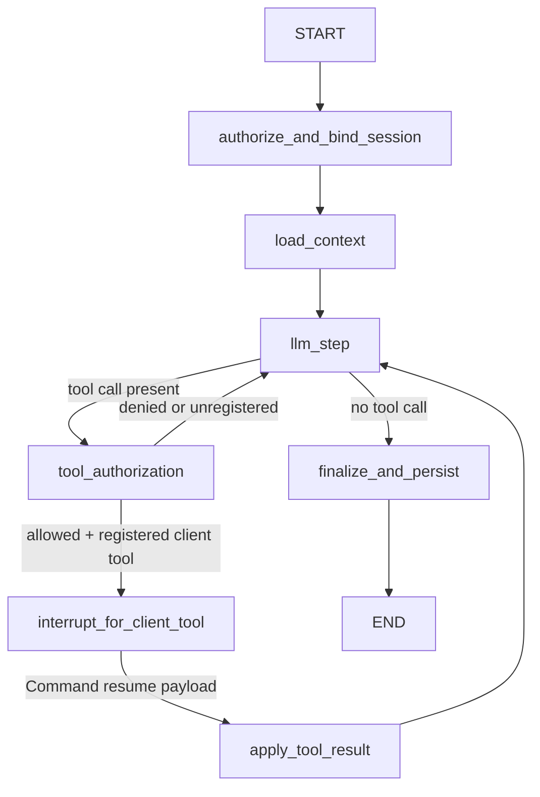

# Conference Agent — Foundation Architecture

> Status: Draft
> Scope: AI-001 — Conversational agent with browser interaction tools
> Prerequisite reading: ai-integration.md (AI-001 entry), existing frontend chatbot implementation

---

## 1. Architecture Overview

### 1.1 Current vs. Target Architecture

| Area              | Current (Next.js-only)                                                                                                                               | Target (FastAPI + LangGraph)                                                                                                     |
| ----------------- | ---------------------------------------------------------------------------------------------------------------------------------------------------- | -------------------------------------------------------------------------------------------------------------------------------- |
| Reasoning loop    | `frontend/app/api/chat/route.ts` runs `streamText` directly and decides tool calls inline.                                                           | `ai-service` owns planning, tool decisions, interrupts, and multi-turn control flow in a LangGraph graph.                        |
| Tool execution    | Tools are declared in route (`getPageContext`, `performAction`), but execution is client-side via `onToolCall` + `addToolOutput` in `chat-view.tsx`. | Same execution model is preserved. Browser still executes DOM tools; `ai-service` only requests tool calls and consumes results. |
| Session state     | Browser localStorage (`ai-chat-*`) + transient request context.                                                                                      | Redis + LangGraph checkpointing for hot session state, PostgreSQL for durable history and audit.                                 |
| Streaming         | Vercel AI SDK UI stream from Next route (`toUIMessageStreamResponse`).                                                                               | FastAPI emits AI SDK-compatible SSE (`x-vercel-ai-ui-message-stream: v1`) to preserve `useChat` behavior.                        |
| Security boundary | Auth handled in frontend/backend proxy layer. Route has no role lock persisted per conversation.                                                     | Identity and session ownership are enforced server-side; tool invocation is deny-by-default via registry checks.                 |
| Extensibility     | Adding tools means editing route logic tightly coupled to current model call.                                                                        | Tool registry + graph nodes provide explicit extension points for future server-side tools.                                      |

What moves to `ai-service`:

- LLM orchestration, tool authorization, state lifecycle, checkpointing, audit persistence, and SSE orchestration.

What stays in frontend:

- DOM capture and DOM action execution (`page-context.ts`, `action-executor.ts`), chat rendering, and `useChat` tool callback flow.

Why:

- DOM access is only possible in-browser.
- Stateful orchestration and policy enforcement are cleaner and safer in a dedicated backend graph runtime.

Current behavior confirmed from existing files: `frontend/app/api/chat/route.ts`, `frontend/components/chatbot/chat-view.tsx`, `frontend/lib/chatbot/action-executor.ts`, `frontend/lib/chatbot/page-context.ts`. [Ref-Local-01] [Ref-Local-02] [Ref-Local-03] [Ref-Local-04]

### 1.2 System Diagram

```mermaid
flowchart TD
  U[User] --> UI[Chat UI\nchat-view.tsx useChat]
  UI --> NX[Next.js /api/chat proxy-adapter]
  NX -->|POST /api/v1/agent/chat (SSE)| AI[FastAPI ai-service]
  AI --> LG[LangGraph Graph Runtime]
  LG --> LLM[LiteLLM]
  LLM --> OR[OpenRouter Model]
  OR --> LLM --> LG --> AI --> NX --> UI

  LG -->|emit tool-input-available| AI
  AI -->|SSE tool part| NX --> UI
  UI -->|onToolCall executes browser tool| DOM[Browser DOM]
  DOM --> UI
  UI -->|addToolOutput + auto-resubmit| NX
  NX -->|POST /api/v1/agent/tool-result| AI
  NX -->|POST /api/v1/agent/chat (resume stream)| AI
```

### 1.3 Why LangGraph + FastAPI vs. Staying in Next.js

LangGraph gives foundation capabilities the current route cannot provide cleanly:

- Durable resumability at tool boundaries via `interrupt(...)` and `Command(resume=...)` with persisted thread checkpoints. [Ref-01] [Ref-02]
- Explicit graph topology (nodes/edges) for policy and control-flow enforcement, instead of a single opaque handler.
- Built-in checkpoint interfaces for production persistence stores (Redis/Postgres classes available and documented). [Ref-03] [Ref-04]
- Clean extension for future server-side tools without redesigning transport or state shape.

FastAPI gives:

- Dedicated service boundary and independent deployment/scaling.
- Native async SSE stream handling.
- Separation from frontend release cycles.

---

## 2. LangGraph Agent Graph

### 2.1 State Schema

```python
from typing import Any, Literal
from typing_extensions import TypedDict

class PendingToolCall(TypedDict):
    tool_call_id: str
    tool_name: str
    input: dict
    requested_at: str
    timeout_at: str
    interrupt_id: str | None

class ToolResultEnvelope(TypedDict):
    tool_call_id: str
    tool_name: str
    status: Literal["output-available", "output-error", "timeout"]
    output: Any | None
    error_text: str | None
    received_at: str

class SessionMeta(TypedDict):
    started_at: str
    last_activity_at: str
    turn_count: int
    model: str
    trace_id: str

class AgentState(TypedDict):
    thread_id: str
    user_id: int
    user_email: str
    messages: list[Any]
    rolling_summary: str | None
    pending_tool_call: PendingToolCall | None
    tool_result: ToolResultEnvelope | None
    session_meta: SessionMeta
    last_error: str | None
```

#### Field semantics and workflow usage (mandatory implementation contract)

| Field               | Meaning                                                                                | Written by node(s)                                                                                                                                               | Read by node(s)                                                                                    | Lifecycle changes in one turn                                                          | Clear/reset rule                                                                    |
| ------------------- | -------------------------------------------------------------------------------------- | ---------------------------------------------------------------------------------------------------------------------------------------------------------------- | -------------------------------------------------------------------------------------------------- | -------------------------------------------------------------------------------------- | ----------------------------------------------------------------------------------- |
| `thread_id`         | Stable conversation cursor. Also LangGraph `thread_id` for checkpoint lookup. [Ref-01] | Request binding before graph invocation, `authorize_and_bind_session` validates immutable binding.                                                               | All nodes; DB/history loaders; checkpointer config.                                                | Set at request entry, unchanged for thread lifetime.                                   | Never cleared; session deletion removes Redis keys only.                            |
| `user_id`           | Immutable session owner id from validated token identity.                              | `authorize_and_bind_session`.                                                                                                                                    | `tool_authorization`, `finalize_and_persist`, audit writer, history/ownership checks.              | Set once when thread starts, reused every turn.                                        | Never changed for existing thread; mismatch returns `403`.                          |
| `user_email`        | Immutable identity string for audit correlation and backend parity.                    | `authorize_and_bind_session`.                                                                                                                                    | Audit logger, persistence, ownership checks.                                                       | Same as `user_id`; immutable after bind.                                               | Never changed for existing thread.                                                  |
| `messages`          | Canonical multi-turn message list (UI-message compatible parts).                       | `load_context` loads persisted list; `llm_step` appends assistant text/tool call; `apply_tool_result` appends tool result part; `finalize_and_persist` persists. | `llm_step`, `context manager`, `finalize_and_persist`.                                             | Grows each turn; may be compacted via summary policy.                                  | Never fully cleared unless explicit archival workflow (out of scope).               |
| `rolling_summary`   | Compressed summary of old turns when context budget is constrained.                    | `load_context` loads existing; `finalize_and_persist` updates after compaction job.                                                                              | `llm_step` prompt assembly.                                                                        | Null in short chats, populated when token budget threshold is exceeded.                | Rewritten when re-summarizing older spans.                                          |
| `pending_tool_call` | Active client-tool request contract used to pause graph and validate result.           | `llm_step` creates; `interrupt_for_client_tool` enriches `interrupt_id`; `tool_authorization` may clear on deny.                                                 | `tool_authorization`, `interrupt_for_client_tool`, `/tool-result` validation, `apply_tool_result`. | `None` -> object when tool is requested; stays set while waiting on browser result.    | Cleared only in `apply_tool_result` (success/error/timeout) or immediate deny path. |
| `tool_result`       | Handoff envelope carrying browser tool execution result into graph.                    | `/tool-result` ingestion path writes envelope.                                                                                                                   | `apply_tool_result`, `llm_step` (indirectly after apply).                                          | `None` during initial call; set on tool-result submission; consumed next resume cycle. | Cleared in `apply_tool_result` immediately after message/audit update.              |
| `session_meta`      | Operational metadata: timing, turn counter, model id, trace correlation.               | `authorize_and_bind_session` initializes; `load_context` updates `last_activity_at`; `finalize_and_persist` increments `turn_count`.                             | All observability/persistence nodes.                                                               | `last_activity_at` bumps each request; `turn_count += 1` at successful finalization.   | Never cleared while thread exists.                                                  |
| `last_error`        | Sticky last failure reason for deterministic error events and recovery messages.       | Any failure branch (`tool_authorization`, timeout handler, exception wrapper).                                                                                   | `finalize_and_persist` error emitter, API layer for structured errors.                             | Set on error path; reset to `None` on successful completion.                           | Cleared at start of new successful turn or after explicit recovery emit.            |

#### Nested `PendingToolCall` field semantics

| Field          | Meaning                                                         | Writer                      | Reader                                                  | Transition                                     | Clear rule                  |
| -------------- | --------------------------------------------------------------- | --------------------------- | ------------------------------------------------------- | ---------------------------------------------- | --------------------------- |
| `tool_call_id` | Unique tool invocation id aligned with AI SDK tool parts.       | `llm_step`                  | `/tool-result`, `apply_tool_result`, audit              | Created at tool request.                       | Cleared with parent object. |
| `tool_name`    | Exact registered tool name (`getPageContext`, `performAction`). | `llm_step`                  | `tool_authorization`, `/tool-result`, UI stream emitter | Created at tool request.                       | Cleared with parent object. |
| `input`        | Tool args payload sent to browser.                              | `llm_step`                  | `interrupt_for_client_tool`, audit                      | Immutable during wait.                         | Cleared with parent object. |
| `requested_at` | ISO timestamp for latency/timeout calculations.                 | `llm_step`                  | timeout scheduler, audit                                | Set when call is emitted.                      | Cleared with parent object. |
| `timeout_at`   | Hard deadline for tool result.                                  | `llm_step`                  | timeout scheduler, `/tool-result` late-submit check     | `requested_at + tool_timeout`.                 | Cleared with parent object. |
| `interrupt_id` | LangGraph interrupt id returned in `__interrupt__`. [Ref-01]    | `interrupt_for_client_tool` | resume validation/logging                               | Null before interrupt, populated once emitted. | Cleared with parent object. |

#### Nested `ToolResultEnvelope` field semantics

| Field          | Meaning                                             | Writer                        | Reader                                  | Transition                                     | Clear rule             |
| -------------- | --------------------------------------------------- | ----------------------------- | --------------------------------------- | ---------------------------------------------- | ---------------------- |
| `tool_call_id` | Correlates result to `pending_tool_call`.           | `/tool-result`                | `apply_tool_result`                     | Must exactly match pending call.               | Cleared with envelope. |
| `tool_name`    | Reported tool name for audit consistency.           | `/tool-result`                | `apply_tool_result`, audit              | Must match pending call tool name.             | Cleared with envelope. |
| `status`       | Result class: success, tool runtime error, timeout. | `/tool-result` or timeout job | `apply_tool_result`                     | Drives assistant follow-up and retry behavior. | Cleared with envelope. |
| `output`       | Arbitrary successful tool payload.                  | `/tool-result`                | `apply_tool_result`, `llm_step` context | Present only when `status=output-available`.   | Cleared with envelope. |
| `error_text`   | User-safe tool error message.                       | `/tool-result` or timeout job | `apply_tool_result`                     | Present for `output-error`/`timeout`.          | Cleared with envelope. |
| `received_at`  | ISO timestamp of result ingestion.                  | `/tool-result`                | audit, metrics                          | Set once at ingestion.                         | Cleared with envelope. |

#### Nested `SessionMeta` field semantics

| Field              | Meaning                                          | Writer                                                               | Reader                  | Transition                                                                   | Clear rule     |
| ------------------ | ------------------------------------------------ | -------------------------------------------------------------------- | ----------------------- | ---------------------------------------------------------------------------- | -------------- |
| `started_at`       | Thread creation timestamp.                       | `authorize_and_bind_session`                                         | observability/history   | Set once.                                                                    | Never cleared. |
| `last_activity_at` | Most recent request activity.                    | `load_context` and `/tool-result` ingestion                          | TTL manager, monitoring | Updated each request/resume.                                                 | Never cleared. |
| `turn_count`       | Completed assistant turns (not tool interrupts). | `finalize_and_persist`                                               | metrics/rate limits     | `+1` on successful finalize.                                                 | Never cleared. |
| `model`            | Selected model id for the session.               | `authorize_and_bind_session`                                         | `llm_step`, audit       | Usually fixed; can change only on explicit migration policy (not in AI-001). | Never cleared. |
| `trace_id`         | Correlation id for logs/traces across services.  | `authorize_and_bind_session` (new) or propagated from request header | all logging nodes       | Stable per thread unless explicitly regenerated.                             | Never cleared. |

### 2.2 Graph Topology

#### Node definitions

1. `authorize_and_bind_session`

- Responsibility: authenticate identity, bind/validate immutable `user_id` and `user_email`, initialize `session_meta`.
- Reads: request auth context, incoming `thread_id`.
- Writes: `user_id`, `user_email`, `session_meta`, optionally `last_error`.

2. `load_context`

- Responsibility: hydrate `messages` + `rolling_summary` from Redis/Postgres; refresh activity timestamp.
- Reads: `thread_id`, `session_meta`.
- Writes: `messages`, `rolling_summary`, `session_meta.last_activity_at`.

3. `llm_step`

- Responsibility: call LiteLLM/OpenRouter, stream text/tool-intent, append assistant output.
- Reads: `messages`, `rolling_summary`, `session_meta.model`.
- Writes: appends assistant text/tool-call parts to `messages`; sets `pending_tool_call` when model requests a client tool.

4. `tool_authorization`

- Responsibility: enforce deny-by-default registry and execution-mode policy for any requested tool.
- Reads: `pending_tool_call.tool_name`.
- Writes: on deny/unregistered -> `last_error`, deny message in `messages`, clear `pending_tool_call`; on allow -> no mutation except trace fields.

5. `interrupt_for_client_tool`

- Responsibility: emit tool input events and pause graph waiting for browser result.
- Reads: `pending_tool_call`.
- Writes: `pending_tool_call.interrupt_id`; interrupt payload.
- Mechanism: `interrupt(payload)`; requires checkpointer and thread id. [Ref-01] [Ref-02]

6. `apply_tool_result`

- Responsibility: validate and apply `tool_result` to message state.
- Reads: `tool_result`, `pending_tool_call`.
- Writes: tool-output message part in `messages`; audit update; clears `pending_tool_call` and `tool_result`.

7. `finalize_and_persist`

- Responsibility: persist durable history, update counters, emit finish metadata.
- Reads: `messages`, `session_meta`, `last_error`.
- Writes: PostgreSQL rows, `session_meta.turn_count`, `last_error=None` on success.

#### Edge map

1. `START -> authorize_and_bind_session`
2. `authorize_and_bind_session -> load_context`
3. `load_context -> llm_step`
4. Conditional `llm_step -> finalize_and_persist` when `pending_tool_call is None`
5. Conditional `llm_step -> tool_authorization` when `pending_tool_call is not None`
6. Conditional `tool_authorization -> interrupt_for_client_tool` when tool is registered + execution_mode=`client`
7. Conditional `tool_authorization -> llm_step` when denied/unregistered (assistant gets denial context and continues)
8. `interrupt_for_client_tool -> apply_tool_result` only after resume value is provided through `Command(resume=...)` path
9. `apply_tool_result -> llm_step` for iterative loops
10. `finalize_and_persist -> END`

#### Client-side tool cycle (exact mechanism)

1. `llm_step` decides to call `getPageContext` or `performAction`, writes `pending_tool_call`.
2. `tool_authorization` enforces registry and execution-mode rules.
3. `interrupt_for_client_tool` emits tool input SSE parts and calls `interrupt(...)`. LangGraph returns `__interrupt__` payload and pauses with checkpoint persisted. [Ref-01] [Ref-02]
4. Frontend executes tool, then proxy submits result to `/api/v1/agent/tool-result`.
5. Resume path prepares `Command(resume=<ToolResultEnvelope>)`.
6. Next `/api/v1/agent/chat` for same `thread_id` consumes resume value and transitions to `apply_tool_result`, then loops back to `llm_step`.



### 2.3 Checkpointing Strategy

Redis hot checkpointer:

- Implementation: `AsyncRedisSaver` (`langgraph-checkpoint-redis`) as primary runtime checkpointer. [Ref-04]
- Purpose: fast per-step checkpoints for active conversations, including interrupt wait state.
- TTL: `default_ttl=30` minutes, `refresh_on_read=true` (sliding idle TTL). [Ref-04]
- Stored scope: full LangGraph runtime checkpoint for active threads only.

PostgreSQL durable checkpointer/snapshots:

- Implementation: `AsyncPostgresSaver`. [Ref-03]
- Purpose: durable recovery points at interruption boundaries; not every token step.
- Write points: after `interrupt_for_client_tool` (waiting boundary). Additional finalize checkpoints are written only when debug mode is enabled.
- Retention: 90 days for checkpoints; message/audit tables retained per data policy.

Why split:

- Redis handles high-frequency checkpoint IO at low latency.
- Postgres stores selected durable checkpoints for recovery after Redis eviction/restart.
- Avoids duplicating every micro-step in both stores.

Implementation notes:

- `AsyncPostgresSaver.setup()` must be run before first use. [Ref-03]
- Redis saver setup/indices (`setup`/`asetup`) must be run at startup. [Ref-04]

### 2.4 Multi-turn Context Management

Conversation continuity:

- `thread_id` (frontend `conv-*` id) is the stable thread key.
- Each completed turn appends durable `agent_messages` rows.
- `load_context` reconstructs latest state from Redis; if missing, rebuilds from PostgreSQL history + `rolling_summary`.

Context window policy:

- Always include: system instructions, latest 12 message exchanges, unresolved tool context.
- If token estimate exceeds 70% of model context, summarize oldest span into `rolling_summary` and keep only recent tail.
- Summary update happens in `finalize_and_persist`.

Reconnect/session timeout behavior:

- If SSE disconnects mid-turn, client can re-send with same `thread_id`; graph resumes from latest checkpoint.
- If Redis session expired, service rebuilds state from PostgreSQL history and continues.
- If an interrupt was pending but Redis expired, latest durable Postgres checkpoint at interrupt boundary is used to restore `pending_tool_call`.

---

## 3. Client-Side Tool Execution Protocol

This section defines the exact contract between LangGraph and browser-executed tools.

### 3.1 Tool Call Event Schema

Transport requirements:

- HTTP headers:
  - `Content-Type: text/event-stream`
  - `Cache-Control: no-cache`
  - `Connection: keep-alive`
  - `x-vercel-ai-ui-message-stream: v1` [Ref-05]

Required tool call sequence (SSE `data:` JSON lines):

```text
data: {"type":"start","messageId":"msg_123"}
data: {"type":"start-step"}
data: {"type":"tool-input-start","toolCallId":"call_abc","toolName":"getPageContext"}
data: {"type":"tool-input-available","toolCallId":"call_abc","toolName":"getPageContext","input":{}}
data: {"type":"finish-step"}
data: {"type":"finish","finishReason":"tool-calls"}
data: [DONE]
```

Tool names are exact:

- `getPageContext`
- `performAction`

`performAction` input schema:

- `action`: `"click" | "type" | "press" | "select" | "clear"`
- `ref`?: `string`
- `text`?: `string`
- `key`?: `string`
- `value`?: `string`

### 3.2 Tool Result Submission

Canonical AI service endpoint:

`POST /api/v1/agent/tool-result`

```json
{
  "thread_id": "conv-1730000000000",
  "tool_call_id": "call_abc",
  "result": {
    "tool_name": "performAction",
    "status": "output-available",
    "output": { "success": true, "message": "Clicked btn-2" },
    "error_text": null
  }
}
```

Status values:

- `output-available`
- `output-error`
- `timeout`

Resume semantics:

- `/tool-result` validates ownership + `tool_call_id` against `pending_tool_call`, stores `tool_result` envelope, and marks thread resumable.
- The next `POST /api/v1/agent/chat` for same `thread_id` issues `Command(resume=<tool_result>)` and continues graph at `apply_tool_result`. [Ref-02]
- In AI-001, this endpoint is invoked by the Next.js proxy adapter only (not directly from browser clients).

Compatibility path (no `chat-view.tsx` tool-flow rewrite):

- Browser still does `addToolOutput(...)`.
- Auto-resubmit to `/api/chat` happens as today.
- `frontend/app/api/chat/route.ts` adapter extracts latest tool output part and calls `/api/v1/agent/tool-result` before opening the resumed `/api/v1/agent/chat` SSE stream.

### 3.3 Timeout and Error Handling

Timeout policy:

- `pending_tool_call.timeout_at = requested_at + 90s`.
- If no result arrives before deadline, service materializes:
  - `tool_result.status = "timeout"`
  - `tool_result.error_text = "Client tool result timeout"`
- Next chat resume emits `tool-output-error` and assistant recovery text.

Error cases:

- `tool_call_id` mismatch: `409 TOOL_CALL_ID_MISMATCH` (state unchanged).
- Unknown thread or no pending tool: `404 NO_PENDING_TOOL_CALL`.
- Late result after timeout/consumption: `409 TOOL_CALL_ALREADY_RESOLVED`.
- Result payload invalid: `422 INVALID_TOOL_RESULT`.

Recovery:

- For `output-error` or `timeout`, `apply_tool_result` appends structured error tool part, clears pending state, and returns to `llm_step` for fallback guidance.

### 3.4 Preserving Compatibility with Existing Tool Implementations

Unchanged contracts required by backend:

- `getPageContext`:
  - input: `{}`
  - output: accessibility tree object matching `capturePageContext().tree`
- `performAction`:
  - input fields exactly as in `action-executor.ts`
  - output shape supports `{ success, message, verified?, previousValue?, currentValue? }`

Unchanged frontend tool runtime:

- `frontend/lib/chatbot/action-executor.ts` stays unchanged.
- `frontend/lib/chatbot/page-context.ts` stays unchanged.
- `chat-view.tsx` `onToolCall` + `addToolOutput` + `sendAutomaticallyWhen(lastAssistantMessageIsCompleteWithToolCalls)` stays unchanged in behavior.

---

## 4. Streaming Architecture

### 4.1 Token Streaming Path

End-to-end:

1. `llm_step` calls LiteLLM `acompletion(..., stream=True)` with OpenRouter model id (`openrouter/<model>`). [Ref-06] [Ref-07]
2. Async chunks are converted into AI SDK UI stream parts.
3. OpenRouter keepalive comment frames (for example `: OPENROUTER PROCESSING`) are ignored by the upstream stream parser before chunk mapping. [Ref-11]
4. FastAPI writes SSE lines (`data: {\"type\":\"text-delta\",\"id\":\"txt_1\",\"delta\":\"Hello\"}\n\n`) with required header `x-vercel-ai-ui-message-stream: v1`. [Ref-05]
5. Stream terminates with `data: [DONE]`.

Event part mapping:

- Text token:
  - `text-start` once per text block
  - repeated `text-delta` chunks
  - `text-end` on completion
- Tool call start:
  - `tool-input-start`
  - `tool-input-available`
- Tool result applied:
  - `tool-output-available` or `tool-output-error`
- Step boundaries:
  - `start-step`
  - `finish-step`
- Message done:
  - `finish` then `[DONE]`
- Error:
  - `error` part with `errorText`, then `[DONE]`

### 4.2 Vercel AI SDK Compatibility

Compatibility requirements:

- Use data stream protocol event names and JSON schema accepted by `uiMessageChunkSchema` (`tool-input-start`, `tool-input-available`, `tool-output-available`, `tool-output-error`, etc.). [Ref-08]
- Return header `x-vercel-ai-ui-message-stream: v1`. [Ref-05]
- End stream with `[DONE]`. [Ref-05]

Frontend impact:

- `useChat` + `DefaultChatTransport` remains compatible because it parses JSON event stream chunks and request body already includes `id`, `messages`, `trigger`, `messageId`. [Ref-09]
- No role payload is required for AI-001 security or orchestration.

### 4.3 Streaming During Tool Execution

Behavior:

- SSE request is not held open while waiting for browser tool completion.
- Stream ends immediately after tool call part (`finish` + `[DONE]`), matching current `useChat` multi-step client-tool loop.
- Frontend executes tool locally, then auto-submits.
- Next request resumes graph.
- AI-001 supports request/response turn streams only; no `GET /api/v1/agent/chat/{thread_id}/stream` resume endpoint.

Waiting state communication:

- Assistant message contains tool part in `input-available` state, which current UI already renders as "Executing..." / waiting.

---

## 5. Role Enforcement and Security

Decision for AI-001:

- Do not enforce immutable per-thread role locking.
- Keep identity/session ownership checks as hard security controls.
- Do not keep per-thread role fields in agent state, API, or persistence for AI-001.

### 5.1 Identity and Role Propagation

Identity flow:

1. Browser calls `/api/chat` with same-origin cookies.
2. Next proxy reads `conference_auth_token` cookie and forwards `Authorization: Bearer <token>` to `ai-service` (pattern already used by current backend proxy). [Ref-Local-05] [Ref-Local-06]
3. `ai-service` validates token by calling Go backend `GET /api/v1/users/me` on each request (or short cache).

Role handling in AI-001:

1. Role is not used as an authorization primitive in the agent foundation.
2. No per-thread role lock or role context state is stored.
3. Future server-side tools may introduce explicit role/resource checks at tool implementation level.

### 5.2 Tool Access Control

Registry pattern:

```python
class ToolSpec(TypedDict):
    name: str
    execution_mode: Literal["client", "server"]
    input_schema: dict
    timeout_seconds: int

TOOL_REGISTRY: dict[str, ToolSpec] = {
    "getPageContext": {
        "name": "getPageContext",
        "execution_mode": "client",
        "input_schema": {},
        "timeout_seconds": 90,
    },
    "performAction": {
        "name": "performAction",
        "execution_mode": "client",
        "input_schema": {
            "action": "click|type|press|select|clear",
            "ref": "string?",
            "text": "string?",
            "key": "string?",
            "value": "string?",
        },
        "timeout_seconds": 90,
    },
}
```

Enforcement point:

- `tool_authorization` node validates:
  1. tool exists in `TOOL_REGISTRY`
  2. execution mode is permitted for this graph stage

On violation:

- append assistant denial message,
- emit `tool-output-error` part,
- set `last_error`,
- write audit row.

### 5.3 Deny-by-Default

Rules:

- Only names in `TOOL_REGISTRY` are invocable.
- Any unknown tool name is rejected before interrupt.
- Prompt text cannot bypass registry policy.

### 5.4 Audit Logging

Every tool invocation writes immutable `agent_tool_audit` record:

- `thread_id`
- `tool_call_id`
- `tool_name`
- `tool_input` (JSONB)
- `status`
- `output` (JSONB nullable)
- `error_text` nullable
- `user_id`, `user_email`
- `requested_at`, `completed_at`
- `trace_id`

Write stages:

- Initial row at tool request emission.
- Update on `apply_tool_result` completion (or timeout/deny).

---

## 6. API Contract

### `POST /api/v1/agent/chat`

Description: Start or continue a conversation turn (including resume after tool result submission).  
Auth: Bearer token (JWT passed from frontend proxy).

Request body:

```json
{
  "thread_id": "conv-1730000000000",
  "messages": [],
  "trigger": "submit-message",
  "message_id": "optional-last-message-id",
  "request_metadata": {
    "client": "web",
    "path": "/role/author/conferences",
    "user_agent": "optional"
  }
}
```

Field definitions:

- `thread_id` (string, required): conversation id; maps to LangGraph `thread_id`.
- `messages` (array, required): UIMessage array from frontend transport.
- `trigger` (string, optional): `submit-message|regenerate-message`.
- `message_id` (string nullable, optional): message id from transport.
- `request_metadata` (object, optional): tracing and UI context.

Response:

- `200 text/event-stream`
- Headers include `x-vercel-ai-ui-message-stream: v1`
- Event types: `start`, `start-step`, `text-start`, `text-delta`, `text-end`, `tool-input-start`, `tool-input-available`, `tool-output-available`, `tool-output-error`, `finish-step`, `finish`, `error`, `[DONE]`.

### `POST /api/v1/agent/tool-result`

Description: Submit client-side tool execution result to resume the graph.  
Auth: Bearer token via Next.js proxy adapter only (endpoint not exposed for direct browser invocation in AI-001).

Request body:

```json
{
  "thread_id": "conv-1730000000000",
  "tool_call_id": "call_abc123",
  "result": {
    "tool_name": "performAction",
    "status": "output-available",
    "output": { "success": true, "message": "Clicked btn-1" },
    "error_text": null
  }
}
```

Field definitions:

- `thread_id` (string, required)
- `tool_call_id` (string, required)
- `result` (object, required)
- `result.tool_name` (string, required)
- `result.status` (string, required): `output-available|output-error|timeout`
- `result.output` (any nullable)
- `result.error_text` (string nullable)

Response:

- `200 OK` with `{ "status": "accepted" }`
- Errors: `401`, `403`, `404`, `409`, `422`.

### `GET /api/v1/agent/sessions/{thread_id}/history`

Description: Retrieve conversation history for a session.  
Auth: Bearer token (must match session owner).

Response:

```json
{
  "thread_id": "conv-1730000000000",
  "messages": [],
  "rolling_summary": "optional summary",
  "session_meta": {
    "started_at": "2026-02-27T10:00:00Z",
    "last_activity_at": "2026-02-27T10:02:00Z",
    "turn_count": 4,
    "model": "google/gemini-2.5-flash-lite",
    "trace_id": "uuid"
  }
}
```

### `DELETE /api/v1/agent/sessions/{thread_id}`

Description: Clear session from Redis; PostgreSQL history is retained.  
Auth: Bearer token (must match session owner).

Response:

- `204 No Content`

Behavior:

- Deletes Redis hot state/checkpoint keys for thread.
- Keeps `agent_messages` and `agent_tool_audit`.

---

## 7. Data Model

```sql
-- agent_sessions: active and historical session metadata
CREATE TABLE agent_sessions (
  thread_id TEXT PRIMARY KEY,
  user_id BIGINT NOT NULL,
  user_email TEXT NOT NULL,
  model VARCHAR(128) NOT NULL,
  trace_id UUID NOT NULL,
  rolling_summary TEXT NULL,
  status VARCHAR(16) NOT NULL DEFAULT 'active' CHECK (status IN ('active', 'waiting_tool', 'closed', 'expired')),
  pending_tool_call JSONB NULL,
  started_at TIMESTAMPTZ NOT NULL DEFAULT NOW(),
  last_activity_at TIMESTAMPTZ NOT NULL DEFAULT NOW(),
  turn_count INT NOT NULL DEFAULT 0,
  redis_expires_at TIMESTAMPTZ NULL,
  created_at TIMESTAMPTZ NOT NULL DEFAULT NOW(),
  updated_at TIMESTAMPTZ NOT NULL DEFAULT NOW()
);

CREATE INDEX idx_agent_sessions_user_id ON agent_sessions(user_id);
CREATE INDEX idx_agent_sessions_last_activity ON agent_sessions(last_activity_at DESC);
CREATE INDEX idx_agent_sessions_status ON agent_sessions(status);

-- agent_messages: durable conversation history
CREATE TABLE agent_messages (
  id BIGSERIAL PRIMARY KEY,
  thread_id TEXT NOT NULL REFERENCES agent_sessions(thread_id),
  sequence_no INT NOT NULL,
  message_id TEXT NOT NULL,
  role VARCHAR(16) NOT NULL CHECK (role IN ('system', 'user', 'assistant', 'tool')),
  parts JSONB NOT NULL,
  token_count INT NULL, -- reserved; not populated in AI-001 (added in later observability phase)
  created_at TIMESTAMPTZ NOT NULL DEFAULT NOW(),
  UNIQUE(thread_id, sequence_no)
);

CREATE INDEX idx_agent_messages_thread_created ON agent_messages(thread_id, created_at);
CREATE INDEX idx_agent_messages_message_id ON agent_messages(message_id);

-- agent_tool_audit: immutable tool invocation log
CREATE TABLE agent_tool_audit (
  id BIGSERIAL PRIMARY KEY,
  thread_id TEXT NOT NULL REFERENCES agent_sessions(thread_id),
  tool_call_id TEXT NOT NULL,
  tool_name TEXT NOT NULL,
  tool_input JSONB NOT NULL,
  status VARCHAR(32) NOT NULL CHECK (status IN ('requested', 'output-available', 'output-error', 'timeout', 'denied', 'unregistered')),
  output JSONB NULL,
  error_text TEXT NULL,
  user_id BIGINT NOT NULL,
  user_email TEXT NOT NULL,
  requested_at TIMESTAMPTZ NOT NULL,
  completed_at TIMESTAMPTZ NULL,
  trace_id UUID NOT NULL,
  source VARCHAR(16) NOT NULL DEFAULT 'client',
  created_at TIMESTAMPTZ NOT NULL DEFAULT NOW(),
  UNIQUE(thread_id, tool_call_id)
);

CREATE INDEX idx_agent_tool_audit_thread ON agent_tool_audit(thread_id, requested_at DESC);
CREATE INDEX idx_agent_tool_audit_user ON agent_tool_audit(user_id, requested_at DESC);
CREATE INDEX idx_agent_tool_audit_tool_name ON agent_tool_audit(tool_name);
```

Redis key scheme:

| Key pattern                                         | Purpose                                                | TTL                                  | Eviction expectation                           |
| --------------------------------------------------- | ------------------------------------------------------ | ------------------------------------ | ---------------------------------------------- |
| `ai:session:{thread_id}:state`                      | Serialized hot `AgentState` mirror for fast reads      | 30 min idle                          | `volatile-ttl` preferred on dedicated cache DB |
| `ai:session:{thread_id}:checkpoint:*`               | LangGraph Redis saver checkpoint keys                  | 30 min idle (`refresh_on_read=true`) | Managed by Redis saver TTL config              |
| `ai:session:{thread_id}:pending_tool`               | Fast lookup for pending tool call contract             | 90 sec                               | Expires automatically after timeout window     |
| `ai:session:{thread_id}:tool_result:{tool_call_id}` | Resume envelope handoff from `/tool-result` to `/chat` | 5 min                                | Auto-evict post-consumption                    |

Note: `ai:session:{thread_id}:stream:{turn_id}` replay buffer is deferred (not implemented in AI-001).

---

## 8. Integration with Existing Frontend

### 8.1 What Changes in the Frontend

`frontend/app/api/chat/route.ts`:

- Replace direct `streamText` inference with proxy/adapter to `ai-service`.
- Map incoming AI SDK transport body:
  - `id -> thread_id`
  - `messages -> messages`
  - `trigger -> trigger`
  - `messageId -> message_id`
  - Include `request_metadata` only when tool use is requested (to avoid unnecessary context load).
- If incoming `messages` contain a newly completed tool output part, call `/api/v1/agent/tool-result` first, then open `/api/v1/agent/chat` SSE stream.
- Forward SSE bytes unchanged (preserve AI SDK protocol).

`frontend/components/chatbot/chat-view.tsx`:

- Keep `onToolCall`, `addToolOutput`, `sendAutomaticallyWhen` flow unchanged.
- No role-related change required.

`frontend/components/chatbot/chatbot-provider.tsx`:

- No structural changes required.
- Continue using existing conversation id; it remains `thread_id`.

### 8.2 What Does Not Change

No changes to:

- `frontend/lib/chatbot/action-executor.ts`
- `frontend/lib/chatbot/page-context.ts`

Reason:

- Tool names, input contracts, and output shapes are preserved exactly.
- DOM access remains fully client-side.

### 8.3 Inter-Service Communication

Chosen path: Next.js proxy first (not direct browser -> `ai-service`).

Justification:

- Reuses secure cookie -> bearer forwarding pattern already used in `/api/backend/[...path]`.
- Keeps AI service private on internal network.
- Avoids exposing tokens to browser JS or widening CORS surface.

Auth forwarding:

- Next route reads `conference_auth_token` cookie and sets `Authorization` header to `ai-service`.

CORS policy:

- `ai-service` only allows Next server origin (or internal network only if not browser-exposed).

---

## 9. Model Selection

| Task                   | Model (via OpenRouter)         | Rationale                                                                                                                                                                                  |
| ---------------------- | ------------------------------ | ------------------------------------------------------------------------------------------------------------------------------------------------------------------------------------------ |
| Primary reasoning loop | `google/gemini-2.5-flash-lite` | Same family as current implementation but move from preview id to stable id; keeps 1M context with lower cost/latency profile suitable for interactive tool loops. [Ref-10] [Ref-Local-01] |

Model policy notes:

- Keep fallback to `google/gemini-2.5-flash` for difficult reasoning/tool orchestration turns.
- Current route uses `google/gemini-2.5-flash-lite-preview-09-2025`; migrate to stable `google/gemini-2.5-flash-lite` for production baseline.

---

## 10. Technical Requirements

| Requirement                       | Target                                     | Notes                                                                  |
| --------------------------------- | ------------------------------------------ | ---------------------------------------------------------------------- |
| First token latency (P50)         | <= 1.2s                                    | From `/chat` POST receipt to first SSE token                           |
| First token latency (P95)         | <= 2.8s                                    | Includes proxy hop and model queue variance                            |
| Full turn latency (P95, no tools) | <= 8.0s                                    | User message to `finish` event                                         |
| Concurrent sessions               | 500 active threads per ai-service instance | Horizontal scale via stateless FastAPI workers + shared Redis/Postgres |
| Session TTL (Redis, idle)         | 30 minutes                                 | Sliding (`refresh_on_read=true`)                                       |
| Tool result timeout               | 90 seconds                                 | Deadline before timeout envelope is generated                          |

Validation scenarios for AI-001 foundation:

1. Node-level state transition tests verify expected field writes/reads for all `AgentState` fields.
2. Interrupt/resume test verifies `pending_tool_call` survives interrupt and resumes correctly with `Command`.
3. Tool-call mismatch test (`tool_call_id` mismatch) returns deterministic `409` and preserves state.
4. Session-ownership test rejects cross-user access to existing `thread_id`.
5. Timeout test generates `tool_result.status=timeout`, clears pending call, emits `tool-output-error`.
6. Streaming conformance test validates required SSE parts and `x-vercel-ai-ui-message-stream: v1`.
7. Recovery test validates Redis-expired reconstruction from PostgreSQL history + durable checkpoints.

---

## 11. Open Questions

Resolved decisions applied in this document:

1. Include route/page context metadata only when tool use is requested.
2. `/api/v1/agent/tool-result` is called only by the Next.js proxy adapter in phase 1.
3. Message-level token accounting in `agent_messages.token_count` is deferred to a later observability phase.
4. Redis checkpoint TTL is fixed at 30 minutes globally.
5. AI-001 keeps request/response turn streaming only (no stream resume endpoint).
6. Optional short replay buffer key (`ai:session:{thread_id}:stream:{turn_id}`) is deferred.
7. Durable Postgres checkpoints are persisted at interrupt boundaries; finalize checkpoints are debug-mode only.

---

## 12. References

- Ref-01: https://langchain-ai.github.io/langgraph/reference/types/#langgraph.types.interrupt (tool: ref) — official `interrupt` semantics, `GraphInterrupt`, resume behavior, checkpointer requirement.
- Ref-02: https://langchain-ai.github.io/langgraph/how-tos/human_in_the_loop/add-human-in-the-loop/#resume-using-the-command-primitive (tool: ref) — official `Command(resume=...)` resume pattern and node re-execution semantics.
- Ref-03: https://langchain-ai.github.io/langgraph/reference/checkpoints/#langgraph.checkpoint.postgres.aio.AsyncPostgresSaver (tool: ref) — `AsyncPostgresSaver` availability, API, and `setup()` requirement.
- Ref-04: https://github.com/redis-developer/langgraph-redis (tool: ref + shell/web) — `AsyncRedisSaver`, setup, and TTL configuration for Redis checkpoints.
- Ref-05: https://ai-sdk.dev/docs/ai-sdk-ui/stream-protocol (tool: ref) — AI SDK UI data stream protocol, event types, required `x-vercel-ai-ui-message-stream: v1` header, `[DONE]`.
- Ref-06: https://github.com/berriai/litellm/blob/main/docs/my-website/docs/completion/stream.md?plain=1#L4#streaming-async (tool: ref) — LiteLLM async streaming via `acompletion(..., stream=True)`.
- Ref-07: https://github.com/berriai/litellm/blob/main/docs/my-website/docs/providers/openrouter.md?plain=1#L1#openrouter (tool: ref) — LiteLLM OpenRouter provider usage and `openrouter/<model>` naming.
- Ref-08: https://github.com/vercel/ai/blob/main/packages/ai/src/ui-message-stream/ui-message-chunks.ts (tool: ref) — concrete chunk schema including tool input/output chunk types.
- Ref-09: https://raw.githubusercontent.com/vercel/ai/main/packages/ai/src/ui/http-chat-transport.ts (tool: shell/web) — default `useChat` request body shape (`id`, `messages`, `trigger`, `messageId`) and transport behavior.
- Ref-10: https://openrouter.ai/api/v1/models (tool: shell) — live model catalog used to evaluate current Gemini options/pricing for selection.
- Ref-11: https://openrouter.ai/docs/api/reference/streaming#additional-information (tool: ref) — OpenRouter SSE behavior, keepalive comments, parser recommendations.
- Ref-Local-01: `frontend/app/api/chat/route.ts` (tool: shell) — current model/tool route behavior and model id.
- Ref-Local-02: `frontend/components/chatbot/chat-view.tsx` (tool: shell) — current `useChat` + `onToolCall` + `addToolOutput` flow.
- Ref-Local-03: `frontend/lib/chatbot/action-executor.ts` (tool: shell) — existing `performAction` input/output contract.
- Ref-Local-04: `frontend/lib/chatbot/page-context.ts` (tool: shell) — existing `getPageContext` output contract.
- Ref-Local-05: `frontend/app/api/backend/[...path]/route.ts` (tool: shell) — existing cookie-to-bearer proxy forwarding pattern.
- Ref-Local-06: `frontend/lib/config.ts` (tool: shell) — auth cookie name `conference_auth_token`.
