# AI-002 Architecture, State Machine, and Execution Workflow

## 1. Workflow Directory Structure

```
ai-service/app/
├── core/
│   ├── auth.py                         # (existing) JWT validation, actor extraction
│   ├── config.py                       # (existing) env config
│   └── logging.py                      # (existing) structured logging
│
├── db/
│   ├── models.py                       # (existing) AI-001 tables; AI-002 tables appended here
│   └── session.py                      # (existing) async DB session
│
├── repositories/
│   ├── session_repo.py                 # (existing) AI-001
│   ├── message_repo.py                 # (existing) AI-001
│   ├── tool_audit_repo.py              # (existing) AI-001
│   └── gating_run_repo.py              # [NEW] CRUD for gating_runs and gating_stage_records
│
├── services/
│   ├── agent_runtime.py                # (existing) AI-001
│   ├── llm_client.py                   # (existing) Gemini client; reused by content_evaluation
│   ├── metrics.py                      # (existing)
│   └── compaction.py                   # (existing)
│
├── workflows/
│   └── submission_gating/
│       ├── __init__.py
│       ├── router.py                   # FastAPI router; POST /runs, GET /runs/{run_id}
│       ├── schemas.py                  # Pydantic models: request, response, state envelope
│       ├── runner.py                   # Orchestrator: sequences stages, owns the state object
│       │
│       ├── stages/
│       │   ├── __init__.py
│       │   ├── intake_normalization.py
│       │   ├── binary_integrity.py
│       │   ├── document_extraction.py
│       │   ├── fact_derivation.py
│       │   ├── content_evaluation.py   # LLM steering; advisory warn-only
│       │   ├── policy_evaluation.py
│       │   ├── verdict_mapping.py
│       │   ├── guidance_rendering.py
│       │   └── persistence_audit.py
│       │
│       ├── extractors/
│       │   ├── __init__.py
│       │   ├── pdf_extractor.py        # pypdf + pdfplumber
│       │   ├── docx_extractor.py       # python-docx
│       │   └── latex_extractor.py      # TexSoup
│       │
│       ├── rules/
│       │   ├── __init__.py
│       │   ├── engine.py               # rule-engine wrapper; evaluates RuleSet against SubmissionFacts
│       │   └── templates/
│       │       └── guidance.j2         # Jinja2 template for remediation text keyed by rule_id
│       │
│       └── models/
│           ├── __init__.py
│           ├── state.py                # GatingState dataclass (in-memory workflow envelope)
│           ├── facts.py                # FileFacts, ExtractedDocument, SubmissionFacts
│           ├── findings.py             # RuleFinding, ContentFinding, VerdictBundle
│           └── policy.py              # PolicySnapshot, DeskRejectionConfig
│
├── api/
│   ├── routes.py                       # (existing) AI-001 agent routes
│   └── schemas.py                      # (existing) AI-001 schemas
│
└── main.py                             # (existing) mounts agent_router; AI-002 router appended here
```

## 2. State Object

The `GatingState` dataclass is the single in-process envelope that flows through all stages. Stages receive it as input and return a mutated copy. No stage communicates with another except through this object.

```python
@dataclass
class GatingState:
    # Identity
    run_id: str
    mode: Literal["advisory", "gate"]
    source: Literal["author_precheck", "submission_create", "submission_publish"]
    conference_id: int
    submission_id: int | None
    actor: ActorContext

    # Input fingerprint and policy hash for determinism verification
    input_fingerprint: str        # SHA-256(file_bytes + repr(normalized_request))
    policy_hash: str              # SHA-256(repr(policy_snapshot))

    # Raw normalized input
    normalized_request: NormalizedRequest
    policy_snapshot: PolicySnapshot

    # Stage outputs (None until stage runs)
    file_facts: FileFacts | None = None
    extracted_document: ExtractedDocument | None = None
    submission_facts: SubmissionFacts | None = None
    content_findings: list[ContentFinding] = field(default_factory=list)
    rule_findings: list[RuleFinding] = field(default_factory=list)
    verdict_bundle: VerdictBundle | None = None
    guidance: list[GuidanceItem] = field(default_factory=list)

    # Observability
    stage_timings: dict[str, float] = field(default_factory=dict)
    determinism_metadata: dict[str, str] = field(default_factory=dict)
    error: StageError | None = None
```

## 3. State Machine

Each stage transitions the state through well-defined status values. A stage failure immediately halts execution and writes the error into `state.error`; no subsequent stage runs.

```mermaid
stateDiagram-v2
    direction LR

    [*] --> RECEIVED : POST /runs

    RECEIVED --> NORMALIZING : runner starts
    NORMALIZING --> NORMALIZED : intake_normalization OK
    NORMALIZING --> FAILED : malformed request / unsupported format

    NORMALIZED --> INTEGRITY_CHECKED : binary_integrity OK
    NORMALIZED --> BLOCKED : file corrupt / encrypted / wrong format

    INTEGRITY_CHECKED --> EXTRACTED : document_extraction OK
    INTEGRITY_CHECKED --> BLOCKED : file unreadable

    EXTRACTED --> FACTS_DERIVED : fact_derivation OK
    EXTRACTED --> FAILED : extraction error

    FACTS_DERIVED --> CONTENT_EVALUATED : content_evaluation OK (or skipped)
    FACTS_DERIVED --> FAILED : fact derivation error

    CONTENT_EVALUATED --> POLICY_EVALUATED : policy_evaluation OK
    CONTENT_EVALUATED --> FAILED : rule engine error

    POLICY_EVALUATED --> VERDICT_MAPPED : verdict_mapping OK
    POLICY_EVALUATED --> FAILED : mapping error

    VERDICT_MAPPED --> GUIDANCE_RENDERED : guidance_rendering OK
    VERDICT_MAPPED --> FAILED : template error

    GUIDANCE_RENDERED --> PERSISTED : persistence_audit OK
    GUIDANCE_RENDERED --> FAILED : DB write error

    PERSISTED --> [*] : response returned

    BLOCKED --> PERSISTED : block result persisted before returning
    FAILED --> PERSISTED : error state persisted before returning
```



**Stage skip rule**: `content_evaluation` transitions directly from `FACTS_DERIVED` to `CONTENT_EVALUATED` with `content_findings = []` when `policy_snapshot.desk_rejection_settings.prompt_fragments` is empty or `desk_rejection_settings.enabled` is false.

**`BLOCKED` vs `FAILED`**:
- `BLOCKED`: deterministic -- a rule or integrity check produced a hard failure. The run completes normally but with `verdict = "block"`. Persisted and returned to the caller.
- `FAILED`: unexpected error (parse crash, DB down, LLM timeout). The run is persisted in an errored state. The Go adapter maps this to an HTTP 502 or retryable error.

## 4. Execution Workflow

```
POST /api/v1/workflows/submission-material-gating/runs
  (called by Go backend proxy, not the browser)
        |
        v
[router.py] Auth check -> extract actor from JWT
        |
        v
[runner.py] Build GatingState from request body
        |
        +---> [1] intake_normalization
        |         Canonicalize request, emit NormalizedRequest + PolicySnapshot + InputFingerprint
        |         FAIL FAST: unknown conference_id, missing file, unsupported content-type
        |
        +---> [2] binary_integrity
        |         python-magic: detect MIME from bytes
        |         Route to format-specific check:
        |           PDF  -> header check, pypdf decrypt probe
        |           DOCX -> zipfile.is_zipfile, parse [Content_Types].xml
        |           LaTeX -> TexSoup parse probe on first 8 KB
        |         Emit FileFacts{format, size_bytes, is_encrypted, is_parseable}
        |         BLOCK if: unrecognized format, encrypted, corrupt
        |
        +---> [3] document_extraction
        |         Branch on FileFacts.format:
        |           "pdf"   -> pdf_extractor.extract()
        |                      pypdf: page_count, metadata, is_text_extractable, raw_text
        |                      pdfplumber: table_count, figure_proxies, layout_coverage
        |           "docx"  -> docx_extractor.extract()
        |                      python-docx: paragraph_count, heading_styles, table_count,
        |                                   core_props (author, title, subject, revision)
        |                                   page_count_estimate from app.xml extended props
        |           "latex" -> latex_extractor.extract()
        |                      TexSoup: section_tags, title_tag, abstract_tag,
        |                               author_tags, bibliography_tag
        |         Emit ExtractedDocument{format, raw_text, structural_signals}
        |         BLOCK if: format is extractable but text coverage < threshold
        |
        +---> [4] fact_derivation
        |         Pure deterministic transforms on ExtractedDocument + NormalizedRequest:
        |           page_count, section_presence, title_word_count, abstract_present,
        |           reference_count_estimate, anonymization_signals, keyword_coverage,
        |           table_count, figure_count, text_coverage_ratio
        |         Emit SubmissionFacts (plain dict, serializable)
        |
        +---> [5] content_evaluation        [SKIPPED if prompt_fragments empty]
        |         Build LLM prompt:
        |           system: role + constraint (warn-only, no hallucinated citations)
        |           user:   steering prompt from policy_snapshot.prompt_fragments
        |                   + extracted text (truncated to token budget)
        |                   + submission facts summary
        |         Call llm_client (Gemini) with structured output schema:
        |           [{rule_id, severity: "warn", reason, excerpt}]
        |         Parse response into list[ContentFinding]
        |         On LLM timeout / parse error: log + set content_findings=[], continue
        |         (LLM failures must NEVER halt the pipeline or produce a block)
        |
        +---> [6] policy_evaluation
        |         Load RuleSet from PolicySnapshot.desk_rejection_settings
        |         rule-engine evaluates each rule against SubmissionFacts
        |         Emit list[RuleFinding{rule_id, verdict: pass|warn|block, detail}]
        |         Fully deterministic: same facts + same rules = same findings, always
        |
        +---> [7] verdict_mapping
        |         Aggregate RuleFindings + ContentFindings:
        |           any block finding       -> verdict = "block"
        |           any warn finding        -> verdict = "warn"
        |           all pass                -> verdict = "pass"
        |         Map to legacy decision:
        |           "block" -> "desk_reject"
        |           "warn"  -> "manual_review"
        |           "pass"  -> "accept_for_review"
        |         Compute score (0.0-1.0) for legacy consumers
        |         Emit VerdictBundle{verdict, decision, score, finding_summary}
        |
        +---> [8] guidance_rendering
        |         For each RuleFinding and ContentFinding:
        |           deterministic rules -> render from guidance.j2 keyed by rule_id
        |           LLM content findings -> use finding.reason directly, tag source
        |         Emit list[GuidanceItem{rule_id, source, severity, message, remediation}]
        |
        +---> [9] persistence_audit
        |         Write to gating_runs table (run_id, status, verdict, score, timings, policy_hash)
        |         Write to gating_stage_records (one row per stage, input/output hashes, timing)
        |         Assemble and return GatingRunResponse
        |
        v
[runner.py] Return GatingRunResponse to router
        |
        v
[router.py] HTTP 200 (advisory) or HTTP 200/422 (gate mode with block) to Go proxy
        |
        v
[Go backend] Map GatingRunResponse -> existing frontend precheck contract
             advisory: return as-is
             gate+block: return PRECHECK_BLOCKED to deny status transition
```

## 5. Database Schema (New Tables)

```sql
-- One row per workflow run
CREATE TABLE gating_runs (
    id              UUID PRIMARY KEY DEFAULT gen_random_uuid(),
    conference_id   BIGINT NOT NULL,
    submission_id   BIGINT,
    actor_id        TEXT NOT NULL,
    mode            TEXT NOT NULL CHECK (mode IN ('advisory', 'gate')),
    source          TEXT NOT NULL,
    verdict         TEXT NOT NULL CHECK (verdict IN ('pass', 'warn', 'block', 'error')),
    decision        TEXT,             -- legacy: accept_for_review | manual_review | desk_reject
    score           FLOAT,
    policy_hash     TEXT NOT NULL,
    input_fingerprint TEXT NOT NULL,
    error_detail    JSONB,
    created_at      TIMESTAMPTZ NOT NULL DEFAULT NOW(),
    completed_at    TIMESTAMPTZ
);

-- One row per stage per run
CREATE TABLE gating_stage_records (
    id          UUID PRIMARY KEY DEFAULT gen_random_uuid(),
    run_id      UUID NOT NULL REFERENCES gating_runs(id) ON DELETE CASCADE,
    stage_name  TEXT NOT NULL,
    status      TEXT NOT NULL CHECK (status IN ('ok', 'skipped', 'blocked', 'failed')),
    input_hash  TEXT,
    output_hash TEXT,
    duration_ms INTEGER,
    detail      JSONB,
    created_at  TIMESTAMPTZ NOT NULL DEFAULT NOW()
);

CREATE INDEX ON gating_runs (conference_id, created_at DESC);
CREATE INDEX ON gating_runs (submission_id) WHERE submission_id IS NOT NULL;
CREATE INDEX ON gating_stage_records (run_id);
```

## 6. API Contract

### Request (`POST /api/v1/workflows/submission-material-gating/runs`)

```json
{
  "mode": "advisory",
  "source": "author_precheck",
  "conference_id": 42,
  "submission_id": null,
  "actor": {
    "user_id": "usr_123",
    "role": "author"
  },
  "submission": {
    "title": "Deep Learning for X",
    "abstract": "We propose...",
    "keywords": ["deep learning", "transformer"]
  },
  "policy": {
    "maximum_pages": 8,
    "review_type": "double-blind",
    "submission_format": ["PDF", "DOCX", "LaTeX"],
    "desk_rejection_settings": {
      "enabled": true,
      "min_references": 10,
      "required_sections": ["Abstract", "Introduction", "Conclusion", "References"],
      "title_max_words": 20,
      "custom_rules": {
        "author_anonymization_required": true,
        "banned_phrases": ["as shown in our previous work"]
      },
      "scope_keywords": ["deep learning", "transformer"],
      "prompt_fragments": [
        "Flag papers that do not address reproducibility. Warn if no ethics statement is present."
      ]
    }
  },
  "file_metadata": {
    "original_filename": "submission.pdf",
    "size_bytes": 1048576,
    "content_type": "application/pdf"
  },
  "file": "<multipart binary>"
}
```

### Response

```json
{
  "run_id": "550e8400-e29b-41d4-a716-446655440000",
  "verdict": "warn",
  "decision": "manual_review",
  "score": 0.74,
  "findings": [
    {
      "rule_id": "min_references",
      "source": "deterministic",
      "severity": "block",
      "message": "Only 6 references detected; minimum is 10.",
      "remediation": "Add at least 4 more references before resubmitting."
    },
    {
      "rule_id": "llm_content_evaluation",
      "source": "llm_content_evaluation",
      "severity": "warn",
      "message": "No reproducibility statement detected in the methodology section.",
      "remediation": "Add a section describing how results can be reproduced."
    }
  ],
  "stage_timings": {
    "intake_normalization": 12,
    "binary_integrity": 38,
    "document_extraction": 210,
    "fact_derivation": 15,
    "content_evaluation": 1840,
    "policy_evaluation": 8,
    "verdict_mapping": 2,
    "guidance_rendering": 5,
    "persistence_audit": 22
  },
  "completed_at": "2026-03-15T03:49:36Z"
}
```

## 7. Go Proxy Adapter Behavior

```
Go backend receives:  POST /api/v1/conferences/{id}/submissions/precheck
                      multipart: file only (from browser)

Go backend:
  1. Extract conference_id from path
  2. Load PolicySnapshot from conference config DTO
  3. Load actor identity from JWT
  4. Load submission_id and submission metadata if available (draft update path)
  5. Assemble GatingRunRequest with all enrichment
  6. Forward to ai-service: POST /api/v1/workflows/submission-material-gating/runs
  7. Receive GatingRunResponse
  8. Map to frontend precheck contract:
       advisory mode:
         verdict="pass"  -> {status:"pass",  message:"No issues found"}
         verdict="warn"  -> {status:"warn",  issues:[...], decision:"manual_review"}
         verdict="block" -> {status:"block", issues:[...], decision:"desk_reject"}
       gate mode (create/publish):
         verdict="block" -> return PRECHECK_BLOCKED 422, halt transition
         verdict="warn"  -> allow, attach warning metadata
         verdict="pass"  -> allow
```
