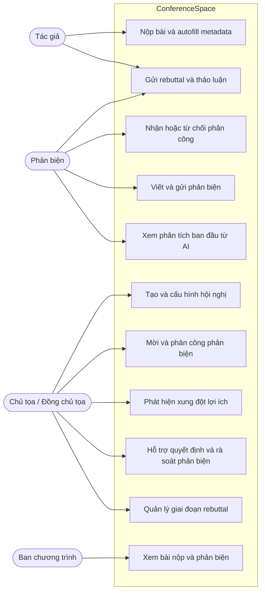
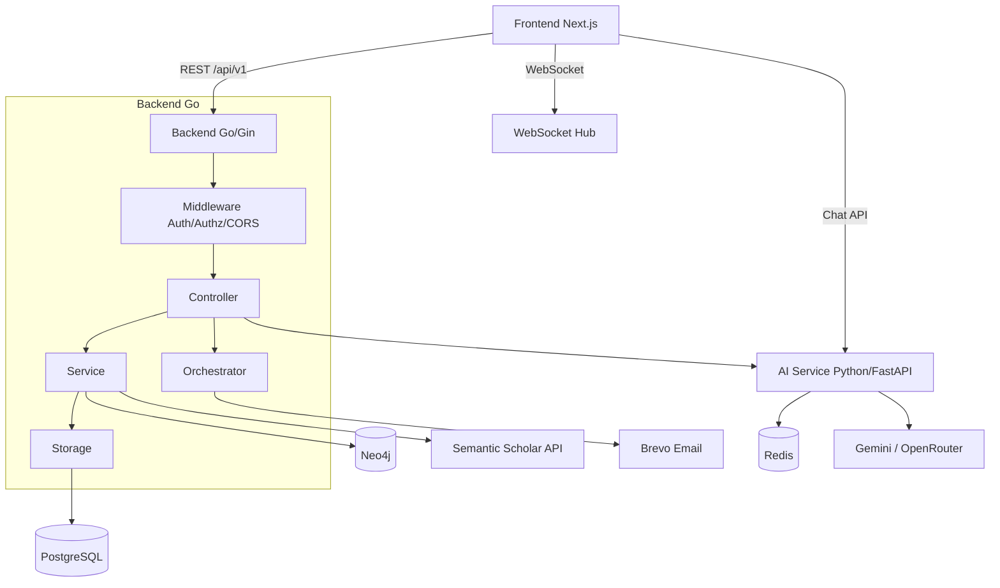
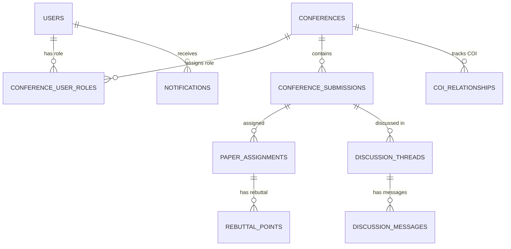
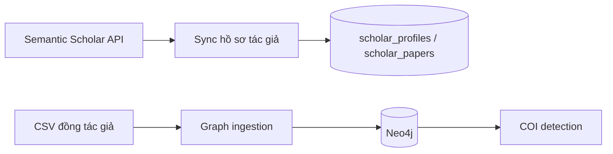
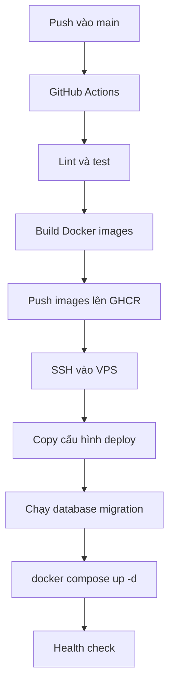

# Báo cáo đồ án: ConferenceSpace

## Mục lục

- [Lời mở đầu](#lời-mở-đầu)
- [Chương 1. Tổng quan và bối cảnh đề tài](#chương-1-tổng-quan-và-bối-cảnh-đề-tài)
  - [1.1. Đặt vấn đề](#11-đặt-vấn-đề)
  - [1.2. Mục tiêu đề tài](#12-mục-tiêu-đề-tài)
  - [1.3. Phạm vi đề tài](#13-phạm-vi-đề-tài)
  - [1.4. Định hướng giải pháp](#14-định-hướng-giải-pháp)
- [Chương 2. Khảo sát hiện trạng và phân tích yêu cầu](#chương-2-khảo-sát-hiện-trạng-và-phân-tích-yêu-cầu)
  - [2.1. Khảo sát nhu cầu người dùng](#21-khảo-sát-nhu-cầu-người-dùng)
  - [2.2. Khảo sát các hệ thống tương tự](#22-khảo-sát-các-hệ-thống-tương-tự)
  - [2.3. Phân tích yêu cầu](#23-phân-tích-yêu-cầu)
  - [2.4. Khảo sát công cụ và nền tảng dữ liệu học thuật](#24-khảo-sát-công-cụ-và-nền-tảng-dữ-liệu-học-thuật)
  - [2.5. Khảo sát và lựa chọn nền tảng AI](#25-khảo-sát-và-lựa-chọn-nền-tảng-ai)
  - [2.6. Công nghệ sử dụng](#26-công-nghệ-sử-dụng)
- [Chương 3. Phân tích và thiết kế hệ thống](#chương-3-phân-tích-và-thiết-kế-hệ-thống)
  - [3.1. Phân tích hệ thống](#31-phân-tích-hệ-thống)
  - [3.2. Thiết kế kiến trúc](#32-thiết-kế-kiến-trúc)
- [Chương 4. Cài đặt và triển khai hệ thống](#chương-4-cài-đặt-và-triển-khai-hệ-thống)
  - [4.1. Môi trường triển khai](#41-môi-trường-triển-khai)
  - [4.2. Cấu hình production](#42-cấu-hình-production)
  - [4.3. CI/CD và Docker Compose](#43-cicd-và-docker-compose)
  - [4.4. Reverse proxy và HTTPS](#44-reverse-proxy-và-https)
  - [4.5. Kiểm tra và gỡ lỗi](#45-kiểm-tra-và-gỡ-lỗi)
- [Chương 5. Đánh giá thực nghiệm và kết quả](#chương-5-đánh-giá-thực-nghiệm-và-kết-quả)
  - [5.1. Thiết lập thực nghiệm](#51-thiết-lập-thực-nghiệm)
  - [5.2. Đánh giá Submission Autofill](#52-đánh-giá-submission-autofill)
  - [5.3. Đánh giá độ trễ và token AI](#53-đánh-giá-độ-trễ-và-token-ai)
  - [5.4. Đánh giá hiệu năng backend](#54-đánh-giá-hiệu-năng-backend)
  - [5.5. Nhận xét chung](#55-nhận-xét-chung)
- [Kết luận](#kết-luận)
- [Tài liệu tham khảo](#tài-liệu-tham-khảo)

## Lời mở đầu

Trong vài năm gần đây, số lượng bài báo gửi đến các hội nghị khoa học tăng nhanh, trong khi quy trình xét duyệt vẫn đòi hỏi nhiều thao tác thủ công: tiếp nhận bản thảo, phân công phản biện, kiểm tra xung đột lợi ích, thu thập nhận xét, trao đổi trong giai đoạn rebuttal và ra quyết định cuối cùng. Với các hội nghị quy mô vừa và nhỏ, đặc biệt trong môi trường đại học, việc vận hành toàn bộ quy trình này bằng email, bảng tính hoặc các công cụ rời rạc dễ dẫn đến chậm trễ, thiếu minh bạch và khó theo dõi.

Từ thực tế đó, nhóm xây dựng **ConferenceSpace**, một nền tảng quản lý hội nghị học thuật có tích hợp các lớp hỗ trợ hiện đại: quy trình nghiệp vụ trực tuyến, thuật toán gợi ý phản biện, phát hiện xung đột lợi ích dựa trên đồ thị đồng tác giả và một số mô-đun AI hỗ trợ người dùng ở những bước cần đọc hiểu, tóm tắt hoặc đối chiếu thông tin.

Báo cáo này tổng hợp quá trình khảo sát, phân tích yêu cầu, thiết kế, cài đặt, triển khai và đánh giá thực nghiệm hệ thống ConferenceSpace. Nội dung được trình bày theo hướng gần với một báo cáo đồ án hoàn chỉnh: vừa mô tả sản phẩm đã xây dựng, vừa giải thích lý do lựa chọn kiến trúc và công nghệ.

---

# Chương 1. Tổng quan và bối cảnh đề tài

## 1.1. Đặt vấn đề

Quy trình xét duyệt bài báo khoa học là một phần quan trọng trong hoạt động tổ chức hội nghị. Một bài nộp thường đi qua nhiều bước: tác giả gửi bản thảo, ban tổ chức kiểm tra điều kiện nộp, chair hoặc co-chair phân công phản biện, phản biện đánh giá, tác giả phản hồi trong giai đoạn rebuttal, sau đó hội nghị đưa ra quyết định chấp nhận hoặc từ chối. Ở mỗi bước đều có dữ liệu, vai trò và deadline riêng.

Các nền tảng như EasyChair, HotCRP, Microsoft CMT hay OpenReview đã hỗ trợ tốt nhiều nghiệp vụ truyền thống. Tuy nhiên, qua khảo sát tài liệu và trải nghiệm công khai, nhóm nhận thấy các hệ thống này vẫn còn một số khoảng trống:

- Giao diện và luồng thao tác chưa thật sự thân thiện với người dùng mới.
- Phân công phản biện vẫn phụ thuộc nhiều vào chair và danh sách chuyên môn được nhập thủ công.
- Phát hiện xung đột lợi ích chủ yếu dựa vào khai báo hoặc kiểm tra thủ công.
- Ít có công cụ hỗ trợ đọc hiểu, tóm tắt, đối chiếu thông tin trong quá trình nộp bài và phản biện.
- Thông báo thời gian thực và hỗ trợ theo ngữ cảnh chưa được xem là thành phần trung tâm.

ConferenceSpace được đề xuất như một hệ thống thử nghiệm nhằm giải quyết các vấn đề trên trong phạm vi hội nghị vừa và nhỏ. Hệ thống không đặt mục tiêu thay thế hoàn toàn vai trò của con người, mà tập trung giảm thao tác lặp lại, cung cấp gợi ý có thể kiểm chứng và giúp các vai trò ra quyết định thuận tiện hơn.

## 1.2. Mục tiêu đề tài

Mục tiêu chính của đề tài là xây dựng một nền tảng web hỗ trợ toàn bộ vòng đời xét duyệt bài báo tại hội nghị khoa học. Hệ thống phục vụ ba nhóm người dùng chính:

| Vai trò | Mục tiêu sử dụng |
|---|---|
| Tác giả | Tìm hội nghị phù hợp, nộp bài, theo dõi trạng thái và gửi phản hồi |
| Người phản biện | Nhận bài được phân công, đọc thông tin hỗ trợ, viết và gửi phản biện |
| Chủ tọa / Chair | Tạo hội nghị, quản lý bài nộp, phân công phản biện, theo dõi tiến độ và ra quyết định |

Bên cạnh các chức năng nghiệp vụ, đề tài tập trung vào ba hướng hỗ trợ chính:

1. **Tự động hóa phân công phản biện:** tính điểm phù hợp giữa phản biện và bài nộp bằng Domain Jaccard Similarity, sau đó đề xuất phân công có xét ràng buộc tải.
2. **Phát hiện xung đột lợi ích:** kết hợp khai báo thủ công, kiểm tra vai trò tác giả và phân tích đồ thị đồng tác giả bằng Neo4j.
3. **Tích hợp AI có kiểm soát:** sử dụng AI cho các tác vụ hỗ trợ như tự động điền thông tin bài nộp, gợi ý track, kiểm tra sơ bộ bản thảo, hỗ trợ phản biện đọc bài, rà soát chất lượng phản biện và tổng hợp thông tin cho chair.

Một câu hỏi xuyên suốt của đề tài là: trong quy trình xét duyệt học thuật, phần nào nên được giải quyết bằng tổ chức nghiệp vụ, phần nào nên dùng thuật toán xác định, và phần nào mới thật sự phù hợp để AI hỗ trợ. Đây cũng là cách nhóm nhìn nhận hệ thống: AI là lớp hỗ trợ, không phải nơi ra quyết định cuối cùng.

## 1.3. Phạm vi đề tài

Đề tài tập trung vào quy trình peer review cho hội nghị khoa học. Phạm vi bao gồm:

- Quản lý hội nghị, track, deadline và cấu hình phản biện.
- Nộp bài, cập nhật bài nộp, theo dõi trạng thái và gửi rebuttal.
- Mời, quản lý và phân công phản biện.
- Nhập, lưu nháp và gửi phiếu phản biện.
- Thảo luận nội bộ giữa chair và reviewer.
- Phát hiện xung đột lợi ích.
- Thông báo thời gian thực.
- Tích hợp Semantic Scholar để làm giàu hồ sơ học thuật.
- Các workflow AI hỗ trợ author, reviewer và chair.

Phạm vi không bao gồm quản lý sự kiện hội nghị theo nghĩa rộng như bán vé, đăng ký tham dự, xếp lịch phòng, in kỷ yếu hay quản lý chương trình hội nghị chi tiết. Kết quả phân công phản biện trong hệ thống chỉ mang tính đề xuất; chair vẫn là người xem xét và xác nhận trước khi áp dụng.

## 1.4. Định hướng giải pháp

ConferenceSpace được tổ chức thành ba lớp rõ ràng:

| Lớp | Nội dung | Vai trò trong hệ thống |
|---|---|---|
| Lớp nghiệp vụ cốt lõi | Nộp bài, phản biện, rebuttal, quyết định, thông báo | Đảm bảo quy trình vận hành ổn định |
| Lớp thuật toán | Gợi ý phản biện, cân bằng tải, phát hiện COI | Tính toán xác định, có thể giải thích |
| Lớp AI hỗ trợ | Autofill, track recommendation, review audit, decision copilot, chatbot | Hỗ trợ đọc hiểu và tổng hợp thông tin |

Về kỹ thuật, hệ thống sử dụng frontend Next.js, backend Go/Gin, AI Service Python/FastAPI, PostgreSQL cho dữ liệu quan hệ, Neo4j cho dữ liệu đồ thị và Redis cho cache/runtime state. Kiến trúc này giúp tách biệt phần nghiệp vụ ổn định với phần AI vốn có thể thay đổi nhanh theo mô hình và nhà cung cấp.

---

# Chương 2. Khảo sát hiện trạng và phân tích yêu cầu

## 2.1. Khảo sát nhu cầu người dùng

Để xác định nhu cầu thực tế, nhóm khảo sát các đối tượng có khả năng tham gia quy trình hội nghị học thuật. Khảo sát được chia thành hai giai đoạn: trước phát triển để thu thập kỳ vọng và khó khăn của người dùng, sau UAT để đánh giá mức độ đáp ứng của hệ thống.

Công cụ thu thập là Google Forms, dữ liệu được xử lý thống kê bằng Python. Tổng cộng có 89 phản hồi sau giai đoạn dùng thử:

| Vai trò | Số lượng phản hồi | Ghi chú |
|---|---:|---|
| Tác giả | 76 | Nhóm phản hồi chính, đa số dùng thử 5-10 phút |
| Người phản biện | 7 | Chủ yếu dùng thử luồng phản biện |
| Chủ tọa / Chair | 6 | Số mẫu nhỏ, dùng cho phân tích định tính |
| Tổng | 89 | Phần lớn đã từng dùng ít nhất một hệ thống học thuật |

### 2.1.1. Các khó khăn trong quy trình hiện tại

Với **tác giả**, khó khăn thường gặp là phải tự tìm thông tin hội nghị, nộp bài qua email hoặc qua giao diện phức tạp, khó theo dõi trạng thái và không có kênh rebuttal có cấu trúc.

Với **người phản biện**, vấn đề nằm ở việc nhận nhiệm vụ rời rạc qua email, thiếu giao diện tập trung, biểu mẫu phản biện không thống nhất và ít công cụ hỗ trợ quản lý deadline.

Với **chair**, áp lực lớn nhất là phân công phản biện và kiểm tra COI. Khi số lượng bài tăng, việc đọc từng bài, đối chiếu từng phản biện và kiểm tra quan hệ đồng tác giả thủ công trở nên tốn thời gian và dễ bỏ sót.

### 2.1.2. Kết quả khảo sát theo vai trò

Đối với vai trò **tác giả**, điểm hài lòng trung bình đạt **3,89/5**. Các tính năng nộp bài cơ bản được sử dụng nhiều nhất, trong đó AI Autofill là tính năng được đánh giá vừa hữu ích nhất vừa cần cải thiện nhất. Điều này cho thấy người dùng kỳ vọng cao vào AI, nhưng vẫn cần kết quả minh bạch và dễ kiểm tra.

| Khía cạnh | Điểm trung bình |
|---|---:|
| Tính năng AI autofill/track/precheck | 3,92 |
| Tải và kiểm tra bản thảo | 3,88 |
| Theo dõi trạng thái bài nộp | 3,82 |
| Tìm hội nghị phù hợp | 3,78 |
| Khai báo xung đột lợi ích | 3,07 |

Khoảng **82% tác giả** cho biết sẵn sàng giới thiệu hệ thống cho bạn bè hoặc đồng nghiệp. Tuy nhiên, hơn một nửa người dùng vẫn có phần chưa thoải mái khi AI tham gia vào quy trình học thuật. Lý do phổ biến là lo ngại AI gợi ý sai, đánh giá học thuật là vấn đề nhạy cảm và AI có thể tạo áp lực không cần thiết.

Đối với vai trò **người phản biện**, điểm hài lòng trung bình đạt **4,29/5**, cao hơn nhóm tác giả. Các phần được đánh giá tốt gồm xem thông tin bài được phân công, nhập điểm theo tiêu chí và AI kiểm tra chất lượng phản biện. Khoảng **86% reviewer** sẵn sàng giới thiệu hệ thống.

Với vai trò **chủ tọa**, số mẫu khảo sát còn hạn chế nên kết quả chủ yếu dùng để tham khảo định tính. Các chức năng được quan tâm nhiều là dashboard, tạo hội nghị từ template, theo dõi tiến độ phản biện, xem gợi ý người phản biện và kiểm tra xung đột lợi ích.

### 2.1.3. Tổng hợp nhu cầu

Từ khảo sát, nhóm rút ra các nhu cầu chính:

| STT | Nhu cầu | Mức ưu tiên |
|---:|---|---|
| 1 | Quy trình nộp bài trực quan, có hướng dẫn từng bước | Cao |
| 2 | AI hỗ trợ giảm nhập liệu thủ công | Cao |
| 3 | AI phải minh bạch, dễ bỏ qua và không thay người dùng quyết định | Cao |
| 4 | Giao diện phản biện rõ ràng, có tiêu chí thống nhất | Cao |
| 5 | Công cụ phát hiện COI đáng tin cậy | Trung bình - cao |
| 6 | Thông báo realtime và lỗi dễ hiểu | Trung bình |
| 7 | Dashboard giúp chair theo dõi tiến độ | Trung bình |

Nhìn chung, nhu cầu cốt lõi không chỉ là "thêm AI", mà là tập trung hóa quy trình, giảm thao tác lặp lại và giúp người dùng hiểu rõ trạng thái của từng bước.

## 2.2. Khảo sát các hệ thống tương tự

Nhóm khảo sát các hệ thống phổ biến trong quản lý hội nghị và học thuật: EasyChair, HotCRP, Microsoft CMT, OpenReview, cùng một số công cụ hỗ trợ tìm kiếm hội nghị như WikiCFP, ICORE và ConfHub.

### 2.2.1. EasyChair

EasyChair là một trong những hệ thống quản lý hội nghị lâu đời và phổ biến nhất. Hệ thống hỗ trợ đầy đủ vòng đời hội nghị, nhiều track, nhiều vai trò và xuất dữ liệu phục vụ quản trị.

Điểm mạnh của EasyChair là độ ổn định và mức độ phổ biến. Tuy nhiên, giao diện có phần cũ, trải nghiệm với người mới chưa tốt, kiểm tra COI còn thủ công và không có các tính năng AI hiện đại.

### 2.2.2. HotCRP

HotCRP thường được dùng trong các hội nghị khoa học máy tính, đặc biệt ở nhóm hệ thống. Hệ thống mạnh về phản biện, bidding, thảo luận nội bộ và tìm kiếm bài nộp.

Hạn chế của HotCRP là thiên về người dùng kỹ thuật, cài đặt self-hosted cần kinh nghiệm, hỗ trợ tác giả không phải trọng tâm và không có AI hỗ trợ trong quy trình.

### 2.2.3. Microsoft CMT

Microsoft CMT hỗ trợ nhiều hội nghị lớn, có khả năng xử lý quy mô hàng nghìn bài nộp và có cơ chế phân công bán tự động. Tuy nhiên, hệ thống vẫn khá phức tạp, phụ thuộc hệ sinh thái Microsoft và không tích hợp LLM hoặc AI hỗ trợ theo ngữ cảnh.

### 2.2.4. OpenReview

OpenReview nổi bật với mô hình phản biện mở, dữ liệu minh bạch và API phục vụ nghiên cứu. Hệ thống phù hợp với các hội nghị chấp nhận open peer review, nhưng không phải lựa chọn tối ưu cho mọi hội nghị truyền thống cần phản biện kín hoặc double-blind.

### 2.2.5. Các công cụ hỗ trợ khác

WikiCFP, ICORE và ConfHub chủ yếu hỗ trợ tra cứu thông tin hội nghị, deadline hoặc xếp hạng. Chúng có ích cho tác giả khi tìm nơi nộp bài, nhưng không xử lý quy trình nộp bài, phản biện hay ra quyết định.

### 2.2.6. So sánh tổng quan

| Tiêu chí | EasyChair | HotCRP | CMT | OpenReview | ConferenceSpace |
|---|:---:|:---:|:---:|:---:|:---:|
| Nộp bài | Có | Có | Có | Có | Có |
| Phản biện | Có | Có | Có | Có | Có |
| Quản lý hội nghị | Có | Có | Có | Có giới hạn | Có |
| Giao diện hiện đại | Hạn chế | Hạn chế | Trung bình | Trung bình | Có |
| Gợi ý phản biện | Có giới hạn | Có bidding | Có TPMS | Không trọng tâm | Có thuật toán matching |
| Phát hiện COI tự động bằng đồ thị | Không | Không | Hạn chế | Không | Có |
| AI Autofill | Không | Không | Không | Không | Có |
| AI kiểm tra review / hỗ trợ quyết định | Không | Không | Không | Không | Có |
| Thông báo realtime | Không | Không | Không | Không | Có |
| Chatbot hỗ trợ | Không | Không | Không | Không | Có |

Khoảng trống chính mà ConferenceSpace hướng đến là sự kết hợp giữa quy trình quản lý hội nghị đầy đủ, giao diện hiện đại, thuật toán phân công có thể giải thích, COI dựa trên đồ thị và AI hỗ trợ ở các bước phù hợp.

## 2.3. Phân tích yêu cầu

### 2.3.1. Yêu cầu chức năng

Hệ thống được chia thành các nhóm chức năng theo vai trò và phân hệ.

**Xác thực và tài khoản**

- Đăng ký, đăng nhập, xác thực email.
- Đặt lại và đổi mật khẩu.
- Cập nhật hồ sơ cá nhân, lĩnh vực chuyên môn và liên kết Semantic Scholar.

**Tác giả**

- Tìm kiếm và đánh dấu hội nghị quan tâm.
- Xem chi tiết hội nghị, CFP, deadline và track.
- Nộp bài qua quy trình nhiều bước: thông tin, tệp, COI, xem lại và gửi.
- Lưu nháp, chỉnh sửa hoặc rút bài trước deadline.
- Theo dõi trạng thái bài nộp.
- Xem phản biện, gửi rebuttal và nộp camera-ready.
- Dùng AI để autofill metadata, gợi ý từ khóa, gợi ý track và kiểm tra sơ bộ.

**Người phản biện**

- Nhận và phản hồi lời mời phản biện.
- Xem danh sách bài được phân công.
- Đọc metadata, tệp bài báo và phân tích ban đầu từ AI.
- Nhập điểm, nhận xét, mức tự tin và khuyến nghị.
- Lưu nháp, gửi phản biện, đọc rebuttal và cập nhật điểm sau rebuttal nếu cần.

**Chair / Co-Chair**

- Tạo, chỉnh sửa và quản lý trạng thái hội nghị.
- Cấu hình track, deadline, template, rebuttal và quy định phản biện.
- Mời reviewer nội bộ hoặc bên ngoài.
- Xem gợi ý người phản biện dựa trên hồ sơ chuyên môn.
- Phân công reviewer, theo dõi tiến độ và kiểm tra COI.
- Xem dashboard thống kê.
- Chạy audit chất lượng review và dùng decision copilot để tổng hợp thông tin trước khi ra quyết định.

**Thông báo và thảo luận**

- Thông báo realtime qua WebSocket.
- Thông báo trong ứng dụng và tùy chỉnh loại thông báo.
- Thảo luận nội bộ theo bài nộp, có kiểm soát quyền truy cập.

### 2.3.2. Yêu cầu phi chức năng

| Nhóm yêu cầu | Nội dung |
|---|---|
| Hiệu năng | API thông thường phản hồi nhanh, workflow AI có thể chậm hơn nhưng cần thông báo rõ trạng thái |
| Bảo mật | JWT, RBAC theo vai trò hội nghị, bcrypt cho mật khẩu, kiểm soát upload, CORS |
| Khả năng sử dụng | Giao diện theo vai trò, quy trình nộp bài dễ theo dõi, lỗi rõ ràng, hỗ trợ tiếng Việt và tiếng Anh |
| Khả năng bảo trì | Clean Architecture, Swagger/OpenAPI, migration có phiên bản, lint và test |
| Khả năng mở rộng | Backend stateless, database và AI service có thể scale riêng |
| Triển khai | Docker Compose, biến môi trường, health check, CI/CD |

### 2.3.3. Ràng buộc

Các ràng buộc chính của đề tài gồm:

- Backend sử dụng Go và Gin.
- Frontend sử dụng Next.js, TypeScript và Tailwind CSS.
- PostgreSQL là cơ sở dữ liệu quan hệ chính.
- Neo4j dùng cho đồ thị đồng tác giả và phát hiện COI.
- AI phụ thuộc dịch vụ mô hình bên ngoài, do đó phải tách khỏi logic nghiệp vụ cốt lõi.
- Hệ thống ưu tiên giải pháp miễn phí hoặc chi phí thấp, phù hợp phạm vi đồ án.

## 2.4. Khảo sát công cụ và nền tảng dữ liệu học thuật

Để gợi ý phản biện và phát hiện COI, hệ thống cần dữ liệu học thuật như hồ sơ tác giả, danh sách bài đã công bố, lĩnh vực nghiên cứu và mạng đồng tác giả.

Nhóm khảo sát hai hướng:

- Web scraping bằng Selenium, Puppeteer hoặc Playwright.
- Gọi API trực tiếp qua Semantic Scholar Open API.

Các công cụ tự động hóa trình duyệt có thể xử lý giao diện web phức tạp nhưng nặng tài nguyên, dễ bị thay đổi khi UI thay đổi và có rủi ro về điều khoản sử dụng. Trong khi đó, Semantic Scholar API trả về dữ liệu JSON có cấu trúc, hợp pháp, nhẹ và dễ tích hợp với Go backend.

Vì vậy, nhóm chọn **Semantic Scholar API** làm nguồn dữ liệu chính. Kết quả được cache trong PostgreSQL để tránh gọi API lặp lại. Playwright vẫn được sử dụng trong dự án cho kiểm thử giao diện và UAT, không dùng làm công cụ thu thập dữ liệu production.

## 2.5. Khảo sát và lựa chọn nền tảng AI

ConferenceSpace dùng AI cho nhiều tác vụ: autofill bài nộp, gợi ý track, kiểm tra sơ bộ, hỗ trợ reviewer đọc bài, kiểm tra chất lượng review, hỗ trợ chair tổng hợp quyết định và chatbot.

Nhóm so sánh ba nhóm nền tảng chính:

| Tiêu chí | Google Gemini | OpenAI GPT | DeepSeek |
|---|:---:|:---:|:---:|
| Free tier | Có | Không đáng kể | Có thử nghiệm / giá rẻ |
| Xử lý PDF / multimodal | Tốt | Cần xử lý trung gian | Hạn chế |
| Context dài | Rất tốt | Tốt | Trung bình - tốt |
| Chất lượng text | Cao | Rất cao | Cao |
| Chi phí | Phù hợp đồ án | Cao hơn | Rất thấp |
| Hệ sinh thái | Tốt | Rất tốt | Đang phát triển |

Kết luận của nhóm là sử dụng **Google Gemini** làm nền tảng AI chính nhờ miễn phí trong giới hạn đủ dùng, hỗ trợ multimodal và context dài. **OpenRouter** được dùng như gateway linh hoạt cho chatbot, còn **LiteLLM** giúp AI Service gọi nhiều provider qua một giao diện thống nhất. DeepSeek được đánh giá có tiềm năng về chi phí nhưng không được chọn làm AI chính vì hạn chế multimodal và các cân nhắc về dữ liệu học thuật chưa công bố.

## 2.6. Công nghệ sử dụng

Hệ thống ConferenceSpace sử dụng stack kỹ thuật sau:

| Thành phần | Công nghệ | Vai trò |
|---|---|---|
| Frontend | Next.js 15, React 18, TypeScript, Tailwind CSS, shadcn/ui | Giao diện web theo vai trò |
| Backend API | Go 1.24, Gin | REST API, nghiệp vụ chính, authorization |
| AI Service | Python, FastAPI, LiteLLM | Chạy workflow AI và agent |
| Relational DB | PostgreSQL 15 | Lưu users, conferences, submissions, reviews |
| Graph DB | Neo4j 5.15 | Lưu đồ thị đồng tác giả phục vụ COI |
| Cache / runtime | Redis | Cache và state cho AI service |
| Realtime | WebSocket | Thông báo tức thì |
| DevOps | Docker, Docker Compose, GitHub Actions, Caddy | Đóng gói, triển khai, HTTPS |
| API Docs | Swagger/OpenAPI | Tài liệu hóa endpoint |

Điểm quan trọng là hệ thống không đặt tất cả logic vào AI. Reviewer matching và COI là những phần có thể giải thích được, nên được triển khai bằng thuật toán và truy vấn dữ liệu. AI chỉ tham gia ở các bước cần đọc hiểu hoặc tổng hợp thông tin khó mô hình hóa bằng luật cứng.

---

# Chương 3. Phân tích và thiết kế hệ thống

## 3.1. Phân tích hệ thống

### 3.1.1. Tổng quan nghiệp vụ

ConferenceSpace hỗ trợ vòng đời của một bài báo từ lúc nộp đến khi có quyết định cuối cùng. Một luồng nghiệp vụ điển hình gồm:

1. Tác giả tạo tài khoản và nộp bài vào một hội nghị.
2. Hệ thống hỗ trợ trích xuất metadata, gợi ý track và kiểm tra sơ bộ bản thảo.
3. Chủ tọa xem danh sách bài nộp, kiểm tra điều kiện và phân công phản biện.
4. Hệ thống gợi ý người phản biện dựa trên lĩnh vực chuyên môn, đồng thời cảnh báo COI.
5. Người phản biện nhận bài, đọc thông tin hỗ trợ, viết nhận xét và gửi phản biện.
6. Tác giả gửi rebuttal nếu hội nghị bật giai đoạn này.
7. Chủ tọa tổng hợp phản biện, thảo luận và rebuttal để đưa ra quyết định.

### 3.1.2. Các nhóm người dùng và quyền hạn

Vai trò trong hệ thống được gán theo từng hội nghị thông qua bảng `conference_user_roles`. Một người dùng có thể là tác giả ở hội nghị này nhưng là người phản biện hoặc chủ tọa ở hội nghị khác.

| Vai trò | Mã | Quyền chính |
|---|---|---|
| Chủ tọa | `chair` | Toàn quyền quản lý hội nghị, phân công phản biện và ra quyết định |
| Đồng chủ tọa | `co_chair` | Hỗ trợ chủ tọa trong hầu hết thao tác vận hành |
| Thành viên ban chương trình | `pc` | Xem bài nộp, phản biện và các phân tích trong hội nghị |
| Người phản biện | `reviewer` | Xem bài được phân công, viết và gửi phản biện |
| Tác giả | `author` | Nộp bài, xem trạng thái và gửi phản hồi rebuttal |
| Quản trị hệ thống | Admin token | Truy cập các chức năng vận hành nội bộ |

Các trạng thái vai trò gồm `active`, `inactive` và `pending`. Điều này giúp hệ thống xử lý lời mời phản biện hoặc thành viên hội đồng chưa xác nhận.

### 3.1.3. Các chức năng chính theo vai trò



## 3.2. Thiết kế kiến trúc

### 3.2.1. Kiến trúc tổng thể

ConferenceSpace sử dụng mô hình nhiều dịch vụ ở mức triển khai, nhưng backend nghiệp vụ chính vẫn là một Go service theo kiến trúc phân lớp. AI được tách thành service riêng để dễ thay đổi mô hình, kiểm soát timeout và scale độc lập.



Trong backend Go, thư mục `internal/` được tổ chức theo các tầng:

| Thư mục | Vai trò |
|---|---|
| `controller` | HTTP handler, nhận request và trả response |
| `service` | Logic nghiệp vụ |
| `storage` | Truy cập dữ liệu, repository pattern |
| `model` | Entity và DTO |
| `middleware` | Xác thực, phân quyền, CORS |
| `clients` | Kết nối AI service, Neo4j, Semantic Scholar, email |
| `websocket` | Hub thông báo realtime |
| `assignment` | Matching, scoring và COI |
| `deskrejection` | Pipeline kiểm tra sơ bộ bài nộp |
| `cron` | Tác vụ định kỳ |
| `config` | Đọc cấu hình từ biến môi trường |

Luồng phụ thuộc chính là **Controller -> Service -> Storage**, được khởi tạo rõ ràng trong `cmd/server/main.go`. Cách tổ chức này giúp logic nghiệp vụ không phụ thuộc trực tiếp vào HTTP framework hoặc database cụ thể.

### 3.2.2. Thiết kế cơ sở dữ liệu

#### PostgreSQL

PostgreSQL lưu dữ liệu quan hệ chính của hệ thống:

| Bảng | Vai trò |
|---|---|
| `users` | Tài khoản, email, mật khẩu hash, domain, trạng thái xác thực |
| `conferences` | Thông tin hội nghị, track, deadline, trạng thái, cấu hình JSONB |
| `conference_submissions` | Bài nộp, metadata, trạng thái, file, rebuttal phase |
| `paper_assignments` | Phân công reviewer, điểm, trạng thái, dữ liệu review |
| `conference_user_roles` | Vai trò của người dùng trong từng hội nghị |
| `conference_reviewers` | Hồ sơ reviewer trong hội nghị |
| `coi_relationships` | Quan hệ xung đột lợi ích và bằng chứng |
| `discussion_threads`, `discussion_messages` | Thảo luận theo bài nộp |
| `rebuttal_points` | Phản hồi theo từng điểm review |
| `notifications`, `notification_preferences` | Thông báo và cấu hình nhận thông báo |
| `external_invitations` | Lời mời reviewer bên ngoài |
| `scholar_profiles`, `scholar_papers` | Cache dữ liệu Semantic Scholar |
| `conference_config_templates` | Template cấu hình hội nghị |
| `usage_events` | Sự kiện phân tích sử dụng |

Quan hệ chính: một hội nghị có nhiều bài nộp; một bài nộp có nhiều phân công phản biện; người dùng có vai trò theo từng hội nghị; mỗi bài nộp có thể có discussion, rebuttal và notification liên quan.



#### Neo4j

Neo4j được dùng cho đồ thị đồng tác giả phục vụ phát hiện COI. Mô hình dữ liệu gồm:

- Node `Author`: chứa `email`, `name`.
- Relationship `COAUTHORED`: thể hiện quan hệ đồng tác giả, có thể kèm năm hoặc đường dẫn bài báo.

Các truy vấn quan trọng gồm tìm đồng tác giả trực tiếp, đồng tác giả trong một khoảng thời gian, và quan hệ gián tiếp trong một độ sâu nhất định. Nếu Neo4j không được cấu hình, hệ thống vẫn chạy được các chức năng cốt lõi và chỉ tắt lớp phát hiện COI dựa trên đồ thị.

### 3.2.3. Luồng đồng bộ dữ liệu học thuật

Hệ thống không xây dựng crawler tổng quát. Dữ liệu học thuật được lấy qua Semantic Scholar API và script nhập đồ thị.



Khi đồng bộ Semantic Scholar, hệ thống lấy thông tin tác giả, danh sách bài báo, sau đó tổng hợp lĩnh vực nghiên cứu. Để tránh gọi API trùng lặp hoặc quá giới hạn, backend dùng cơ chế khóa theo người dùng và rate limit. Dữ liệu đồng tác giả có thể được nhập theo batch vào Neo4j qua script riêng.

### 3.2.4. Thiết kế reviewer matching

Reviewer matching trong ConferenceSpace là thuật toán xác định, không gọi LLM. Mỗi reviewer và bài nộp được biểu diễn bằng tập domain hoặc keyword. Hệ thống tính độ tương đồng bằng Jaccard:

```text
similarity(A, B) = |A ∩ B| / |A ∪ B|
```

Sau khi có điểm phù hợp, hệ thống dùng chiến lược gán tham lam có xét ràng buộc:

- Mỗi bài cần đủ số reviewer tối thiểu.
- Mỗi reviewer không vượt quá số bài tối đa.
- Reviewer có COI với bài nộp sẽ bị loại khỏi danh sách gợi ý.
- Chair vẫn có quyền xem, điều chỉnh và xác nhận phân công.

Lựa chọn này phù hợp với đồ án vì đơn giản, dễ giải thích và đủ nhanh cho hội nghị quy mô vừa. Quan trọng hơn, kết quả không phải "hộp đen": chair có thể hiểu vì sao một reviewer được gợi ý.

### 3.2.5. Thiết kế phát hiện xung đột lợi ích

COI được kiểm tra theo nhiều lớp:

1. **Self-author:** reviewer là tác giả của bài nộp.
2. **Declared conflict:** người dùng đã khai báo xung đột.
3. **Co-authorship graph:** reviewer và tác giả có quan hệ đồng tác giả gần đây trên Neo4j.

Thiết kế nhiều lớp giúp hệ thống không phụ thuộc hoàn toàn vào một nguồn dữ liệu. Nếu dữ liệu Semantic Scholar chưa đủ, khai báo thủ công và kiểm tra self-author vẫn hoạt động. Nếu Neo4j có dữ liệu tốt, hệ thống có thể phát hiện thêm các quan hệ khó thấy bằng mắt thường.

### 3.2.6. Tích hợp AI Service

Các workflow AI được triển khai trong AI Service Python/FastAPI:

| Workflow | Mục đích | Vai trò hưởng lợi |
|---|---|---|
| `submission_autofill` | Trích xuất tiêu đề, abstract, keyword từ PDF | Tác giả |
| `track_recommendation` | Gợi ý track phù hợp | Tác giả |
| `submission_gating` | Kiểm tra sơ bộ bản thảo, hỗ trợ desk rejection | Tác giả / Chair |
| `reviewer_initial_analysis` | Tạo briefing ban đầu cho reviewer | Reviewer |
| `review_quality_auditor` | Kiểm tra độ đầy đủ và nhất quán của review | Reviewer / Chair |
| `chair_decision_copilot` | Tổng hợp review, rebuttal, thảo luận để hỗ trợ quyết định | Chair |
| `research_keywords` | Gợi ý từ khóa nghiên cứu | Hệ thống / Tác giả |

Backend Go gọi AI Service qua HTTP, có timeout và retry. AI Service dùng LiteLLM/OpenRouter/Gemini để gọi mô hình. Cách tách này giúp backend không bị khóa cứng vào một provider AI, đồng thời tránh làm rối logic nghiệp vụ chính.

### 3.2.7. API và phân quyền

Backend cung cấp REST API dưới `/api/v1`, có tài liệu Swagger tại `/swagger/index.html`. Xác thực chính dùng JWT Bearer token. Một số header nội bộ được dùng cho admin và AI service:

- `Authorization: Bearer <token>` cho người dùng.
- `X-Admin-Token` cho thao tác vận hành nội bộ.
- `X-Agent-Service-Token` cho AI Service gọi vào backend.
- Token trên query string cho WebSocket notification.

Các nhóm endpoint chính:

| Nhóm | Chức năng |
|---|---|
| `/auth/*` | Đăng ký, đăng nhập, xác thực email, reset password |
| `/users/*` | Hồ sơ, liên kết học thuật, tìm kiếm người dùng |
| `/conferences/*` | CRUD hội nghị, bookmark, trạng thái, thống kê |
| `/conferences/:id/reviewers/*` | Quản lý reviewer, gợi ý và lời mời |
| `/conferences/:id/submissions/*` | Nộp bài, file, precheck, autofill, track, decision copilot |
| `/conferences/:id/assignments/*` | Phân công, review, audit, initial analysis |
| `/conferences/:id/rebuttal/*` | Cấu hình, mở, đóng và finalize rebuttal |
| `/coi/*` | Kiểm tra và thống kê COI |
| `/threads/*` | Thảo luận và tin nhắn |
| `/notifications/*` | Danh sách, đánh dấu đã đọc, cấu hình nhận thông báo |
| `/semantic-scholar/*` | Tìm kiếm và đồng bộ hồ sơ học thuật |
| `/ws/notifications` | WebSocket realtime notification |

---

# Chương 4. Cài đặt và triển khai hệ thống

## 4.1. Môi trường triển khai

ConferenceSpace được triển khai theo hướng container hóa để đảm bảo môi trường nhất quán giữa phát triển và production. Server khuyến nghị là Ubuntu Server 22.04 LTS hoặc mới hơn.

Tài nguyên đề xuất:

| Mức cấu hình | CPU | RAM | Ghi chú |
|---|---:|---:|---|
| Tối thiểu | 2 vCPU | 4 GB | Dùng cho demo và tải nhẹ |
| Khuyến nghị | 4 vCPU | 8 GB trở lên | Phù hợp khi chạy PostgreSQL, Neo4j, Redis, backend, frontend và AI service cùng lúc |

Quy trình bootstrap trên server cài đặt Docker Engine, Docker Compose plugin, cấu hình user deploy, tạo thư mục `/opt/conferencespace` và mở các cổng cần thiết qua UFW.

Các cổng public cần mở:

- `22/TCP` cho SSH.
- `80/TCP` cho HTTP và xác thực chứng chỉ.
- `443/TCP` cho HTTPS.

Các dịch vụ nội bộ như PostgreSQL, Neo4j, Redis, Go backend và AI Service không được mở trực tiếp ra Internet. Chúng chỉ giao tiếp trong Docker network.

## 4.2. Cấu hình production

Biến môi trường production được đặt trong `/opt/conferencespace/.env.production`. File này chứa:

- Image frontend, backend và AI service từ GHCR.
- URL public của ứng dụng.
- Cấu hình CORS.
- JWT secret, admin token và service token.
- Kết nối PostgreSQL, Redis, Neo4j.
- Cấu hình file storage.
- API key cho Gemini, OpenRouter, Semantic Scholar và Brevo.
- Timeout và giới hạn runtime của AI Service.

Cách làm này giúp không hard-code thông tin nhạy cảm vào mã nguồn. GitHub Actions chỉ dùng secrets để SSH vào server và kéo image mới.

## 4.3. CI/CD và Docker Compose

Quy trình triển khai tự động chạy khi có push vào nhánh `main` hoặc khi kích hoạt thủ công từ GitHub Actions.



Docker Compose production gồm các service:

| Service | Vai trò |
|---|---|
| `frontend` / Caddy | Reverse proxy, HTTPS tự động |
| `web` | Next.js frontend |
| `backend` | Go REST API |
| `ai-service` | FastAPI AI workflow service |
| `postgres` | Database quan hệ |
| `neo4j` | Database đồ thị |
| `redis` | Cache và runtime state |
| `backend-migrate` | Chạy migration PostgreSQL |

Các container dùng chính sách `restart: unless-stopped` để tự khởi động lại khi có lỗi hoặc sau khi server reboot.

## 4.4. Reverse proxy và HTTPS

ConferenceSpace dùng Caddy thay cho mô hình Nginx + Certbot truyền thống. Caddy tự đăng ký, gia hạn chứng chỉ TLS và chuyển hướng lưu lượng HTTPS mà không cần viết script gia hạn riêng.

Luồng định tuyến chính:

1. Người dùng truy cập `https://conference-space.com`.
2. Caddy nhận request ở cổng 443.
3. Lưu lượng WebSocket `/ws/*` được proxy đến Go backend.
4. Lưu lượng web thông thường được proxy đến Next.js.
5. Next.js proxy các API client-side về Go backend qua Docker network.
6. Backend gọi AI Service, PostgreSQL, Neo4j và Redis trong mạng nội bộ.

Thiết kế này giúp public surface của hệ thống nhỏ hơn, trong khi các service dữ liệu vẫn được cô lập.

## 4.5. Kiểm tra và gỡ lỗi

Sau khi deploy, quản trị viên có thể kiểm tra:

- Ứng dụng web tại `https://conference-space.com`.
- WebSocket notification qua endpoint `/ws/notifications`.
- Trạng thái container bằng `docker compose ps`.
- Log backend, frontend và AI service bằng `docker compose logs`.
- Trạng thái PostgreSQL bằng `pg_isready`.

Dữ liệu bài nộp và database được lưu trong Docker volumes. Trước khi bảo trì lớn, cần sao lưu các volume quan trọng như `postgres_data`, `neo4j_data` và `uploads_data`.

---

# Chương 5. Đánh giá thực nghiệm và kết quả

## 5.1. Thiết lập thực nghiệm

Nhóm đánh giá ConferenceSpace trên ba khía cạnh:

1. Chất lượng của các mô-đun AI, đặc biệt là Submission Autofill.
2. Hiệu năng của backend và các thuật toán cốt lõi.
3. Tài nguyên tiêu thụ khi hệ thống chạy ở quy mô dữ liệu lớn.

Tập dữ liệu AI quality gồm **1.127 bài báo** từ 8 hội nghị hoặc track khác nhau, được tổng hợp từ các nguồn học thuật công khai như OpenReview.

| Hội nghị / Track | Số bài | Tỷ lệ |
|---|---:|---:|
| ICLR 2023 TinyPapers | 215 | 19,08% |
| UAI 2022 Conference | 213 | 18,90% |
| CoRL 2023 Conference | 191 | 16,95% |
| CoRL 2022 Conference | 178 | 15,79% |
| MIDL 2023 Conference | 111 | 9,85% |
| LOG 2022 Conference | 82 | 7,28% |
| MIDL 2023 Short Paper Track | 77 | 6,83% |
| IEEE ICIST 2024 Conference | 60 | 5,32% |
| Tổng | 1.127 | 100% |

Ngoài ra, backend được benchmark với dataset seed lớn hơn gồm **300 hội nghị, 15.000 bài nộp và 9.000 reviewer** để đánh giá tải API, matching và COI.

## 5.2. Đánh giá Submission Autofill

Submission Autofill là tính năng đầu tiên tác giả tiếp xúc khi nộp bài. Hệ thống đọc file PDF và trích xuất các trường như tiêu đề, tóm tắt, từ khóa và tác giả. Kết quả được so sánh với ground truth từ dữ liệu gốc.

Các chỉ số đánh giá gồm:

- **Title Exact Match:** tiêu đề trích xuất khớp hoàn toàn sau chuẩn hóa.
- **ROUGE-1 và ROUGE-L:** độ tương đồng phần abstract.
- **Keyword F1:** độ chính xác và độ phủ của từ khóa.
- **Author F1:** độ chính xác và độ phủ của danh sách tác giả.

| Chỉ số | Trung bình | Trung vị | Ghi chú |
|---|---:|---:|---|
| Title Exact Match | 0,9122 | 1,0000 | Khoảng 91,22% tiêu đề khớp tuyệt đối |
| Abstract ROUGE-1 | 0,8364 | 0,8549 | Chất lượng tóm tắt cao |
| Abstract ROUGE-L | 0,8325 | 0,8542 | Gần với ROUGE-1 |
| Keyword F1 | 0,9277 | 1,0000 | Từ khóa được trích xuất tốt |
| Author F1 | 0,8349 | 1,0000 | Bị ảnh hưởng bởi bài có nhiều tác giả/affiliation phức tạp |

Kết quả cho thấy Autofill có khả năng giảm đáng kể thao tác nhập liệu thủ công. Điểm yếu chủ yếu xuất hiện ở các bài có định dạng đặc thù, nhiều tác giả hoặc phần abstract không trình bày theo cấu trúc quen thuộc.

Theo từng track, CoRL 2023 có kết quả nổi bật với **98,43%** tiêu đề khớp và ROUGE abstract trên **95%**. Ngược lại, MIDL 2023 có Author F1 thấp hơn do bài y khoa thường có nhiều tác giả và affiliation phức tạp.

## 5.3. Đánh giá độ trễ và token AI

Benchmark AI đo thời gian xử lý của các vai trò Author, Reviewer và Chair. Do nhiều tác vụ được chạy song song, tổng thời gian wall-clock thấp hơn tổng thời gian inference cộng dồn.

| Luồng xử lý | Trung bình | Trung vị |
|---|---:|---:|
| Wall-clock time | 69,85 giây | 64,75 giây |
| Tổng thời gian LLM inference | 121,96 giây | 120,91 giây |
| Author Autofill | 10,64 giây | 9,32 giây |
| Chair Decision Support | 21,68 giây | 20,59 giây |
| Reviewer latency tối đa | 58,33 giây | 55,46 giây |

Autofill phản hồi tương đối nhanh so với các tác vụ còn lại. Reviewer support tốn thời gian nhất vì phải đọc nội dung bài báo dài và phân tích nhiều khía cạnh phục vụ phản biện.

Về token, trung bình một chu trình xử lý bài nộp dùng khoảng **28.481 tokens**, gồm **22.849 input tokens** và **5.631 output tokens**. Phần tiêu thụ lớn nhất thuộc về reviewer workflow vì cần xử lý toàn bộ nội dung bản thảo.

## 5.4. Đánh giá hiệu năng backend

Backend được benchmark bằng k6 và Go micro-benchmarks. Tập dữ liệu thử nghiệm gồm 300 hội nghị, 15.000 bài nộp và 9.000 reviewer. Cả ba kịch bản CRUD, Matching và COI đều ghi nhận **0% request failure**.

| Kịch bản | Requests | Throughput | Median | p95 | Max |
|---|---:|---:|---:|---:|---:|
| CRUD | 11.110 | 369 req/s | 46,2 ms | 117,6 ms | 403,6 ms |
| Matching | 17.184 | 572 req/s | 9,7 ms | 71,8 ms | 254,7 ms |
| COI | 16.760 | 558 req/s | 9,5 ms | 79,3 ms | 293,9 ms |

Kết quả cho thấy backend có thể xử lý hàng trăm request mỗi giây với độ trễ p95 dưới 120 ms ở các kịch bản chính. PostgreSQL là điểm tiêu thụ CPU cao nhất trong bài test, trong khi API container khá nhẹ, RAM trung bình khoảng 30 MB.

Go micro-benchmarks cho thấy:

| Thuật toán | Small | Medium | Large |
|---|---:|---:|---:|
| COI detection | 14,9 µs/op | 147 µs/op | 653 µs/op |
| Reviewer matching | 131 µs/op | 6,1 ms/op | 56 ms/op |

Reviewer matching tăng theo kích thước dữ liệu và là phần tính toán nặng hơn COI detection, nhưng vẫn nằm trong ngưỡng phù hợp cho hội nghị quy mô vừa.

## 5.5. Nhận xét chung

Từ kết quả thực nghiệm, có thể rút ra một số nhận xét:

- Lớp nghiệp vụ và API backend hoạt động ổn định ở quy mô dữ liệu lớn hơn nhiều so với nhu cầu demo.
- Thuật toán matching và COI đủ nhanh, có thể giải thích và không phụ thuộc LLM.
- AI Autofill đạt chất lượng tốt, đặc biệt với title, abstract và keyword.
- Các workflow AI hỗ trợ reviewer/chair có chi phí token và độ trễ cao hơn, phù hợp hơn với tác vụ nền hoặc tác vụ mà người dùng chấp nhận chờ.
- PostgreSQL là thành phần cần theo dõi khi mở rộng tải, vì database CPU là bottleneck rõ nhất trong benchmark.

Quan trọng hơn, kết quả thực nghiệm củng cố định hướng ban đầu của đề tài: không nên dùng AI cho mọi thứ. Những phần cần tính đúng, nhanh và có thể giải thích nên dùng thuật toán hoặc logic nghiệp vụ. AI phát huy giá trị rõ hơn ở các tác vụ đọc hiểu, tóm tắt và hỗ trợ người dùng xử lý thông tin phức tạp.

---

# Kết luận

ConferenceSpace là một thử nghiệm hoàn chỉnh về cách xây dựng hệ thống quản lý hội nghị học thuật hiện đại hơn, có kết hợp giữa nghiệp vụ truyền thống, thuật toán có thể giải thích và AI hỗ trợ theo ngữ cảnh.

Về mặt sản phẩm, hệ thống đã bao phủ các luồng chính của ba vai trò Author, Reviewer và Chair: nộp bài, phản biện, rebuttal, phân công, COI, thông báo và ra quyết định. Về mặt kỹ thuật, hệ thống sử dụng kiến trúc tách lớp rõ ràng, backend Go/Gin, frontend Next.js, AI Service Python/FastAPI, PostgreSQL, Neo4j và Docker-based deployment. Về mặt thực nghiệm, các kết quả benchmark cho thấy backend có hiệu năng tốt, thuật toán cốt lõi đủ nhanh, còn các workflow AI đạt chất lượng hữu ích nhưng cần được dùng đúng vị trí.

Hạn chế của đề tài nằm ở quy mô khảo sát chair còn nhỏ, chất lượng AI phụ thuộc vào mô hình bên ngoài, dữ liệu đồng tác giả phụ thuộc nguồn Semantic Scholar và một số workflow AI vẫn cần đánh giá sâu hơn bằng người dùng thật. Trong tương lai, hệ thống có thể được mở rộng theo hướng cải thiện giải thích COI, tối ưu chi phí token, bổ sung đánh giá LLM-as-a-judge có kiểm chứng bởi chuyên gia và hỗ trợ nhiều mô hình hội nghị khác nhau.

Nhìn chung, ConferenceSpace cho thấy một hướng tiếp cận thực tế: AI không thay thế quy trình học thuật, nhưng nếu được đặt đúng chỗ, nó có thể giảm tải đáng kể cho người dùng và giúp quy trình xét duyệt trở nên minh bạch, nhanh và dễ vận hành hơn.

---

# Tài liệu tham khảo

[1] EasyChair — https://easychair.org

[2] HotCRP — https://hotcrp.com

[3] Microsoft CMT — https://cmt3.research.microsoft.com

[4] OpenReview — https://openreview.net

[5] Semantic Scholar API — https://api.semanticscholar.org/graph/v1

[6] Neo4j Documentation — https://neo4j.com/docs

[7] Google Gemini API — https://ai.google.dev/gemini-api/docs

[8] OpenRouter — https://openrouter.ai

[9] LiteLLM — https://litellm.ai

[10] Next.js Documentation — https://nextjs.org/docs

[11] Gin Web Framework — https://gin-gonic.com

[12] PostgreSQL Documentation — https://www.postgresql.org/docs

[13] Docker Documentation — https://docs.docker.com

[14] Caddy Documentation — https://caddyserver.com/docs
