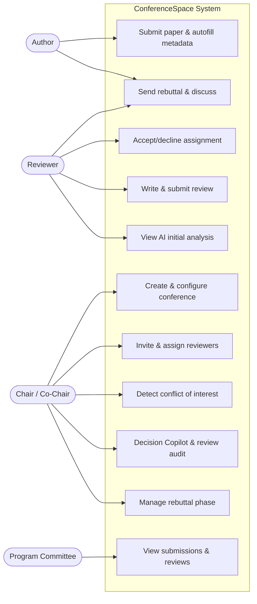
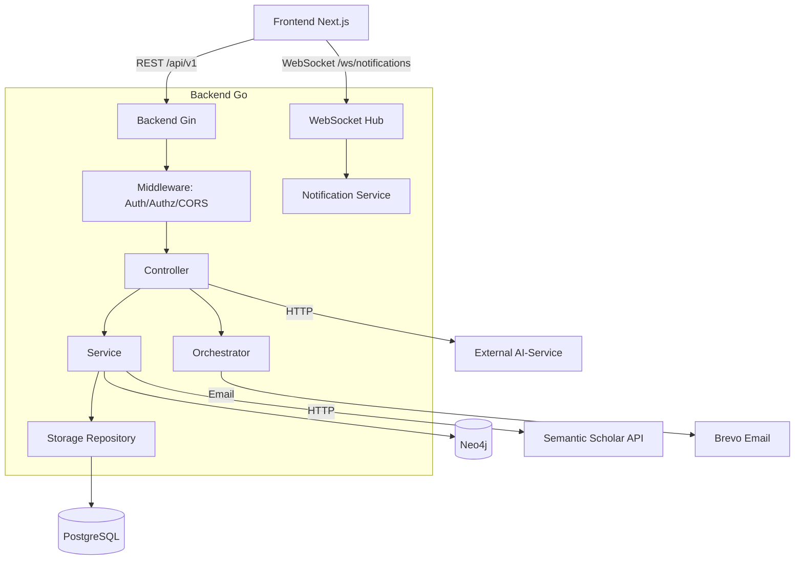
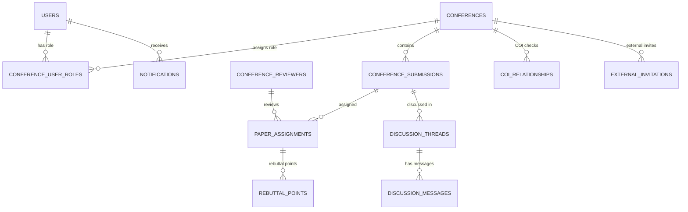
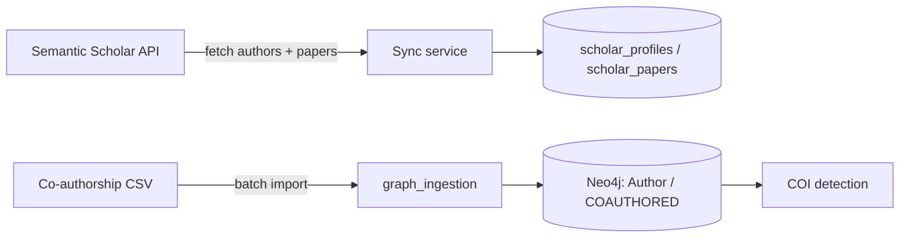

# Chapter 3 — System Analysis and Design

> Document scope: the **backend** of the ConferenceSpace system (Go/Gin service,
> PostgreSQL, Neo4j, and external AI services). This document describes the
> architecture design and the main backend functions.

---

## Outline

- [3.1 System Analysis](#31-system-analysis)
  - [3.1.1 Business Overview](#311-business-overview)
  - [3.1.2 Actors](#312-actors)
  - [3.1.3 Main Use Cases by Actor](#313-main-use-cases-by-actor)
  - [3.1.4 Use Case Diagram (modeling)](#314-use-case-diagram-modeling)
- [3.2 System Design](#32-system-design)
  - [3.2.1 System Architecture](#321-system-architecture)
  - [3.2.2 Database Design](#322-database-design)
  - [3.2.3 Academic Data Ingestion / Sync Flow](#323-academic-data-ingestion--sync-flow)
  - [3.2.4 AI Integration (Copilot & Analysis)](#324-ai-integration-copilot--analysis)
  - [3.2.5 API Surface & Authorization (user and admin interface)](#325-api-surface--authorization-user-and-admin-interface)
  - [3.2.6 Performance Benchmarks](#326-performance-benchmarks)
- [3.3 Chapter Summary](#33-chapter-summary)

---

## 3.1 System Analysis

### 3.1.1 Business Overview

ConferenceSpace is an academic conference management system that supports the full
lifecycle of a paper: submission, reviewer assignment, review, author rebuttal,
discussion, and accept/reject decisions. The system integrates AI features:
automatic paper metadata extraction, track recommendation, conflict-of-interest
(COI) detection, decision-support summaries for chairs, and review quality
auditing.

### 3.1.2 Actors

The system assigns roles per conference through the `conference_user_roles` table.
The roles (constants in `internal/model/conference.go`):

| Role | Code | Description |
|------|------|-------------|
| Chair | `chair` | Full conference control: create/edit/delete conference, manage reviewers, configure rebuttal, make decisions |
| Co-Chair | `co_chair` | Equivalent to chair for most operational actions |
| Program Committee | `pc` | View submissions and reviews, provide expertise |
| Reviewer | `reviewer` | View assigned papers, write and submit reviews, acknowledge rebuttals |
| Author | `author` | Submit papers, view own submissions, send rebuttals, join discussions |
| System Admin | (admin token) | Internal operational access via the `X-Admin-Token` header |

Role statuses: `active`, `inactive`, `pending`.

### 3.1.3 Main Use Cases by Actor

**Author**
- Register / log in / verify email / reset password.
- Submit a paper: upload PDF, system precheck and automatic metadata fill
  (autofill) from the paper content.
- View recommended tracks for the submission.
- Upload cover letter and camera-ready version.
- Send rebuttals to reviews and join discussions.

**Reviewer**
- Receive and accept/decline review invitations (with a reason).
- View a dashboard of assigned papers.
- Read the AI-generated initial analysis of a paper.
- Write, save drafts, and submit reviews; update score after rebuttal.
- Acknowledge author rebuttals.

**Chair / Co-Chair**
- Create and configure conferences (tracks, deadlines, rebuttal config, templates).
- Invite reviewers (internal and external — external invitation).
- View reviewer suggestions based on academic profiles.
- Auto-assign papers to reviewers by similarity score.
- Detect and check conflicts of interest (COI) between reviewers and authors.
- Use the Decision Copilot (AI) to synthesize reviews, discussions, and rebuttals
  to support decision-making.
- Run review quality audits.
- Open/close/finalize the rebuttal phase.

**Program Committee (PC)**
- View the list of submissions, reviews, and review analytics in the conference.

**System Actors**
- A cron job auto-finalizes rebuttals when overdue (`StartRebuttalAutoFinalize`).
- The external AI service calls back into the backend via a service token
  (`X-Agent-Service-Token`).

### 3.1.4 Use Case Diagram (modeling)



---

## 3.2 System Design

### 3.2.1 System Architecture

> Note: the current backend does **not** implement a full microservices model. It
> follows a **layered (Clean/Layered) architecture** as a monolith, combined with a
> **separate AI service (AI-Service)** invoked over HTTP. This section describes the
> architecture as actually implemented.

**Technology stack:**
- Language: Go 1.24, HTTP framework **Gin** (`gin-gonic/gin`).
- Relational DB: **PostgreSQL** (driver `lib/pq`, query builder `squirrel`).
- Graph DB: **Neo4j 5.15** (`neo4j-go-driver/v5`) — optional.
- Authentication: **JWT** (`golang-jwt/jwt/v5`).
- Realtime: **WebSocket** (`gorilla/websocket`).
- Others: `gin-contrib/cors`, `swaggo` (Swagger), `ledongthuc/pdf` (PDF parsing),
  `golang.org/x/time/rate` (rate limiting for external API calls).

**Layers in `internal/`:**

```
internal/
├── controller/    # Presentation layer — HTTP handlers (Gin)
├── service/       # Business layer — application logic
├── storage/       # Data access layer — repository pattern (interfaces)
├── model/         # Domain — entities & DTOs
├── orchestrator/  # Cross-domain workflow orchestration (registration, external invites...)
├── middleware/    # Authentication, authorization, CORS
├── clients/       # External service integrations (AI-Service, Neo4j, Semantic Scholar, Brevo, Gemini)
├── websocket/     # Realtime notification hub
├── assignment/    # Assignment domain: coi/ matching/ scoring/
├── deskrejection/ # Desk-rejection pipeline: extractor → checkers → evaluator
├── cron/          # Scheduled background tasks
└── config/        # Configuration from environment variables
```

**Dependency flow:** `Storage → Service → Controller`, wired explicitly
(Dependency Injection) in `cmd/server/main.go` through the `AppContext` struct:

```go
type AppContext struct {
    Controller       *controller.Controller
    AgentQueryEngine *agentquery.Engine
    Hub              *websocket.Hub
    Store            *storage.Storage
}
```

Each layer has an aggregator file (`controller.go`, `service.go`, `storage.go`) that
gathers all of its dependencies. External clients (Neo4j, Semantic Scholar, Gemini)
are **optional** — if not configured, the system disables the related feature
gracefully without erroring (graceful degradation). For example, the COI detector
uses the Composite pattern: `SelfAuthorDetector` + `DeclaredConflictsDetector` are
always on, while `RelationshipDetector` is enabled only when Neo4j is available.

**High-level architecture diagram:**



### 3.2.2 Database Design

#### a) PostgreSQL (relational data)

Main tables (defined in `backend/migrations/`):

| Table | Role | Key columns |
|-------|------|-------------|
| `users` | User accounts | `user_id` PK, `email` UNIQUE, `hashed_password`, `domain[]`, `email_verified` |
| `conferences` | Conferences | `conference_id` PK, `acronym` UNIQUE, `chair`, `co_chairs[]`, `tracks[]`, `status`, `configurations` (JSONB), rebuttal config |
| `conference_submissions` | Submissions | `submission_id` PK, `conference_id` FK, `title`, `abstract`, `status`, `track`, file info (PDF, cover letter, camera-ready), `rebuttal_phase` |
| `paper_assignments` | Reviewer assignments | `id` PK, `submission_id` FK, `reviewer_id` FK, `score`, `status`, `review_data` (JSONB), pre/post-rebuttal scores, `review_audit_state` |
| `conference_user_roles` | Per-conference role mapping | `conference_id`, `user_email`, `role`, `status`; UNIQUE(`conference_id`, `user_email`) |
| `conference_reviewers` | Reviewer profiles (legacy) | `user_id`, `conference_id`, `status`, `domain[]` |
| `coi_relationships` | Conflict-of-interest relationships | `reviewer_id`, `author_email`, `relationship_type`, `severity`, `evidence` (JSONB), `detected_by` |
| `discussion_threads` / `discussion_messages` | Discussions on submissions | `thread_id`, `submission_id`, `content`, `visibility` |
| `rebuttal_points` | Per-assignment rebuttal points | linked to `assignment_id` |
| `notifications` / `notification_preferences` | Notifications & preferences | `user_email`, `type`, `read`, `action_url` |
| `external_invitations` | External reviewer invitations | `conference_id`, `email`, `scholar_id`, `role`, `invitation_token`, `status` |
| `scholar_profiles` / `scholar_papers` | Semantic Scholar cache | author profiles, papers, research fields |
| `conference_config_templates` | Conference config templates | reusable configuration |
| `usage_events` | Usage analytics events | `session_id`, `event_name`, `role`, `metadata` |

**Key relationships:** a `conference` has many `submission`s; each `submission` has
many `paper_assignment`s (one reviewer ↔ one paper, UNIQUE(`submission_id`,
`reviewer_id`)); `conference_user_roles` maps user ↔ conference ↔ role;
`coi_relationships` link reviewers ↔ authors; `discussion_threads` attach to a
`submission`.

**Simplified ERD:**



#### b) Neo4j (graph data — COI detection)

The graph models co-authorship relationships for conflict-of-interest detection:

- **Node `:Author`** — properties `email` (UNIQUE constraint), `name`.
- **Relationship `:COAUTHORED`** (directed) — properties `established_date` (year,
  indexed), `paper_link`.

Main operations (`internal/clients/neo4j/`): `CreateAuthor`, `CreateCoauthorship`,
`GetCoauthors`, `GetCoauthorsSince(year)`, `HasRecentCollaboration` (1-hop),
`HasIndirectCollaboration(maxDepth, year)` (N-hop). Pool config: up to 50
connections, 5-minute lifetime. Neo4j is optional — without it, only the
co-authorship-based COI detection is disabled.

### 3.2.3 Academic Data Ingestion / Sync Flow

> The system has **no general-purpose web crawler**. Instead, academic data is loaded
> through APIs and ingestion scripts. This section describes the equivalent sync flow.

**(1) Semantic Scholar profile sync** (`controller/semantic_scholar/sync.go`):
1. Call the Semantic Scholar API for author details (`GetAuthorDetails`).
2. Fetch the author's papers (paginated, up to 100).
3. Create/update `scholar_profiles`, upsert `scholar_papers`.
4. Aggregate research fields across the papers.
5. Use a per-user lock (`acquireSyncLock`) to avoid concurrent syncs. The client is
   rate-limited to 1 request/second (`golang.org/x/time/rate`).

**(2) Co-authorship graph ingestion into Neo4j** (`scripts/graph_ingestion/main.go`):
- Read a CSV file (columns Author1, Author2, Date, Metadata), ingest in batches
  (default 1000 records/batch), initialize constraints/indexes, support the
  `--clear` flag to wipe before importing.



### 3.2.4 AI Integration (Copilot & Analysis)

> The backend has **no chatbot** (the chatbot lives in the frontend, using
> OpenRouter). The backend-side AI features are the **Copilot/analysis workflows**
> that call the external AI service (AI-Service) over HTTP
> (`internal/clients/ai_service/client.go`), with 3-attempt retries and a
> configurable timeout.

Supported AI workflows:

| Workflow | Purpose | Primary actor |
|----------|---------|---------------|
| Submission Material Gating | Check format/policy, recommend desk-reject | Author/Chair |
| Submission Autofill | Extract title, abstract, keywords, paper type from PDF | Author |
| Track Recommendation | Recommend suitable tracks for a paper | Author |
| Reviewer Initial Analysis | Initial briefing to help reviewers prepare | Reviewer |
| Review Quality Auditor | Assess review completeness/consistency/evidence | Chair |
| Research Keyword Extraction | Extract research keywords | System |
| Chair Decision Copilot | Synthesize reviews, discussions, rebuttals → decision support | Chair |

### 3.2.5 API Surface & Authorization (user and admin interface)

> The backend exposes a **REST API** under `/api/v1` (Swagger docs at
> `/swagger/index.html`) instead of a graphical interface. This section describes the
> API surface and the authorization mechanism — the backend-tier equivalent of the
> "user & admin interface".

**Authentication mechanism** (`internal/middleware/auth.go`):
- **JWT Bearer** (primary): header `Authorization: Bearer <token>`, claims include
  `user_id`, `email`, with a 24-hour expiry.
- **Admin token**: header `X-Admin-Token` for internal operations.
- **WebSocket token**: query `?token=<jwt>` for `/ws/notifications`.
- **Agent service token**: header `X-Agent-Service-Token` for internal calls from
  the AI-Service.

**Authorization** (`internal/middleware/authorization.go`): `RequireChairOrCoChair`,
`RequireChairCoChairOrPC`, `RequireSubmissionAccess`, `RequireThreadParticipant`,
`RequireSelfReviewerEmail`, `RequireAssignmentOwner`, `RequireCOICheckAuthorization`.

**Main endpoint groups under `/api/v1`:**

| Group | Path | Function |
|-------|------|----------|
| Auth | `/auth/*` | register, log in, verify email, reset/change password |
| Users | `/users/*` | profile, link academic profile, search, COI check |
| Conferences | `/conferences/*` | conference CRUD, bookmark, status transition, stats |
| Reviewers | `/conferences/:id/reviewers/*` | manage/invite reviewers, reviewer suggestions |
| Submissions | `/conferences/:id/submissions/*` | submit, precheck, autofill, track, files, decision copilot |
| Assignments | `/conferences/:id/assignments/*` | assignment, review, audit, initial analysis, post-rebuttal score |
| Rebuttal | `/conferences/:id/rebuttal/*` | configure, open/finalize, open discussion |
| COI | `/coi/*` | stats, relationships, check, rebuild |
| Discussion | `/threads/*` | messages, attachments |
| Notifications | `/notifications/*` | list, mark read, preferences, unread count |
| External invitations | `/conferences/:id/external-invitations/*` | invite external reviewers |
| Semantic Scholar | `/semantic-scholar/*` | search/sync author profiles (optional) |
| Realtime | `/ws/notifications` | WebSocket realtime notifications |

**Realtime notifications (WebSocket):** the Hub (`internal/websocket/hub.go`) manages
connections by user email (supporting multiple tabs) and broadcasts notifications via
`BroadcastToUser(email, notification)`. The notification service variant
`NewWithWebSocket(hub)` pushes notifications automatically when events occur.

### 3.2.6 Performance Benchmarks

The backend includes a benchmark suite under `backend/benchmarks/`, combining k6
HTTP load tests, container resource sampling, and Go micro-benchmarks. The figures
below come from the latest run (`results/run-20260531-225049/`, 2026-05-31).

**Test conditions:** host with 14 CPU cores and 48 GB RAM; seeded dataset of
**300 conferences, 15,000 submissions, and 9,000 reviewers** (0 seed failures). The
stack under test ran PostgreSQL, Neo4j, and Redis alongside the API container.

**HTTP load test (k6)** — measures end-to-end API latency and throughput. All three
scenarios reported a **0% request-failure rate** with all checks passing:

| Scenario | Requests | Throughput | Median | p90 | p95 | Max | Avg |
|----------|----------|-----------|--------|-----|-----|-----|-----|
| CRUD | 11,110 | 369 req/s | 46.2 ms | 100.5 ms | 117.6 ms | 403.6 ms | 51.8 ms |
| Matching | 17,184 | 572 req/s | 9.7 ms | 50.8 ms | 71.8 ms | 254.7 ms | 19.0 ms |
| COI | 16,760 | 558 req/s | 9.5 ms | 56.5 ms | 79.3 ms | 293.9 ms | 20.4 ms |

**Resource utilization** (averaged over the full run): the API container stayed
lightweight (avg 28% CPU of one core, peak 43%; ~30 MB RAM), while **PostgreSQL was
the primary bottleneck** (avg ~115% CPU, peak 163% — i.e. >1 core; ~204 MB RAM,
peak 222 MB). Neo4j (~508 MB RAM, <1% CPU) and Redis (~9 MB RAM) were largely idle
during these scenarios.

**Go micro-benchmarks** (Apple M4 Pro, arm64) — isolate the core algorithms in-process:

| Algorithm | Small | Medium | Large |
|-----------|-------|--------|-------|
| COI detection | ~14.9 µs/op (27.8 KB, 241 allocs) | ~147 µs/op (283 KB, 2,073 allocs) | ~653 µs/op (1.13 MB, 8,123 allocs) |
| Reviewer matching | ~131 µs/op (82 KB, 31 allocs) | ~6.1 ms/op (2.47 MB, 42 allocs) | ~56 ms/op (24.2 MB, 55 allocs) |

The results show the API layer handles hundreds of requests per second with
sub-120 ms p95 latency at a 15k-submission scale, with database CPU as the main
scaling constraint. The matching algorithm grows roughly linearly with dataset size
(micro-benchmark large case ~56 ms in-process), making it the most
compute-intensive core operation.

---

## 3.3 Chapter Summary

The ConferenceSpace backend is designed with a clear layered architecture
(Controller → Service → Storage) and explicit Dependency Injection, using PostgreSQL
for relational data and Neo4j for the academic relationship graph that powers
conflict-of-interest detection. The system enforces role-based authorization at the
per-conference level, integrates AI workflows through an external service to support
authors, reviewers, and chairs, and delivers realtime notifications over WebSocket.
The design allows optional components (Neo4j, Semantic Scholar, AI-Service) to be
enabled or disabled flexibly without affecting core operation.
