# Chương 3. Xây dựng hệ thống

Chương 1 đã xác định bài toán trung tâm của đề tài: xây dựng một nền tảng quản lý quy trình xét duyệt bài báo có thể tích hợp AI mà không làm suy yếu trách nhiệm học thuật của con người. Chương 2 tiếp tục chuyển bài toán đó thành các nhu cầu và yêu cầu cụ thể: giảm thao tác thủ công cho tác giả, hỗ trợ người phản biện đọc và kiểm tra bài hiệu quả hơn, giúp Chair kiểm soát tiến độ, phân công, COI và tổng hợp quyết định. Vì vậy, Chương 3 không chỉ trình bày hệ thống đã xây dựng gồm những chức năng nào, mà còn giải thích cách các quyết định thiết kế phản hồi trực tiếp với những vấn đề đã đặt ra.

Nguyên tắc xuyên suốt của ConferenceSpace là **tách rõ ba lớp trách nhiệm**: nghiệp vụ cốt lõi, thuật toán xác định và AI hỗ trợ. Lớp nghiệp vụ chịu trách nhiệm về vòng đời hội nghị và quyền truy cập. Lớp thuật toán xử lý các tác vụ cần tính nhất quán, khả năng giải thích và kiểm soát công bằng, đặc biệt là reviewer matching và COI. Lớp AI chỉ tham gia vào các tác vụ trích xuất, tóm tắt, rà soát và tổng hợp, trong đó kết quả luôn cần được người dùng kiểm tra hoặc ghi đè. Cách phân lớp này là câu trả lời thiết kế cho mối lo chính của đề tài: AI có thể giúp giảm tải, nhưng không được trở thành người ra quyết định học thuật.

## 3.1. Tổng quan hệ thống

ConferenceSpace là nền tảng web phục vụ toàn bộ vòng đời xét duyệt bài báo trong hội nghị khoa học: tạo và cấu hình hội nghị, mở nhận bài, nộp bản thảo, kiểm tra sơ bộ, phân công phản biện, thu thập đánh giá, rebuttal, tổng hợp phản biện và ra quyết định. Hệ thống phục vụ ba nhóm người dùng chính: **Tác giả**, **Người phản biện**, và **Chủ tọa/Đồng chủ tọa**. Ngoài ra, hệ thống còn có các tác nhân hỗ trợ như quản trị hệ thống, AI service và các tác vụ nền.

Điểm khác biệt của ConferenceSpace không nằm ở việc bổ sung AI như một tiện ích rời rạc. Mỗi workflow AI đều được gắn với một nhu cầu đã xuất hiện ở Chương 2: Submission Autofill và `track_rankings` giảm nhập liệu thủ công cho tác giả; Submission Gating phát hiện lỗi sớm trước khi gửi chính thức; Reviewer Initial Analysis hỗ trợ người phản biện nắm bối cảnh và theo dõi điểm cần kiểm tra; Review Quality Auditor giúp kiểm soát chất lượng phản biện; Chair Decision Copilot tổng hợp bằng chứng cho Chair; Chatbot Agent hỗ trợ truy vấn thao tác và trạng thái trong phạm vi quyền truy cập.

### 3.1.1. Mô hình phân lớp của hệ thống

**Hình 3.1. Mô hình phân lớp của hệ thống ConferenceSpace**

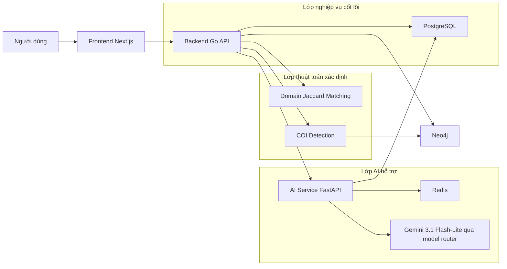

Lớp nghiệp vụ cốt lõi do backend Go đảm nhiệm. Đây là lớp xử lý các trạng thái quan trọng của hệ thống: hội nghị, track, bài nộp, phân công, phản biện, rebuttal, quyết định và quyền truy cập. Lớp này phải hoạt động ổn định ngay cả khi dịch vụ AI không khả dụng, vì vòng đời hội nghị không thể phụ thuộc hoàn toàn vào model bên ngoài.

Lớp thuật toán xác định xử lý reviewer matching và COI. Đây là các tác vụ có rủi ro công bằng cao nên cần kết quả có thể giải thích. ConferenceSpace dùng điểm tương đồng Domain Jaccard để tính mức phù hợp giữa bài nộp và reviewer, đồng thời loại các cặp có xung đột lợi ích trước khi gợi ý phân công. Chair vẫn có quyền xem, điều chỉnh và xác nhận kết quả cuối cùng.

Lớp AI hỗ trợ được tách thành dịch vụ FastAPI riêng. Dịch vụ này xử lý các workflow có đặc điểm đọc hiểu tài liệu, trích xuất metadata, tổng hợp nội dung hoặc kiểm tra chất lượng văn bản. Các workflow AI dùng `gemini-3.1-flash-lite` thông qua model router/OpenAI-compatible client hoặc OpenRouter tùy cấu hình vận hành, nhưng cùng tuân thủ một nguyên tắc: đầu ra là bằng chứng hoặc gợi ý, không phải quyết định.

### 3.1.2. Nguyên tắc thiết kế hệ thống

Từ các yêu cầu ở Chương 2, nhóm xác định năm nguyên tắc thiết kế cho ConferenceSpace.

**Thứ nhất, platform-first.** Hệ thống phải bao phủ nghiệp vụ hội nghị trước khi nói đến AI. Nếu không có quản lý hội nghị, phân quyền, nộp bài, review, rebuttal và decision workflow đủ chặt, AI chỉ là một lớp trang trí.

**Thứ hai, AI-assistive.** AI chỉ hỗ trợ những bước có giá trị rõ: giảm thao tác nhập liệu, giảm tải đọc lại, tóm tắt bằng chứng, kiểm tra cấu trúc phản biện hoặc trả lời câu hỏi thao tác. AI không viết phản biện thay người phản biện, không phân công reviewer thay Chair, không quyết định accept/reject.

**Thứ ba, explainable-by-design.** Những kết quả ảnh hưởng đến niềm tin của người dùng phải có căn cứ. Matching cần điểm phù hợp và keyword khớp; COI cần loại quan hệ và bằng chứng; workflow AI cần output có cấu trúc, chỉ ra dữ liệu đầu vào và cho phép người dùng kiểm tra.

**Thứ tư, graceful degradation.** Khi dịch vụ AI, Semantic Scholar hoặc Neo4j không khả dụng, hệ thống vẫn phải giữ được các luồng nghiệp vụ chính. Người dùng có thể nhập thủ công, Chair có thể phân công thủ công, và lỗi AI được trả về như lỗi có kiểm soát.

**Thứ năm, audit-friendly.** Các workflow quan trọng cần lưu trạng thái, thời gian xử lý, fingerprint hoặc artifact đủ để đánh giá ở Chương 5. Điều này đặc biệt quan trọng với AI vì chỉ có thể bảo vệ chất lượng đầu ra khi có dữ liệu kiểm chứng.

## 3.2. Use Case

### 3.2.1. Tác nhân hệ thống

**Tác giả** sử dụng hệ thống để tìm hội nghị, xem track và hạn chót, nộp bài, khai báo COI, chỉnh sửa bản thảo trước deadline, xem phản biện và gửi rebuttal. Đây là nhóm chịu ảnh hưởng trực tiếp của các vấn đề nhập liệu dài, chọn track khó và thiếu kiểm tra lỗi sớm.

**Người phản biện** nhận lời mời, xem bài được phân công, đọc bản thảo, nhập điểm và nhận xét, lưu nháp, gửi phản biện và xem rebuttal khi có. Với nhóm này, AI không được dùng để thay thế việc đọc bài. Vai trò hợp lý của AI là cung cấp tóm tắt trung lập, điểm cần kiểm tra và cảnh báo chất lượng bản nháp review để giảm thao tác rà soát thủ công.

**Chủ tọa/Đồng chủ tọa** cấu hình hội nghị, track, deadline, biểu mẫu phản biện, mời reviewer, kiểm tra COI, xác nhận phân công, theo dõi tiến độ và đưa ra quyết định cuối cùng. Đây là nhóm cần cả công cụ thuật toán và AI: thuật toán để có matching minh bạch, AI để tổng hợp nhiều nguồn phản biện và phát hiện rủi ro chất lượng.

**Quản trị hệ thống** chịu trách nhiệm vận hành, cấu hình và khắc phục sự cố. Các thao tác này không đại diện cho người dùng học thuật thông thường và được kiểm soát bằng cơ chế xác thực riêng.

**Tác nhân hệ thống** gồm AI service, các job nền và các service bên ngoài. AI service có thể gọi backend qua service token trong phạm vi được phép; các job nền xử lý trạng thái quá hạn hoặc đồng bộ dữ liệu.

### 3.2.2. Các use case chính

**Hình 3.2. Use case tổng quát theo vai trò**

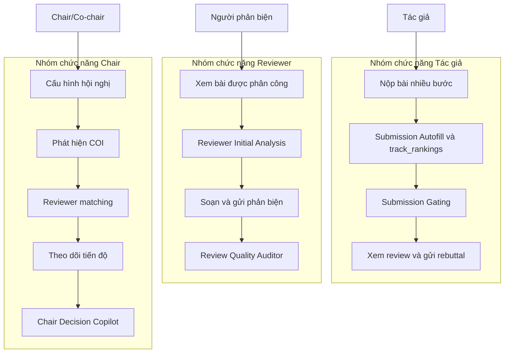

Các use case trên phản ánh trực tiếp ma trận truy vết ở Chương 2. Luồng của tác giả tập trung vào giảm thao tác thủ công và giảm lỗi trước khi gửi. Luồng của reviewer tập trung vào hỗ trợ đọc, ghi chú và bảo đảm bản phản biện đủ căn cứ. Luồng của Chair tập trung vào kiểm soát rủi ro hệ thống: COI, tải phản biện, tiến độ và tổng hợp bằng chứng ra quyết định.

### 3.2.3. Đặc tả use case quan trọng

#### UC-01. Nộp bài với Submission Autofill và `track_rankings`

**Mục tiêu.** Tác giả hoàn thành bản nháp nộp bài với metadata được trích xuất từ bản thảo và gợi ý track trong ngữ cảnh hội nghị.

**Điều kiện tiên quyết.** Tác giả đã đăng nhập; hội nghị đang mở nhận bài; danh sách track của hội nghị đã được cấu hình; file bản thảo có thể đọc được.

**Hình 3.3. Luồng nộp bài với Submission Autofill**

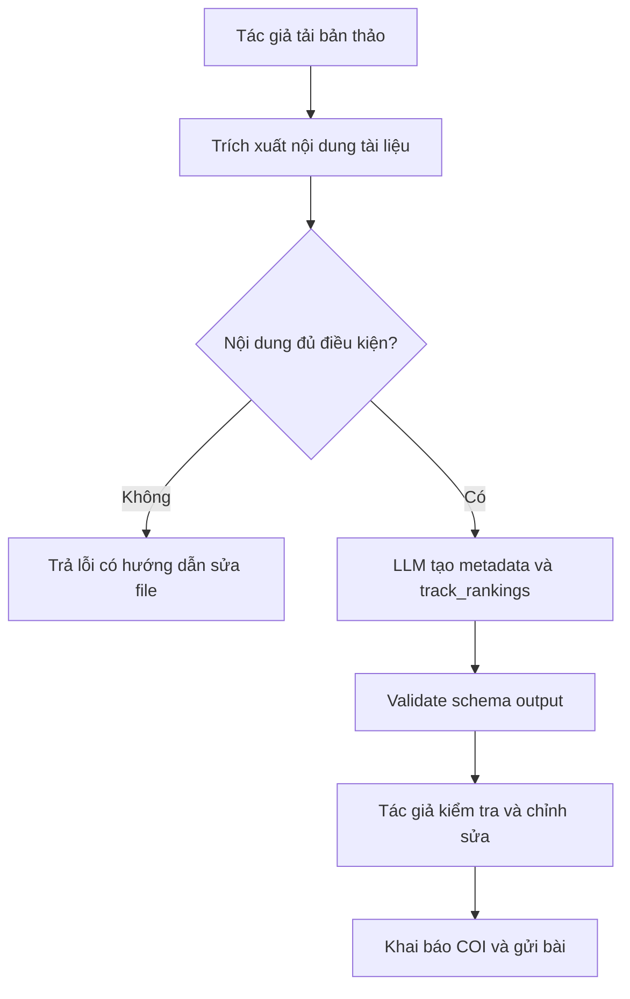

Workflow này không tự động gửi bài thay tác giả. Output từ AI chỉ là bản nháp gồm tiêu đề, tóm tắt, keyword, thông tin liên quan và `track_rankings`. Tác giả vẫn phải xem lại, chỉnh sửa và xác nhận trước khi gửi. Thiết kế này giải quyết vấn đề biểu mẫu dài ở Chương 2 nhưng vẫn giữ quyền kiểm soát của người dùng.

Các trường hợp lỗi được xử lý rõ: nếu file không đọc được, text extraction thấp hoặc dữ liệu không đủ căn cứ, workflow trả lỗi thay vì tạo metadata thiếu cơ sở. Đây là điểm quan trọng vì một hệ thống AI trong bối cảnh học thuật không được “đoán cho đủ form” khi bản thảo đầu vào không đủ tin cậy.

#### UC-02. Phân công phản biện có kiểm tra COI

**Mục tiêu.** Chair nhận được gợi ý phân công reviewer có điểm phù hợp, không vi phạm COI và có thể kiểm tra/ghi đè trước khi lưu.

**Điều kiện tiên quyết.** Hội nghị có bài nộp hợp lệ; reviewer đã được mời hoặc đăng ký; dữ liệu domain/keyword và thông tin COI đủ để tính toán.

**Hình 3.4. Luồng reviewer matching và COI**

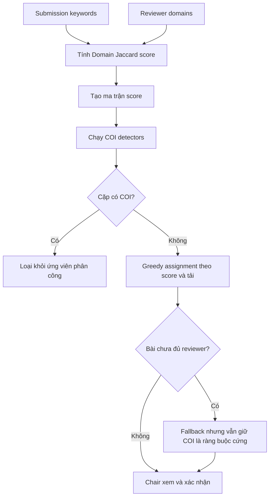

Điểm phù hợp giữa bài và reviewer được tính bằng Jaccard similarity trên tập keyword/domain:

```text
score = |submission_keywords ∩ reviewer_domains| / |submission_keywords ∪ reviewer_domains|
```

Sau đó, thuật toán greedy sắp xếp các cặp theo điểm giảm dần và gán reviewer theo các ràng buộc: không có COI, không vượt tải reviewer, không vượt số reviewer tối đa mỗi bài và đạt ngưỡng điểm tối thiểu nếu có. Nếu một bài chưa có reviewer nào, fallback pass có thể nới ràng buộc tải hoặc ngưỡng điểm, nhưng **không nới COI**. Điều này giúp hệ thống ưu tiên tính toàn vẹn học thuật hơn việc lấp đầy phân công bằng mọi giá.

COI được phát hiện bằng nhiều lớp: self-author, khai báo thủ công và quan hệ học thuật qua đồ thị đồng tác giả. Cách thiết kế này phù hợp với nhận định ở Chương 2 rằng COI không thể chỉ dựa vào tự khai báo.

#### UC-03. Reviewer Initial Analysis và Review Quality Auditor

**Mục tiêu.** Người phản biện nhận được hỗ trợ đọc ban đầu và kiểm tra chất lượng bản nháp review, nhưng vẫn giữ trách nhiệm đọc bài và viết phản biện.

**Hình 3.5. Luồng hỗ trợ người phản biện**

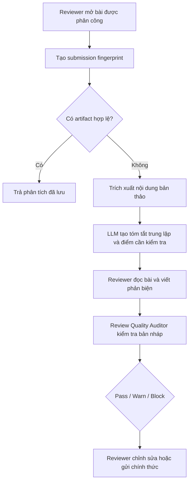

Reviewer Initial Analysis không phải là bản review tự động. Nó chỉ cung cấp bối cảnh đọc ban đầu: tóm tắt trung lập, đóng góp chính, điểm cần kiểm tra và câu hỏi nên chú ý. Luận điểm thiết kế ở đây là AI có thể giảm số lần reviewer phải đọc lại toàn bộ bài chỉ để truy vết các điểm cần chú ý, từ đó giúp reviewer tập trung vào phần quan trọng hơn của phản biện chuyên môn.

Review Quality Auditor kiểm tra bản nháp review theo rubric: mức độ đầy đủ, tính cụ thể, sự nhất quán giữa điểm và nhận xét, khả năng thiếu căn cứ hoặc quá ngắn. Auditor có thể trả trạng thái `pass`, `warn` hoặc `block`, nhưng không đánh giá thay reviewer về đúng/sai chuyên môn của bài báo.

#### UC-04. Chair Decision Copilot

**Mục tiêu.** Chair nhận được bản tổng hợp có cấu trúc từ các review, rebuttal và thảo luận nội bộ để ra quyết định có căn cứ hơn.

**Hình 3.6. Luồng Chair Decision Copilot**

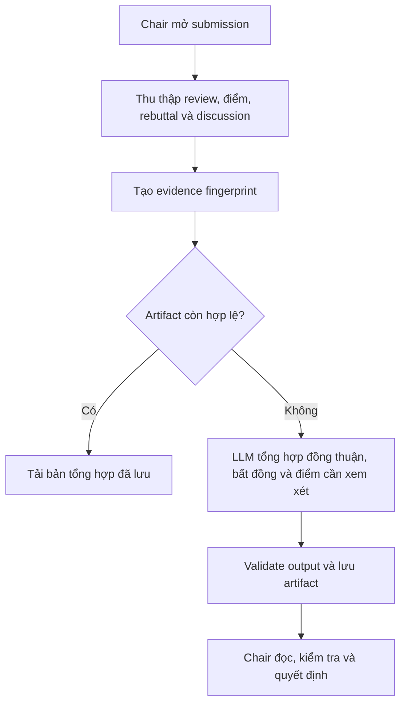

Copilot không sinh quyết định accept/reject và không đưa ra kết luận thay Chair. Output cần tập trung vào bằng chứng: reviewer nào đồng thuận, reviewer nào bất đồng, rebuttal có trả lời được điểm nào, còn vấn đề nào chưa được giải quyết. Đây là ranh giới quan trọng để tránh tạo áp lực vô hình lên quyết định cuối cùng.

## 3.3. Thiết kế kỹ thuật

### 3.3.1. Kiến trúc tổng thể

ConferenceSpace được triển khai như một hệ thống nhiều service ở mức vận hành, nhưng backend nghiệp vụ chính vẫn được giữ theo hướng monolith phân lớp. Quyết định này giúp hệ thống tránh độ phức tạp không cần thiết của microservices, đồng thời vẫn cô lập được AI service, data stores và gateway.

Các thành phần chính gồm:

- **Frontend Next.js**: giao diện cho người dùng theo vai trò, route dashboard, form nộp bài, form review và màn hình Chair.
- **Backend Go/Gin**: API nghiệp vụ, phân quyền, validation, matching, COI, review workflow, notification và tích hợp service ngoài.
- **AI Service FastAPI**: thực thi các workflow AI, validate input/output bằng Pydantic, gọi model qua LLM client/model router.
- **PostgreSQL**: lưu dữ liệu nghiệp vụ bền vững và artifact cần truy vết.
- **Redis**: lưu session, cache, runtime state và tool result ngắn hạn.
- **Neo4j**: lưu/truy vấn quan hệ học thuật phục vụ COI graph.
- **Caddy và Docker Compose**: gateway, network boundary và triển khai production.

Backend là ranh giới nghiệp vụ chính. Frontend không gọi trực tiếp database hoặc AI provider; AI service không tự ý truy cập toàn bộ dữ liệu nghiệp vụ ngoài các repository/query endpoint được kiểm soát. Cách tổ chức này giúp giảm rủi ro lộ dữ liệu bản thảo khi đưa AI vào hệ thống.

### 3.3.2. Thiết kế backend

Backend được tổ chức theo các module có trách nhiệm rõ trong `backend/internal/`. Tầng controller tiếp nhận HTTP request và chuyển về service; tầng service chứa logic nghiệp vụ; tầng storage/repository làm việc với PostgreSQL; tầng clients bọc các tích hợp bên ngoài như AI service, Neo4j, Semantic Scholar và email.

**Hình 3.7. Phụ thuộc các tầng trong Go backend**

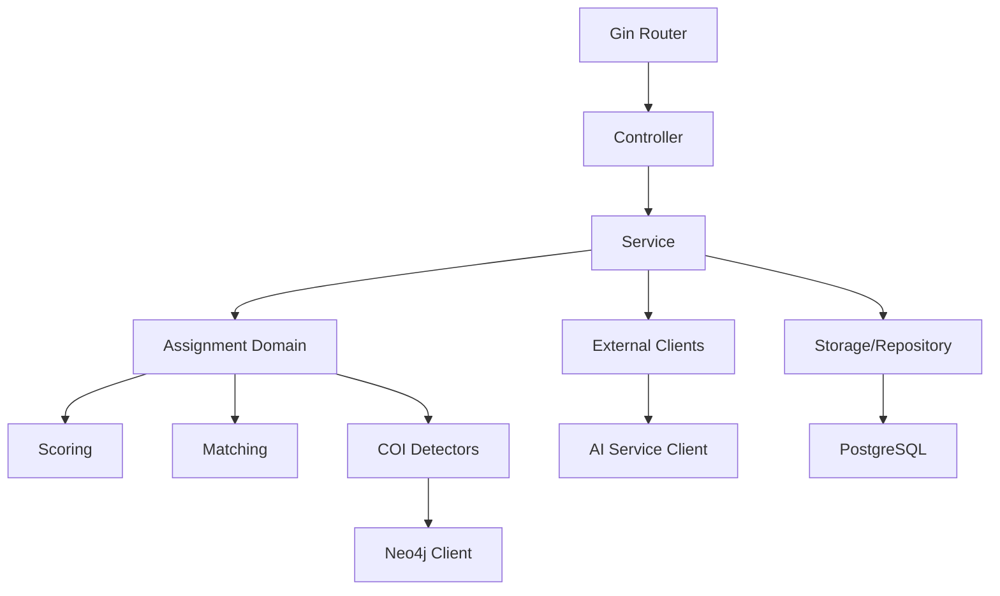

Luồng phụ thuộc được giữ một chiều để tránh controller chứa logic nghiệp vụ hoặc service phụ thuộc ngược vào framework HTTP. Assignment được tách thành domain riêng vì matching và COI có logic đủ quan trọng để cần kiểm thử, giải thích và đánh giá độc lập ở Chương 5.

Phân quyền được thiết kế theo vai trò trong từng hội nghị, không theo quyền toàn cục. Cùng một người dùng có thể là tác giả ở hội nghị này, reviewer ở hội nghị khác và Chair ở một hội nghị khác nữa. Vì vậy, mỗi request cần xét cả danh tính người dùng và vai trò của họ trong tài nguyên cụ thể.

### 3.3.3. Thiết kế dữ liệu

Thiết kế dữ liệu của ConferenceSpace phản ánh ba loại dữ liệu chính.

Thứ nhất là **dữ liệu nghiệp vụ quan hệ**: users, conferences, tracks, submissions, authors, files, paper assignments, reviews, rebuttals, decisions, notification và roles. Nhóm dữ liệu này phù hợp với PostgreSQL vì có quan hệ rõ, yêu cầu nhất quán và cần transaction.

Thứ hai là **dữ liệu quan hệ học thuật**: tác giả, bài báo, đồng tác giả và các quan hệ có thể tạo COI. Nhóm dữ liệu này phù hợp với Neo4j vì việc kiểm tra quan hệ nhiều bậc giữa tác giả và reviewer tự nhiên là bài toán graph traversal.

Thứ ba là **artifact AI và trạng thái vận hành**: kết quả autofill, gating run, reviewer analysis, review audit, decision copilot, chatbot session, fingerprint, timing và cache. Nhóm dữ liệu này cần vừa lưu được kết quả có cấu trúc, vừa đủ linh hoạt để mỗi workflow có schema riêng.

**Hình 3.8. Mô hình dữ liệu nghiệp vụ và graph COI**

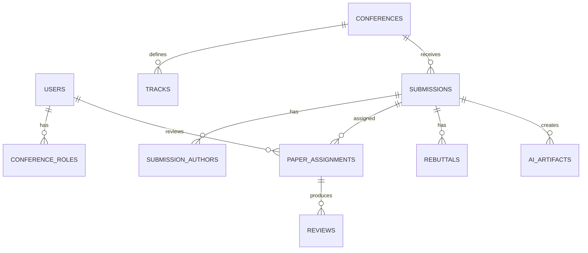

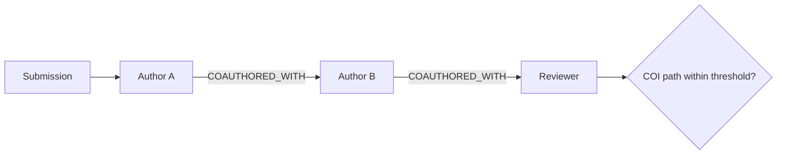

Điểm cần nhấn mạnh là dữ liệu AI không đứng ngoài hệ thống. Mỗi artifact cần gắn với submission, user hoặc conference tương ứng; có fingerprint hoặc trạng thái để biết artifact còn hợp lệ hay không; và có dữ liệu đủ để đánh giá lại khi cần. Đây là cơ sở để Chương 5 không chỉ đánh giá cảm tính mà có thể nhìn vào input/output thực tế.

### 3.3.4. Luồng xử lý hệ thống

#### Luồng nộp bài có AI hỗ trợ

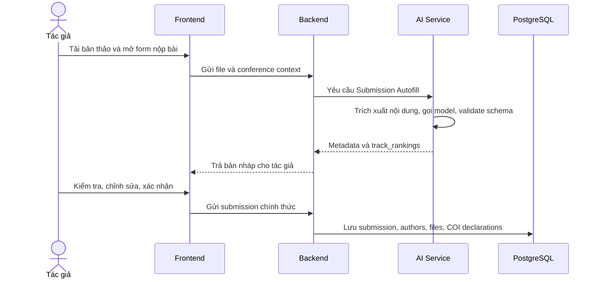

Luồng này thể hiện đúng ranh giới trách nhiệm: AI giúp tạo bản nháp, backend giữ quyền ghi dữ liệu chính thức, tác giả xác nhận trước khi lưu. Nếu AI lỗi, form thủ công vẫn phải hoạt động.

#### Luồng agent truy vấn dữ liệu hệ thống

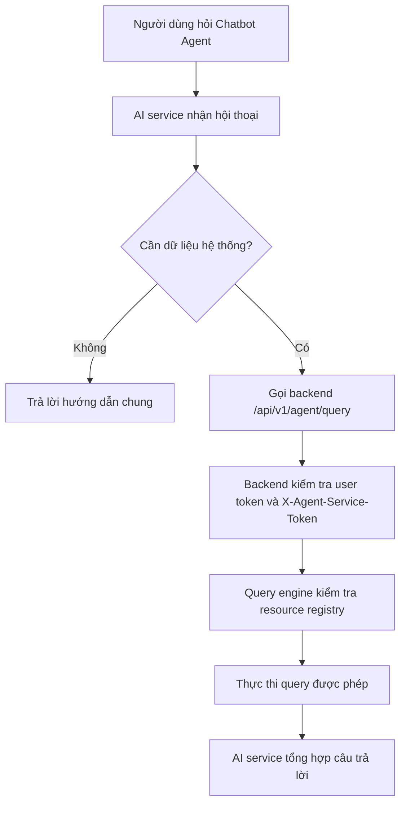

Chatbot Agent không được truy vấn database tùy ý. Mọi truy vấn đều đi qua backend query engine và resource registry, nhờ đó quyền truy cập dữ liệu vẫn nằm dưới kiểm soát của backend nghiệp vụ.

## 3.4. Giải pháp AI

### 3.4.1. Vai trò của AI trong hệ thống

AI được đưa vào ConferenceSpace theo vai trò hỗ trợ từng điểm nghẽn, không phải như lớp tự động hóa toàn bộ quy trình. Nhóm chia workflow AI thành ba nhóm.

Nhóm thứ nhất là **hỗ trợ nhập liệu và kiểm tra sớm** cho tác giả: Submission Autofill, `track_rankings` và Submission Gating. Nhóm này giải quyết trực tiếp vấn đề biểu mẫu dài và lỗi chỉ được phát hiện muộn.

Nhóm thứ hai là **hỗ trợ đọc và kiểm soát chất lượng phản biện** cho reviewer: Reviewer Initial Analysis và Review Quality Auditor. Nhóm này không thay việc đọc bài hoặc viết phản biện, mà giúp reviewer định hướng đọc và kiểm tra bản nháp có đủ căn cứ hay chưa.

Nhóm thứ ba là **hỗ trợ tổng hợp cho Chair**: Chair Decision Copilot và Chatbot Agent. Nhóm này giảm tải nhận thức khi Chair phải xử lý nhiều review, rebuttal, thảo luận và trạng thái hội nghị cùng lúc.

### 3.4.2. Các workflow có sử dụng AI

| Workflow | Người dùng hưởng lợi | Input chính | Output | Ranh giới kiểm soát |
|---|---|---|---|---|
| Submission Autofill | Tác giả | Bản thảo, conference context, available tracks | Metadata nháp và `track_rankings` | Tác giả xem lại và chỉnh sửa |
| Submission Gating | Tác giả, Chair | Bản thảo, policy hội nghị | Pass/warn/block, guidance, audit trail | Chỉ theo policy cấu hình; không tự quyết định học thuật |
| Reviewer Initial Analysis | Reviewer | Bản thảo, metadata | Tóm tắt trung lập, điểm cần kiểm tra | Reviewer vẫn đọc và viết review |
| Review Quality Auditor | Reviewer, Chair | Bản nháp review, rubric | Pass/warn/block và gợi ý sửa | Không đánh giá thay chuyên môn reviewer |
| Chair Decision Copilot | Chair | Reviews, scores, rebuttal, discussion | Tổng hợp đồng thuận/bất đồng/bằng chứng | Không sinh accept/reject |
| Chatbot Agent | Tất cả vai trò | Câu hỏi người dùng, quyền truy cập | Câu trả lời bám dữ liệu hệ thống | Query qua backend registry |

### 3.4.3. Tích hợp AI vào kiến trúc hệ thống

AI service được triển khai như một service FastAPI độc lập. Trong repo, entry point `ai-service/app/main.py` đăng ký các router workflow riêng: submission gating, reviewer initial analysis, review quality audit, chair decision copilot, research keyword, submission autofill, hỗ trợ gợi ý track trong ngữ cảnh nộp bài và agent/status router. Cách tách router này giúp mỗi workflow có schema, prompt, runner và validation riêng thay vì gom tất cả vào một endpoint chung.

**Hình 3.9. Luồng tích hợp AI service**

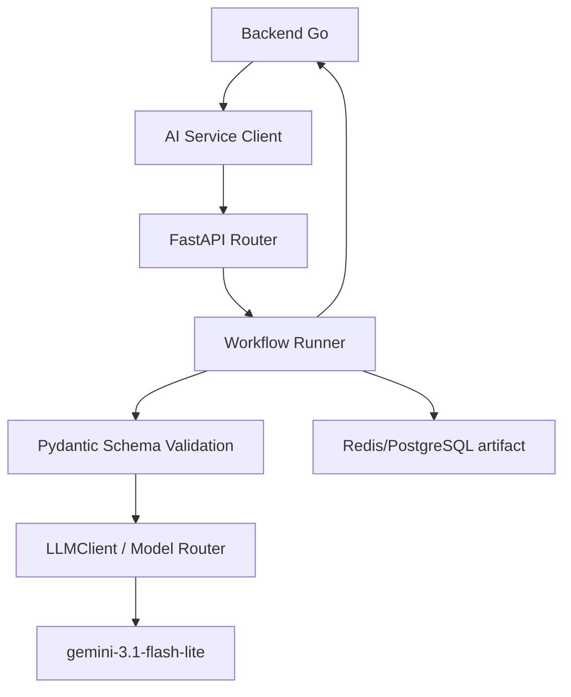

`LLMClient` là lớp giữ hợp đồng gọi model thống nhất. Client có thể nhận cấu hình OpenAI-compatible provider hoặc OpenRouter provider, có timeout, structured output và fallback khi provider đầu tiên lỗi trước khi stream dữ liệu. Tuy nhiên, fallback chỉ là cơ chế vận hành; nó không làm thay đổi bản chất học thuật của workflow. Mọi workflow vẫn phải tuân thủ cùng schema, prompt và validation.

### 3.4.4. Ưu điểm và giới hạn của các workflow AI

Ưu điểm lớn nhất của các workflow AI là giảm chi phí thao tác và chi phí nhận thức ở những điểm người dùng đã phản ánh trong Chương 2. Tác giả không phải nhập lại metadata đã có trong bản thảo. Reviewer có thêm bản đồ đọc ban đầu và công cụ kiểm tra bản nháp review. Chair có bản tổng hợp bằng chứng để đối chiếu nhanh hơn.

Tuy nhiên, các lợi ích này chỉ có giá trị nếu được diễn giải đúng phạm vi. AI có thể giúp reviewer giảm số lần đọc lại toàn bộ bài để tìm điểm cần chú ý, nhưng không thể thay thế việc đọc bài. AI có thể giúp Chair nhìn thấy điểm đồng thuận và mâu thuẫn, nhưng không thể quyết định thay Chair. AI có thể giúp tác giả phát hiện lỗi sớm, nhưng không bảo đảm bản thảo đạt chuẩn học thuật.

Các giới hạn chính gồm: phụ thuộc chất lượng file đầu vào, khả năng hallucination hoặc thiếu căn cứ, chi phí/token, rate limit của provider, rủi ro bảo mật dữ liệu bản thảo và khác biệt chất lượng giữa các lĩnh vực chuyên môn. Vì vậy, mọi output AI trong hệ thống đều phải có người kiểm tra, có schema/validation và có tiêu chí đánh giá riêng ở Chương 5.

## 3.5. Kiến trúc triển khai tổng quan

### 3.5.1. Cấu hình triển khai

ConferenceSpace được đóng gói thành các service độc lập: Caddy gateway, Next.js web, Go backend, backend migration job, FastAPI AI service, PostgreSQL, Redis và Neo4j. Cách triển khai này giúp nhóm chứng minh hệ thống không chỉ chạy ở môi trường development mà có thể vận hành như một stack thực tế.

Chương 3 chỉ mô tả vai trò kiến trúc của môi trường triển khai. Lý do chọn từng công nghệ triển khai như Docker Compose, Caddy hay GitHub Actions sẽ được trình bày ở Chương 4 để tránh lặp nội dung.

### 3.5.2. Proxy và ranh giới truy cập

Caddy đóng vai trò gateway nhận lưu lượng từ Internet và định tuyến vào các service nội bộ. Trình duyệt không truy cập trực tiếp backend, AI service, PostgreSQL, Redis hoặc Neo4j. WebSocket notification được định tuyến riêng về backend, còn giao diện web được định tuyến về Next.js.

```caddyfile
conference-space.com, www.conference-space.com {
    encode zstd gzip
    reverse_proxy /ws/* backend:8080
    reverse_proxy web:3000
}
```

Đoạn cấu hình trên là anchor quan trọng của kiến trúc triển khai: mọi truy cập công khai đi qua gateway, còn service nội bộ chỉ giao tiếp trong Docker network.

### 3.5.3. Thành phần triển khai và network isolation

**Hình 3.10. Topology triển khai và network isolation**

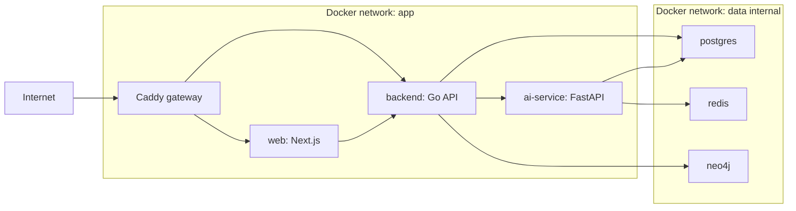

Network `app` phục vụ giao tiếp giữa các service ứng dụng, còn network `data` được cấu hình nội bộ để giới hạn truy cập vào cơ sở dữ liệu và cache. Thiết kế này phù hợp với yêu cầu bảo mật bản thảo và dữ liệu phản biện: các thành phần dữ liệu không được expose trực tiếp ra Internet.

Tóm lại, Chương 3 cho thấy ConferenceSpace được xây dựng như một nền tảng hoàn chỉnh, trong đó AI là một lớp hỗ trợ có kiểm soát. Cấu trúc này tạo nền tảng để Chương 4 giải thích vì sao từng công nghệ được chọn và Chương 5 đánh giá từng lớp theo tiêu chí phù hợp.
