# Chương 3. Xây dựng hệ thống

## 3.1. Tổng quan hệ thống

ConferenceSpace được xây dựng nhằm giải quyết một bài toán có tính thực tiễn cao trong cộng đồng nghiên cứu học thuật: quản lý toàn bộ vòng đời xét duyệt bài báo khoa học tại hội nghị, từ khâu nộp bản thảo, phân công phản biện, thu thập đánh giá, giai đoạn rebuttal, đến khi ra quyết định chấp nhận hoặc từ chối. Hệ thống không đặt mục tiêu cạnh tranh với các nền tảng đã vận hành lâu năm như EasyChair hay Microsoft CMT về độ phủ người dùng, mà hướng đến việc chứng minh một mô hình tích hợp AI vào quy trình học thuật theo cách có trách nhiệm và có thể giải thích được, trong đó mọi quyết định cuối cùng vẫn thuộc về con người. Đây là quan điểm thiết kế xuyên suốt chi phối mọi quyết định kỹ thuật trong quá trình xây dựng hệ thống.

Hệ thống phục vụ ba nhóm người dùng chính với những nhu cầu và quyền hạn khác biệt rõ ràng. **Tác giả** là những người tìm kiếm hội nghị phù hợp, nộp bản thảo, theo dõi tiến trình xét duyệt và phản hồi trong giai đoạn rebuttal. **Người phản biện** (reviewer) nhận bài được phân công, đọc và đánh giá dựa trên các tiêu chí chuyên môn, lưu nháp và gửi phản biện. **Chủ tọa** (chair) và đồng chủ tọa (co-chair) có quyền quản lý toàn bộ hội nghị: cấu hình track và deadline, mời và phân công phản biện, kiểm tra xung đột lợi ích, theo dõi tiến độ và đưa ra quyết định cuối cùng. Quan trọng là vai trò của một người dùng được gán theo từng hội nghị, không phải trên toàn hệ thống: một người có thể là tác giả ở hội nghị này nhưng đồng thời là người phản biện hoặc chủ tọa ở hội nghị khác.

Về kiến trúc tổng thể, ConferenceSpace được cấu trúc thành ba lớp rõ ràng và tách biệt về mặt trách nhiệm. Lớp thứ nhất là **lớp nghiệp vụ cốt lõi**, bao gồm toàn bộ quy trình quản lý hội nghị, nộp bài, phân công, đánh giá và ra quyết định — những tác vụ không cần AI và cần hoạt động ổn định, xác định. Lớp thứ hai là **lớp thuật toán xác định**, bao gồm thuật toán đối sánh phản biện — bài nộp dựa trên Jaccard Similarity và cơ chế phát hiện xung đột lợi ích đa tầng — những tác vụ cần kết quả nhất quán và có thể giải thích được mà không phụ thuộc vào mô hình ngôn ngữ lớn. Lớp thứ ba là **lớp AI hỗ trợ**, bao gồm sáu mô-đun AI phục vụ các tác nhân khác nhau trong quy trình: Autofill, Track Recommendation, Submission Gating, Reviewer Initial Analysis, Review Quality Auditor và Chair Decision Copilot. Sự phân tầng này không chỉ là quyết định thiết kế mà còn là câu trả lời cho câu hỏi cốt lõi: phần nào trong quy trình xét duyệt học thuật phù hợp để AI hỗ trợ, và phần nào cần giải quyết bằng logic có thể kiểm chứng?

### 3.1.1. Sơ đồ kiến trúc tổng quan hệ thống

Dưới đây là sơ đồ Mermaid biểu diễn sự phân tầng ba lớp và mối tương tác giữa các dịch vụ trong hệ thống ConferenceSpace.

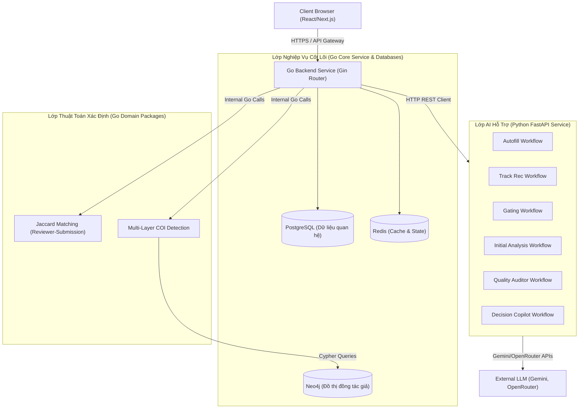

#### Giải thích sơ đồ kiến trúc tổng quan

Sơ đồ trên minh họa rõ ràng luồng dữ liệu đi từ trình duyệt của người dùng (Client Browser) qua các tầng phân lớp của ConferenceSpace:
1. **Lớp 1 (Nghiệp vụ cốt lõi):** Đóng vai trò là cổng tiếp nhận tất cả các yêu cầu từ phía máy khách. Go Backend chạy Gin Router sẽ định tuyến các yêu cầu, thực hiện các thao tác CRUD dữ liệu trên PostgreSQL, ghi nhận phiên làm việc trên Redis và quản lý kết nối WebSocket.
2. **Lớp 2 (Thuật toán xác định):** Khi cần tính toán phân công phản biện hoặc kiểm tra xung đột lợi ích (COI), Go Backend sẽ gọi các package nội bộ. Riêng thuật toán phát hiện COI sẽ gửi các câu lệnh Cypher đến Neo4j Database để duyệt đồ thị đồng tác giả theo thời gian thực.
3. **Lớp 3 (AI hỗ trợ):** Các tác vụ đọc hiểu, phân tích ngữ nghĩa được tách hoàn toàn sang Python FastAPI Service. Go Backend giao tiếp với AI Service qua giao thức HTTP REST. AI Service sau đó sẽ tương tác với các LLM Provider bên ngoài để xử lý kết quả và trả về cho Go Backend dưới dạng JSON có cấu trúc.

---

## 3.2. Use Case

### 3.2.1. Tác nhân hệ thống

Hệ thống ConferenceSpace xác định sáu tác nhân tương tác trực tiếp hoặc gián tiếp với các chức năng của hệ thống, phản ánh cấu trúc phân công vai trò trong một hội nghị khoa học thực tế.

**Tác giả** (Author) là tác nhân có tần suất tương tác cao nhất với hệ thống trong giai đoạn đầu vòng đời bài nộp. Tác giả tìm kiếm và đánh dấu các hội nghị phù hợp với lĩnh vực nghiên cứu, tiến hành nộp bài theo quy trình nhiều bước có hướng dẫn, theo dõi trạng thái bài nộp theo thời gian thực và tương tác với kết quả phản biện trong giai đoạn rebuttal. Đây cũng là tác nhân hưởng lợi trực tiếp từ các mô-đun AI hỗ trợ như Autofill (trích xuất metadata từ PDF), gợi ý track phù hợp và kiểm tra sơ bộ bản thảo trước khi nộp chính thức.

**Người phản biện** (Reviewer) tương tác với hệ thống chủ yếu trong giai đoạn đánh giá bài. Reviewer nhận lời mời phân công, chấp nhận hoặc từ chối kèm lý do, xem danh sách bài được phân công kèm thông tin hỗ trợ từ AI, nhập điểm theo các tiêu chí chuyên môn, lưu nháp và gửi phản biện. Sau giai đoạn rebuttal, reviewer có thể đọc phản hồi của tác giả và điều chỉnh điểm số nếu thấy cần thiết.

**Chủ tọa và Đồng chủ tọa** (Chair / Co-Chair) là tác nhân có quyền hạn rộng nhất trong phạm vi hội nghị mà họ quản lý. Chair chịu trách nhiệm tạo và cấu hình hội nghị, thiết lập track, deadline và mẫu phản biện, mời và phân công reviewer, kiểm tra xung đột lợi ích, theo dõi tiến độ phản biện và cuối cùng là ra quyết định chấp nhận hoặc từ chối dựa trên tổng hợp phản biện, rebuttal và thảo luận nội bộ. Chair được hỗ trợ bởi thuật toán gợi ý reviewer và mô-đun Decision Copilot để có cái nhìn tổng quan và đưa ra quyết định có căn cứ.

**Ban chương trình** (Program Committee — PC) là tác nhân có quyền đọc và tổng quan, không có quyền can thiệp vào quy trình nghiệp vụ. PC có thể xem danh sách bài nộp, các phản biện và thống kê tổng hợp trong phạm vi hội nghị mà họ tham gia.

**Quản trị hệ thống** (System Admin) là tác nhân đặc biệt, không phải người dùng cuối thông thường, truy cập qua header `X-Admin-Token`. Tác nhân này phục vụ các thao tác vận hành nội bộ như xem dữ liệu thô, cưỡng bức đồng bộ hoặc khắc phục sự cố.

**Tác nhân hệ thống** bao gồm cron job tự động kết thúc giai đoạn rebuttal quá hạn và AI Service gọi lại vào backend qua header `X-Agent-Service-Token`. Hai tác nhân này không tương tác qua giao diện người dùng nhưng đóng vai trò quan trọng trong tính tự động hóa và tích hợp AI của toàn hệ thống.

### 3.2.2. Các use case chính

Hệ thống ConferenceSpace tổ chức các chức năng thành các nhóm use case theo từng tác nhân, phản ánh trực tiếp nhu cầu đã xác định trong quá trình khảo sát người dùng ở Chương 2.

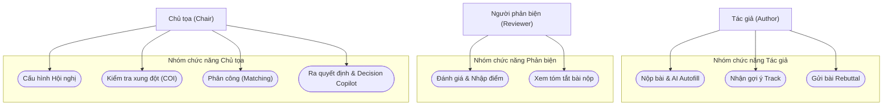

#### Giải thích biểu đồ Use Case hệ thống

Biểu đồ Use Case tổng quát trên biểu diễn mối liên kết giữa ba nhóm tác nhân chính và các chức năng quan trọng nhất trong vòng đời của một hội nghị khoa học:
1. **Tác giả (Author):** Tập trung vào việc nộp bài báo. Tác nhân này có thể tải lên tệp PDF để kích hoạt `AI Autofill` (tự điền metadata) hoặc nhận gợi ý track chuyên môn trước khi gửi bản thảo chính thức. Sau khi có kết quả review, tác giả tham gia giai đoạn phản hồi bằng cách gửi `Rebuttal`.
2. **Người phản biện (Reviewer):** Nhận bài nộp được phân công, xem bản tóm tắt đóng góp chính của bài viết do AI biên soạn nhằm nắm bắt nhanh nội dung, và tiến hành đánh giá chuyên môn theo mẫu tiêu chí có sẵn của hội nghị.
3. **Chủ tọa (Chair):** Quản lý toàn bộ cấu hình, tiến hành rà soát xung đột lợi ích (COI), xác nhận phân công reviewer dựa trên gợi ý từ thuật toán matching và sử dụng `Decision Copilot` để có cái nhìn tổng hợp đa chiều trước khi đưa ra quyết định chấp nhận hay từ chối bài viết.

---

### 3.2.3. Đặc tả use case quan trọng

Phần này trình bày chi tiết ba use case trọng tâm đại diện cho ba lớp của hệ thống: nộp bài (lớp nghiệp vụ), phân công phản biện (lớp thuật toán) và hỗ trợ quyết định bằng AI (lớp AI).

#### UC-01: Nộp bài và trích xuất metadata tự động

**Mục tiêu:** Tác giả hoàn thành quy trình nộp bản thảo vào một hội nghị, với tùy chọn hỗ trợ AI trích xuất metadata từ tệp PDF.

**Điều kiện tiên quyết:** Tác giả đã đăng nhập, hội nghị đang trong giai đoạn mở nhận bài và tác giả chưa nộp bài vào hội nghị này.

**Sơ đồ hoạt động (Activity Diagram) cho UC-01:**

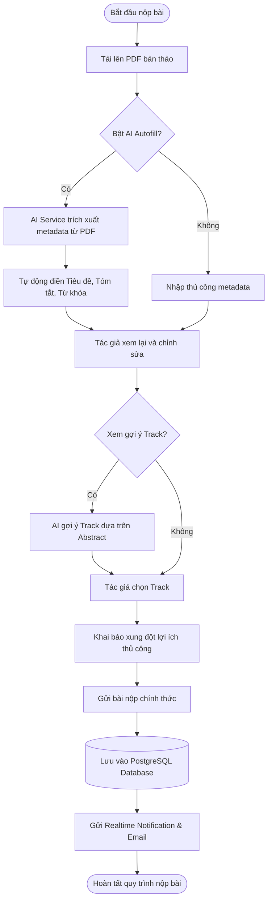

#### Giải thích sơ đồ hoạt động UC-01

Sơ đồ hoạt động trên mô tả trình tự các bước từ khi tác giả bắt đầu nộp bài cho đến khi hoàn thành:
1. **Bước tải PDF và trích xuất:** Tác giả tải lên tệp PDF. Nếu bật tùy chọn AI Autofill, AI Service sẽ xử lý tệp PDF và tự động điền các trường chính. Nếu không, tác giả tự nhập thủ công.
2. **Gợi ý Track:** Sau khi có thông tin tiêu đề và tóm tắt, hệ thống cung cấp tùy chọn gợi ý track. AI phân tích sự tương đồng giữa abstract và mô tả của các track để đưa ra đề xuất.
3. **Khai báo và Lưu trữ:** Tác giả xác nhận track, khai báo COI thủ công với các thành viên ban tổ chức, và gửi bài. Hệ thống lưu toàn bộ metadata vào PostgreSQL, đồng thời kích hoạt WebSocket để thông báo realtime cho tác giả và ban tổ chức.

---

#### UC-02: Phân công phản biện có kiểm tra xung đột lợi ích

**Mục tiêu:** Chủ tọa xem gợi ý phân công dựa trên thuật toán Jaccard Similarity, kiểm tra COI và xác nhận phân công.

**Điều kiện tiên quyết:** Hội nghị đang trong giai đoạn phân công, đã có ít nhất một bài nộp được xem xét và ít nhất một reviewer đã được mời và chấp nhận tham gia.

**Sơ đồ luồng xử lý COI và Phân công cho UC-02:**

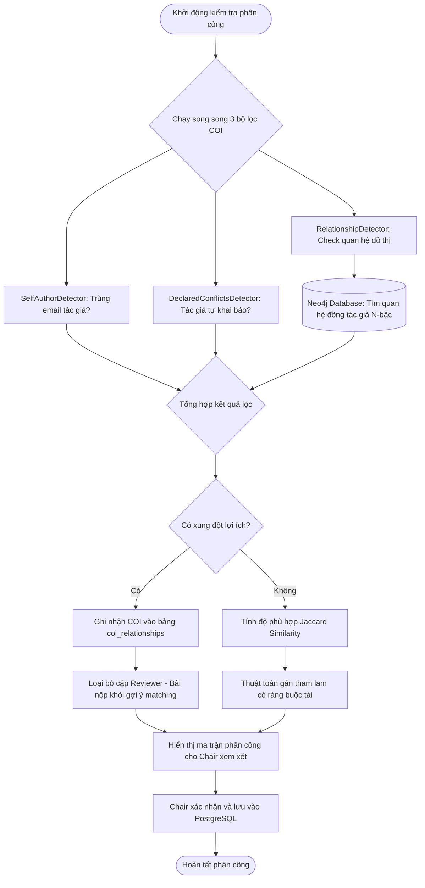

#### Giải thích sơ đồ xử lý UC-02

Sơ đồ trên mô tả cơ chế kiểm tra COI đa tầng kết hợp với thuật toán đối sánh phân công:
1. **Lọc COI song song:** Hệ thống chạy đồng thời 3 cơ chế phát hiện xung đột nhằm đảm bảo tính toàn vẹn học thuật. Điểm đặc sắc là `RelationshipDetector` truy vấn đồ thị đồng tác giả trong database Neo4j để phát hiện các mối quan hệ gián tiếp (ví dụ: reviewer đã viết chung bài báo với tác giả của bài nộp trong vòng 2 năm qua).
2. **Loại trừ và Tính điểm:** Những cặp bị phát hiện COI sẽ bị loại ngay lập tức. Những cặp hợp lệ được đưa qua bộ tính điểm Jaccard Similarity giữa tập domain của reviewer và tập keyword của bài nộp.
3. **Gán tham lam:** Thuật toán sắp xếp các cặp hợp lệ theo điểm số từ cao xuống thấp và tiến hành phân công tự động, đảm bảo reviewer không bị quá tải và bài nộp nhận đủ số phản biện tối thiểu. Chair có quyền sửa đổi thủ công trên ma trận trực quan trước khi nhấn xác nhận để ghi vào database.

---

#### UC-03: Hỗ trợ quyết định bằng AI (Decision Copilot)

**Mục tiêu:** Chủ tọa nhận bản tổng hợp từ AI về toàn bộ đánh giá, thảo luận và rebuttal của một bài nộp để hỗ trợ ra quyết định chấp nhận hay từ chối.

**Điều kiện tiên quyết:** Bài nộp đã có đủ phản biện và giai đoạn rebuttal đã kết thúc hoặc không được bật.

**Sơ đồ tuần tự (Sequence Diagram) cho UC-03:**

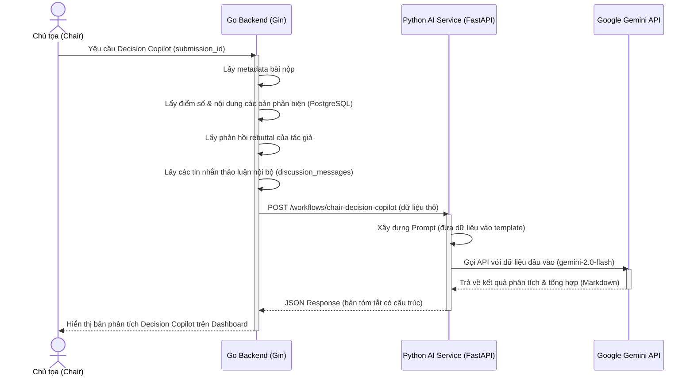

#### Giải thích sơ đồ tuần tự UC-03

Sơ đồ tuần tự minh họa dòng tương tác giữa các dịch vụ khi chủ tọa kích hoạt tính năng hỗ trợ quyết định:
1. **Thu thập dữ liệu thô:** Go Backend chịu trách nhiệm truy vấn PostgreSQL để gom toàn bộ ngữ cảnh liên quan của bài viết. Dữ liệu bao gồm các bản phản biện thô, phản hồi rebuttal và các đoạn chat thảo luận bảo mật giữa các reviewer.
2. **Định dạng Prompt:** Dữ liệu thô được gửi sang AI Service dưới dạng payload JSON. Tại đây, AI Service định dạng dữ liệu vào một prompt mẫu được thiết kế sẵn cho việc tổng hợp học thuật.
3. **Phân tích bằng Gemini:** Gemini API xử lý dữ liệu và trả về bản tổng hợp dưới dạng văn bản có cấu trúc (các điểm đồng thuận, bất đồng chính, đánh giá rebuttal). Kết quả cuối cùng được hiển thị trên dashboard để chair tham khảo. Toàn bộ quy trình này diễn ra bất đồng bộ, bảo vệ backend không bị block luồng xử lý do latency cao của LLM.

---

## 3.3. Thiết kế kỹ thuật

### 3.3.1. Kiến trúc tổng thể

ConferenceSpace áp dụng mô hình **kiến trúc nhiều dịch vụ ở mức triển khai** (service-oriented deployment), trong đó backend nghiệp vụ chính được tổ chức theo **kiến trúc phân lớp** (layered architecture) như một monolith, còn AI được tách thành một dịch vụ độc lập giao tiếp qua HTTP. Sự phân tách này không phải vì microservices là xu hướng mà vì có lý do kỹ thuật cụ thể: các workflow AI vốn có latency cao, phụ thuộc vào model provider bên ngoài và có thể thay đổi nhanh theo sự phát triển của LLM — những đặc điểm này cần được cô lập để không ảnh hưởng đến sự ổn định của lớp nghiệp vụ cốt lõi.

Về mặt tổng thể, hệ thống gồm bốn thành phần chính. **Frontend** được xây dựng bằng Next.js 15, đóng vai trò giao diện cho người dùng và cũng hoạt động như một proxy layer để ẩn URL backend khỏi phía trình duyệt. **Backend Go/Gin** là trung tâm xử lý nghiệp vụ, cung cấp REST API tại `/api/v1` và phục vụ kết nối WebSocket realtime tại `/ws/notifications`. **AI Service Python/FastAPI** xử lý các workflow AI có latency cao và tích hợp với các model provider (Gemini, OpenRouter). **Hệ thống dữ liệu** gồm PostgreSQL cho dữ liệu quan hệ, Neo4j cho đồ thị đồng tác giả và Redis cho cache và runtime state của AI Service.

Luồng tương tác giữa các thành phần được thiết kế có chủ đích rõ ràng. Trình duyệt chỉ giao tiếp với Frontend Next.js thông qua Caddy reverse proxy — không có đường dẫn trực tiếp từ trình duyệt đến backend Go hay AI Service. Frontend gọi backend qua route proxy nội bộ (`/api/backend/*`), và backend gọi AI Service qua mạng Docker nội bộ. Thiết kế này tạo ra một vành đai bảo vệ nhất quán và giảm bề mặt tấn công đáng kể.

Các thành phần tùy chọn (Neo4j, Semantic Scholar, AI Service) được thiết kế theo nguyên tắc **graceful degradation**: nếu không được cấu hình, hệ thống tự động tắt các tính năng liên quan mà không gây lỗi đối với các chức năng cốt lõi. Điều này giúp hệ thống có thể triển khai ở nhiều mức độ cấu hình khác nhau tùy theo tài nguyên sẵn có.

---

### 3.3.2. Thiết kế backend

Backend của ConferenceSpace được viết bằng Go 1.24 với framework Gin, tổ chức theo kiến trúc phân lớp rõ ràng trong thư mục `internal/`. Quyết định dùng Go thay vì Node.js hay Python/FastAPI xuất phát từ ba yếu tố kỹ thuật chính: hiệu năng cao nhờ biên dịch thành binary, mô hình concurrency đơn giản và hiệu quả qua goroutines (đặc biệt phù hợp khi gọi AI API đồng thời cho nhiều request), và kiểu tĩnh giúp phát hiện lỗi tại compile-time trong một codebase lớn. Kết quả benchmark thực tế trên tập dữ liệu 300 hội nghị và 15.000 bài nộp cho thấy backend xử lý được 369–572 request/giây với p95 latency dưới 120ms, trong khi container API chỉ sử dụng trung bình 28% CPU của một core và khoảng 30 MB RAM — Go là lựa chọn phù hợp về hiệu năng với tài nguyên tiêu thụ tối thiểu.

Kiến trúc phân lớp trong `internal/` gồm các tầng với luồng phụ thuộc một chiều từ trên xuống. Tầng **Controller** (`internal/controller/`) là điểm tiếp nhận HTTP request từ Gin router, chịu trách nhiệm parse request, gọi service tương ứng và trả response — Controller không chứa logic nghiệp vụ, đây là nguyên tắc cốt lõi giúp logic không bị ràng buộc vào HTTP framework. Tầng **Service** (`internal/service/`) chứa toàn bộ logic nghiệp vụ: validation phức tạp, orchestrate các lời gọi đến Storage và các dịch vụ bên ngoài, và thực hiện các quy tắc như kiểm tra quyền truy cập tài nguyên và chuyển đổi trạng thái bài nộp. Tầng **Storage** (`internal/storage/`) triển khai Repository Pattern — một interface ẩn chi tiết cài đặt cơ sở dữ liệu, giúp việc kiểm thử và thay thế implementation trở nên dễ dàng hơn. Tầng **Model** (`internal/model/`) định nghĩa các entity domain và DTO dùng để truyền dữ liệu giữa các tầng.

Ngoài bốn tầng chính, backend còn có các module chuyên biệt phục vụ các nhu cầu cụ thể. Module **Middleware** xử lý xác thực JWT, phân quyền và CORS ở mức framework. Module **Orchestrator** điều phối các workflow phức tạp đòi hỏi phối hợp nhiều service. Module **Clients** bọc các lời gọi đến dịch vụ bên ngoài như AI Service, Neo4j, Semantic Scholar API và Brevo Email. Module **Assignment** chứa domain riêng cho matching, scoring và COI với ba thành phần con là `matching/`, `scoring/` và `coi/`. Module **DeskRejection** triển khai pipeline kiểm tra sơ bộ bản thảo theo mô hình extractor → checkers → evaluator. Module **WebSocket** quản lý Hub thông báo realtime, hỗ trợ nhiều kết nối đồng thời từ cùng một người dùng.

Toàn bộ các phụ thuộc được khởi tạo rõ ràng (Dependency Injection) tại điểm entry `cmd/server/main.go` thông qua struct `AppContext`. Cách tiếp cận này giúp dòng phụ thuộc của cả ứng dụng có thể đọc hiểu chỉ bằng cách nhìn vào hàm `main`, tránh "magic" không rõ nguồn gốc và làm cho việc kiểm thử unit test trở nên trực tiếp hơn.

Phân quyền được thiết kế theo mô hình **RBAC cấp hội nghị** (per-conference RBAC). Mỗi request đến các endpoint hội nghị cụ thể đều đi qua middleware kiểm tra cả JWT token (xác thực danh tính) lẫn vai trò của người dùng trong hội nghị đó (phân quyền). Các middleware phân quyền chuyên biệt như `RequireChairOrCoChair`, `RequireSubmissionAccess`, `RequireAssignmentOwner` giúp kiểm soát truy cập ở mức chi tiết mà không cần nhúng logic phân quyền vào từng handler.

#### Sơ đồ phụ thuộc các tầng trong Go Backend

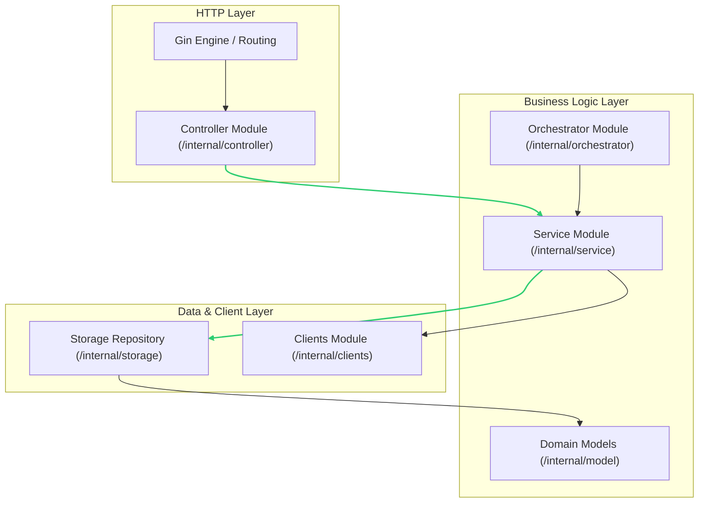

#### Giải thích sơ đồ phụ thuộc Go Backend

Sơ đồ trên thể hiện nguyên lý phụ thuộc một chiều (Clean/Layered Architecture) trong Go backend:
1. **Tính độc lập:** Các package bên trên (`HTTP Layer`) phụ thuộc vào các package bên dưới (`Business Logic Layer`), và tầng nghiệp vụ phụ thuộc vào tầng dữ liệu (`Data & Client Layer`). Không có sự phụ thuộc ngược chiều.
2. **Orchestrator:** Được đặt ngang hàng với Service để điều phối các tác vụ liên vùng nghiệp vụ (ví dụ: đăng ký và gửi email đồng thời), tránh việc các Service gọi chéo nhau tạo thành vòng lặp phụ thuộc (circular dependency).
3. **Clients:** Nằm ở tầng thấp nhất, chịu trách nhiệm đóng gói các kết nối ra ngoài (Gemini, Neo4j, Semantic Scholar). Điều này đảm bảo khi thay đổi API của bên thứ ba, chúng ta chỉ cần sửa đổi code trong thư mục `/internal/clients` mà không làm ảnh hưởng đến logic nghiệp vụ cốt lõi của Service.

---

### 3.3.3. Thiết kế dữ liệu

Hệ thống ConferenceSpace sử dụng chiến lược lưu trữ dữ liệu kép: **PostgreSQL** cho dữ liệu quan hệ với cấu trúc xác định và **Neo4j** cho dữ liệu đồ thị quan hệ đồng tác giả. Quyết định này phản ánh bản chất của từng loại dữ liệu: dữ liệu hội nghị, bài nộp và phản biện có cấu trúc rõ ràng phù hợp với mô hình quan hệ, trong khi mạng đồng tác giả là dữ liệu đồ thị mà các truy vấn duyệt theo chiều sâu nhiều bậc sẽ rất tốn kém nếu thực hiện bằng SQL JOIN.

PostgreSQL lưu trữ toàn bộ dữ liệu nghiệp vụ cốt lõi, với schema được quản lý thông qua migration files có phiên bản (golang-migrate). Bảng `users` lưu tài khoản người dùng với trường `domain` kiểu `TEXT[]` — mảng domain chuyên môn — thay vì bảng phụ, giúp query matching đơn giản hơn với toán tử `= ANY(domain)`. Bảng `conferences` có cột `configurations` kiểu JSONB lưu cấu hình linh hoạt như số reviewer tối thiểu, quy tắc double-blind và template phiếu đánh giá; dùng JSONB thay vì nhiều cột riêng lẻ cho phép cấu hình mở rộng mà không cần thay đổi schema, phù hợp với sự đa dạng cấu hình của các hội nghị khác nhau. Bảng `paper_assignments` có ràng buộc UNIQUE(`submission_id`, `reviewer_id`) để đảm bảo mỗi reviewer chỉ phụ trách một bài một lần, với cột `review_data` kiểu JSONB lưu chi tiết đánh giá theo cấu trúc linh hoạt phù hợp với mỗi hội nghị có tiêu chí đánh giá khác nhau.

Bảng `coi_relationships` lưu các quan hệ xung đột lợi ích phát hiện được, kèm loại quan hệ (`self_author`, `declared`, `co_authorship`), mức độ nghiêm trọng và cột `evidence` kiểu JSONB lưu bằng chứng cụ thể như danh sách bài báo đồng tác giả. Việc lưu trữ bằng chứng giúp chair có cơ sở để xem xét và quyết định, thay vì chỉ nhận một cờ cảnh báo không rõ nguồn gốc. Các bảng `scholar_profiles` và `scholar_papers` lưu cache dữ liệu từ Semantic Scholar API, tránh gọi API lặp lại và đảm bảo hệ thống hoạt động được ngay cả khi Semantic Scholar API tạm thời không khả dụng.

Neo4j lưu trữ đồ thị đồng tác giả phục vụ phát hiện COI nhiều bậc với mô hình đơn giản nhưng hiệu quả: node `:Author` (thuộc tính `email` có unique constraint, `name`) và relationship `:COAUTHORED` (thuộc tính `established_date` có index, `paper_link`). Khi cần kiểm tra COI giữa một reviewer và một tác giả bài nộp, hệ thống thực hiện truy vấn Cypher duyệt đồ thị với độ sâu tối đa 2 bậc:

```cypher
MATCH (r:Author {email: $reviewer})-[:COAUTHORED*1..2]-(a:Author {email: $author})
RETURN r, a
```

Với SQL thuần, truy vấn tương đương đòi hỏi nhiều lượt JOIN lồng nhau và hiệu năng giảm mạnh khi đồ thị có hàng triệu quan hệ. Neo4j tối ưu hóa graph traversal ở mức engine, cho kết quả nhanh hơn đáng kể cho loại truy vấn này. Quan trọng là Neo4j được thiết kế như thành phần tùy chọn: backend kiểm tra sự khả dụng khi khởi động và chỉ kích hoạt `RelationshipDetector` khi kết nối Neo4j thành công, trong khi hai lớp COI còn lại luôn hoạt động độc lập.

#### Sơ đồ Quan hệ Thực thể (PostgreSQL ERD) và Đồ thị (Neo4j Schema)

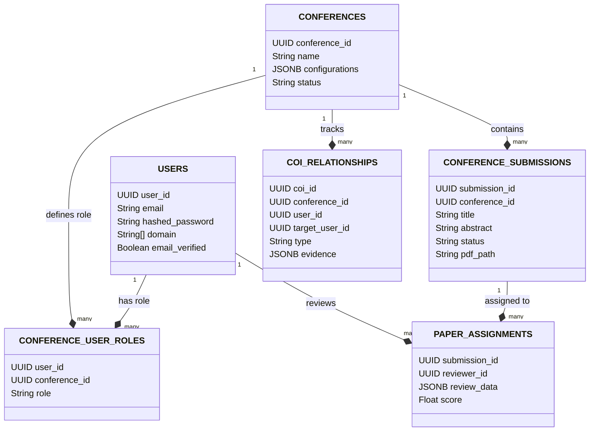

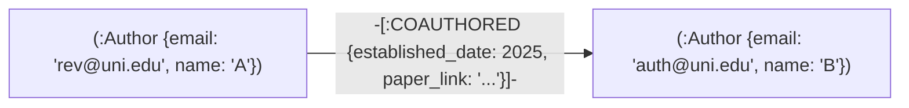

#### Giải thích mô hình dữ liệu PostgreSQL và Neo4j

Sơ đồ dữ liệu kết hợp làm rõ vai trò của từng loại cơ sở dữ liệu:
1. **PostgreSQL ERD:** Biểu diễn mô hình quan hệ chặt chẽ. Bảng trung gian `CONFERENCE_USER_ROLES` liên kết `USERS` và `CONFERENCES` để định vị vai trò của một tài khoản theo từng hội nghị cụ thể. Dữ liệu bài nộp (`CONFERENCE_SUBMISSIONS`) và phân công (`PAPER_ASSIGNMENTS`) liên kết chặt chẽ qua khoá ngoại để đảm bảo tính toàn vẹn dữ liệu.
2. **Neo4j Graph Database Schema:** Thể hiện đồ thị đồng tác giả gọn nhẹ. Chỉ có một nhãn node duy nhất là `:Author` và một mối quan hệ `:COAUTHORED`. Tuy đơn giản nhưng mô hình đồ thị này cho phép hệ thống thực hiện duyệt đồ thị N-bậc rất nhanh thông qua Cypher, giảm thiểu tải cho database PostgreSQL chính.

---

### 3.3.4. Luồng xử lý hệ thống

Để hiểu hệ thống hoạt động ra sao trong thực tế, phần này trình bày hai luồng xử lý quan trọng và có tính phức tạp cao: luồng nộp bài có hỗ trợ AI và luồng phân công phản biện.

#### Sơ đồ tuần tự: Luồng nộp bài với AI Autofill

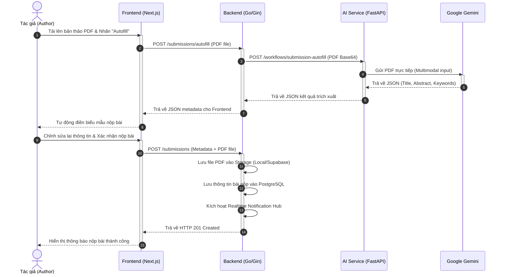

#### Giải thích luồng nộp bài với AI Autofill

Biểu đồ tuần tự trên mô tả chi tiết hai giai đoạn của luồng nộp bài:
1. **Giai đoạn 1 (Trích xuất thử):** Diễn ra từ bước 1 đến bước 8. Khi người dùng tải PDF lên, file được mã hoá base64 và gửi qua Go Backend đến Python AI Service. Nhờ tính năng multimodal của Gemini, tệp PDF được đọc trực tiếp và trích xuất thông tin mà không cần parse text thủ công. Thông tin hiển thị lên UI để tác giả kiểm chứng.
2. **Giai đoạn 2 (Gửi chính thức):** Diễn ra từ bước 9 đến bước 14. Sau khi tác giả chỉnh sửa, dữ liệu và file PDF chính thức được gửi lên Go Backend để ghi vào cơ sở dữ liệu và lưu trữ lâu dài. Nếu AI Service gặp sự cố ở Giai đoạn 1, luồng xử lý sẽ quay về chế độ điền tay thủ công, đảm bảo Giai đoạn 2 luôn hoạt động độc lập.

---

#### Sơ đồ tuần tự: Luồng matching và phân công phản biện tự động

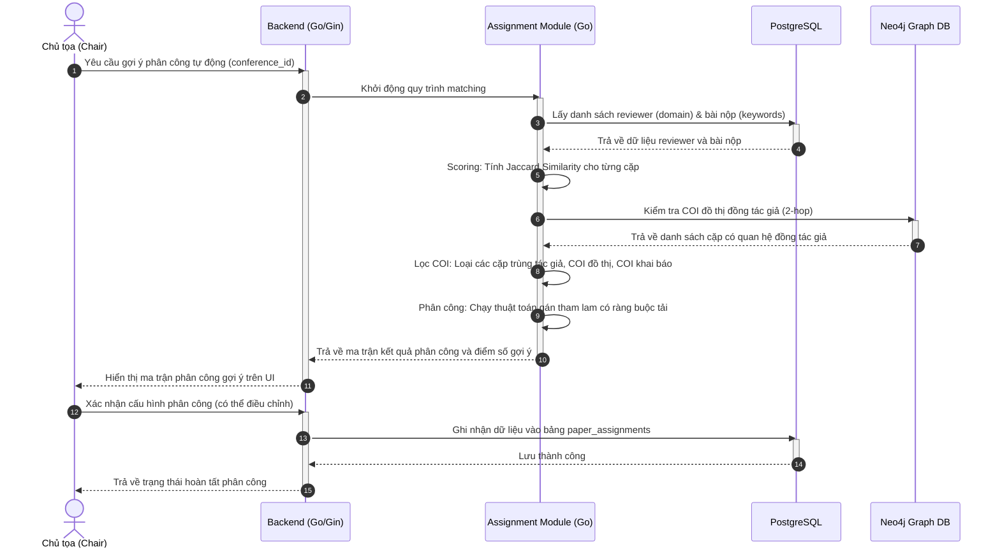

#### Giải thích luồng matching và phân công phản biện tự động

Biểu đồ mô tả quy trình tính toán đối sánh phản biện hoàn toàn xác định tại Go Backend:
1. **Đọc dữ liệu và Tính điểm Jaccard:** (Bước 1 - 5) Hệ thống lấy tập domain của reviewer và keyword bài nộp từ PostgreSQL, tính điểm độ tương đồng Jaccard.
2. **Lọc COI bằng Neo4j:** (Bước 6 - 8) Hệ thống truy vấn Neo4j để lấy danh sách các reviewer có xung đột đồng tác giả với tác giả bài nộp và loại bỏ các cặp này khỏi danh sách ứng viên hợp lệ.
3. **Phân công tham lam và Phê duyệt:** (Bước 9 - 14) Thuật toán gán tham lam chạy trên tập ứng viên sạch COI để đưa ra gợi ý tối ưu. Gợi ý này hiển thị cho Chair xem xét, điều chỉnh thủ công trước khi lưu chính thức vào PostgreSQL.

---

## 3.4. Giải pháp AI

### 3.4.1. Vai trò của AI trong hệ thống

Khảo sát nhu cầu người dùng ở Chương 2 cho thấy ba điểm cốt lõi về kỳ vọng với AI: AI phải giảm được thao tác lặp lại (đặc biệt là nhập liệu metadata), AI phải minh bạch và có thể bỏ qua, và AI không được thay thế quyết định học thuật của con người. Những kỳ vọng này không phải ngẫu nhiên — chúng phản ánh lo ngại thực sự của cộng đồng nghiên cứu về nguy cơ AI làm suy yếu tính liêm chính học thuật, điều mà Chương 1 đã dẫn chứng từ các nghiên cứu gần đây về peer review tại ICLR 2026, nơi 21% phản biện được phân loại là do AI tạo hoàn toàn.

Từ quan điểm đó, AI trong ConferenceSpace được đưa vào để giải quyết ba hạn chế cụ thể của quy trình hiện tại mà không thể giải quyết bằng thuật toán xác định. Thứ nhất, việc trích xuất metadata từ tệp PDF bản thảo — một tác vụ đòi hỏi đọc hiểu nội dung văn bản có cấu trúc không đồng nhất, không thể làm tốt bằng regex hay rule-based parser. Thứ hai, gợi ý track phù hợp dựa trên ngữ nghĩa của title và abstract so sánh với mô tả các track — một tác vụ matching ngữ nghĩa mà keyword-based approach cho kết quả kém chính xác. Thứ ba, tổng hợp nhiều phản biện, rebuttal và thảo luận thành bản tóm lược có cấu trúc cho chair — một tác vụ tổng hợp thông tin đa chiều mà không thể tự động hóa bằng logic cứng.

Quan trọng hơn, có những phần của quy trình mà nhóm chủ động quyết định **không dùng AI**. Thuật toán matching reviewer — bài nộp được triển khai bằng Jaccard Similarity thay vì embedding, cosine similarity hay LLM, vì kết quả cần có thể giải thích được cho chair. Kiểm tra COI được triển khai bằng truy vấn đồ thị Neo4j và logic rule-based, vì tính xác định và kiểm chứng được là bắt buộc trong một quy trình liên quan đến tính công bằng học thuật. Những quyết định này có cơ sở từ các nghiên cứu được trích dẫn trong Chương 1: LLM tạo ra kết quả không nhất quán ở các nhiệm vụ đòi hỏi tính công bằng cao và kết quả phân công phản biện cần phải là "hộp trắng" — có thể giải thích và kiểm chứng bởi chair.

### 3.4.2. Các workflow có sử dụng AI

ConferenceSpace triển khai sáu workflow AI, mỗi workflow được hiện thực như một module độc lập trong AI Service (`ai-service/app/workflows/`). Sự độc lập về module giúp từng workflow có thể được cập nhật, thay đổi model hay prompt mà không ảnh hưởng đến các workflow khác.

**Submission Autofill** là workflow phục vụ tác giả, được kích hoạt khi tác giả chọn hỗ trợ AI điền thông tin bài nộp. Đầu vào là tệp PDF bản thảo được encode base64; Gemini API được gọi với khả năng đọc PDF trực tiếp (native multimodal), không cần bước chuyển đổi trung gian. Prompt được thiết kế để trích xuất title, abstract, keywords và loại bài báo theo định dạng JSON có cấu trúc. Đầu ra được validate cấu trúc trước khi trả về frontend; tác giả luôn xem lại và có thể chỉnh sửa kết quả trước khi gửi, đảm bảo AI không tự động lưu bất kỳ thông tin nào.

**Track Recommendation** gợi ý track phù hợp cho bài nộp dựa trên title, abstract và danh sách track của hội nghị kèm mô tả. Workflow này đặc biệt hữu ích khi hội nghị có nhiều track với ranh giới chủ đề gần nhau, khiến tác giả khó tự xác định track phù hợp nhất. Gemini trả về track được gợi ý kèm lý do ngắn gọn — yếu tố giải thích này giúp tác giả hiểu cơ sở của gợi ý và quyết định có theo hay không.

**Submission Gating** (kiểm tra sơ bộ bản thảo) phân tích bản thảo để phát hiện các vấn đề về định dạng, tuân thủ chính sách hoặc chất lượng cơ bản có thể dẫn đến desk rejection. Workflow này hoạt động như một bộ lọc sơ bộ, giúp tác giả biết trước các vấn đề tiềm ẩn trước khi bài vào tay chair, với đầu ra là danh sách vấn đề phân loại theo mức độ (nghiêm trọng, cảnh báo, gợi ý) kèm giải thích cụ thể.

**Reviewer Initial Analysis** tạo bản tóm lược sơ bộ cho reviewer về bài nộp được phân công, bao gồm tóm tắt đóng góp chính, phương pháp nghiên cứu, điểm mạnh tiềm năng và các câu hỏi cần làm rõ khi đọc. Mục tiêu không phải là thay thế việc reviewer đọc bài mà giúp reviewer định hướng đọc hiệu quả hơn và chuẩn bị câu hỏi từ trước — đây là ứng dụng phù hợp với nguyên tắc "AI as assistant, not arbiter" mà nghiên cứu về ứng dụng LLM vào peer review khuyến nghị.

**Review Quality Auditor** phân tích nội dung phản biện đã nộp để đánh giá mức độ đầy đủ, nhất quán và có bằng chứng. Workflow này được chair sử dụng khi muốn kiểm tra chất lượng phản biện trước khi đưa ra quyết định hoặc khi cần xác định phản biện nào cần bổ sung thêm chi tiết, với đầu ra là đánh giá theo các tiêu chí cụ thể (độ bao phủ đóng góp, chiều sâu kỹ thuật, tính xây dựng) kèm gợi ý cải thiện.

**Chair Decision Copilot** là workflow phức tạp nhất về mặt đầu vào: toàn bộ metadata bài nộp, tất cả phản biện với điểm số, rebuttal của tác giả và các thảo luận nội bộ. Gemini được gọi với context window lớn (lý do chọn Gemini Flash thay vì GPT-4o cho workflow này) để tổng hợp các điểm đồng thuận và mâu thuẫn giữa reviewers, các vấn đề kỹ thuật chính và tóm tắt rebuttal của tác giả. Đầu ra là bản tóm lược có cấu trúc, không bao gồm khuyến nghị chấp nhận hay từ chối — ngay cả ở mức gợi ý — để tránh tạo ra bất kỳ áp lực vô hình nào lên quyết định của chair.

---

### 3.4.3. Tích hợp AI vào kiến trúc hệ thống

AI Service được triển khai như một dịch vụ FastAPI độc lập, giao tiếp với backend Go qua HTTP nội bộ trong mạng Docker. Thiết kế tách biệt này có ba lợi ích rõ ràng: AI Service có thể được scale riêng khi có nhiều yêu cầu đồng thời, thay đổi model hay thêm workflow mới không đòi hỏi biên dịch lại backend Go, và timeout dài của các lời gọi AI không ảnh hưởng đến pool goroutine của backend.

Phía backend Go, mọi lời gọi đến AI Service được bọc trong module `internal/clients/ai_service/client.go`. Client này thực hiện ba lần retry với exponential backoff khi gặp lỗi transient, có configurable timeout (mặc định 180 giây cho workflows phức tạp như Decision Copilot), và log đầy đủ trạng thái lời gọi để hỗ trợ debug. Khi AI Service không phản hồi, backend không crash mà trả về lỗi có cấu trúc để frontend hiển thị thông báo phù hợp cho người dùng.

Phía AI Service, mỗi workflow được tổ chức thành một module Python riêng trong `ai_service/app/workflows/`. Mỗi module định nghĩa schema đầu vào và đầu ra bằng Pydantic, xử lý lỗi từ LLM provider và chuẩn hóa output trước khi trả về. AI Service dùng LiteLLM làm lớp trừu tượng gọi LLM, cho phép chuyển đổi giữa Gemini, OpenAI hay các provider khác chỉ bằng thay đổi biến môi trường mà không cần sửa code. Cơ chế xác thực giữa backend và AI Service dùng header `X-Agent-Service-Token` — một shared secret được cấu hình qua biến môi trường — đảm bảo chỉ backend Go mới có thể gọi các API của AI Service.

Redis đóng vai trò lưu trữ session và cache cho AI Service, đặc biệt quan trọng cho chatbot agent cần duy trì context hội thoại qua nhiều lượt tương tác. Chatbot sử dụng cơ chế context compaction khi conversation vượt ngưỡng 70% context window để giảm chi phí token mà vẫn duy trì đủ ngữ cảnh cần thiết.

#### Sơ đồ luồng tích hợp và xử lý lỗi AI

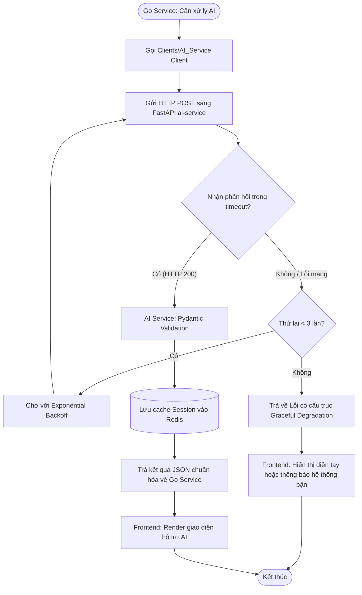

#### Giải thích sơ đồ luồng tích hợp AI

Sơ đồ trên thể hiện cơ chế giao tiếp và xử lý lỗi tự động để đảm bảo độ tin cậy của ứng dụng:
1. **Kháng lỗi (Resilience):** Khi xảy ra lỗi mạng hoặc timeout tạm thời từ phía LLM Provider, Go Backend Client tự động thực hiện cơ chế thử lại (retry) tối đa 3 lần với thời gian chờ tăng dần (exponential backoff), giúp triệt tiêu các lỗi transient.
2. **Graceful Degradation:** Nếu sau 3 lần thử lại vẫn thất bại, hệ thống không bị crash mà trả về lỗi có cấu trúc. Go Backend thông báo cho Frontend để tắt tính năng AI tương ứng và hướng dẫn người dùng chuyển sang điền tay thủ công.
3. **Cache & Validation:** Dữ liệu phản hồi từ Gemini API được Python AI Service kiểm tra tính hợp lệ bằng Pydantic trước khi gửi về Go Backend, đồng thời Redis được cập nhật để cache session làm việc của người dùng.

---

### 3.4.4. Ưu điểm và giới hạn của các workflow AI

Các workflow AI trong ConferenceSpace mang lại lợi ích định lượng được trong quy trình xét duyệt. Mô-đun Autofill giảm đáng kể thời gian nhập liệu cho tác giả: thay vì phải gõ lại tiêu đề, tóm tắt và từ khóa từ bản thảo đã viết, tác giả chỉ cần xem lại và điều chỉnh kết quả AI trích xuất. Reviewer Initial Analysis giúp reviewer chuẩn bị trước, giảm thời gian đọc lần đầu và tăng chất lượng câu hỏi trong đánh giá. Decision Copilot tiết kiệm thời gian chair khi cần đối chiếu nhiều phản biện dài và rebuttal phức tạp, đặc biệt trong hội nghị có hàng chục bài nộp.

Tuy nhiên, các giới hạn của các workflow này cũng cần được nhìn nhận trung thực để đặt đúng kỳ vọng. Về **phụ thuộc chất lượng đầu vào**, Autofill hoạt động tốt với tệp PDF có thể trích xuất text thông thường nhưng kém hiệu quả với PDF là ảnh scan hoặc có cấu trúc bảng phức tạp. Về **tính không nhất quán**, LLM về bản chất là mô hình xác suất, hai lần gọi với cùng đầu vào có thể cho đầu ra hơi khác nhau — điều này là bình thường nhưng cần được người dùng hiểu rõ. Về **chi phí và rate limit**, mô hình Gemini 2.0 Flash ở free tier có giới hạn 15 request/phút và 1.500 request/ngày; ở quy mô hội nghị lớn với nhiều bài nộp đồng thời, giới hạn này có thể bị chạm. Về **ngữ nghĩa chuyên ngành**, Gemini được huấn luyện trên corpus tổng quát và các bài báo trong lĩnh vực chuyên sâu với thuật ngữ hẹp có thể không được tóm tắt chính xác như kỳ vọng của chuyên gia. Về **yêu cầu kiểm duyệt**, tất cả các workflow AI đều yêu cầu người dùng xem lại kết quả trước khi hành động — đây không chỉ là thiết kế mà là yêu cầu bắt buộc để đảm bảo tính liêm chính học thuật.

Những giới hạn này không phủ nhận giá trị của các workflow AI mà xác định đúng phạm vi ứng dụng phù hợp: AI là công cụ hỗ trợ giảm tải thao tác lặp lại và tổng hợp thông tin, không phải công cụ ra quyết định tự động.

---

## 3.5. Môi trường triển khai

### 3.5.1. Cấu hình server

ConferenceSpace được triển khai trên máy chủ ảo (VPS) chạy **Ubuntu Server 22.04 LTS**, với cấu hình khuyến nghị tối thiểu 4 vCPU và 8 GB RAM. Lý do chọn Ubuntu LTS là sự ổn định dài hạn, hỗ trợ chính thức từ Canonical đến 2027 và hệ sinh thái package phong phú tương thích tốt với Docker Engine. Cấu hình RAM 8 GB là cần thiết vì hệ thống chạy đồng thời nhiều dịch vụ nặng: Neo4j mặc định cấu hình 512 MB heap, PostgreSQL có thể sử dụng đến 200 MB trong tải cao, và bản thân AI Service FastAPI cần dự phòng cho các lời gọi LLM đồng thời. Kết quả benchmark thực tế xác nhận điều này: PostgreSQL là bottleneck chính với trung bình 115% CPU (tức hơn một core), trong khi Neo4j và Redis tiêu thụ ít tài nguyên hơn đáng kể.

Quy trình thiết lập môi trường server được tự động hóa hoàn toàn thông qua script bootstrap, chạy với quyền `root` khi khởi tạo VPS lần đầu. Script này cài đặt Docker Engine và Docker Compose Plugin từ repository chính thức của Docker, thêm user deploy vào nhóm `docker`, tạo thư mục triển khai `/opt/conferencespace` và cấu hình tường lửa UFW. Việc tự động hóa bước bootstrap không chỉ tiết kiệm thời gian mà còn đảm bảo tính lặp lại: bất kỳ thành viên nào cũng có thể tái tạo môi trường production trên VPS mới chỉ bằng một lệnh duy nhất, loại bỏ rủi ro cấu hình thủ công sai hoặc thiếu bước nào đó.

Chính sách tường lửa áp dụng nguyên tắc **Zero Trust Network inside Server**: chỉ ba cổng được mở công khai — SSH (22/TCP) để quản trị, HTTP (80/TCP) cho xác thực chứng chỉ TLS và HTTPS redirect, và HTTPS (443/TCP) cho toàn bộ lưu lượng người dùng. Tất cả các dịch vụ nội bộ như PostgreSQL, Neo4j, Redis, backend Go (8080) và AI Service (8090) đều chỉ giao tiếp trong mạng Docker ảo nội bộ, hoàn toàn không thể truy cập từ Internet dù từ bên ngoài hay từ các container không được cấp quyền truy cập rõ ràng.

### 3.5.2. Proxy

ConferenceSpace sử dụng **Caddy 2** làm reverse proxy thay cho giải pháp truyền thống Nginx + Certbot. Quyết định này xuất phát từ vấn đề thực tế: Certbot yêu cầu cấu hình cron job gia hạn chứng chỉ riêng, dễ gặp lỗi khi cổng 80 bị chặn hoặc cấu hình Nginx thay đổi, dẫn đến gián đoạn HTTPS trên production. Caddy tích hợp sẵn ACME client và tự động xử lý toàn bộ vòng đời chứng chỉ TLS: tạo khóa, đăng ký với Let's Encrypt hoặc ZeroSSL và gia hạn trước khi hết hạn mà không cần bất kỳ script hay cron job bên ngoài — đây là yếu tố giảm đáng kể rủi ro vận hành trong môi trường production thực tế.

Cấu hình Caddy (Caddyfile) cho hệ thống ConferenceSpace rất ngắn gọn và dễ đọc:

```
conference-space.com, www.conference-space.com {
    encode zstd gzip
    reverse_proxy /ws/* backend:8080
    reverse_proxy web:3000
}
```

Caddy xử lý hai loại lưu lượng theo thứ tự ưu tiên. Lưu lượng WebSocket (`/ws/*`) được proxy trực tiếp đến Go backend tại `backend:8080` để xử lý kết nối realtime — WebSocket cần kết nối persistent và Caddy hỗ trợ upgrade protocol HTTP→WebSocket tự động. Toàn bộ lưu lượng HTTP còn lại được proxy đến Next.js frontend tại `web:3000`; frontend tự xử lý routing nội bộ và proxy các lời gọi API đến backend Go theo cấu hình Next.js. Caddy hoạt động trong Docker network `app` và có thể resolve tên dịch vụ (`web`, `backend`) nhờ DNS nội bộ của Docker, giúp cấu hình không cần hardcode địa chỉ IP và tự động cập nhật khi container được khởi động lại với IP khác.

---

### 3.5.3. Các thành phần triển khai khác

Toàn bộ hệ thống được quản lý bởi **Docker Compose** thông qua file `deployment/docker-compose.prod.yml`, định nghĩa tám service được điều phối theo thứ tự phụ thuộc và health check. Hai mạng Docker được định nghĩa với mục đích tách biệt rõ ràng: mạng `app` (bridge) kết nối các thành phần ứng dụng cần giao tiếp với nhau (Caddy, Next.js, backend, AI Service, Neo4j), và mạng `data` (bridge với thuộc tính `internal: true`) kết nối riêng các thành phần dữ liệu (PostgreSQL, Redis, Neo4j). Vì mạng `data` có thuộc tính `internal: true`, cổng của PostgreSQL và Redis không thể truy cập từ bên ngoài Docker host.

PostgreSQL 15 được triển khai với volume `postgres_data` để dữ liệu tồn tại độc lập với container lifecycle, cùng health check bằng `pg_isready` đảm bảo backend Go chỉ khởi động sau khi PostgreSQL thực sự sẵn sàng nhận kết nối, tránh race condition khi restart. Neo4j 5.15 Community được triển khai với plugin APOC (Awesome Procedures On Cypher) và cần thêm 60 giây khởi động (start_period trong health check) phản ánh thời gian JVM khởi động thực tế của Neo4j; memory được giới hạn qua cấu hình heap (256MB–512MB) và pagecache (256MB) để tránh tiêu thụ quá nhiều RAM trên VPS. Redis 7 được dùng làm backend cache và session store cho AI Service với persistence mode `appendonly` để tránh mất dữ liệu khi container restart.

Service `backend-migrate` là một container one-shot chạy sau khi PostgreSQL healthy, thực thi database migrations bằng golang-migrate và exit sau khi hoàn thành (`restart: "no"`). Đây là cách tiếp cận an toàn: migration được chạy như một bước riêng trong pipeline CI/CD, không phải khi backend khởi động, giúp tránh tình huống nhiều instance backend cùng chạy migration đồng thời trong môi trường có nhiều replica.

Quy trình CI/CD được tự động hóa hoàn toàn qua GitHub Actions. Khi có push vào nhánh `main`, pipeline chạy lint và test song song cho ba service (Frontend, Backend Go, AI Service Python), sau đó build ba Docker image và push lên GitHub Container Registry (GHCR) với tag theo Git commit hash. Cuối cùng, pipeline SSH vào VPS, copy file cấu hình (`docker-compose.prod.yml`, `Caddyfile`), chạy migration và thực thi `docker compose up -d --remove-orphans` để cập nhật các container với image mới mà không gây gián đoạn dịch vụ quá vài giây. Tất cả secret nhạy cảm (SSH key, GHCR token, API keys) được lưu trong GitHub Secrets và không bao giờ xuất hiện trong log của pipeline, đảm bảo an toàn thông tin trong toàn bộ quy trình CD.

#### Sơ đồ mạng nội bộ Docker (Network Isolation Topology)

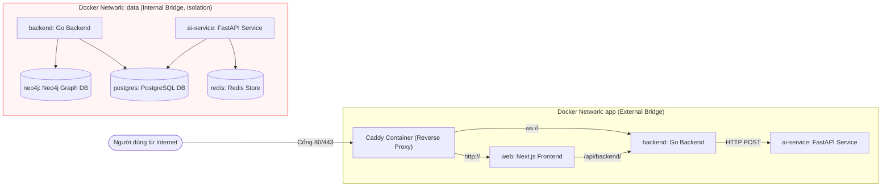

#### Giải thích sơ đồ mạng nội bộ Docker

Sơ đồ trên minh họa giải pháp an ninh mạng cấp container được thiết lập trong Docker Compose:
1. **Mạng app (Vòng ngoài):** Là mạng cầu nối (bridge) cho phép các dịch vụ web giao tiếp với nhau. Caddy có thể chuyển hướng lưu lượng đến Next.js hoặc Go Backend. Next.js có thể proxy request đến Go backend. Dịch vụ AI FastAPI cũng kết nối vào đây để Go Backend có thể gọi API.
2. **Mạng data (Vòng trong - Cô lập):** Được thiết lập với thuộc tính `internal: true`. Mạng này không có cổng kết nối ra ngoài Internet (no gateway) và cũng không thể giao tiếp với các container trong mạng khác. Chỉ có `backend` và `ai-service` được kết nối đồng thời vào cả hai mạng để làm cầu nối truy vấn. Các cơ sở dữ liệu như PostgreSQL, Redis và Neo4j hoàn toàn vô hình đối với Caddy, Next.js hay bất kỳ kẻ tấn công nào dò quét cổng từ ngoài Internet.
