# Chương 3. Xây dựng hệ thống

Chương 1 đã xác định bài toán trung tâm của đề tài: xây dựng một nền tảng quản lý quy trình xét duyệt bài báo có thể tích hợp AI mà không làm suy yếu trách nhiệm học thuật của con người. Chương 2 tiếp tục chuyển bài toán đó thành các nhu cầu cụ thể: giảm thao tác thủ công cho tác giả, hỗ trợ người phản biện đọc và kiểm tra bài hiệu quả hơn, giúp Chair kiểm soát tiến độ, phân công, xung đột lợi ích và tổng hợp quyết định. Vì vậy, Chương 3 không chỉ mô tả hệ thống đã xây dựng gồm những chức năng nào, mà còn giải thích cách các quyết định thiết kế phản hồi trực tiếp với các vấn đề đã đặt ra.

Nguyên tắc xuyên suốt của ConferenceSpace là **tách rõ ba lớp trách nhiệm**: nghiệp vụ cốt lõi, thuật toán xác định và AI hỗ trợ. Lớp nghiệp vụ chịu trách nhiệm về vòng đời hội nghị và quyền truy cập. Lớp thuật toán xác định xử lý các tác vụ cần tính nhất quán, khả năng giải thích và kiểm soát công bằng, đặc biệt là reviewer matching và phát hiện xung đột lợi ích. Lớp AI chỉ tham gia vào các tác vụ trích xuất, rà soát, tóm tắt và tổng hợp; đầu ra luôn là bằng chứng hoặc gợi ý để con người kiểm tra. Cách phân lớp này là câu trả lời thiết kế cho mối lo chính của đề tài: AI có thể giúp giảm tải, nhưng không được trở thành người ra quyết định học thuật.

---

## 3.1. Tổng quan hệ thống

ConferenceSpace là nền tảng web phục vụ toàn bộ vòng đời xét duyệt bài báo trong hội nghị khoa học: tạo và cấu hình hội nghị, mở nhận bài, nộp bản thảo, kiểm tra sơ bộ, phân công phản biện, thu thập đánh giá, rebuttal, tổng hợp phản biện và ra quyết định. Hệ thống phục vụ ba nhóm người dùng chính: **Tác giả**, **Người phản biện**, và **Chủ tọa/Đồng chủ tọa**. Ngoài ra, hệ thống còn có các tác nhân hỗ trợ như quản trị hệ thống, AI service và các tác vụ nền.

Điểm khác biệt của ConferenceSpace không nằm ở việc bổ sung AI như một tiện ích rời rạc. Mỗi workflow AI đều được gắn với một nhu cầu đã xuất hiện ở Chương 2: Submission Autofill giảm nhập liệu thủ công cho tác giả; Submission Gating phát hiện lỗi trước khi gửi chính thức; Reviewer Initial Analysis hỗ trợ người phản biện nắm bối cảnh và theo dõi điểm cần kiểm tra; Review Quality Auditor giúp kiểm soát chất lượng phản biện; Chair Decision Copilot tổng hợp bằng chứng cho Chair; Chatbot Agent hỗ trợ truy vấn thao tác và trạng thái trong phạm vi quyền truy cập.

### 3.1.1. Mô hình phân lớp của hệ thống

**Hình 3.1. Mô hình phân lớp của hệ thống ConferenceSpace**

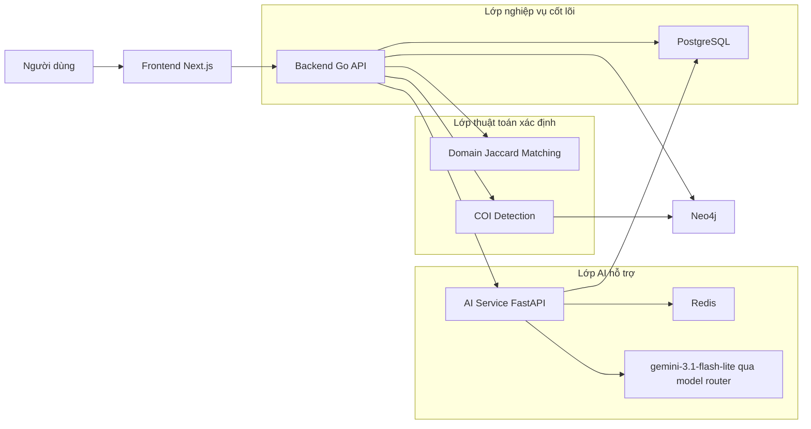
```mermaid
flowchart LR
    U["Người dùng"] --> F["Frontend Next.js"]
    F --> B["Backend Go API"]
    B --> P["PostgreSQL"]
    B --> N["Neo4j"]
    B --> A["AI Service FastAPI"]
    A --> R["Redis"]
    A --> P
    A --> L["gemini-3.1-flash-lite qua model router"]

    subgraph Core["Lớp nghiệp vụ cốt lõi"]
        B
        P
    end

    subgraph Algorithm["Lớp thuật toán xác định"]
        M["Domain Jaccard Matching"]
        C["COI Detection"]
    end

    subgraph AI["Lớp AI hỗ trợ"]
        A
        L
        R
    end

    B --> M
    B --> C
    C --> N
```

Lớp nghiệp vụ cốt lõi do backend Go đảm nhiệm. Đây là lớp xử lý các trạng thái quan trọng của hệ thống: hội nghị, track, bài nộp, phân công, phản biện, rebuttal, quyết định và quyền truy cập. Lớp này phải hoạt động ổn định ngay cả khi dịch vụ AI không khả dụng, vì vòng đời hội nghị không thể phụ thuộc hoàn toàn vào model bên ngoài.

Lớp thuật toán xác định xử lý reviewer matching và phát hiện xung đột lợi ích. Đây là các tác vụ có rủi ro công bằng cao nên cần kết quả có thể giải thích. ConferenceSpace dùng điểm tương đồng Domain Jaccard để tính mức phù hợp giữa bài nộp và reviewer, đồng thời loại các cặp có xung đột lợi ích trước khi gợi ý phân công. Chair vẫn có quyền xem, điều chỉnh và xác nhận kết quả cuối cùng.

Lớp AI hỗ trợ được tách thành dịch vụ FastAPI riêng. Dịch vụ này xử lý các workflow có đặc điểm đọc hiểu tài liệu, trích xuất metadata, tổng hợp nội dung hoặc kiểm tra chất lượng văn bản. Toàn bộ thao tác LLM trong hệ thống dùng `gemini-3.1-flash-lite` thông qua OpenRouter hoặc OpenAI-compatible model router của nhóm, nhưng cùng tuân thủ một nguyên tắc: đầu ra là bằng chứng hoặc gợi ý, không phải quyết định.

### 3.1.2. Nguyên tắc thiết kế hệ thống

Từ các yêu cầu ở Chương 2, nhóm xác định năm nguyên tắc thiết kế cho ConferenceSpace.

**Thứ nhất, platform-first.** Hệ thống phải bao phủ nghiệp vụ hội nghị trước khi nói đến AI. Nếu không có quản lý hội nghị, phân quyền, nộp bài, review, rebuttal và decision workflow đủ chặt, AI chỉ là một lớp trang trí.

**Thứ hai, AI-assistive.** AI chỉ hỗ trợ những bước có giá trị rõ: giảm thao tác nhập liệu, giảm tải đọc lại, tóm tắt bằng chứng, kiểm tra cấu trúc phản biện hoặc trả lời câu hỏi thao tác. AI không viết phản biện thay người phản biện, không phân công reviewer thay Chair, không quyết định accept/reject.

**Thứ ba, explainable-by-design.** Những kết quả ảnh hưởng đến niềm tin của người dùng phải có căn cứ. Matching cần điểm phù hợp và keyword khớp; xung đột lợi ích cần loại quan hệ và bằng chứng; workflow AI cần output có cấu trúc, chỉ ra dữ liệu đầu vào và cho phép người dùng kiểm tra.

**Thứ tư, graceful degradation.** Khi dịch vụ AI, Semantic Scholar hoặc Neo4j không khả dụng, hệ thống vẫn phải giữ được các luồng nghiệp vụ chính. Người dùng có thể nhập thủ công, Chair có thể phân công thủ công, và lỗi AI được trả về như lỗi có kiểm soát.

**Thứ năm, audit-friendly.** Các workflow quan trọng cần lưu trạng thái, thời gian xử lý, fingerprint hoặc artifact đủ để đánh giá ở Chương 4. Điều này đặc biệt quan trọng với AI vì chỉ có thể bảo vệ chất lượng đầu ra khi có dữ liệu kiểm chứng.

### 3.1.3. Lựa chọn công nghệ ở mức tổng quan

Các công nghệ trong ConferenceSpace được chọn để phục vụ kiến trúc có ranh giới rõ, không phải để tạo một danh sách thư viện. Frontend dùng Next.js App Router, React và TypeScript vì giao diện phải tổ chức nhiều khu vực nghiệp vụ theo vai trò, nhiều form có trạng thái phức tạp và nhiều API contract cần được kiểm soát sớm [1][2][3]. Backend dùng Go và Gin vì lớp nghiệp vụ cần hiệu năng tốt, concurrency đơn giản cho các tác vụ I/O, routing rõ và triển khai thành binary gọn [6][7].

PostgreSQL là nguồn dữ liệu nghiệp vụ chính vì dữ liệu hội nghị có quan hệ và ràng buộc giao dịch rõ. JSONB được dùng cho các artifact hoặc cấu hình bán cấu trúc, nhưng không thay thế mô hình quan hệ cốt lõi [8]. Neo4j được dùng cho bài toán xung đột lợi ích dạng graph, nơi cần truy vấn đường đi đồng tác giả nhiều bậc [9]. Redis giữ cache, session và runtime state ngắn hạn [10]. AI service dùng FastAPI/Pydantic vì workflow AI cần endpoint async, schema validation và OpenAPI contract rõ [12][13].

Ở lớp vận hành, Docker Compose mô tả topology production nhiều service, Caddy làm reverse proxy và tự động HTTPS, GitHub Actions build/push container image lên GitHub Container Registry rồi triển khai lên VPS [17][18][19][20][21]. Các lựa chọn này giúp hệ thống có thể tái lập triển khai thay vì chỉ chạy được trên máy thành viên nhóm.

---

## 3.2. Use Case

### 3.2.1. Tác nhân hệ thống

**Tác giả** sử dụng hệ thống để tìm hội nghị, xem track và hạn chót, nộp bài, khai báo xung đột lợi ích, chỉnh sửa bản thảo trước deadline, xem phản biện và gửi rebuttal. Đây là nhóm chịu ảnh hưởng trực tiếp của các vấn đề nhập liệu dài, chọn track khó và thiếu kiểm tra lỗi sớm.

**Người phản biện** nhận lời mời, xem bài được phân công, đọc bản thảo, nhập điểm và nhận xét, lưu nháp, gửi phản biện và xem rebuttal khi có. Với nhóm này, AI không được dùng để thay thế việc đọc bài. Vai trò hợp lý của AI là cung cấp tóm tắt trung lập, điểm cần kiểm tra và cảnh báo chất lượng bản nháp review để giảm thao tác rà soát thủ công.

**Chủ tọa/Đồng chủ tọa** cấu hình hội nghị, track, deadline, biểu mẫu phản biện, mời reviewer, kiểm tra xung đột lợi ích, xác nhận phân công, theo dõi tiến độ và đưa ra quyết định cuối cùng. Đây là nhóm cần cả công cụ thuật toán và AI: thuật toán để có matching minh bạch, AI để tổng hợp nhiều nguồn phản biện và phát hiện rủi ro chất lượng.

**Quản trị hệ thống** chịu trách nhiệm vận hành, cấu hình và khắc phục sự cố. Các thao tác này không đại diện cho người dùng học thuật thông thường và được kiểm soát bằng cơ chế xác thực riêng.

**Tác nhân hệ thống** gồm AI service, các job nền và các service bên ngoài. AI service có thể gọi backend qua service token trong phạm vi được phép; các job nền xử lý trạng thái quá hạn hoặc đồng bộ dữ liệu.

### 3.2.2. Các use case chính

**Hình 3.2. Use case tổng quát theo vai trò**

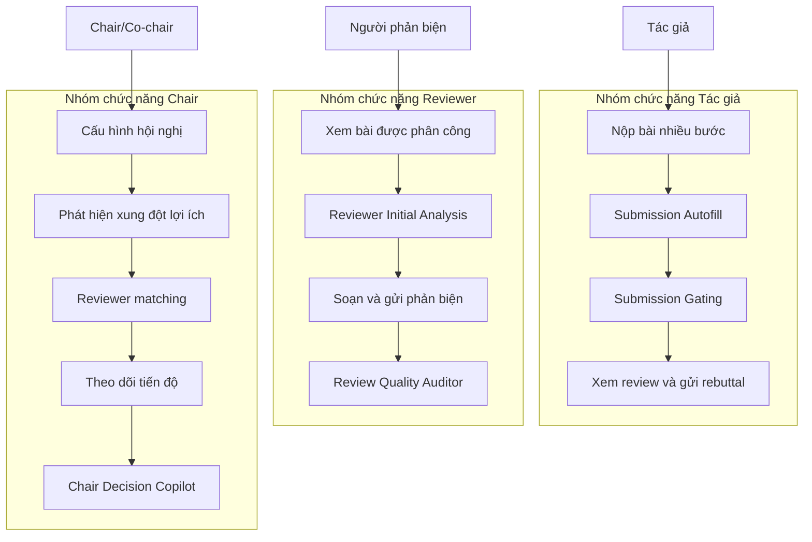
```mermaid
flowchart TD
    Author["Tác giả"]
    Reviewer["Người phản biện"]
    Chair["Chair/Co-chair"]

    subgraph A["Nhóm chức năng Tác giả"]
        A1["Nộp bài nhiều bước"]
        A2["Submission Autofill"]
        A3["Submission Gating"]
        A4["Xem review và gửi rebuttal"]
    end

    subgraph R["Nhóm chức năng Reviewer"]
        R1["Xem bài được phân công"]
        R2["Reviewer Initial Analysis"]
        R3["Soạn và gửi phản biện"]
        R4["Review Quality Auditor"]
    end

    subgraph C["Nhóm chức năng Chair"]
        C1["Cấu hình hội nghị"]
        C2["Phát hiện xung đột lợi ích"]
        C3["Reviewer matching"]
        C4["Theo dõi tiến độ"]
        C5["Chair Decision Copilot"]
    end

    Author --> A1 --> A2 --> A3 --> A4
    Reviewer --> R1 --> R2 --> R3 --> R4
    Chair --> C1 --> C2 --> C3 --> C4 --> C5
```

Các use case trên phản ánh trực tiếp ma trận truy vết ở Chương 2. Luồng của tác giả tập trung vào giảm thao tác thủ công và giảm lỗi trước khi gửi. Luồng của reviewer tập trung vào hỗ trợ đọc, ghi chú và bảo đảm bản phản biện đủ căn cứ. Luồng của Chair tập trung vào kiểm soát rủi ro hệ thống: xung đột lợi ích, tải phản biện, tiến độ và tổng hợp bằng chứng ra quyết định.

### 3.2.3. Đặc tả use case quan trọng

#### UC-01. Nộp bài với Submission Autofill

**Mục tiêu.** Tác giả hoàn thành bản nháp nộp bài với metadata được trích xuất từ bản thảo, trong đó hệ thống có thể gợi ý track dựa trên ngữ cảnh hội nghị.

**Điều kiện tiên quyết.** Tác giả đã đăng nhập; hội nghị đang mở nhận bài; danh sách track của hội nghị đã được cấu hình; file bản thảo có thể đọc được.

**Hình 3.3. Luồng nộp bài với Submission Autofill**

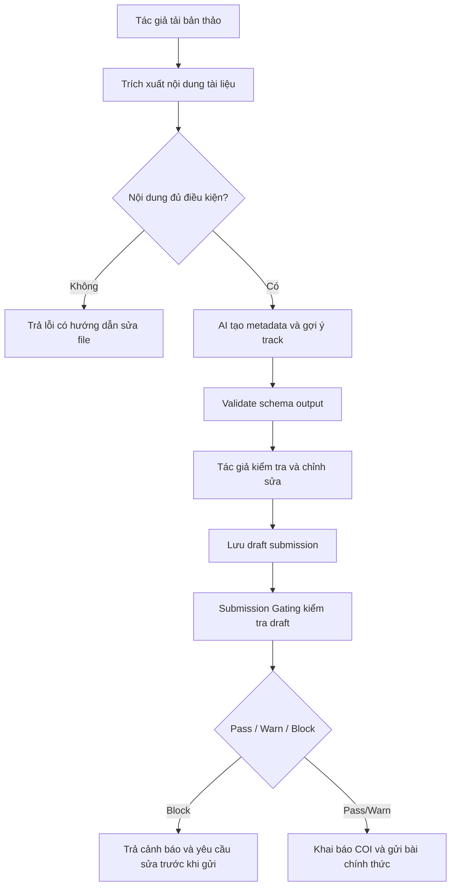
```mermaid
flowchart TD
    A["Tác giả tải bản thảo"] --> B["Trích xuất nội dung tài liệu"]
    B --> C{"Nội dung đủ điều kiện?"}
    C -- "Không" --> D["Trả lỗi có hướng dẫn sửa file"]
    C -- "Có" --> E["AI tạo metadata và gợi ý track"]
    E --> F["Validate schema output"]
    F --> G["Tác giả kiểm tra và chỉnh sửa"]
    G --> H["Lưu draft submission"]
    H --> I["Submission Gating kiểm tra draft"]
    I --> J{"Pass / Warn / Block"}
    J -- "Block" --> K["Trả cảnh báo và yêu cầu sửa trước khi gửi"]
    J -- "Pass/Warn" --> L["Khai báo COI và gửi bài chính thức"]
```

Workflow này không tự động gửi bài thay tác giả. Output từ AI chỉ là bản nháp gồm tiêu đề, tóm tắt, keyword, thông tin liên quan và gợi ý track phù hợp với danh sách track của hội nghị. Tác giả vẫn phải xem lại, chỉnh sửa và xác nhận trước khi gửi. Trước khi submission được gửi chính thức, Submission Gating đóng vai trò như một lớp kiểm tra draft ở cổng nộp bài: hệ thống có thể cảnh báo hoặc chặn các bản nộp không đáp ứng policy/hình thức rõ ràng, nhưng không đưa ra kết luận học thuật thay Chair hoặc reviewer. Thiết kế này giải quyết vấn đề biểu mẫu dài và phát hiện lỗi muộn ở Chương 2 nhưng vẫn giữ quyền kiểm soát của người dùng.

Các trường hợp lỗi được xử lý rõ: nếu file không đọc được, text extraction thấp hoặc dữ liệu không đủ căn cứ, workflow trả lỗi thay vì tạo metadata thiếu cơ sở. Đây là điểm quan trọng vì một hệ thống AI trong bối cảnh học thuật không được “đoán cho đủ form” khi bản thảo đầu vào không đủ tin cậy.

#### UC-02. Phân công phản biện có kiểm tra xung đột lợi ích

**Mục tiêu.** Chair nhận được gợi ý phân công reviewer có điểm phù hợp, không vi phạm xung đột lợi ích và có thể kiểm tra/ghi đè trước khi lưu.

**Điều kiện tiên quyết.** Hội nghị có bài nộp hợp lệ; reviewer đã được mời hoặc đăng ký; dữ liệu domain/keyword và thông tin xung đột lợi ích đủ để tính toán.

**Hình 3.4. Luồng reviewer matching và xung đột lợi ích**

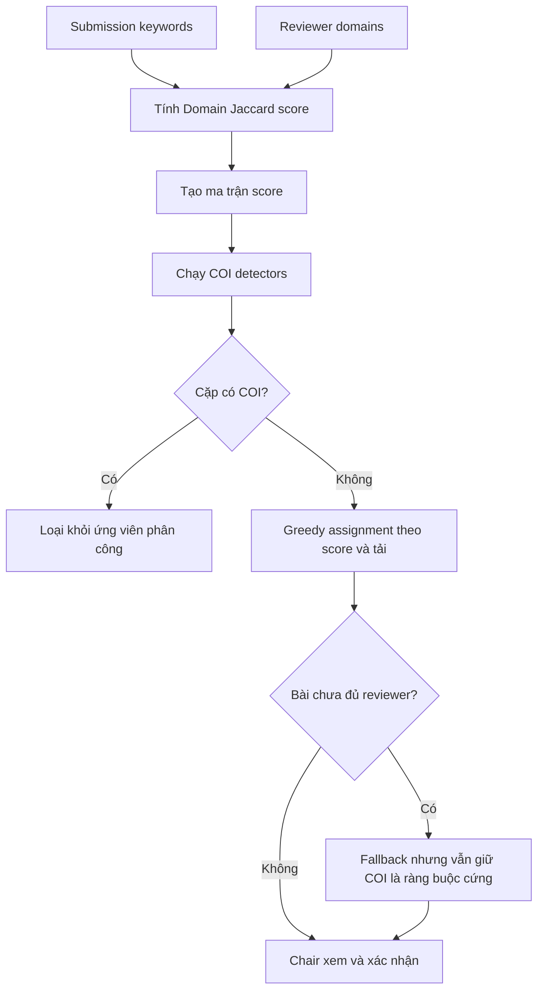
```mermaid
flowchart TD
    A["Submission keywords"] --> C["Tính Domain Jaccard score"]
    B["Reviewer domains"] --> C
    C --> D["Tạo ma trận score"]
    D --> E["Chạy COI detectors"]
    E --> F{"Cặp có COI?"}
    F -- "Có" --> G["Loại khỏi ứng viên phân công"]
    F -- "Không" --> H["Greedy assignment theo score và tải"]
    H --> I{"Bài chưa đủ reviewer?"}
    I -- "Có" --> J["Fallback nhưng vẫn giữ COI là ràng buộc cứng"]
    I -- "Không" --> K["Chair xem và xác nhận"]
    J --> K
```

Điểm phù hợp giữa bài và reviewer được tính bằng Jaccard similarity trên tập keyword/domain:

```text
score = |submission_keywords ∩ reviewer_domains| / |submission_keywords ∪ reviewer_domains|
```

Sau đó, thuật toán greedy sắp xếp các cặp theo điểm giảm dần và gán reviewer theo các ràng buộc: không có xung đột lợi ích, không vượt tải reviewer, không vượt số reviewer tối đa mỗi bài và đạt ngưỡng điểm tối thiểu nếu có. Nếu một bài chưa có reviewer nào, fallback pass có thể nới ràng buộc tải hoặc ngưỡng điểm, nhưng **không nới xung đột lợi ích**. Điều này giúp hệ thống ưu tiên tính toàn vẹn học thuật hơn việc lấp đầy phân công bằng mọi giá.

#### UC-03. Reviewer Initial Analysis và Review Quality Auditor

**Mục tiêu.** Người phản biện nhận được hỗ trợ đọc ban đầu và kiểm tra chất lượng bản nháp review, nhưng vẫn giữ trách nhiệm đọc bài và viết phản biện.

**Hình 3.5. Luồng hỗ trợ người phản biện**

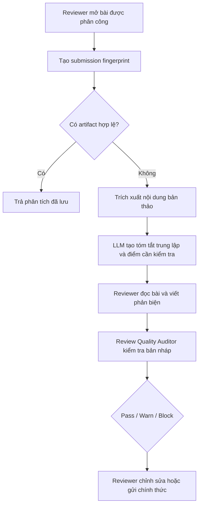
```mermaid
flowchart TD
    A["Reviewer mở bài được phân công"] --> B["Tạo submission fingerprint"]
    B --> C{"Có artifact hợp lệ?"}
    C -- "Có" --> D["Trả phân tích đã lưu"]
    C -- "Không" --> E["Trích xuất nội dung bản thảo"]
    E --> F["LLM tạo tóm tắt trung lập và điểm cần kiểm tra"]
    F --> G["Reviewer đọc bài và viết phản biện"]
    G --> H["Review Quality Auditor kiểm tra bản nháp"]
    H --> I{"Pass / Warn / Block"}
    I --> J["Reviewer chỉnh sửa hoặc gửi chính thức"]
```

Reviewer Initial Analysis không phải là bản review tự động. Nó chỉ cung cấp bối cảnh đọc ban đầu: tóm tắt trung lập, đóng góp chính, điểm cần kiểm tra và câu hỏi nên chú ý. Luận điểm thiết kế ở đây là AI có thể giảm số lần reviewer phải đọc lại toàn bộ bài chỉ để truy vết các điểm cần chú ý, từ đó giúp reviewer tập trung vào phần quan trọng hơn của phản biện chuyên môn.

Review Quality Auditor kiểm tra bản nháp review theo rubric: mức độ đầy đủ, tính cụ thể, sự nhất quán giữa điểm và nhận xét, khả năng thiếu căn cứ hoặc quá ngắn. Auditor có thể trả trạng thái `pass`, `warn` hoặc `block`, nhưng không đánh giá thay reviewer về đúng/sai chuyên môn của bài báo.

#### UC-04. Chair Decision Copilot

**Mục tiêu.** Chair nhận được bản tổng hợp có cấu trúc từ các review, rebuttal và thảo luận nội bộ để ra quyết định có căn cứ hơn.

**Hình 3.6. Luồng Chair Decision Copilot**

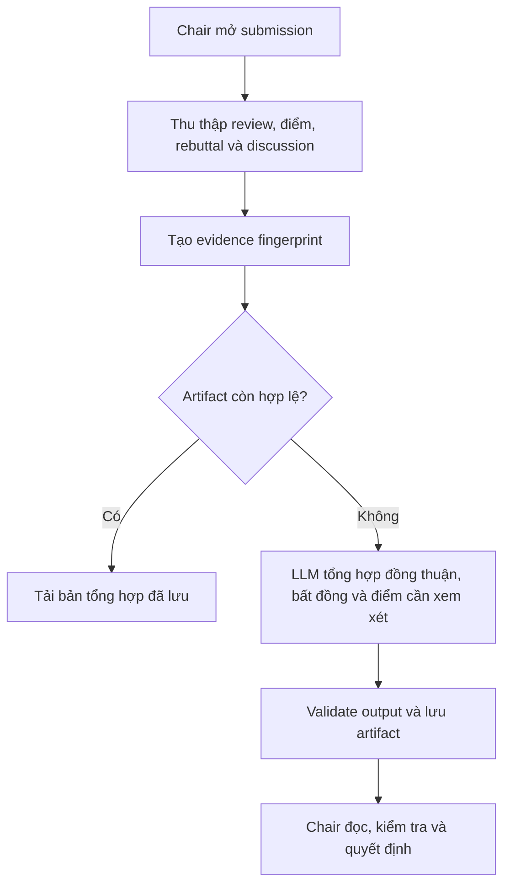
```mermaid
flowchart TD
    A["Chair mở submission"] --> B["Thu thập review, điểm, rebuttal và discussion"]
    B --> C["Tạo evidence fingerprint"]
    C --> D{"Artifact còn hợp lệ?"}
    D -- "Có" --> E["Tải bản tổng hợp đã lưu"]
    D -- "Không" --> F["LLM tổng hợp đồng thuận, bất đồng và điểm cần xem xét"]
    F --> G["Validate output và lưu artifact"]
    G --> H["Chair đọc, kiểm tra và quyết định"]
```

Copilot không sinh quyết định accept/reject và không đưa ra kết luận thay Chair. Output tập trung vào bằng chứng: reviewer nào đồng thuận, reviewer nào bất đồng, rebuttal có trả lời được điểm nào, còn vấn đề nào chưa được giải quyết. Đây là ranh giới quan trọng để tránh tạo áp lực vô hình lên quyết định cuối cùng.

---

## 3.3. Thiết kế kỹ thuật

### 3.3.1. Kiến trúc tổng thể

ConferenceSpace được triển khai như một hệ thống nhiều service ở mức vận hành, nhưng backend nghiệp vụ chính vẫn được giữ theo hướng monolith phân lớp. Quyết định này giúp hệ thống tránh độ phức tạp không cần thiết của microservices, đồng thời vẫn cô lập được AI service, data stores và gateway.

Các thành phần chính gồm:

- **Frontend Next.js**: giao diện cho người dùng theo vai trò, route dashboard, form nộp bài, form review và màn hình Chair.
- **Backend Go/Gin**: API nghiệp vụ, phân quyền, validation, matching, xung đột lợi ích, review workflow, notification và tích hợp service ngoài.
- **AI Service FastAPI**: thực thi các workflow AI, validate input/output bằng Pydantic, gọi model qua LLM client/model router.
- **PostgreSQL**: lưu dữ liệu nghiệp vụ bền vững và artifact cần truy vết.
- **Redis**: lưu session, cache, runtime state và tool result ngắn hạn.
- **Neo4j**: lưu/truy vấn quan hệ học thuật phục vụ phát hiện xung đột lợi ích.
- **Caddy và Docker Compose**: gateway, network boundary và triển khai production.

Backend là ranh giới nghiệp vụ chính. Frontend không gọi trực tiếp database hoặc AI provider; AI service không tự ý truy cập toàn bộ dữ liệu nghiệp vụ ngoài các repository/query endpoint được kiểm soát. Cách tổ chức này giúp giảm rủi ro lộ dữ liệu bản thảo khi đưa AI vào hệ thống.

**Hình 3.7. Kiến trúc service và ranh giới dữ liệu**

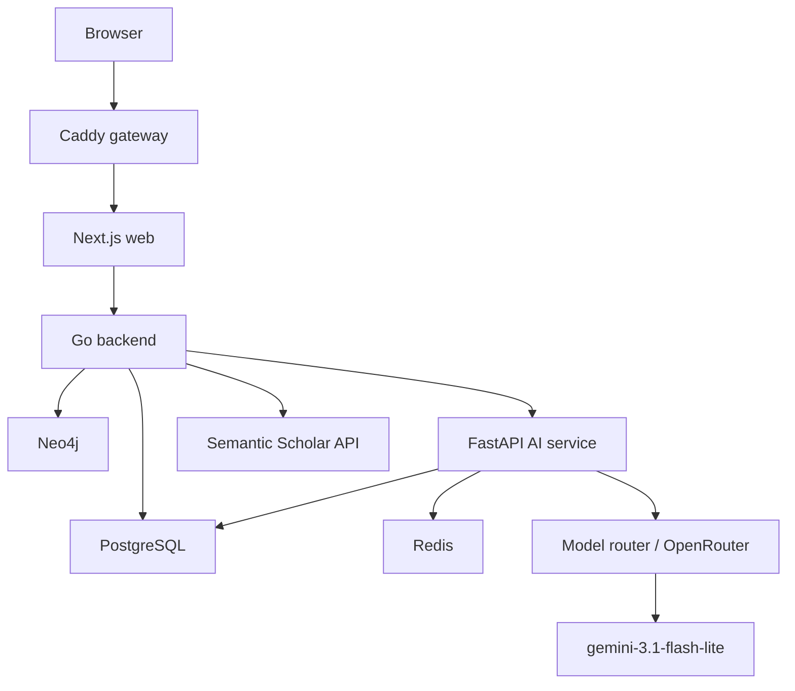
```mermaid
flowchart TD
    Browser["Browser"] --> Caddy["Caddy gateway"]
    Caddy --> Web["Next.js web"]
    Web --> Backend["Go backend"]
    Backend --> Postgres["PostgreSQL"]
    Backend --> Neo4j["Neo4j"]
    Backend --> AI["FastAPI AI service"]
    AI --> Redis["Redis"]
    AI --> Postgres
    Backend --> Scholar["Semantic Scholar API"]
    AI --> Router["Model router / OpenRouter"]
    Router --> Gemini["gemini-3.1-flash-lite"]
```

### 3.3.2. Thiết kế frontend và trải nghiệm theo vai trò

Frontend của ConferenceSpace được xây dựng bằng Next.js App Router, React và TypeScript. Cấu trúc route bám theo không gian làm việc của từng vai trò: tác giả cần luồng nộp bài nhiều bước, reviewer cần workspace đọc bài và soạn review, Chair cần dashboard có khả năng quét nhanh trạng thái hội nghị.

UI sử dụng Radix UI và Tailwind CSS để chuẩn hóa các primitive tương tác như dialog, select, tabs, tooltip và menu [4][5]. Giá trị của lựa chọn này nằm ở tính nhất quán: các luồng phức tạp được chia thành bước rõ, trạng thái quan trọng được hiển thị bằng bảng và badge, còn các hành động nguy cơ cao như gửi bài hoặc quyết định cuối cùng cần có bước xác nhận.

**Hình 3.8. Tổ chức frontend theo vai trò**

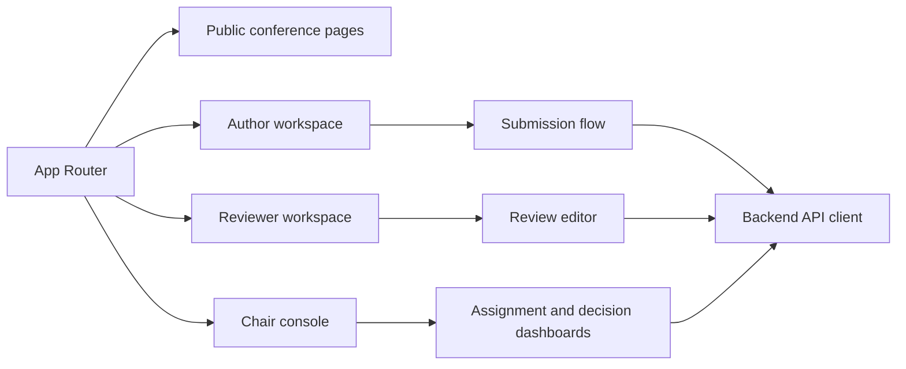
```mermaid
flowchart LR
    A["App Router"] --> B["Public conference pages"]
    A --> C["Author workspace"]
    A --> D["Reviewer workspace"]
    A --> E["Chair console"]
    C --> F["Submission flow"]
    D --> G["Review editor"]
    E --> H["Assignment and decision dashboards"]
    F --> I["Backend API client"]
    G --> I
    H --> I
```

Frontend cũng đóng vai trò kiểm soát trải nghiệm AI. Kết quả AI không được trình bày như kết luận cuối cùng, mà như bản nháp, cảnh báo hoặc bằng chứng cần kiểm tra. Ví dụ, gợi ý track trong Submission Autofill hiển thị để tác giả chọn/chỉnh sửa; Reviewer Initial Analysis hiển thị như briefing đọc bài; Chair Decision Copilot hiển thị như bản tổng hợp cần Chair đối chiếu với review gốc.

### 3.3.3. Thiết kế backend, API và phân quyền

Backend được tổ chức theo các module có trách nhiệm rõ trong `backend/internal/`. Tầng controller tiếp nhận HTTP request và chuyển về service; tầng service chứa logic nghiệp vụ; tầng storage/repository làm việc với PostgreSQL; tầng clients bọc các tích hợp bên ngoài như AI service, Neo4j, Semantic Scholar và email.

**Hình 3.9. Phụ thuộc các tầng trong Go backend**

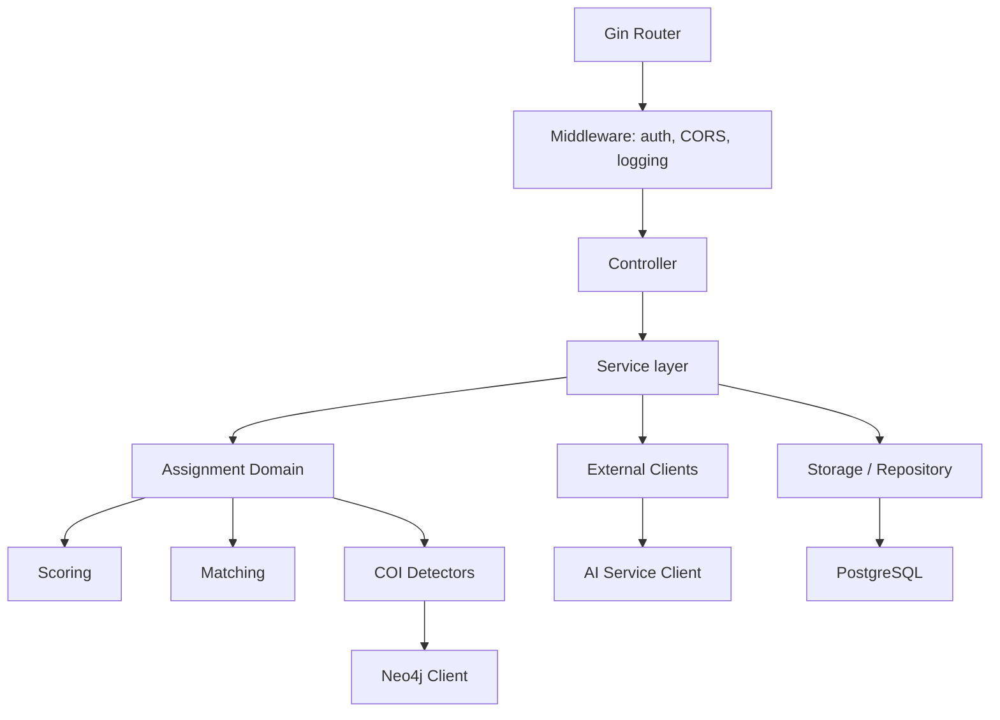
```mermaid
flowchart TD
    R["Gin Router"] --> M["Middleware: auth, CORS, logging"]
    M --> C["Controller"]
    C --> S["Service layer"]
    S --> ST["Storage / Repository"]
    S --> CL["External Clients"]
    S --> AS["Assignment Domain"]
    AS --> SC["Scoring"]
    AS --> MT["Matching"]
    AS --> COI["COI Detectors"]
    COI --> N["Neo4j Client"]
    CL --> AI["AI Service Client"]
    ST --> P["PostgreSQL"]
```

Luồng phụ thuộc được giữ một chiều để tránh controller chứa logic nghiệp vụ hoặc service phụ thuộc ngược vào framework HTTP. Assignment được tách thành domain riêng vì matching và phát hiện xung đột lợi ích có logic đủ quan trọng để cần kiểm thử, giải thích và đánh giá độc lập ở Chương 4.

Phân quyền được thiết kế theo vai trò trong từng hội nghị, không theo quyền toàn cục. Cùng một người dùng có thể là tác giả ở hội nghị này, reviewer ở hội nghị khác và Chair ở một hội nghị khác nữa. Vì vậy, mỗi request cần xét cả danh tính người dùng và vai trò của họ trong tài nguyên cụ thể.

Ngoài JWT Bearer token cho người dùng cuối, hệ thống có hai header phục vụ vận hành và tích hợp service: `X-Admin-Token` cho tác vụ quản trị nội bộ và `X-Agent-Service-Token` cho AI service khi cần gọi backend query endpoint. Thiết kế này giúp tách quyền người dùng cuối khỏi quyền service-to-service, tránh để AI service truy cập dữ liệu vượt phạm vi được phép.

### 3.3.4. Thiết kế dữ liệu

Thiết kế dữ liệu của ConferenceSpace không chỉ trả lời câu hỏi "lưu ở đâu", mà còn xác định mỗi loại dữ liệu chịu trách nhiệm cho phần nào trong quy trình học thuật. Cách tổ chức này giúp hệ thống giữ được ba nguyên tắc đã đặt ra từ Chương 1 và Chương 2: nghiệp vụ cốt lõi phải nhất quán, các cảnh báo rủi ro phải có bằng chứng kiểm tra được, và đầu ra AI phải có khả năng truy vết thay vì trở thành kết luận mơ hồ.

Nhóm thứ nhất là **dữ liệu nghiệp vụ quan hệ**. Các thực thể như `users`, `conferences`, `conference_user_roles`, `conference_submissions`, `paper_assignments`, `rebuttal_points`, `discussion_threads`, `discussion_messages` và `notifications` mô tả vòng đời chính của một hội nghị. Trong nhóm này, `paper_assignments` là thực thể trung tâm vì nó nối submission với reviewer, đồng thời lưu trạng thái phân công, điểm matching, trạng thái review, nội dung review có cấu trúc và metadata audit. Nhờ vậy, hệ thống không tách rời "gợi ý phân công" khỏi quá trình review thật sự.

Nhóm thứ hai là **dữ liệu quan hệ học thuật và xung đột lợi ích**. ConferenceSpace lưu cache hồ sơ học thuật qua `scholar_profiles`, `scholar_papers`, `scholar_profile_papers` và `semantic_scholar_cache`, đồng thời lưu kết quả phát hiện xung đột lợi ích trong `coi_relationships`. Với `coi_relationships`, mỗi cảnh báo không chỉ là một cờ boolean mà có loại quan hệ, mức độ nghiêm trọng, nguồn phát hiện và bằng chứng đi kèm. Phần graph trong Neo4j dùng để mô hình hóa quan hệ đồng tác giả giữa các tác giả/reviewer, sau đó kết quả có ý nghĩa nghiệp vụ được đồng bộ về PostgreSQL để Chair kiểm tra trong cùng luồng phân công.

Nhóm thứ ba là **dữ liệu AI và trạng thái vận hành**. Các workflow AI không được xem là hộp đen tách khỏi hệ thống chính. Schema `ai` lưu session hội thoại, message, tool audit, các run của Submission Gating, Reviewer Initial Analysis, Review Quality Audit và Chair Decision Copilot, cùng artifact JSON, fingerprint, trạng thái, thời điểm tạo và bản ghi theo từng stage. Thiết kế này cho phép hệ thống biết một artifact được sinh từ submission/assignment nào, theo trạng thái dữ liệu nào và có còn hợp lệ hay không. Đây cũng là nền để Chương 4 đánh giá workflow AI bằng input/output, timing và failure case, thay vì chỉ dựa vào cảm nhận người dùng.

| Nhóm dữ liệu | Thực thể tiêu biểu | Vai trò trong thiết kế |
|---|---|---|
| Nghiệp vụ hội nghị | `conferences`, `conference_submissions`, `paper_assignments`, `rebuttal_points` | Bảo toàn vòng đời submission-review-rebuttal và các ràng buộc giao dịch |
| Phân quyền và phối hợp | `users`, `conference_user_roles`, `discussion_threads`, `notifications` | Đảm bảo mỗi vai trò chỉ thao tác trong phạm vi được phép và nhận đúng tín hiệu vận hành |
| Học thuật và COI | `scholar_profiles`, `scholar_papers`, `coi_relationships`, Neo4j co-author graph | Phát hiện quan hệ rủi ro và cung cấp bằng chứng để Chair kiểm tra |
| AI artifact và audit | `ai.*_runs`, `ai.*_artifacts`, `ai.*_stage_records`, `ai_tool_audit` | Truy vết đầu vào, đầu ra, trạng thái và lỗi của các workflow AI |

**Hình 3.10. Mô hình dữ liệu nghiệp vụ cốt lõi**

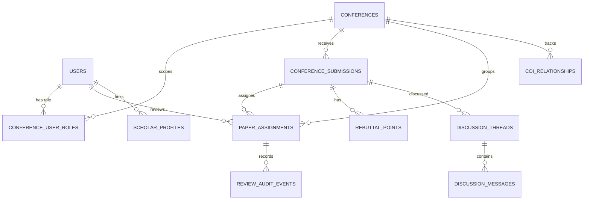
```mermaid
erDiagram
    USERS ||--o{ CONFERENCE_USER_ROLES : "has role"
    CONFERENCES ||--o{ CONFERENCE_USER_ROLES : "scopes"
    CONFERENCES ||--o{ CONFERENCE_SUBMISSIONS : "receives"
    CONFERENCES ||--o{ PAPER_ASSIGNMENTS : "groups"
    CONFERENCE_SUBMISSIONS ||--o{ PAPER_ASSIGNMENTS : "assigned"
    USERS ||--o{ PAPER_ASSIGNMENTS : "reviews"
    PAPER_ASSIGNMENTS ||--o{ REVIEW_AUDIT_EVENTS : "records"
    CONFERENCE_SUBMISSIONS ||--o{ REBUTTAL_POINTS : "has"
    CONFERENCE_SUBMISSIONS ||--o{ DISCUSSION_THREADS : "discussed"
    DISCUSSION_THREADS ||--o{ DISCUSSION_MESSAGES : "contains"
    CONFERENCES ||--o{ COI_RELATIONSHIPS : "tracks"
    USERS ||--o{ SCHOLAR_PROFILES : "links"
```

**Hình 3.11. Dữ liệu COI từ graph đến bằng chứng nghiệp vụ**

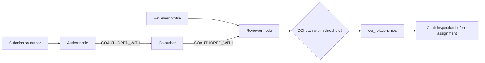
```mermaid
flowchart LR
    S["Submission author"] --> A["Author node"]
    R["Reviewer profile"] --> B["Reviewer node"]
    A -- "COAUTHORED_WITH" --> C["Co-author"]
    C -- "COAUTHORED_WITH" --> B
    B --> D{"COI path within threshold?"}
    D --> E["coi_relationships"]
    E --> F["Chair inspection before assignment"]
```

**Hình 3.12. Truy vết dữ liệu AI trong hệ thống**

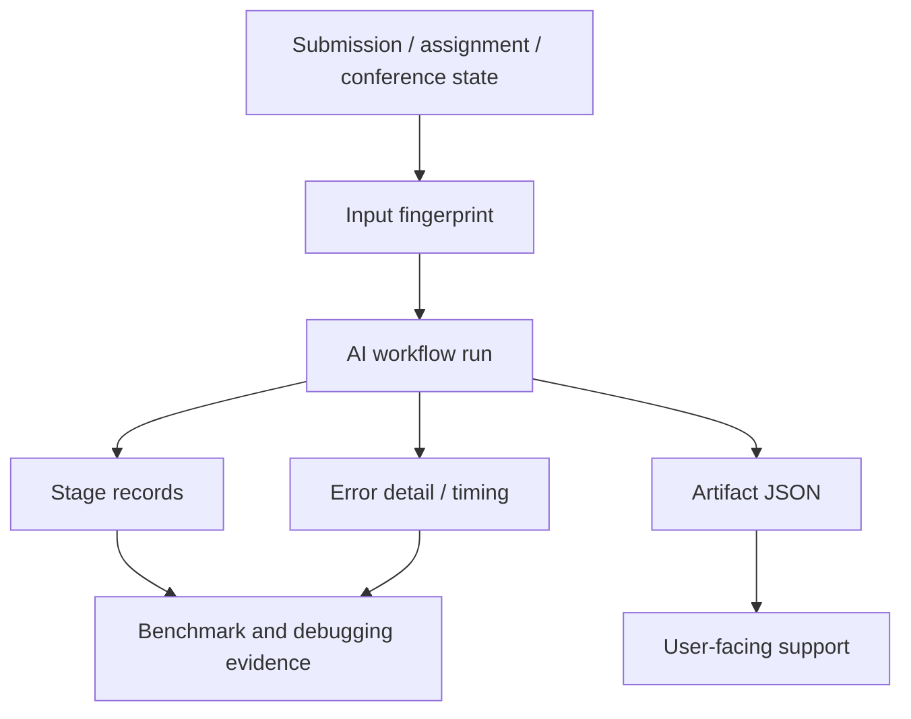
```mermaid
flowchart TD
    A["Submission / assignment / conference state"] --> B["Input fingerprint"]
    B --> C["AI workflow run"]
    C --> D["Stage records"]
    C --> E["Artifact JSON"]
    C --> F["Error detail / timing"]
    E --> G["User-facing support"]
    D --> H["Benchmark and debugging evidence"]
    F --> H
```

Điểm quan trọng của thiết kế trên là dữ liệu AI luôn gắn với dữ liệu nghiệp vụ cụ thể. Ví dụ, Reviewer Initial Analysis gắn với `assignment_id` và `submission_id`, Review Quality Audit gắn với bản review đang được lưu trong `paper_assignments`, còn Chair Decision Copilot gắn với submission và evidence fingerprint tại thời điểm sinh gợi ý. Vì vậy, khi submission, review hoặc rebuttal thay đổi, hệ thống có cơ sở để xác định artifact cũ có còn phù hợp hay cần sinh lại.

### 3.3.5. Luồng xử lý hệ thống

#### Luồng nộp bài có AI hỗ trợ

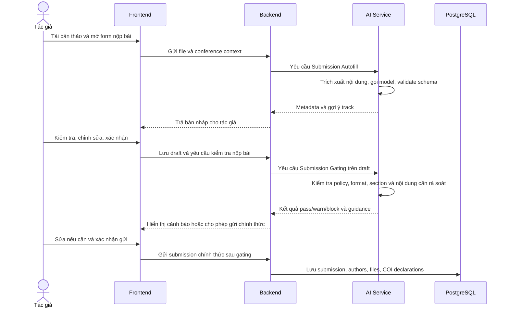
```mermaid
sequenceDiagram
    actor Author as Tác giả
    participant FE as Frontend
    participant BE as Backend
    participant AI as AI Service
    participant DB as PostgreSQL

    Author->>FE: Tải bản thảo và mở form nộp bài
    FE->>BE: Gửi file và conference context
    BE->>AI: Yêu cầu Submission Autofill
    AI->>AI: Trích xuất nội dung, gọi model, validate schema
    AI-->>BE: Metadata và gợi ý track
    BE-->>FE: Trả bản nháp cho tác giả
    Author->>FE: Kiểm tra, chỉnh sửa, xác nhận
    FE->>BE: Lưu draft và yêu cầu kiểm tra nộp bài
    BE->>AI: Yêu cầu Submission Gating trên draft
    AI->>AI: Kiểm tra policy, format, section và nội dung cần rà soát
    AI-->>BE: Kết quả pass/warn/block và guidance
    BE-->>FE: Hiển thị cảnh báo hoặc cho phép gửi chính thức
    Author->>FE: Sửa nếu cần và xác nhận gửi
    FE->>BE: Gửi submission chính thức sau gating
    BE->>DB: Lưu submission, authors, files, COI declarations
```

Luồng này thể hiện đúng ranh giới trách nhiệm: AI giúp tạo bản nháp và kiểm tra draft ở cổng nộp bài, backend giữ quyền ghi dữ liệu chính thức, tác giả xác nhận trước khi lưu. Submission Gating đóng vai trò tương tự desk reject ở tầng nộp draft đối với lỗi policy/hình thức hoặc dấu hiệu cần rà soát, nhưng không thay thế đánh giá học thuật sau khi bài được phân công phản biện. Nếu AI lỗi, form thủ công và quy trình nộp bài cơ bản vẫn phải hoạt động.

#### Luồng agent truy vấn dữ liệu hệ thống

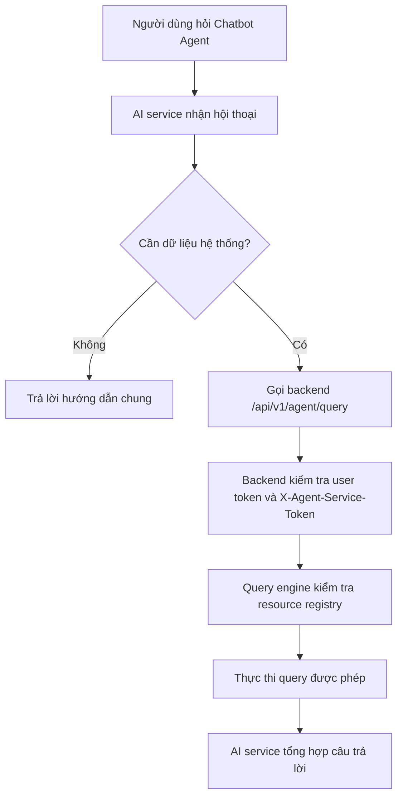
```mermaid
flowchart TD
    A["Người dùng hỏi Chatbot Agent"] --> B["AI service nhận hội thoại"]
    B --> C{"Cần dữ liệu hệ thống?"}
    C -- "Không" --> D["Trả lời hướng dẫn chung"]
    C -- "Có" --> E["Gọi backend /api/v1/agent/query"]
    E --> F["Backend kiểm tra user token và X-Agent-Service-Token"]
    F --> G["Query engine kiểm tra resource registry"]
    G --> H["Thực thi query được phép"]
    H --> I["AI service tổng hợp câu trả lời"]
```

Chatbot Agent không được truy vấn database tùy ý. Mọi truy vấn đều đi qua backend query engine và resource registry, nhờ đó quyền truy cập dữ liệu vẫn nằm dưới kiểm soát của backend nghiệp vụ.

---

## 3.4. Cơ chế nghiệp vụ và thuật toán xác định

### 3.4.1. Vai trò của các cơ chế xác định

Không phải mọi chức năng thông minh trong ConferenceSpace đều cần AI. Một số tác vụ cần tính quyết định, khả năng giải thích và kết quả lặp lại ổn định hơn là khả năng sinh ngôn ngữ. Vì vậy, hệ thống tách riêng các cơ chế nghiệp vụ và thuật toán xác định khỏi lớp AI.

Nhóm cơ chế này gồm reviewer matching, phát hiện xung đột lợi ích, kiểm tra trạng thái hội nghị, kiểm soát deadline, phân quyền theo vai trò, notification routing và một số kiểm tra hợp lệ của submission/review. Điểm chung của chúng là: cùng một đầu vào phải cho cùng một kết quả; khi có lỗi, hệ thống phải chỉ ra nguyên nhân cụ thể; người dùng có thẩm quyền có thể kiểm tra và ghi đè trong phạm vi nghiệp vụ.

### 3.4.2. Reviewer matching

Reviewer matching được triển khai như một thuật toán xác định dựa trên Domain Jaccard Similarity và greedy assignment. Đầu vào gồm keyword/domain của bài nộp, domain của reviewer, tải phản biện hiện tại, cấu hình số reviewer mỗi bài và các cặp bị loại do xung đột lợi ích.

**Hình 3.13. Pipeline reviewer matching**

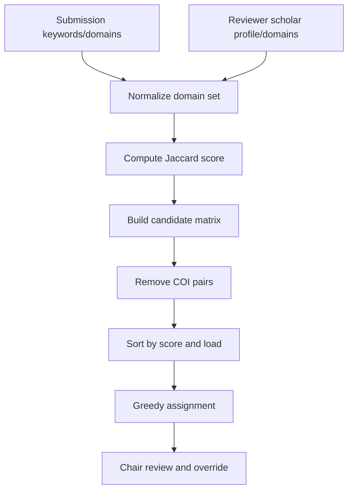
```mermaid
flowchart TD
    A["Submission keywords/domains"] --> B["Normalize domain set"]
    C["Reviewer scholar profile/domains"] --> B
    B --> D["Compute Jaccard score"]
    D --> E["Build candidate matrix"]
    E --> F["Remove COI pairs"]
    F --> G["Sort by score and load"]
    G --> H["Greedy assignment"]
    H --> I["Chair review and override"]
```

Thuật toán này không cố gắng mô phỏng toàn bộ quyết định của Chair. Nó cung cấp một danh sách ứng viên có điểm phù hợp và lý do đủ rõ để Chair kiểm tra. Đây là cách cân bằng giữa tự động hóa và trách nhiệm học thuật: hệ thống giảm công tìm kiếm thủ công, nhưng quyết định phân công vẫn thuộc về Chair.

### 3.4.3. Phát hiện xung đột lợi ích

Phát hiện xung đột lợi ích được triển khai theo nhiều lớp:

1. **Self-author detector** phát hiện trường hợp reviewer là tác giả hoặc đồng tác giả của bài.
2. **Declared-conflict detector** sử dụng khai báo thủ công từ tác giả, reviewer hoặc Chair.
3. **Co-author graph detector** sử dụng Neo4j để truy vấn quan hệ đồng tác giả nhiều bậc trong đồ thị học thuật.

**Hình 3.14. Cơ chế phát hiện xung đột lợi ích đa tầng**

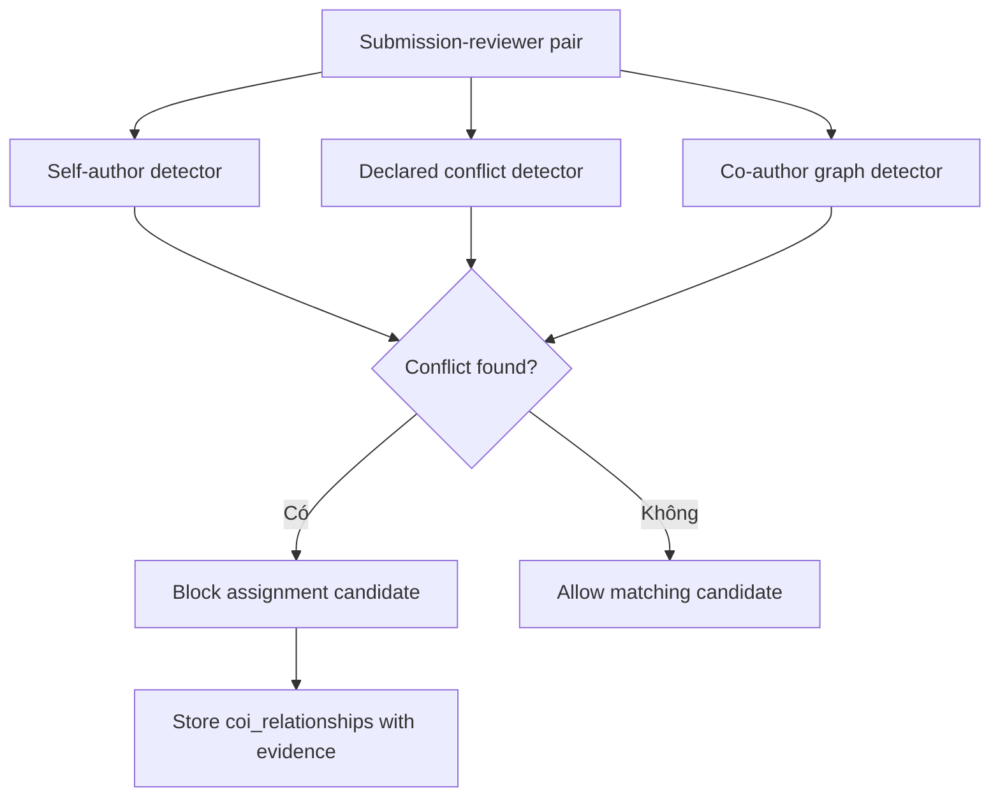
```mermaid
flowchart TD
    A["Submission-reviewer pair"] --> B["Self-author detector"]
    A --> C["Declared conflict detector"]
    A --> D["Co-author graph detector"]
    B --> E{"Conflict found?"}
    C --> E
    D --> E
    E -- "Có" --> F["Block assignment candidate"]
    E -- "Không" --> G["Allow matching candidate"]
    F --> H["Store coi_relationships with evidence"]
```

Trong luồng phân công, COI là ràng buộc cứng. Thuật toán có thể fallback khi thiếu reviewer phù hợp, nhưng không được bỏ qua COI để lấp đủ số lượng. Mỗi cảnh báo COI được lưu kèm loại quan hệ, nguồn phát hiện và bằng chứng để Chair kiểm tra.

### 3.4.4. Các cơ chế nghiệp vụ hỗ trợ vận hành

Bên cạnh matching và COI, hệ thống có nhiều cơ chế xác định nhỏ hơn nhưng quan trọng cho trải nghiệm vận hành:

- **State machine hội nghị** kiểm soát các giai đoạn Draft, Open, Reviewing, Decision và Closed.
- **Deadline gating** kiểm tra thời điểm nộp bài, chỉnh sửa, gửi review, rebuttal và camera-ready.
- **RBAC theo hội nghị** kiểm tra vai trò của người dùng trên từng tài nguyên.
- **Notification routing** gửi thông báo đúng người, đúng thời điểm, đúng ngữ cảnh.
- **Schema validation** kiểm tra request/response trước khi ghi dữ liệu bền vững.

Các cơ chế này là phần nền của hệ thống. Nếu chúng không đúng, AI workflow dù tốt cũng không thể tạo ra một nền tảng đáng tin cậy.

---

## 3.5. Giải pháp AI

### 3.5.1. Vai trò của AI trong hệ thống

AI được đưa vào ConferenceSpace theo vai trò hỗ trợ từng điểm nghẽn, không phải như lớp tự động hóa toàn bộ quy trình. Nhóm chia workflow AI thành ba nhóm.

Nhóm thứ nhất là **hỗ trợ nhập liệu và kiểm tra sớm** cho tác giả: Submission Autofill và Submission Gating. Submission Autofill có thể gợi ý track từ nội dung bản thảo và danh sách track của hội nghị, nhưng đây là một khả năng bên trong workflow nộp bài, không phải một workflow AI riêng. Nhóm này giải quyết trực tiếp vấn đề biểu mẫu dài, lựa chọn track thủ công và lỗi chỉ được phát hiện muộn.

Nhóm thứ hai là **hỗ trợ đọc và kiểm soát chất lượng phản biện** cho reviewer: Reviewer Initial Analysis và Review Quality Auditor. Nhóm này không thay việc đọc bài hoặc viết phản biện, mà giúp reviewer định hướng đọc và kiểm tra bản nháp có đủ căn cứ hay chưa.

Nhóm thứ ba là **hỗ trợ tổng hợp và truy vấn ngữ cảnh hệ thống**. Chair Decision Copilot hỗ trợ Chair tổng hợp review, rebuttal và thảo luận để chuẩn bị quyết định. Chatbot Agent là trợ lý chung cho tác giả, reviewer và Chair, cho phép mỗi vai trò tra cứu thao tác, trạng thái và dữ liệu trong phạm vi quyền truy cập của mình. Nhóm này giảm tải nhận thức ở các điểm người dùng phải tổng hợp nhiều nguồn thông tin hoặc tự dò trạng thái hệ thống.

### 3.5.2. Các workflow có sử dụng AI

#### 3.5.2.1. Submission Autofill

Submission Autofill nhận bản thảo, conference context và danh sách track để tạo metadata nháp cho form nộp bài. Output chính gồm tiêu đề, tóm tắt, keyword, thông tin tác giả khi trích xuất được và gợi ý track phù hợp trong danh sách track hợp lệ của hội nghị. Giá trị của workflow này là giảm nhập liệu lặp lại, đặc biệt với các trường đã có trong PDF, đồng thời giảm thao tác dò/chọn track thủ công.

Ranh giới kiểm soát là tác giả. Hệ thống không tự động gửi bài và không khóa các trường do AI tạo. Tác giả phải xem lại, chỉnh sửa và xác nhận trước khi lưu submission chính thức.

#### 3.5.2.2. Submission Gating

Submission Gating kiểm tra bản thảo trước khi gửi chính thức theo policy hội nghị. Workflow có thể phát hiện thiếu section bắt buộc, nội dung không phù hợp track, hoặc dấu hiệu cần Chair kiểm tra thêm. Output nên được diễn giải theo ba mức: `pass`, `warn` và `block`.

Điểm cần nhấn mạnh là Submission Gating đóng vai trò như một desk-check/desk-reject gate ở khâu nộp draft, nhưng không phải quyết định desk rejection học thuật cuối cùng. Nếu workflow trả `block`, hệ thống chỉ ngăn một bản nộp không đáp ứng điều kiện hình thức hoặc policy cấu hình rõ ràng; các kết luận học thuật vẫn thuộc về Chair và reviewer.

#### 3.5.2.3. Reviewer Initial Analysis

Reviewer Initial Analysis tạo briefing ban đầu cho reviewer: tóm tắt trung lập, đóng góp chính, điểm cần kiểm tra, câu hỏi gợi ý và các tín hiệu về mức độ sẵn sàng của bài để phản biện. Workflow này được thiết kế để hỗ trợ quá trình đọc, không thay thế quá trình đọc.

Luận điểm thiết kế quan trọng là AI có thể giảm số lần reviewer phải đọc lại toàn bộ bài chỉ để truy vết các điểm cần chú ý. Khi các điểm cần kiểm tra được gom lại có cấu trúc, reviewer có thể tập trung nhiều hơn vào đánh giá chuyên môn và chất lượng lập luận của bài.

#### 3.5.2.4. Review Quality Auditor

Review Quality Auditor kiểm tra bản nháp review trước khi gửi chính thức. Đầu vào gồm review draft, rubric hoặc form đánh giá của hội nghị và một phần ngữ cảnh submission. Output gồm trạng thái `pass`, `warn` hoặc `block`, cùng danh sách vấn đề cần chỉnh sửa.

Auditor không xác định bài báo tốt hay xấu. Nó kiểm tra chất lượng của chính bản phản biện: review có quá ngắn không, nhận xét có cụ thể không, điểm số và nhận xét có mâu thuẫn không, có thiếu phần bắt buộc không. Đây là cơ chế giúp Chair giảm rủi ro nhận review nghèo thông tin.

#### 3.5.2.5. Chair Decision Copilot

Chair Decision Copilot tổng hợp review, scores, rebuttal và discussion để tạo bản tóm tắt bằng chứng. Output cần làm rõ điểm đồng thuận, điểm bất đồng, vấn đề còn bỏ ngỏ, phản hồi của tác giả và các rủi ro cần Chair xem lại.

Workflow này không sinh quyết định accept/reject. Nếu hệ thống trình bày một khuyến nghị như kết luận, nó sẽ làm lệch trách nhiệm học thuật. Vì vậy, output của Copilot được thiết kế như bản tổng hợp để Chair đọc nhanh hơn và đối chiếu với dữ liệu gốc.

#### 3.5.2.6. Chatbot Agent của nền tảng

Chatbot Agent hỗ trợ người dùng hỏi về trạng thái, thao tác và dữ liệu trong phạm vi quyền truy cập. Khi cần dữ liệu hệ thống, agent gọi backend query endpoint thay vì truy vấn database trực tiếp. Backend kiểm tra user token, service token, resource registry và quyền truy cập trước khi trả dữ liệu.

Ranh giới này đặc biệt quan trọng vì chatbot là nơi dễ phát sinh rủi ro lộ dữ liệu bản thảo hoặc phản biện. Agent chỉ được trả lời dựa trên dữ liệu người dùng có quyền xem.

#### 3.5.2.7. Các kiểm soát chung cho workflow AI

Các workflow AI dùng chung một số kiểm soát:

- **Schema validation**: output phải đúng cấu trúc trước khi trả về frontend hoặc lưu artifact.
- **Input fingerprint**: artifact gắn với trạng thái dữ liệu tại thời điểm sinh.
- **Timeout và error handling**: lỗi provider không được biến thành dữ liệu giả hợp lệ.
- **Human override**: người dùng có thẩm quyền phải có khả năng chỉnh sửa, bỏ qua hoặc xác nhận output.
- **Audit trail**: trạng thái, thời gian xử lý và lỗi cần được lưu để phục vụ benchmark ở Chương 4.

### 3.5.3. AI Service, model router và structured output

AI service được triển khai như một service FastAPI độc lập. Trong repo, service đăng ký các router workflow riêng: submission autofill, submission gating, reviewer initial analysis, review quality audit, chair decision copilot và agent/status router. Cách tách router này giúp mỗi workflow có schema, prompt, runner và validation riêng thay vì gom tất cả vào một endpoint chung.

**Hình 3.15. Luồng tích hợp AI service**

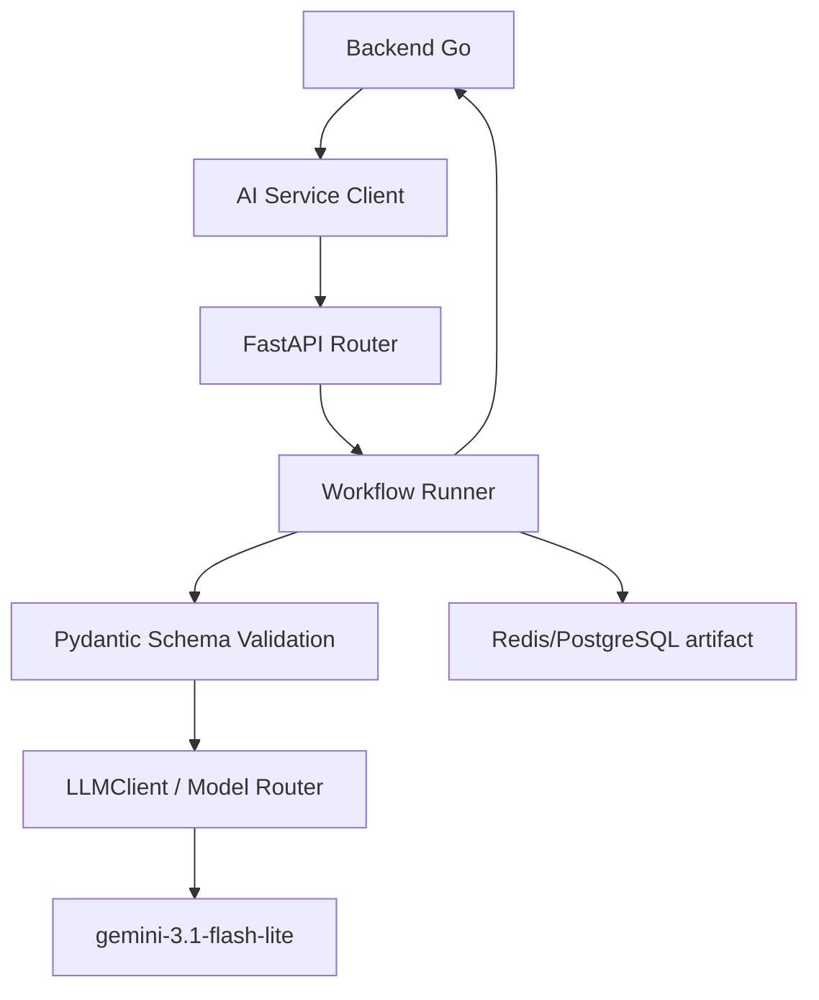
```mermaid
flowchart TD
    B["Backend Go"] --> C["AI Service Client"]
    C --> A["FastAPI Router"]
    A --> W["Workflow Runner"]
    W --> V["Pydantic Schema Validation"]
    V --> L["LLMClient / Model Router"]
    L --> M["gemini-3.1-flash-lite"]
    W --> R["Redis/PostgreSQL artifact"]
    W --> B
```

`LLMClient` là lớp giữ hợp đồng gọi model thống nhất. Client có thể nhận cấu hình OpenAI-compatible provider hoặc OpenRouter provider, có timeout và structured output. Fallback provider chỉ là cơ chế vận hành; nó không làm thay đổi bản chất học thuật của workflow. Mọi workflow vẫn phải tuân thủ cùng schema, prompt và validation.

Đối với LLM, cấu hình production cần khóa về `gemini-3.1-flash-lite`:

```env
OPENROUTER_API_KEY=
AGENT_MODEL=openrouter/google/gemini-3.1-flash-lite
OPENAI_API_KEY=
OPENAI_BASE_URL=
OPENAI_MODEL=gemini-3.1-flash-lite
LLM_REQUEST_TIMEOUT_SECONDS=60
```

Đoạn env trên thể hiện ý nghĩa thiết kế: dù gọi qua OpenRouter hay OpenAI-compatible route, model mục tiêu của hệ thống vẫn là `gemini-3.1-flash-lite`. Nếu thay đổi provider trong tương lai, thay đổi đó phải giữ nguyên ranh giới workflow, schema validation và nguyên tắc con người kiểm soát đầu ra.

### 3.5.4. Tích hợp nguồn dữ liệu học thuật bên ngoài

Semantic Scholar API được dùng để làm giàu hồ sơ học thuật, hỗ trợ matching và phát hiện xung đột lợi ích [16]. Với ConferenceSpace, nguồn dữ liệu này hữu ích vì hệ thống cần thông tin quan hệ học thuật thay vì chỉ dựa vào khai báo thủ công của người dùng.

Tuy nhiên, dữ liệu bên ngoài chỉ là nguồn hỗ trợ. Nếu hồ sơ tác giả thiếu hoặc dữ liệu không đầy đủ, Chair vẫn cần có quyền kiểm tra và ghi đè. Đây là giới hạn quan trọng khi dùng nguồn dữ liệu học thuật tự động trong quy trình có ảnh hưởng đến công bằng phản biện.

### 3.5.5. Ưu điểm và giới hạn của các workflow AI

Ưu điểm lớn nhất của các workflow AI là giảm chi phí thao tác và chi phí nhận thức ở những điểm người dùng đã phản ánh trong Chương 2. Tác giả không phải nhập lại metadata đã có trong bản thảo. Reviewer có thêm bản đồ đọc ban đầu và công cụ kiểm tra bản nháp review. Chair có bản tổng hợp bằng chứng để đối chiếu nhanh hơn.

Tuy nhiên, các lợi ích này chỉ có giá trị nếu được diễn giải đúng phạm vi. AI có thể giúp reviewer giảm số lần đọc lại toàn bộ bài để tìm điểm cần chú ý, nhưng không thể thay thế việc đọc bài. AI có thể giúp Chair nhìn thấy điểm đồng thuận và mâu thuẫn, nhưng không thể quyết định thay Chair. AI có thể giúp tác giả phát hiện lỗi sớm, nhưng không bảo đảm bản thảo đạt chuẩn học thuật.

Các giới hạn chính gồm: phụ thuộc chất lượng file đầu vào, khả năng hallucination hoặc thiếu căn cứ, chi phí/token, rate limit của provider, rủi ro bảo mật dữ liệu bản thảo và khác biệt chất lượng giữa các lĩnh vực chuyên môn. Vì vậy, mọi output AI trong hệ thống đều phải có người kiểm tra, có schema/validation và có tiêu chí đánh giá riêng ở Chương 4.

---

## 3.6. Môi trường triển khai và vận hành

### 3.6.1. Kiến trúc triển khai production

ConferenceSpace được đóng gói thành các service độc lập: Caddy gateway, Next.js web, Go backend, backend migration job, FastAPI AI service, PostgreSQL, Redis và Neo4j. Cách triển khai này giúp nhóm chứng minh hệ thống không chỉ chạy ở môi trường development mà có thể vận hành như một stack thực tế.

**Hình 3.16. Topology triển khai production**

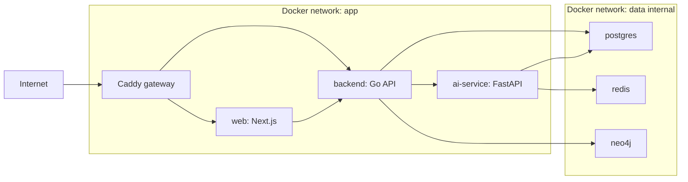
```mermaid
flowchart LR
    Internet["Internet"] --> Caddy["Caddy gateway"]

    subgraph App["Docker network: app"]
        Caddy
        Web["web: Next.js"]
        BE["backend: Go API"]
        AI["ai-service: FastAPI"]
    end

    subgraph Data["Docker network: data internal"]
        PG["postgres"]
        Redis["redis"]
        Neo["neo4j"]
    end

    Caddy --> Web
    Caddy --> BE
    Web --> BE
    BE --> AI
    BE --> PG
    BE --> Neo
    AI --> Redis
    AI --> PG
```

Network `app` phục vụ giao tiếp giữa các service ứng dụng, còn network `data` được cấu hình `internal: true` để giới hạn truy cập vào cơ sở dữ liệu và cache. Thiết kế này phù hợp với yêu cầu bảo mật bản thảo và dữ liệu phản biện: các thành phần dữ liệu không được expose trực tiếp ra Internet.

### 3.6.2. Docker Compose và container images

File `deployment/docker-compose.prod.yml` là evidence chính cho topology production. Compose khai báo service, image, environment, volume, healthcheck, network và restart policy. Ba service ứng dụng `web`, `backend` và `ai-service` dùng image được build từ GitHub Actions và truyền vào qua biến môi trường:

```yaml
web:
  image: ${FRONTEND_IMAGE}
backend:
  image: ${BACKEND_IMAGE}
ai-service:
  image: ${AI_SERVICE_IMAGE}
```

Các image này được build và push lên GitHub Container Registry theo format:

```text
ghcr.io/<owner>/conferencespace-frontend:<GITHUB_SHA>
ghcr.io/<owner>/conferencespace-backend:<GITHUB_SHA>
ghcr.io/<owner>/conferencespace-ai-service:<GITHUB_SHA>
```

Đây là điểm quan trọng về khả năng tái lập. Mỗi lần deploy production không build trực tiếp trên server mà kéo đúng image đã build trong pipeline, sau đó chạy migration và cập nhật stack bằng Docker Compose.

### 3.6.3. Cấu hình server và biến môi trường

Runtime configuration được tách khỏi mã nguồn bằng `.env.production` trên server. GitHub Actions chỉ cập nhật ba biến image (`FRONTEND_IMAGE`, `BACKEND_IMAGE`, `AI_SERVICE_IMAGE`) và yêu cầu file `.env.production` đã tồn tại trước khi deploy. Cách này giúp secret thật không đi vào repository.

Các nhóm biến chính gồm:

- **Public URL và CORS**: domain public, origin được phép, base URL cho frontend/backend.
- **PostgreSQL**: `POSTGRES_USER`, `POSTGRES_PASSWORD`, `POSTGRES_DB`.
- **Neo4j**: `NEO4J_USERNAME`, `NEO4J_PASSWORD`, heap/pagecache.
- **AI service**: `REDIS_URL`, `POSTGRES_DSN`, `BACKEND_API_BASE_URL`, timeout, model provider.
- **LLM provider**: `OPENROUTER_API_KEY`, `AGENT_MODEL`, `OPENAI_API_KEY`, `OPENAI_BASE_URL`, `OPENAI_MODEL`.
- **Service token**: token cho admin và agent service-to-service.

Mọi secret phải được cấu hình ở server hoặc GitHub Secrets. Báo cáo chỉ trình bày tên biến và vai trò, không đưa giá trị thật.

### 3.6.4. Reverse proxy, HTTPS và routing

Caddy đóng vai trò gateway nhận lưu lượng từ Internet và định tuyến vào các service nội bộ. Trình duyệt không truy cập trực tiếp backend, AI service, PostgreSQL, Redis hoặc Neo4j. WebSocket notification được định tuyến riêng về backend, còn giao diện web được định tuyến về Next.js.

File `deployment/Caddyfile` hiện tại:

```caddyfile
conference-space.com, www.conference-space.com {
    encode zstd gzip
    reverse_proxy /ws/* backend:8080
    reverse_proxy web:3000
}
```

Đoạn cấu hình trên là anchor quan trọng của kiến trúc triển khai: mọi truy cập công khai đi qua gateway, còn service nội bộ chỉ giao tiếp trong Docker network. Caddy đồng thời xử lý nén nội dung và Automatic HTTPS [19], giúp giảm phần cấu hình vận hành thủ công so với mô hình reverse proxy cộng Certbot riêng.

### 3.6.5. CI/CD, GitHub Actions và GHCR

Pipeline `.github/workflows/deploy.yml` có bốn nhóm bước chính:

1. Build và push image frontend lên GHCR.
2. Build và push image backend lên GHCR.
3. Build và push image AI service lên GHCR.
4. SSH vào VPS, cập nhật `.env.production`, pull image, chạy migration và `docker compose up -d`.

**Hình 3.17. Luồng CI/CD production**

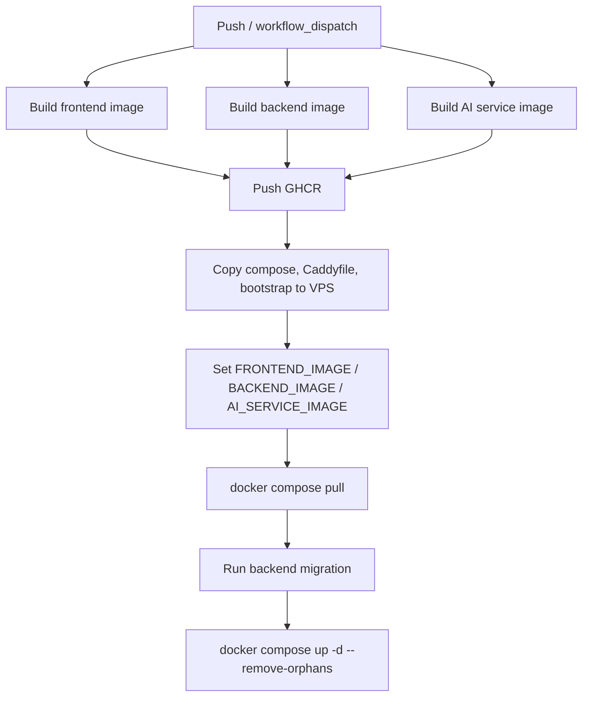
```mermaid
flowchart TD
    A["Push / workflow_dispatch"] --> B["Build frontend image"]
    A --> C["Build backend image"]
    A --> D["Build AI service image"]
    B --> E["Push GHCR"]
    C --> E
    D --> E
    E --> F["Copy compose, Caddyfile, bootstrap to VPS"]
    F --> G["Set FRONTEND_IMAGE / BACKEND_IMAGE / AI_SERVICE_IMAGE"]
    G --> H["docker compose pull"]
    H --> I["Run backend migration"]
    I --> J["docker compose up -d --remove-orphans"]
```

Pipeline cũng in image digest vào GitHub Step Summary. Đây là bằng chứng vận hành hữu ích: khi cần truy vết một bản deploy, nhóm có thể biết service nào chạy image nào thay vì chỉ dựa vào tag `latest`.

### 3.6.6. Network isolation, volume và bảo mật secret

Production Compose tách network `app` và `data`; network `data` được khai báo `internal: true`. PostgreSQL, Redis và Neo4j chỉ nằm trên network dữ liệu, trong khi backend và AI service là các service được phép đi qua ranh giới này. Caddy chỉ nằm ở network ứng dụng và expose cổng 80/443.

Các volume bền vững gồm `postgres_data`, `redis_data`, `neo4j_data`, `neo4j_logs`, `neo4j_plugins`, `uploads_data`, `caddy_data` và `caddy_config`. Việc tách volume giúp dữ liệu không mất khi container được tái tạo trong quá trình deploy.

Secret không được đưa vào image, Dockerfile hoặc báo cáo. File `.env.production` trên server được đặt quyền `600` trong pipeline deploy. Đây là mức bảo vệ cơ bản nhưng cần thiết cho một hệ thống có dữ liệu bản thảo, thông tin phản biện và token gọi model bên ngoài.

---

## 3.7. Tổng kết chương

Chương 3 đã trình bày ConferenceSpace như một hệ thống hoàn chỉnh thay vì một tập hợp tính năng rời rạc. Về mặt nghiệp vụ, hệ thống bao phủ ba vai trò chính của quy trình hội nghị: tác giả, người phản biện và Chair. Về mặt kỹ thuật, hệ thống tách rõ frontend, backend, AI service, dữ liệu quan hệ, dữ liệu graph, cache và gateway. Về mặt thiết kế AI, hệ thống giữ nguyên tắc xuyên suốt: AI hỗ trợ nhập liệu, đọc, kiểm tra và tổng hợp; con người vẫn chịu trách nhiệm với phản biện, phân công và quyết định học thuật.

Việc tách lớp nghiệp vụ cốt lõi, thuật toán xác định và AI hỗ trợ tạo cơ sở để Chương 4 đánh giá hệ thống theo đúng bản chất từng lớp. Backend và thuật toán cần được đánh giá bằng hiệu năng, độ ổn định và khả năng giải thích; workflow AI cần được đánh giá bằng chất lượng đầu ra, độ trễ, chi phí và mức độ hữu ích với người dùng; khảo sát sau sử dụng cần kiểm chứng liệu các lựa chọn thiết kế có thật sự giải quyết được nhu cầu đã nêu ở Chương 2 hay không.

---

## Tài liệu tham khảo

[1] Next.js, "App Router," Available: https://nextjs.org/docs/app

[2] Next.js, "Server and Client Components," Available: https://nextjs.org/docs/app/getting-started/server-and-client-components

[3] React, "React Documentation," Available: https://react.dev/

[4] Radix UI, "Primitives Overview," Available: https://www.radix-ui.com/primitives/docs/overview/introduction

[5] Tailwind CSS, "Documentation," Available: https://tailwindcss.com/docs

[6] Go, "Documentation," Available: https://go.dev/doc/

[7] Gin Web Framework, "Documentation," Available: https://gin-gonic.com/en/docs/

[8] PostgreSQL, "JSON Types," Available: https://www.postgresql.org/docs/current/datatype-json.html

[9] Neo4j, "Variable-length paths," Available: https://neo4j.com/docs/cypher-manual/current/patterns/variable-length-paths/

[10] Redis, "Redis Documentation," Available: https://redis.io/docs/latest/

[11] Google AI for Developers, "Gemini 3.1 Flash-Lite," Available: https://ai.google.dev/gemini-api/docs/models/gemini-3.1-flash-lite

[12] FastAPI, "Features," Available: https://fastapi.tiangolo.com/features/

[13] Pydantic, "Models and validation," Available: https://pydantic.dev/docs/validation/latest/concepts/models/

[14] Google AI for Developers, "Gemini API OpenAI compatibility," Available: https://ai.google.dev/gemini-api/docs/openai

[15] OpenRouter, "API reference overview," Available: https://openrouter.ai/docs/api/reference/overview

[16] Semantic Scholar, "Semantic Scholar API," Available: https://www.semanticscholar.org/product/api

[17] Docker, "Docker Compose," Available: https://docs.docker.com/compose/

[18] Docker, "Compose file services reference," Available: https://docs.docker.com/reference/compose-file/services/

[19] Caddy, "Automatic HTTPS," Available: https://caddyserver.com/docs/automatic-https

[20] GitHub Docs, "Workflows," Available: https://docs.github.com/en/actions/concepts/workflows-and-actions/workflows

[21] GitHub Docs, "Working with the Container registry," Available: https://docs.github.com/en/packages/working-with-a-github-packages-registry/working-with-the-container-registry
