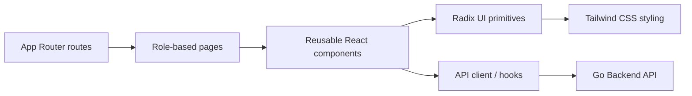
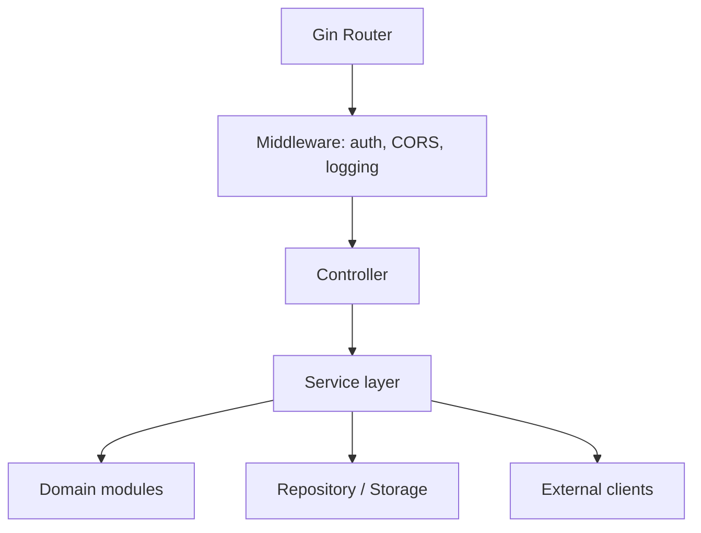
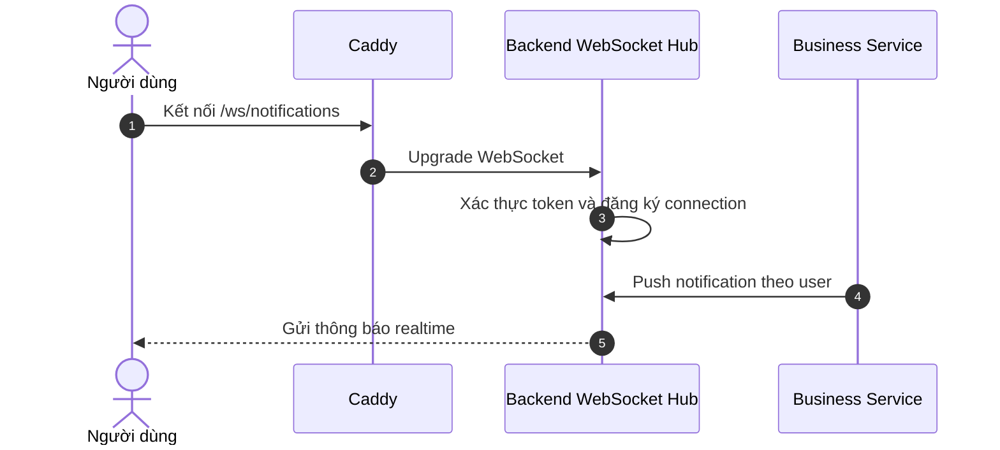
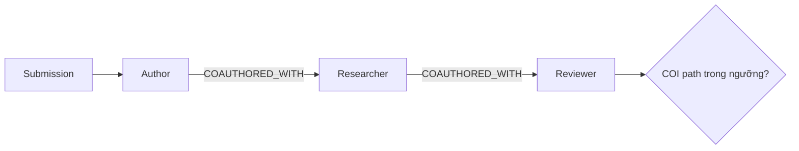
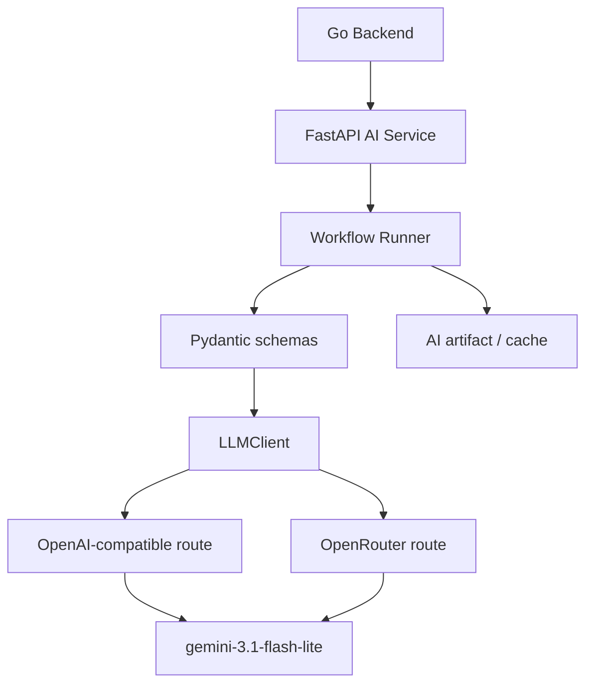
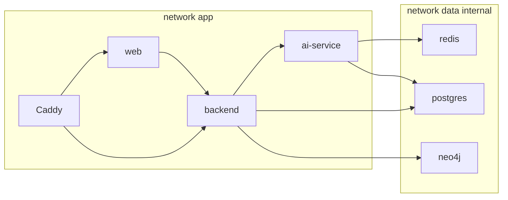
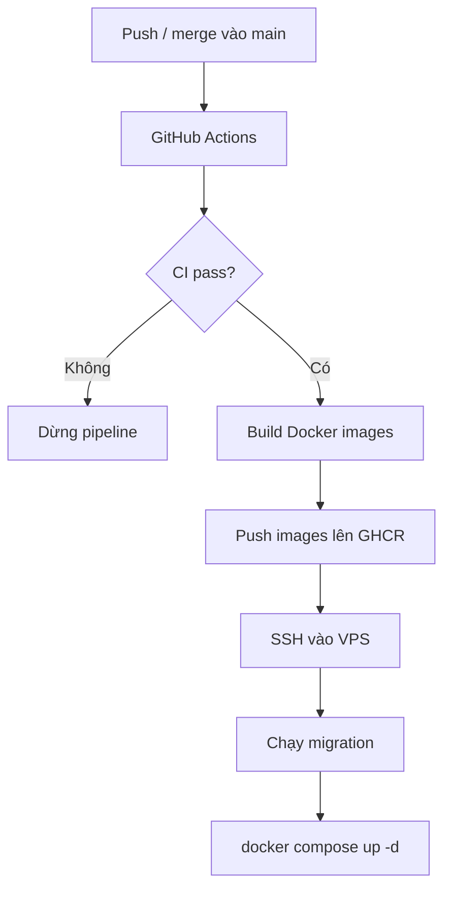

# Chương 4. Công nghệ sử dụng

Chương 3 đã trình bày ConferenceSpace như một hệ thống gồm ba lớp trách nhiệm: nghiệp vụ cốt lõi, thuật toán xác định và AI hỗ trợ. Chương 4 đi sâu vào câu hỏi khác: những công nghệ nào được dùng để hiện thực các lớp đó, vì sao chúng phù hợp với yêu cầu của đề tài, và chúng được cấu hình như thế nào trong hệ thống thực tế.

Các lựa chọn công nghệ trong chương này không được trình bày như danh sách thư viện. Mỗi công nghệ chỉ được đưa vào nếu nó có vai trò rõ trong một trong bốn yêu cầu: hỗ trợ nhiều vai trò người dùng, bảo vệ dữ liệu và quyền truy cập, vận hành ổn định nhiều service, hoặc tích hợp AI có kiểm soát.

## 4.1. Công nghệ phía giao diện

### 4.1.1. Framework giao diện và ngôn ngữ phát triển

Frontend của ConferenceSpace được xây dựng bằng **Next.js App Router**, **React** và **TypeScript**. Next.js App Router phù hợp với hệ thống vì giao diện được tổ chức theo nhiều khu vực nghiệp vụ: author dashboard, reviewer workspace, chair console, submission flow và review flow. Cơ chế routing theo thư mục của App Router giúp cấu trúc giao diện bám sát cấu trúc nghiệp vụ, đồng thời hỗ trợ React Server Components và Client Components để phân tách phần render tĩnh/dữ liệu với phần tương tác phía client [1][2].

TypeScript được dùng để giảm lỗi runtime khi frontend trao đổi với backend qua nhiều kiểu dữ liệu phức tạp: submission, conference configuration, review form, assignment, AI artifact và notification. Với một hệ thống có nhiều trạng thái và nhiều vai trò, kiểu dữ liệu rõ giúp các thay đổi API được phát hiện sớm hơn trong quá trình phát triển.

**React** giữ vai trò nền UI component. Điều này phù hợp với các màn hình của ConferenceSpace vì nhiều phần giao diện có trạng thái tương tác dày: form nộp bài nhiều bước, bảng phân công reviewer, trình soạn review, dashboard tiến độ và chatbot assistant [3].

### 4.1.2. Tổ chức giao diện và trải nghiệm người dùng

ConferenceSpace sử dụng các primitive UI từ **Radix UI** và styling bằng **Tailwind CSS**. Radix UI phù hợp với các thành phần tương tác cần accessibility như dialog, select, tabs, tooltip và menu; Tailwind giúp chuẩn hóa spacing, màu sắc và responsive layout mà không cần tạo quá nhiều CSS tùy biến [4][5].

Trong báo cáo, hai công nghệ này nên được hiểu như công cụ bảo đảm tính nhất quán giao diện, không phải đóng góp học thuật chính. Giá trị của chúng nằm ở việc giúp hệ thống tổ chức các luồng phức tạp thành các màn hình dễ theo dõi: tác giả thấy từng bước nộp bài, reviewer thấy trạng thái review và Chair có dashboard tổng hợp.



## 4.2. Công nghệ phía máy chủ

### 4.2.1. Ngôn ngữ và framework backend

Backend nghiệp vụ chính được viết bằng **Go** và framework **Gin**. Go phù hợp với ConferenceSpace vì backend phải xử lý nhiều loại request đồng thời: thao tác hội nghị, nộp bài, cập nhật trạng thái review, thông báo realtime, gọi AI service và gọi nguồn dữ liệu học thuật bên ngoài. Go cung cấp mô hình concurrency nhẹ bằng goroutine, phù hợp với các network service cần xử lý nhiều tác vụ I/O song song [6].

Gin được chọn làm HTTP framework vì cung cấp routing, middleware, route grouping và JSON binding/validation cho REST API [7]. Trong ConferenceSpace, Gin không chứa logic nghiệp vụ chính; nó đóng vai trò lớp HTTP để chuyển request vào service layer. Cách tổ chức này giúp nghiệp vụ như matching, COI, submission state hay review workflow không bị phụ thuộc chặt vào framework web.



### 4.2.2. Xác thực, phân quyền và API contract

Hệ thống dùng **JWT Bearer token** cho người dùng cuối, kết hợp kiểm tra vai trò theo từng hội nghị ở backend. Vai trò không nên chỉ nhúng cứng trong token vì một người dùng có thể có quyền khác nhau ở các hội nghị khác nhau. Do đó, mỗi request quan trọng cần xác minh cả danh tính và quyền trên tài nguyên cụ thể.

Ngoài JWT, hệ thống có hai header phục vụ vận hành và tích hợp service: `X-Admin-Token` cho tác vụ quản trị nội bộ và `X-Agent-Service-Token` cho AI service khi cần gọi backend query endpoint. Thiết kế này giúp tách quyền người dùng cuối khỏi quyền service-to-service, tránh để AI service truy cập dữ liệu vượt phạm vi được phép.

API contract được giữ bằng schema request/response và tài liệu API sinh từ code. Với một hệ thống có frontend, backend và AI service phát triển song song, API contract rõ là điều kiện để tránh lỗi tích hợp muộn.

### 4.2.3. Giao tiếp thời gian thực

ConferenceSpace dùng **WebSocket** cho thông báo realtime, đặc biệt ở các tình huống như reviewer nhận phân công, Chair theo dõi tiến độ review hoặc tác giả nhận cập nhật trạng thái. WebSocket phù hợp hơn polling vì server có thể đẩy sự kiện khi trạng thái thay đổi, giảm độ trễ và giảm request lặp lại.



## 4.3. Công nghệ cơ sở dữ liệu và lưu trữ

### 4.3.1. Cơ sở dữ liệu quan hệ

**PostgreSQL** là cơ sở dữ liệu chính cho dữ liệu nghiệp vụ: users, conferences, tracks, submissions, assignments, reviews, rebuttals, decisions và notifications. Mô hình quan hệ phù hợp vì các thực thể có ràng buộc rõ và cần tính nhất quán giao dịch.

PostgreSQL cũng hỗ trợ kiểu JSON/JSONB, hữu ích với các trường có cấu trúc linh hoạt như cấu hình hội nghị, review form hoặc AI artifact. Theo tài liệu PostgreSQL, `jsonb` lưu dữ liệu ở dạng đã phân rã, có chi phí chuyển đổi khi ghi nhưng xử lý nhanh hơn khi đọc vì không cần parse lại mỗi lần truy vấn [8]. Vì vậy, JSONB phù hợp cho dữ liệu bán cấu trúc cần lưu bền vững nhưng không nên bị lạm dụng để thay thế toàn bộ schema quan hệ.

### 4.3.2. Cơ sở dữ liệu đồ thị

**Neo4j** được dùng cho đồ thị quan hệ học thuật phục vụ phát hiện COI. COI không chỉ là quan hệ trực tiếp giữa reviewer và tác giả; trong nhiều trường hợp, cần xét quan hệ đồng tác giả nhiều bậc hoặc quan hệ gần đây trong một khoảng thời gian nhất định. Đây là dạng truy vấn tự nhiên của graph database.

Cypher hỗ trợ variable-length path, cho phép truy vấn các đường đi có độ dài thay đổi trong đồ thị [9]. Điều này phù hợp với `RelationshipDetector` trong hệ thống, nơi backend cần kiểm tra xem reviewer và tác giả có quan hệ qua chuỗi đồng tác giả trong ngưỡng cấu hình hay không.



### 4.3.3. Cache, session và lưu trữ file

**Redis** giữ vai trò cache, session và runtime state ngắn hạn. Trong ConferenceSpace, Redis phù hợp cho chatbot session, cache trạng thái AI workflow và tool result tạm thời. Redis không phải nguồn dữ liệu nghiệp vụ chính; dữ liệu cần bền vững vẫn được lưu ở PostgreSQL. Cách phân vai này giúp tránh lẫn lộn giữa dữ liệu tạm và dữ liệu cần audit [10].

Tệp bản thảo và tài liệu nộp bài được lưu qua abstraction layer để có thể dùng local storage trong môi trường demo hoặc chuyển sang object storage khi cần mở rộng. Trong deployment hiện tại, file được mount qua Docker volume riêng để dữ liệu không mất khi container được tái tạo.

## 4.4. Công nghệ AI/ML

### 4.4.1. Nền tảng mô hình ngôn ngữ

Toàn bộ thao tác LLM trong ConferenceSpace dùng **`gemini-3.1-flash-lite`**. Model này phù hợp với phạm vi đồ án vì các workflow AI của hệ thống chủ yếu là trích xuất metadata, tóm tắt, phân loại, rà soát văn bản và tạo output có cấu trúc. Tài liệu Gemini mô tả Gemini 3.1 Flash-Lite là model multimodal, độ trễ thấp, chi phí thấp, phù hợp workflow tần suất cao và hỗ trợ structured outputs [11].

Điểm quan trọng trong báo cáo không phải là khẳng định model này “tốt nhất”, vì nhóm không thực hiện benchmark so sánh model. Lý do chọn model cần được trình bày thận trọng hơn: model đáp ứng các yêu cầu vận hành của đồ án về tốc độ, chi phí, xử lý tài liệu và output có cấu trúc. Chất lượng thực tế của từng workflow được đánh giá ở Chương 5.

### 4.4.2. AI Service và lớp gọi mô hình

AI service được xây dựng bằng **FastAPI** và **Pydantic**. FastAPI phù hợp với dịch vụ AI vì hỗ trợ async endpoint, type hints và OpenAPI documentation; Pydantic giúp validate request/response và các schema output của workflow [12][13]. Đây là điểm quan trọng vì output AI không thể được xem là hợp lệ chỉ vì model đã trả lời; hệ thống cần kiểm tra cấu trúc trước khi trả về frontend hoặc lưu artifact.

ConferenceSpace dùng `LLMClient` như lớp gọi model thống nhất. Client có thể nhận OpenAI-compatible provider hoặc OpenRouter provider. Google cũng cung cấp hướng dẫn truy cập Gemini bằng OpenAI libraries/API settings, phù hợp với cách hệ thống giữ một hợp đồng gọi model thống nhất [14]. OpenRouter đóng vai trò provider gateway tương thích Chat Completions, còn LiteLLM giúp gọi model/provider qua một lớp routing chung [15][16].



Fallback provider trong lớp model router chỉ là cơ chế tăng độ bền vận hành. Nó không thay đổi nguyên tắc học thuật của hệ thống: cùng một workflow phải giữ cùng prompt, cùng schema, cùng validation và cùng quyền kiểm tra của con người.

### 4.4.3. Nguồn dữ liệu học thuật bên ngoài

**Semantic Scholar API** được dùng để làm giàu hồ sơ học thuật, hỗ trợ matching và COI. Semantic Scholar cung cấp API chính thức cho dữ liệu paper, author, citation và venue [17]. Với ConferenceSpace, nguồn dữ liệu này hữu ích vì hệ thống cần thông tin quan hệ học thuật thay vì chỉ dựa vào khai báo thủ công của người dùng.

Tuy nhiên, dữ liệu bên ngoài chỉ là nguồn hỗ trợ. Nếu hồ sơ tác giả thiếu hoặc dữ liệu không đầy đủ, Chair vẫn cần có quyền kiểm tra và ghi đè. Đây là giới hạn quan trọng khi dùng nguồn dữ liệu học thuật tự động trong quy trình có ảnh hưởng đến công bằng phản biện.

## 4.5. Công nghệ triển khai và vận hành

### 4.5.1. Container hóa và điều phối dịch vụ

ConferenceSpace dùng **Docker Compose** để triển khai production topology gồm nhiều service: Caddy gateway, Next.js web, Go backend, migration job, AI service, PostgreSQL, Redis và Neo4j. Docker Compose phù hợp vì cho phép khai báo service, network, volume, healthcheck và biến môi trường trong một file YAML có thể version control [18][19].



Sự tách biệt network `app` và `data` giúp giới hạn bề mặt tấn công: các thành phần dữ liệu không cần expose trực tiếp ra Internet. Backend và AI service là các thành phần được phép đi qua ranh giới này theo vai trò đã định.

### 4.5.2. Reverse proxy và HTTPS

**Caddy** đóng vai trò reverse proxy và gateway HTTPS. Lý do chọn Caddy là cấu hình gọn và Automatic HTTPS: Caddy có thể tự động lấy và gia hạn chứng chỉ TLS cho domain public mà không cần quản lý Certbot riêng [20].

Cấu hình gateway hiện tại có thể trình bày đầy đủ vì ngắn và thể hiện rõ ranh giới truy cập:

```caddyfile
conference-space.com, www.conference-space.com {
    encode zstd gzip
    reverse_proxy /ws/* backend:8080
    reverse_proxy web:3000
}
```

Route `/ws/*` được chuyển về backend vì WebSocket notification thuộc Go service; các route còn lại chuyển về Next.js web app. Cách cấu hình này giúp người dùng chỉ thấy một domain, trong khi các service nội bộ vẫn được tách biệt.

### 4.5.3. CI/CD và tự động hóa vận hành

**GitHub Actions** được dùng cho CI/CD vì workflow được định nghĩa bằng YAML trong cùng repository và tự động chạy theo sự kiện như push hoặc merge [21]. **GitHub Container Registry** lưu Docker/OCI images được build từ frontend, backend và AI service [22].



Điểm có giá trị học thuật ở đây không phải là pipeline phức tạp, mà là khả năng tái lập triển khai. Một hệ thống đồ án có nhiều service dễ rơi vào trạng thái “chỉ chạy trên máy thành viên nhóm”; CI/CD và container image giúp giảm rủi ro đó bằng một quy trình build, phát hành và cập nhật có thể lặp lại.

### 4.5.4. Cấu hình runtime và bảo mật secret

Runtime configuration được tách khỏi mã nguồn bằng biến môi trường. Các nhóm biến chính gồm public URL, service URL, PostgreSQL, Redis, Neo4j, backend runtime, AI service runtime, service token, timeout và model provider. Không đưa secret thật vào repository hoặc báo cáo.

Đối với LLM, cấu hình production cần khóa về `gemini-3.1-flash-lite`:

```env
OPENROUTER_API_KEY=
AGENT_MODEL=openrouter/google/gemini-3.1-flash-lite
OPENAI_API_KEY=
OPENAI_BASE_URL=
OPENAI_MODEL=gemini-3.1-flash-lite
LLM_REQUEST_TIMEOUT_SECONDS=60
```

Đoạn env trên thể hiện ý nghĩa thiết kế: dù gọi qua OpenRouter hay OpenAI-compatible route, model mục tiêu của hệ thống vẫn là `gemini-3.1-flash-lite`. Nếu thay đổi provider trong tương lai, thay đổi đó phải giữ nguyên ranh giới workflow, schema validation và nguyên tắc con người kiểm soát đầu ra.

## 4.6. Tổng kết lựa chọn công nghệ

Các công nghệ của ConferenceSpace được chọn để phục vụ một kiến trúc có ranh giới rõ: Next.js/React cho giao diện nhiều vai trò; Go/Gin cho nghiệp vụ ổn định và API; PostgreSQL cho dữ liệu bền vững; Neo4j cho COI dạng graph; Redis cho state ngắn hạn; FastAPI/Pydantic cho workflow AI có schema; `gemini-3.1-flash-lite` cho tác vụ LLM tần suất cao; Docker Compose/Caddy/GitHub Actions cho triển khai có thể tái lập.

Quan trọng hơn, các công nghệ này không làm mờ nguyên tắc của đề tài. AI service có thể được thay đổi provider, nhưng không thay đổi quyền quyết định của con người. Graph database giúp phát hiện COI tốt hơn, nhưng Chair vẫn kiểm tra và xác nhận. CI/CD giúp vận hành ổn định hơn, nhưng không thay thế đánh giá thực nghiệm. Những giới hạn này sẽ được kiểm chứng ở Chương 5.

---

## Tài liệu tham khảo

[1] Next.js, "App Router," Available: https://nextjs.org/docs/app

[2] Next.js, "Server and Client Components," Available: https://nextjs.org/docs/app/getting-started/server-and-client-components

[3] React, "React Documentation," Available: https://react.dev/

[4] Radix UI, "Primitives Overview," Available: https://www.radix-ui.com/primitives/docs/overview/introduction

[5] Tailwind CSS, "Documentation," Available: https://tailwindcss.com/docs

[6] Go, "Documentation," Available: https://go.dev/doc/

[7] Gin Web Framework, "Documentation," Available: https://gin-gonic.com/en/docs/

[8] PostgreSQL, "JSON Types," Available: https://www.postgresql.org/docs/current/datatype-json.html

[9] Neo4j, "Variable-length paths," Available: https://neo4j.com/docs/cypher-manual/current/patterns/variable-length-paths/

[10] Redis, "Redis Documentation," Available: https://redis.io/docs/latest/

[11] Google AI for Developers, "Gemini 3.1 Flash-Lite," Available: https://ai.google.dev/gemini-api/docs/models/gemini-3.1-flash-lite

[12] FastAPI, "Features," Available: https://fastapi.tiangolo.com/features/

[13] Pydantic, "Models and validation," Available: https://pydantic.dev/docs/validation/latest/concepts/models/

[14] Google AI for Developers, "Gemini API OpenAI compatibility," Available: https://ai.google.dev/gemini-api/docs/openai

[15] OpenRouter, "API reference overview," Available: https://openrouter.ai/docs/api/reference/overview

[16] LiteLLM, "Routing," Available: https://docs.litellm.ai/docs/routing

[17] Semantic Scholar, "Semantic Scholar API," Available: https://www.semanticscholar.org/product/api

[18] Docker, "Docker Compose," Available: https://docs.docker.com/compose/

[19] Docker, "Compose file services reference," Available: https://docs.docker.com/reference/compose-file/services/

[20] Caddy, "Automatic HTTPS," Available: https://caddyserver.com/docs/automatic-https

[21] GitHub Docs, "Workflows," Available: https://docs.github.com/en/actions/concepts/workflows-and-actions/workflows

[22] GitHub Docs, "Working with the Container registry," Available: https://docs.github.com/en/packages/working-with-a-github-packages-registry/working-with-the-container-registry
