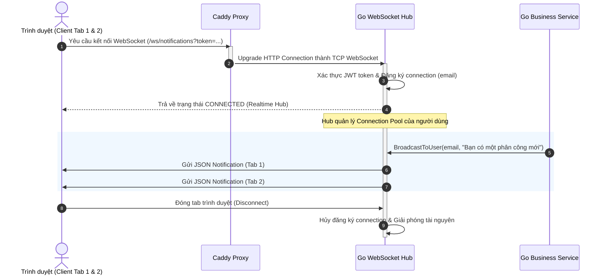
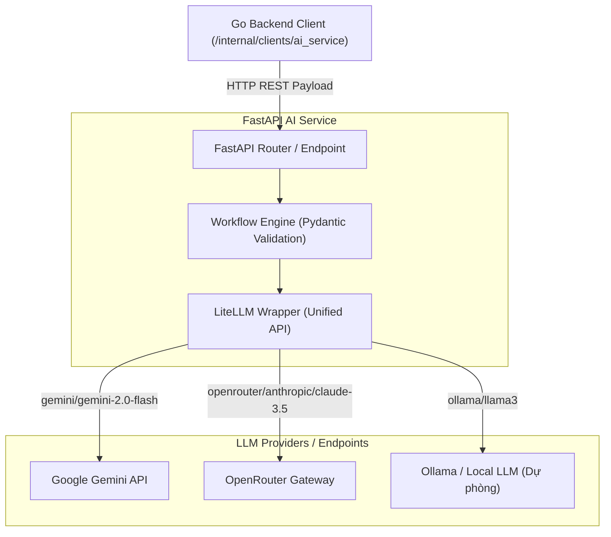
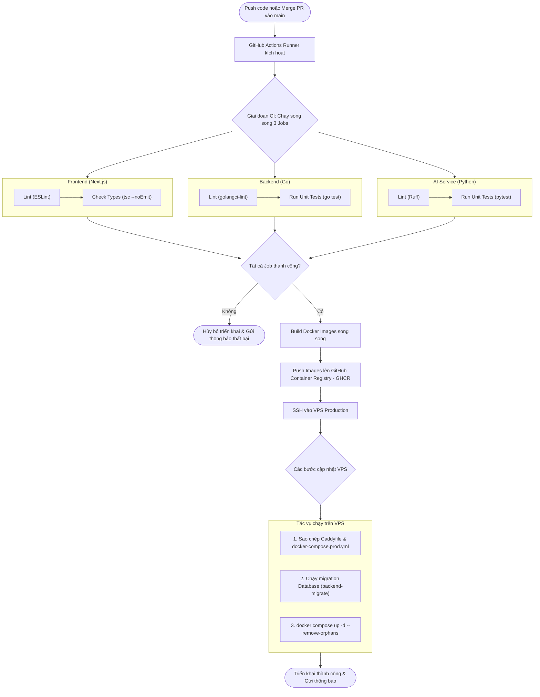

# Chương 4. Công nghệ sử dụng

## 4.1. Công nghệ phía giao diện

Giao diện người dùng của ConferenceSpace được xây dựng trên nền tảng **Next.js 15** — framework React full-stack do Vercel phát triển, sử dụng kiến trúc App Router (ra mắt từ Next.js 13 và trở thành chuẩn từ Next.js 14). Lý do chọn Next.js không đơn thuần là vì phổ biến, mà vì App Router cung cấp hai khả năng kỹ thuật quan trọng cho ConferenceSpace. Khả năng đầu tiên là **Server Components** — các component được render ở phía server, giảm lượng JavaScript phải gửi xuống trình duyệt và cải thiện thời gian tải trang ban đầu, đặc biệt quan trọng với các trang hiển thị danh sách hội nghị và bài nộp phức tạp. Khả năng thứ hai là **API Routes** cho phép Next.js đóng vai trò proxy layer: mọi lời gọi API từ trình duyệt đi qua Next.js thay vì trực tiếp đến backend Go, qua đó ẩn URL backend, xử lý CORS và thêm lớp bảo mật bổ sung. Ngoài ra, Next.js cung cấp **File-based routing** — cấu trúc thư mục `app/` ánh xạ trực tiếp thành URL, giúp cấu trúc dự án dễ điều hướng và giảm thiểu cấu hình thủ công.

**TypeScript** được sử dụng như ngôn ngữ chính thay vì JavaScript thuần, bổ sung hệ thống kiểu tĩnh (static typing) cho toàn bộ codebase frontend. Trong bối cảnh ConferenceSpace giao tiếp với backend Go qua một API surface lớn (hơn 50 endpoint với các kiểu dữ liệu phức tạp như cấu hình hội nghị dạng JSONB, mảng keyword, trạng thái bài nộp), TypeScript đảm bảo rằng khi backend thay đổi cấu trúc response, frontend sẽ báo lỗi tại compile-time thay vì lỗi runtime vào ban đêm. Tính năng autocomplete và kiểm tra kiểu trong IDE cũng tăng tốc độ phát triển đáng kể khi làm việc với codebase lớn nhiều người cùng tham gia.

**React 18** là thư viện UI cốt lõi, cung cấp mô hình component-based và các tính năng Concurrent Features như Suspense cho data fetching và Automatic Batching (gom nhiều state update thành một lần render). ConferenceSpace tận dụng Suspense để hiển thị skeleton loading state trong khi chờ dữ liệu từ backend, tạo trải nghiệm người dùng mượt mà hơn so với trang trắng hay spinner toàn màn hình.

**Tailwind CSS v4** được dùng làm framework CSS theo hướng utility-first: thay vì viết CSS riêng với tên class tùy ý, style được khai báo trực tiếp trong JSX thông qua các class tiện ích như `flex`, `text-sm`, `bg-primary`. Cách tiếp cận này giúp thiết kế nhất quán nhờ hệ thống spacing và color scale định sẵn, loại bỏ các cuộc tranh luận về đặt tên class và tự động loại bỏ CSS không dùng (tree-shaking) khi build production, giúp bundle size nhỏ hơn đáng kể.

**shadcn/ui** là bộ component UI được xây dựng trên Radix UI (headless components) kết hợp với Tailwind CSS. Điểm khác biệt của shadcn/ui so với các component library thông thường như MUI hay Ant Design là thay vì cài đặt qua npm package, các component được copy trực tiếp vào dự án — người dùng sở hữu hoàn toàn code và có thể tùy chỉnh bất kỳ chi tiết nào. Radix UI bên dưới đảm bảo khả năng tiếp cận (accessibility) tốt theo chuẩn ARIA và điều hướng bàn phím, điều quan trọng trong một ứng dụng học thuật cần phục vụ đa dạng người dùng.

---

## 4.2. Công nghệ phía máy chủ

### Go 1.24 và Gin Framework

Backend của ConferenceSpace được viết bằng **Go 1.24** — ngôn ngữ lập trình biên dịch, statically typed được Google phát triển. Quyết định chọn Go thay vì các lựa chọn phổ biến hơn trong cộng đồng web như Node.js hay Python/FastAPI xuất phát từ phân tích kỹ lưỡng về yêu cầu kỹ thuật của hệ thống. Go biên dịch ra binary đơn không phụ thuộc runtime, khởi động trong mili-giây và sử dụng ít bộ nhớ hơn Node.js hay Python đáng kể. Quan trọng hơn, mô hình concurrency của Go thông qua goroutines và channels phù hợp tự nhiên với bài toán của ConferenceSpace: gọi Semantic Scholar API đồng thời cho nhiều tác giả, xử lý nhiều WebSocket connection song song, và gọi AI Service không đồng bộ trong khi vẫn tiếp nhận request mới. Kết quả benchmark thực tế xác nhận lựa chọn này: backend xử lý 369–572 request/giây với p95 latency dưới 120ms trên tập dữ liệu 15.000 bài nộp, trong khi container API chỉ sử dụng trung bình 28% CPU của một core và ~30 MB RAM.

**Gin** là HTTP web framework được chọn cho backend Go, nổi tiếng với hiệu năng cao nhờ router dựa trên radix tree. Gin cung cấp route grouping theo prefix (ví dụ: `/api/v1/conferences/:id/submissions/*`), middleware pipeline linh hoạt (JWT auth, CORS, logging, rate limiting được kết nối theo thứ tự rõ ràng), và binding tự động request body vào struct Go với validation. Trong ConferenceSpace, toàn bộ logic xác thực và phân quyền được triển khai như Gin middleware, giúp mỗi handler tập trung vào logic nghiệp vụ thay vì phải tự kiểm tra token và quyền.

### Xác thực và phân quyền

Hệ thống xác thực của ConferenceSpace sử dụng **JWT (JSON Web Token)** — token tự mô tả (self-contained), không cần lưu session trên server. Thiết kế stateless này phù hợp với kiến trúc container hóa của hệ thống: không cần shared session store giữa các instance backend, dễ scale horizontal khi cần thiết. JWT payload trong ConferenceSpace chứa `user_id`, `email` và thời gian hết hạn (24 giờ); thông tin vai trò hội nghị không được nhúng vào token để tránh token stale khi vai trò hay đổi, thay vào đó được tra cứu từ bảng `conference_user_roles` mỗi request.

Bên cạnh JWT Bearer (cho người dùng cuối), hệ thống sử dụng thêm hai cơ chế xác thực đặc biệt. Header `X-Admin-Token` phục vụ các thao tác vận hành nội bộ yêu cầu quyền hệ thống. Header `X-Agent-Service-Token` cho phép AI Service gọi lại vào backend để truy vấn dữ liệu cần thiết cho các workflow (ví dụ: chatbot cần truy vấn thông tin hội nghị trong khi xử lý câu hỏi của người dùng). Cơ chế token riêng biệt này giúp kiểm soát truy cập ở mức tinh tế mà không cần chia sẻ JWT của người dùng ra khỏi phạm vi frontend.

### golang-migrate và Swagger/OpenAPI

**golang-migrate** quản lý database schema thông qua migration files có phiên bản — mỗi thay đổi schema là một file SQL có thể áp dụng (`up`) hoặc hoàn tác (`down`). Cách quản lý này đảm bảo mọi thay đổi cơ sở dữ liệu đều được theo dõi trong version control, có thể triển khai lên production một cách xác định và có thể rollback khi cần. Trong pipeline CI/CD, migration được chạy tự động qua container `backend-migrate` một-lần (one-shot) trước khi backend khởi động, đảm bảo schema luôn đồng bộ với code.

**Swagger/OpenAPI 3.0** được dùng để tài liệu hóa API tự động. Thay vì viết tài liệu riêng, annotations được nhúng trực tiếp vào Go code (comment theo chuẩn swaggo), sau đó công cụ `swag generate` tạo ra file `swagger.json` và giao diện Swagger UI tại `/swagger/index.html`. Điều này đảm bảo tài liệu API luôn đồng bộ với implementation — đây là yêu cầu thiết yếu khi frontend và backend phát triển song song.

### WebSocket (Gorilla)

Thông báo realtime trong ConferenceSpace được triển khai qua **WebSocket** sử dụng thư viện `gorilla/websocket`. Khi người dùng đăng nhập, trình duyệt thiết lập kết nối WebSocket tới endpoint `/ws/notifications` được xác thực bằng JWT qua query string. Backend duy trì một Hub (`internal/websocket/hub.go`) quản lý tất cả kết nối đang hoạt động, ánh xạ theo `user_email` để hỗ trợ nhiều tab trình duyệt từ cùng một tài khoản. Khi có sự kiện (phân công bài, phản biện mới, rebuttal kết thúc), Service gọi `BroadcastToUser(email, notification)` để push thông báo ngay lập tức đến tất cả kết nối của người dùng đó. Thiết kế này tránh cơ chế polling kém hiệu quả và cải thiện trải nghiệm người dùng đáng kể, đặc biệt khi chair đang theo dõi tiến độ phản biện theo thời gian thực.

#### Sơ đồ tuần tự: Luồng đẩy thông báo realtime qua WebSocket



#### Giải thích luồng đẩy thông báo qua WebSocket

Sơ đồ tuần tự trên thể hiện vòng đời kết nối và cơ chế đẩy thông báo realtime:
1. **Kết nối và Nâng cấp:** (Bước 1 - 4) Client thiết lập liên kết, Caddy nâng cấp giao thức tự động từ HTTP thành WebSocket. Hub tại Go Backend tiếp nhận, kiểm tra JWT, và đưa kết nối vào map quản lý với key là email người dùng.
2. **Quản lý đa tab:** Một người dùng có thể mở nhiều tab. Hub sẽ lưu giữ một mảng các kết nối cho cùng một email. Khi `Go Business Service` phát tín hiệu push thông báo (Bước 5), Hub duyệt mảng này để đẩy đồng thời đến tất cả các tab đang mở (Bước 6 - 7).
3. **Giải phóng tài nguyên:** Khi người dùng đóng tab, sự kiện ngắt kết nối được phát hiện, Hub xoá kết nối khỏi map và giải phóng socket để tránh rò rỉ bộ nhớ (leak file descriptor).

---

## 4.3. Công nghệ cơ sở dữ liệu và lưu trữ

### PostgreSQL 15

**PostgreSQL 15** là hệ quản trị cơ sở dữ liệu quan hệ chính của ConferenceSpace, được chọn vì độ trưởng thành, tính ổn định cao trong production và một số tính năng đặc thù phù hợp với yêu cầu cụ thể của hệ thống. Hệ thống tận dụng nhiều tính năng nâng cao của PostgreSQL vượt ra ngoài SQL cơ bản. Kiểu **JSONB** được sử dụng để lưu cấu hình hội nghị (`configurations` trong bảng `conferences`) và dữ liệu phản biện (`review_data` trong bảng `paper_assignments`) — những dữ liệu có cấu trúc linh hoạt không cần schema cứng nhắc. Kiểu **TEXT[]** (mảng chuỗi) được dùng để lưu mảng domain chuyên môn của người dùng và keyword của bài nộp, cho phép query tìm kiếm giao nhau với toán tử `= ANY(domain)` rất hiệu quả. **Partial indexes** được tạo trên các cột `status` để chỉ index các bản ghi đang active, giảm kích thước index và tăng tốc query lọc theo trạng thái. **TIMESTAMP WITH TIME ZONE** được dùng cho tất cả các cột thời gian, đảm bảo xử lý deadline chính xác cho hội nghị có người dùng từ nhiều múi giờ khác nhau.

Schema của PostgreSQL được quản lý thông qua golang-migrate với các migration file được đánh phiên bản. Kết quả benchmark cho thấy PostgreSQL là thành phần tiêu thụ tài nguyên cao nhất trong stack: trung bình 115% CPU (hơn một core) khi xử lý tải đồng thời — đây là bottleneck cần lưu ý khi scale hệ thống lên quy mô lớn hơn.

### Neo4j 5.15

**Neo4j 5.15 Community Edition** là cơ sở dữ liệu đồ thị (graph database) được sử dụng riêng cho việc lưu trữ và truy vấn đồ thị đồng tác giả phục vụ phát hiện xung đột lợi ích. Lý do chọn Neo4j thay vì mở rộng PostgreSQL để làm nhiệm vụ này là sự khác biệt căn bản về mô hình dữ liệu và hiệu năng truy vấn. PostgreSQL lưu dữ liệu dạng bảng — để tìm quan hệ đồng tác giả gián tiếp hai bậc, cần thực hiện nhiều vòng JOIN lồng nhau với độ phức tạp tăng theo hàm mũ khi đồ thị có hàng triệu quan hệ. Neo4j lưu dữ liệu dạng đồ thị với các con trỏ trực tiếp giữa node, cho phép duyệt đồ thị theo chiều sâu nhiều bậc với độ phức tạp tuyến tính.

Backend kết nối Neo4j qua driver `neo4j-go-driver/v5` with connection pool cấu hình tối đa 50 kết nối đồng thời và lifetime 5 phút. Các thao tác chính được triển khai trong `internal/clients/neo4j/`: `CreateAuthor`, `CreateCoauthorship`, `GetCoauthors`, `GetCoauthorsSince(year)`, `HasRecentCollaboration` (1-hop) và `HasIndirectCollaboration(maxDepth, year)` (N-hop). Quan trọng là Neo4j được thiết kế như thành phần tùy chọn: backend kiểm tra kết nối khi khởi động, và nếu Neo4j không khả dụng, chỉ lớp phát hiện COI dựa trên đồ thị bị tắt, hai lớp còn lại vẫn hoạt động bình thường.

### Redis 7

**Redis 7** đóng vai trò lưu trữ cache và runtime state, chủ yếu phục vụ AI Service. AI Service dùng Redis để lưu session hội thoại của chatbot — khi người dùng gửi tin nhắn tiếp theo, AI Service tra cứu context hội thoại từ Redis thay vì phải fetch lại từ database. Redis cũng được dùng để rate limit các lời gọi đến LLM API, tránh vượt quá giới hạn của provider. Redis 7 được triển khai với persistence mode `appendonly` (AOF — Append Only File) để đảm bảo session không bị mất khi container restart, phù hợp với trường hợp người dùng đang trong giữa cuộc hội thoại với chatbot.

### Lưu trữ file

Tệp PDF bài nộp, cover letter và camera-ready được lưu trữ qua một abstraction layer có thể cấu hình giữa **local storage** và **Supabase Storage**. Trong môi trường development và demo, local storage được dùng với thư mục `/data/uploads/submissions` được mount qua Docker volume `uploads_data`. Trong môi trường production với yêu cầu về khả năng mở rộng, Supabase Storage (compatible với S3 API) có thể được kích hoạt chỉ bằng thay đổi biến môi trường `FILE_STORAGE_PROVIDER`. Abstraction layer này giúp backend không bị lock-in vào một provider lưu trữ cụ thể.

---

## 4.4. Công nghệ AI/ML

### Google Gemini API (gemini-2.0-flash)

**Google Gemini** là nền tảng AI chính được chọn để thực hiện các workflow AI trong ConferenceSpace. Model cụ thể được sử dụng là **gemini-2.0-flash** — phiên bản cân bằng tốt giữa tốc độ và chất lượng. Quyết định chọn Gemini Flash thay vì các lựa chọn thay thế như GPT-4o hay DeepSeek V3 dựa trên ba yếu tố quyết định.

**Thứ nhất, hỗ trợ PDF native (multimodal):** Tính năng Autofill yêu cầu đọc và phân tích nội dung tệp PDF bản thảo. Gemini là model duy nhất trong số các lựa chọn được khảo sát hỗ trợ xử lý PDF trực tiếp mà không cần bước chuyển đổi trung gian — GPT-4o yêu cầu extract text từ PDF trước, DeepSeek không hỗ trợ multimodal. Việc xử lý PDF native giúp Gemini nắm bắt được cả cấu trúc bố cục (vị trí tiêu đề, danh sách tác giả, abstract), không chỉ nội dung text thuần.

**Thứ hai, context window lớn:** Gemini 2.0 Flash hỗ trợ context window lên đến 1 triệu token, phù hợp với workflow Decision Copilot cần xử lý đồng thời nhiều phản biện dài, rebuttal và thảo luận cho một bài nộp. GPT-4o có context window 128K token — vẫn đủ dùng trong hầu hết trường hợp, nhưng có thể bị hạn chế ở các bài nộp với nhiều phản biện dài.

**Thứ ba, free tier phù hợp với quy mô đồ án:** Gemini 2.0 Flash cung cấp 15 request/phút và 1.500 request/ngày ở tier miễn phí — đủ dùng cho quy mô demo và thử nghiệm. GPT-4o không có free tier đủ dùng cho production; DeepSeek có chi phí rất thấp nhưng thiếu multimodal.

Trong codebase backend Go, Gemini được gọi qua `internal/clients/` cho một số tính năng như trích xuất keyword nghiên cứu. Hầu hết các workflow phức tạp hơn đi qua AI Service (FastAPI) — nơi Gemini được gọi qua LiteLLM để giữ tính linh hoạt về provider.

### OpenRouter API

**OpenRouter** (openrouter.ai) đóng vai trò gateway đa model cho chatbot, cho phép routing linh hoạt đến nhiều LLM khác nhau (Gemini, GPT, Claude, Llama, v.v.) qua một endpoint duy nhất với giao diện API thống nhất theo chuẩn OpenAI. Lý do chọn OpenRouter cho chatbot thay vì gọi trực tiếp một provider là tính linh hoạt không bị lock-in vào vendor: nếu cần thay đổi model chatbot (ví dụ: dùng Claude 3.5 Sonnet thay Gemini Flash vì chất lượng hội thoại tốt hơn), chỉ cần thay đổi biến môi trường `AGENT_MODEL` mà không cần sửa bất kỳ dòng code nào.

Chatbot trong ConferenceSpace không phải chatbot thông thường — đây là một agent có khả năng gọi tools để truy vấn thông tin hội nghị thực tế từ hệ thống (ví dụ: "Deadline nộp bài của hội nghị VLDB 2026 là khi nào?" — agent sẽ gọi tool truy vấn cơ sở dữ liệu thay vì trả lời từ training data). Khả năng function calling và tool use của các model qua OpenRouter đáp ứng yêu cầu này.

### FastAPI và LiteLLM

**FastAPI** là framework Python được chọn để xây dựng AI Service — dịch vụ thực thi các workflow AI phức tạp. FastAPI phù hợp cho AI Service vì hệ sinh thái Python phong phú về thư viện AI/ML, async-first design phù hợp với các lời gọi LLM có latency cao và tự động generate OpenAPI documentation từ type hints Pydantic.

**LiteLLM** là thư viện Python đóng vai trò abstraction layer cho các lời gọi LLM — cung cấp giao diện thống nhất để gọi Gemini, OpenAI, Anthropic, Cohere hay bất kỳ provider nào khác với cùng một API. Trong AI Service của ConferenceSpace, tất cả workflow đều gọi LLM qua LiteLLM, nghĩa là khi cần chuyển sang provider khác, chỉ cần thay đổi tên model trong cấu hình mà không cần sửa logic workflow. Điều này đặc biệt quan trọng trong lĩnh vực AI đang phát triển nhanh — khả năng thay provider mà không cần refactor là lợi thế kỹ thuật thực sự.

#### Sơ đồ tích hợp dịch vụ AI và Định tuyến Đa Model



#### Giải thích sơ đồ định tuyến đa model của AI Service

Sơ đồ trên mô tả cơ chế hoạt động của lớp trừu tượng (Abstraction Layer) trong tích hợp AI:
1. **Chuẩn hóa đầu vào:** Go Backend chỉ cần gửi request HTTP REST chuẩn đến FastAPI. FastAPI kiểm tra kiểu dữ liệu đầu vào bằng Pydantic để đảm bảo tính nhất quán trước khi chuyển giao cho động cơ xử lý (Workflow Engine).
2. **Vai trò của LiteLLM:** Đóng vai trò là một proxy adapter chuyển đổi các câu lệnh thống nhất thành định dạng API riêng biệt của từng nhà cung cấp (Gemini, OpenRouter, Ollama).
3. **Thay đổi linh hoạt:** Chúng ta có thể cấu hình định tuyến thông qua biến môi trường. Ví dụ, đối với tác vụ Autofill, LiteLLM định tuyến đến Gemini API để dùng khả năng đọc PDF native; đối với tác vụ chatbot hội thoại phức tạp, LiteLLM có thể định tuyến qua OpenRouter để sử dụng Claude 3.5 Sonnet.

---

### Semantic Scholar API

**Semantic Scholar** (api.semanticscholar.org) cung cấp dữ liệu học thuật miễn phí cho việc làm giàu hồ sơ người dùng và chuẩn bị dữ liệu cho COI detection. Hệ thống sử dụng ba endpoint chính: `GET /author/{id}` để lấy hồ sơ tác giả, `GET /author/{id}/papers` để lấy danh sách bài báo (paginated, tối đa 100 bài), và `POST /author/batch` để lấy nhiều tác giả trong một request. Dữ liệu này được cache trong PostgreSQL (bảng `scholar_profiles` và `scholar_papers`) để tránh gọi API lặp lại và giảm áp lực lên rate limit (100 request/5 phút không cần API key).

Việc chọn Semantic Scholar thay vì các nguồn dữ liệu học thuật khác như Google Scholar hay DBLP xuất phát từ một lý do thực tế đơn giản: Semantic Scholar cung cấp API chính thức với dữ liệu có cấu trúc JSON, miễn phí, tuân thủ điều khoản sử dụng. Google Scholar không có API chính thức; DBLP có API nhưng ít phong phú hơn về hồ sơ tác giả và citation network.

---

## 4.5. Công nghệ triển khai và vận hành

### Docker và Docker Compose

**Docker** là nền tảng container hóa cốt lõi của ConferenceSpace, được sử dụng để đóng gói từng service (PostgreSQL, Neo4j, Redis, backend Go, AI Service Python, frontend Next.js) vào container độc lập với môi trường runtime được định nghĩa hoàn toàn trong Dockerfile. Container hóa giải quyết ba vấn đề thực tế của việc triển khai ứng dụng đa ngôn ngữ: xung đột runtime version (Next.js cần Node.js v20+, backend Go cần Go 1.24+, AI Service cần Python 3.10+ — cài chung trên một máy dễ gây xung đột thư viện chia sẻ), khả năng tái tạo môi trường (cùng image Docker chạy giống nhau trên laptop developer và VPS production), và tự động khởi động lại khi service bị crash (policy `restart: unless-stopped`).

**Docker Compose** đảm nhận việc điều phối toàn bộ stack của hệ thống thông qua file `deployment/docker-compose.prod.yml`. File này định nghĩa tám service, hai mạng nội bộ, sáu volume dữ liệu và các health check để đảm bảo thứ tự khởi động đúng (PostgreSQL phải healthy trước khi backend Go bắt đầu, backend phải running trước khi AI Service kết nối). Docker Compose giúp toàn bộ hệ thống phức tạp có thể được khởi động hoặc dừng bằng một lệnh duy nhất, và trạng thái của tất cả service có thể kiểm tra trong một view tổng hợp.

Hai môi trường Docker Compose riêng biệt được duy trì: `backend/docker-compose.yml` dùng trong development (mount source code trực tiếp, không build image, dễ debug) và `deployment/docker-compose.prod.yml` dùng trong production (dùng image đã build từ GHCR, cấu hình memory limits cho Neo4j, không expose port internal ra host). Sự phân tách này tránh tình huống cấu hình development làm ảnh hưởng production.

### Caddy Server

**Caddy 2** đóng vai trò reverse proxy và quản lý TLS trong môi trường production, thay thế hoàn toàn cho giải pháp truyền thống Nginx + Certbot. Điểm đặc biệt của Caddy là **Automatic HTTPS** — tích hợp sẵn ACME client để tự động đăng ký và gia hạn chứng chỉ TLS với Let's Encrypt hoặc ZeroSSL mà không cần bất kỳ cấu hình hay cron job bổ sung nào. Khi Caddyfile chỉ khai báo tên domain, Caddy tự động: tạo khóa riêng tư, gửi ACME challenge qua HTTP-01, nhận chứng chỉ, cấu hình TLS và lên lịch gia hạn trước khi hết hạn.

Ngoài TLS tự động, Caddy xử lý nén phản hồi bằng **Zstandard (zstd)** và Gzip, cải thiện tốc độ truyền tải cho các trang data-heavy như danh sách bài nộp. Caddy cũng hỗ trợ upgrade protocol HTTP→WebSocket trong suốt, giúp cấu hình Caddyfile cho WebSocket (`reverse_proxy /ws/* backend:8080`) hoạt động chính xác mà không cần cấu hình header thủ công như trong Nginx.

---

### GitHub Actions (CI/CD)

**GitHub Actions** được chọn làm hệ thống CI/CD vì tích hợp sẵn với GitHub repository (nơi lưu mã nguồn của dự án), không cần setup hạ tầng CI riêng và cung cấp free tier đủ dùng cho quy mô đồ án. Pipeline CI/CD của ConferenceSpace được chia thành hai giai đoạn rõ ràng.

Giai đoạn **CI (Continuous Integration):** Mỗi push vào nhánh `main` kích hoạt chạy song song ba job — test và lint cho Frontend (Next.js), Backend Go và AI Service Python. Go backend chạy `go test ./...` để chạy unit test và `golangci-lint` để kiểm tra code quality. Frontend chạy `tsc --noEmit` để kiểm tra TypeScript. AI Service Python chạy `ruff` để lint và `pytest` cho tests. Nếu bất kỳ job nào fail, pipeline dừng lại và không tiến hành build.

Giai đoạn **CD (Continuous Deployment):** Sau khi CI thành công, pipeline build song song ba Docker image (frontend, backend, ai-service), tag theo Git commit hash và push lên GitHub Container Registry (GHCR). Sau đó, pipeline SSH vào VPS production, copy file cấu hình (`docker-compose.prod.yml`, `Caddyfile`), chạy database migration qua container `backend-migrate` và thực thi `docker compose up -d --remove-orphans` để cập nhật các container với image mới. Toàn bộ quá trình từ push code đến service cập nhật trên production mất khoảng 5–8 phút.

GitHub Secrets lưu trữ tất cả thông tin nhạy cảm cần cho pipeline (SSH key, GHCR token, địa chỉ server), đảm bảo không có thông tin bí mật nào xuất hiện trong log của pipeline hay trong mã nguồn. GitHub Environments cho phép cấu hình riêng cho môi trường `production` với yêu cầu phê duyệt thủ công trước khi deploy nếu cần kiểm soát chặt hơn.

#### Sơ đồ hoạt động: Quy trình CI/CD Pipeline



#### Giải thích sơ đồ hoạt động CI/CD Pipeline

Sơ đồ trên thể hiện quy trình phân phối liên tục (CI/CD) tự động hóa hoàn toàn từ mã nguồn đến môi trường production:
1. **Chốt chặn CI (Continuous Integration):** Nhằm ngăn chặn mã nguồn bị lỗi tích hợp hoặc không đáp ứng tiêu chuẩn code style lên production. Ba luồng Frontend, Backend và AI Service được kiểm tra độc lập và song song để tối ưu hóa thời gian chạy. Bất kỳ lỗi biên dịch hay unit test thất bại nào ở bước này đều làm ngắt dòng xử lý ngay lập tức.
2. **Đóng gói và Phát hành (Continuous Delivery):** Khi code đã được chứng thực sạch lỗi, GitHub Actions tiến hành build Docker Image cho ba service chính, gắn thẻ (tag) theo mã Git Commit SHA và lưu trữ trên registry GHCR.
3. **Triển khai tự động (Continuous Deployment):** Trình biên dịch CI kết nối an toàn đến VPS bằng SSH key đã mã hoá, chạy database migration trước để đảm bảo cấu trúc bảng khớp với logic code mới, sau đó khởi chạy các container mới với tính năng `--remove-orphans` nhằm xóa sạch các container cũ không còn sử dụng mà không làm gián đoạn dịch vụ của người dùng.

---

### Makefile

**Makefile** là công cụ orchestrate các lệnh phát triển phổ biến, giúp chuẩn hóa workflow giữa các thành viên trong nhóm. Thay vì phải nhớ từng lệnh dài và phức tạp, mọi tác vụ thường dùng được gói thành target Makefile:

```
make dev          # Khởi động môi trường development (Docker Compose + hot reload)
make test         # Chạy toàn bộ test suite
make migrate-up   # Apply database migrations
make swagger      # Generate Swagger docs từ annotations
make build        # Build binary production
make lint         # Chạy golangci-lint
```

Makefile không chỉ tiết kiệm thời gian gõ lệnh mà còn là documentation ngầm về cách vận hành dự án: bất kỳ developer mới nào đọc Makefile sẽ ngay lập tức hiểu workflow phát triển và triển khai.
