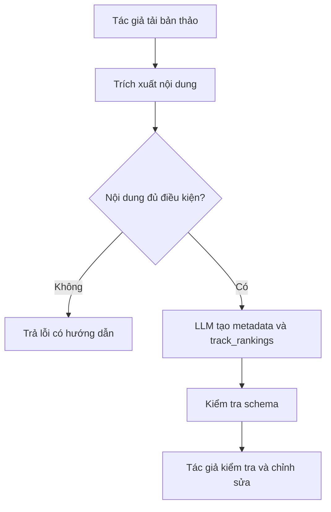
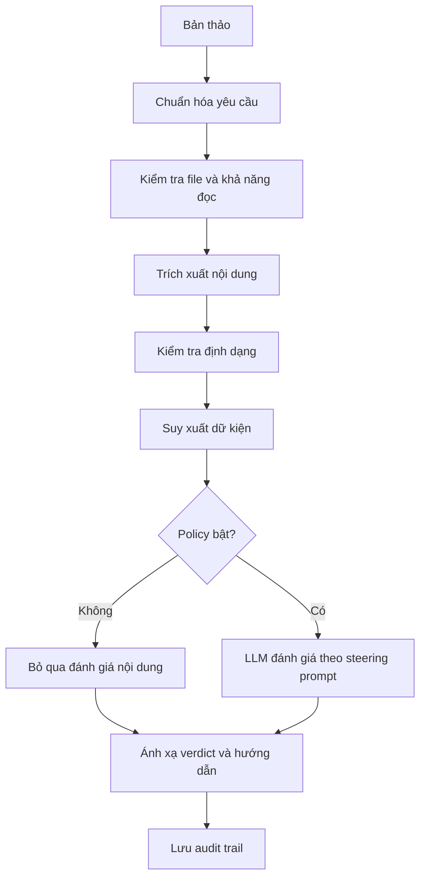
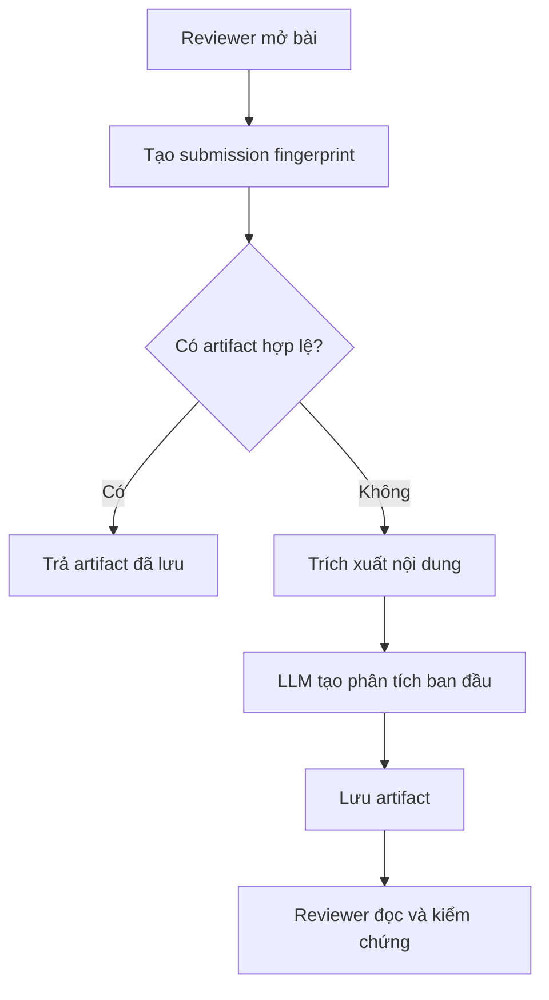
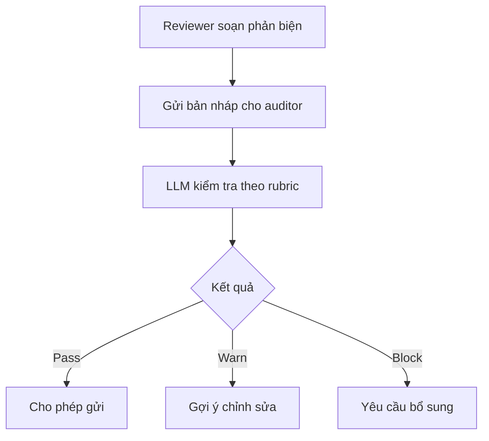
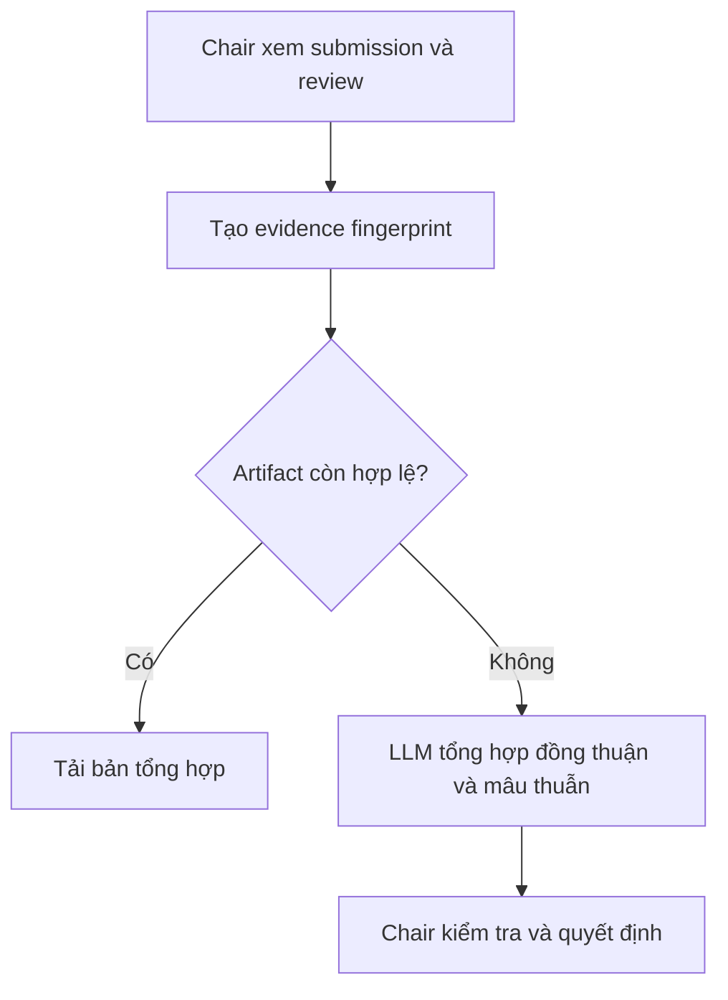
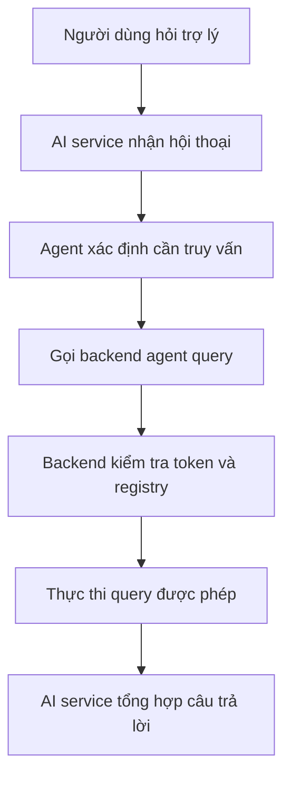
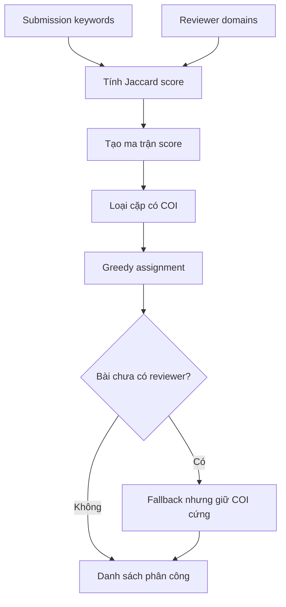
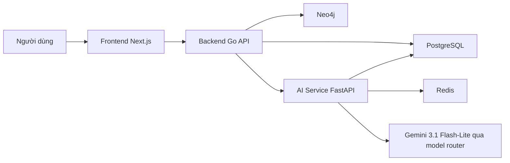

# Source pack và kế hoạch chỉnh sửa Chương 3/4

Tài liệu này khóa bằng chứng kỹ thuật, citation và validation flow cho bước rewrite Chương 3 và Chương 4. Mục tiêu là giữ hai chương này nhất quán với Chương 1/2 đã duyệt, đồng thời đủ chặt để bảo vệ trước hội đồng: Chương 3 giải thích thiết kế hệ thống; Chương 4 giải thích công nghệ, cấu hình, triển khai và vận hành.

## 1. Quyết định cần khóa

### 1.1. Ranh giới Chương 3 và Chương 4

- **Chương 3**: thiết kế hệ thống, actor, use case, kiến trúc, dữ liệu, thuật toán, workflow AI và ranh giới trách nhiệm giữa con người và AI.
- **Chương 4**: công nghệ hiện thực, cấu hình, code evidence, deployment topology, CI/CD, runtime, bảo mật vận hành và giới hạn kỹ thuật.
- Không để Chương 3 thành danh sách công nghệ. Không để Chương 4 lặp lại toàn bộ phân tích nghiệp vụ của Chương 3.

### 1.2. Ranh giới AI

- AI trong ConferenceSpace là **AI hỗ trợ**, không phải AI ra quyết định học thuật cuối cùng.
- Với reviewer, AI có thể giúp giảm số lần đọc lại toàn bộ bài, gom điểm cần chú ý và chuẩn bị ngữ cảnh; reviewer vẫn phải đọc, kiểm chứng và chịu trách nhiệm với phản biện.
- Reviewer matching và COI là thuật toán/tất định, không phải workflow AI sinh nội dung.
- `track_rankings` trong Submission Autofill là narrative chính. Endpoint `track_recommendation` độc lập có thể được nhắc như chi tiết hiện thực, nhưng không nên biến thành một workflow nghiên cứu riêng nếu Chương 2/5 không đánh giá riêng.

### 1.3. Model LLM

Theo chỉ đạo hiện tại của nhóm, mọi thao tác LLM trong hệ thống dùng:

```text
gemini-3.1-flash-lite
```

Quy ước này áp dụng cho cả ba đường đi: gọi trực tiếp Gemini, gọi qua OpenRouter, và gọi qua model router của nhóm bằng OpenAI-compatible client.

Repo hiện có drift cần đồng bộ trước bản báo cáo cuối:

- `ai-service/app/core/config.py`: default `AGENT_MODEL=openrouter/google/gemini-2.5-flash-lite`;
- `deployment/.env.production.example`: `AGENT_MODEL=openrouter/google/gemini-2.5-flash-lite`;
- `deployment/.env.production.example`: `GEMINI_MODEL=gemini-1.5-pro`.

Khi rewrite, báo cáo phải mô tả hệ thống mục tiêu với `gemini-3.1-flash-lite`. Nếu config chưa được sửa, chỉ nhắc model cũ trong phần “drift cấu hình cần đồng bộ”, không để người đọc hiểu hệ thống cuối cùng dùng model cũ.

## 2. Evidence pack từ repo

### 2.1. AI service entry point

Nguồn:

- `ai-service/app/main.py`
- `ai-service/app/api/`
- `ai-service/app/workflows/`

FastAPI app đăng ký các router: status, agent, submission gating, reviewer initial analysis, review quality audit, chair decision copilot, research keyword, track recommendation và submission autofill.

Cách dùng:

- Chương 3: chứng minh AI service được thiết kế theo workflow tách biệt theo nhiệm vụ.
- Chương 4: trích đoạn route registry như code evidence.

### 2.2. Model router và LLM client

Nguồn:

- `ai-service/app/core/config.py`
- `ai-service/app/services/llm_client.py`
- `deployment/.env.production.example`

Thiết kế:

- `LLMClient` nhận OpenAI-compatible provider và OpenRouter provider.
- Nếu có `OPENAI_API_KEY`, `OPENAI_BASE_URL`, `OPENAI_MODEL`, client ưu tiên đường OpenAI Responses-compatible.
- Nếu có `OPENROUTER_API_KEY` và `AGENT_MODEL`, client dùng OpenRouter qua LiteLLM.
- Nếu provider đầu tiên lỗi trước khi stream chunk nào, client chuyển sang provider kế tiếp.
- Structured output được kiểm soát bằng schema hoặc JSON fallback.

Cách dùng:

- Chương 3: mô tả đây là tầng trừu tượng provider để workflow không phụ thuộc trực tiếp vào một API.
- Chương 4: mô tả env, timeout, fallback, structured output và model `gemini-3.1-flash-lite`.

### 2.3. Submission Autofill

Nguồn:

- `ai-service/app/workflows/submission_autofill/runner.py`
- `ai-service/app/workflows/submission_autofill/schemas.py`
- `ai-service/app/workflows/submission_autofill/prompts.py`

Vai trò:

- Hỗ trợ tác giả điền metadata bài nộp từ tài liệu.
- Đề xuất `track_rankings` theo danh sách track của hội nghị.
- Nếu text extraction thấp hoặc file không đủ dữ liệu, workflow trả lỗi có kiểm soát thay vì tạo thông tin thiếu căn cứ.

Sơ đồ đề xuất:



Điểm cần nhấn mạnh: `track_rankings` không thay tác giả chọn track cuối cùng; giá trị chính là giảm nhập liệu thủ công và giảm lỗi trước khi gửi.

### 2.4. Submission Gating

Nguồn:

- `ai-service/app/workflows/submission_gating/runner.py`
- `ai-service/app/workflows/submission_gating/stages/`
- `ai-service/app/workflows/submission_gating/models/state.py`

Pipeline:

1. `intake_normalization`
2. `binary_integrity`
3. `document_extraction`
4. `format_compliance`
5. `fact_derivation`
6. `content_evaluation` nếu policy bật và có steering prompt
7. `policy_evaluation`
8. `verdict_mapping`
9. `guidance_rendering`
10. `persistence_audit`

Sơ đồ đề xuất:



Điểm cần nhấn mạnh: workflow có nhiều bước tất định trước khi dùng LLM; mỗi stage ghi timing, input hash, output hash và trạng thái để hỗ trợ truy vết và đánh giá ở Chương 5.

### 2.5. Reviewer Initial Analysis

Nguồn:

- `ai-service/app/workflows/reviewer_initial_analysis/runner.py`
- `ai-service/app/workflows/reviewer_initial_analysis/schemas.py`
- `ai-service/app/workflows/reviewer_initial_analysis/prompts.py`

Vai trò:

- Tạo phân tích ban đầu cho reviewer từ bản thảo.
- Hỗ trợ reviewer nắm bối cảnh, câu hỏi cần kiểm tra và điểm cần chú ý.
- Cache artifact theo fingerprint trạng thái submission.

Sơ đồ đề xuất:



Điểm cần nhấn mạnh: AI không loại bỏ việc đọc bài, nhưng có thể giảm thao tác đọc lại toàn bộ bài để truy vết các điểm quan trọng. Cần viết như mục tiêu thiết kế và luận điểm được kiểm chứng tiếp ở Chương 5, không viết như kết luận tuyệt đối.

### 2.6. Review Quality Auditor

Nguồn:

- `ai-service/app/workflows/review_quality_auditor/runner.py`
- `ai-service/app/workflows/review_quality_auditor/schemas.py`
- `ai-service/app/workflows/review_quality_auditor/prompts.py`

Vai trò:

- Kiểm tra chất lượng bản nháp review trước khi gửi.
- Phân loại kết quả theo `pass`, `warn`, `block`.
- Kiểm tra cấu trúc, tính đầy đủ và rủi ro chất lượng; không thay reviewer đánh giá chuyên môn.

Sơ đồ đề xuất:



### 2.7. Chair Decision Copilot

Nguồn:

- `ai-service/app/workflows/chair_decision_copilot/runner.py`
- `ai-service/app/workflows/chair_decision_copilot/schemas.py`
- `ai-service/app/workflows/chair_decision_copilot/prompts.py`

Vai trò:

- Tổng hợp review để hỗ trợ Chair ra quyết định.
- Cache artifact theo evidence fingerprint.
- Không thay Chair đưa ra quyết định cuối cùng.

Sơ đồ đề xuất:



### 2.8. Chatbot Agent và query engine

Nguồn:

- `ai-service/app/api/routes.py`
- `ai-service/app/services/agent_runtime.py`
- `ai-service/app/services/query_engine_client.py`
- `backend/internal/agentquery/engine.go`
- `backend/internal/agentquery/registry.go`

Thiết kế:

- AI service xử lý hội thoại và gọi backend `/api/v1/agent/query`.
- Request mang user token và `X-Agent-Service-Token`.
- Backend dùng resource registry và query plan để giới hạn truy vấn mà agent được phép thực thi.

Sơ đồ đề xuất:



Điểm cần nhấn mạnh: AI có thể hỗ trợ thao tác thông tin, nhưng quyền truy cập dữ liệu vẫn đi qua backend và registry.

### 2.9. Reviewer matching và COI

Nguồn:

- `backend/internal/assignment/scoring/domain_jaccard.go`
- `backend/internal/assignment/matching/greedy.go`
- `backend/internal/assignment/coi/`
- `backend/internal/assignment/coi/detectors/relationship.go`

Thiết kế:

- Jaccard similarity: `|intersection| / |union|`.
- Greedy matcher sắp xếp score giảm dần và gán reviewer theo COI, ngưỡng điểm, tải reviewer và số reviewer tối đa mỗi bài.
- Fallback pass cố gắng bảo đảm mỗi bài có ít nhất một reviewer, nhưng COI vẫn là hard constraint.
- Relationship COI dùng Neo4j để phát hiện quan hệ theo ngưỡng đường đi/năm cấu hình.

Sơ đồ đề xuất:



Điểm cần nhấn mạnh: đây là phần thuật toán cốt lõi chứng minh hệ thống không chỉ là CRUD cộng AI.

## 3. Evidence triển khai cho Chương 4

### 3.1. Production topology

Nguồn:

- `deployment/docker-compose.prod.yml`

Các service cần mô tả: `frontend` Caddy gateway, `web` Next.js runtime, `backend` Go API, `backend-migrate`, `ai-service` FastAPI, `postgres`, `redis`, `neo4j`.

Điểm cần dùng: network `app` cho giao tiếp service public-facing, network `data` là internal; PostgreSQL/Redis/Neo4j có healthcheck; uploads dùng volume riêng.

### 3.2. Gateway, env và CI/CD

Nguồn:

- `deployment/Caddyfile`
- `deployment/.env.production.example`
- `.github/workflows/deploy.yml`

Caddyfile có thể trích đầy đủ:

```caddyfile
conference-space.com, www.conference-space.com {
    encode zstd gzip
    reverse_proxy /ws/* backend:8080
    reverse_proxy web:3000
}
```

Nhóm env cần trình bày: public URL/service URL, `AGENT_SERVICE_TOKEN`, PostgreSQL, Redis, Neo4j, backend runtime, AI service runtime, LLM/provider config, timeout, rate limit. Không đưa secret thật vào báo cáo.

CI/CD nên trình bày theo phase: checkout, build image, push registry, deploy server. Nếu dùng full code workflow, đặt trong phụ lục hoặc block evidence có chọn lọc để không làm vỡ mạch diễn giải.

### 3.3. Frontend, backend và data layer

Nguồn:

- `frontend/app/`, `frontend/components/`, `frontend/lib/`
- `backend/internal/`, `backend/migrations/`, `backend/tests/`
- `backend/internal/assignment/coi/`

Cách viết:

- Frontend: Next.js App Router, route/component organization, API integration.
- Backend: Go API, module nghiệp vụ, migration, storage, AI service client.
- Data: PostgreSQL cho dữ liệu bền vững, Redis cho cache/session/tool result, Neo4j cho graph quan hệ COI, file storage cho submission uploads.

## 4. Citation pack

| Nguồn | Link | Dùng cho claim |
|---|---|---|
| Google Gemini 3.1 Flash-Lite | https://ai.google.dev/gemini-api/docs/models/gemini-3.1-flash-lite | Model `gemini-3.1-flash-lite`, multimodal, low-latency/cost-effective, phù hợp high-volume workflow. |
| Gemini model list | https://ai.google.dev/gemini-api/docs/models | Kiểm tra tên model hiện hành. |
| Gemini API changelog | https://ai.google.dev/gemini-api/docs/changelog | Tránh dùng tên preview cũ nếu stable đã thay thế. |
| Gemini OpenAI compatibility | https://ai.google.dev/gemini-api/docs/openai | Gemini có thể gọi qua OpenAI-compatible libraries/API settings. |
| Gemini structured output | https://ai.google.dev/gemini-api/docs/structured-output | Structured output/JSON schema cho workflow cần dữ liệu có cấu trúc. |
| OpenRouter API reference | https://openrouter.ai/docs/api/reference/overview | OpenRouter cung cấp API tương thích Chat Completions. |
| OpenRouter model fallbacks | https://openrouter.ai/docs/guides/routing/model-fallbacks | Provider routing/fallback. |
| LiteLLM routing | https://docs.litellm.ai/docs/routing | Routing nhiều provider/model. |
| LiteLLM reliability | https://docs.litellm.ai/docs/proxy/reliability | Fallback/retry ở tầng model gateway. |
| FastAPI features | https://fastapi.tiangolo.com/features/ | OpenAPI docs, typing-based validation. |
| Pydantic validation | https://pydantic.dev/docs/validation/latest/get-started/ | Request/response/schema validation. |
| Next.js App Router | https://nextjs.org/docs/app | App Router và frontend architecture. |
| Next.js Server/Client Components | https://nextjs.org/docs/app/getting-started/server-and-client-components | Phân tách server/client rendering. |
| Docker Compose services | https://docs.docker.com/reference/compose-file/services/ | Service, healthcheck, env, network, volume. |
| Caddy Automatic HTTPS | https://caddyserver.com/docs/automatic-https | HTTPS/TLS tự động. |
| PostgreSQL JSON types | https://www.postgresql.org/docs/current/datatype-json.html | JSON/JSONB artifact hoặc dữ liệu bán cấu trúc. |
| Neo4j variable-length paths | https://neo4j.com/docs/cypher-manual/current/patterns/variable-length-paths/ | Truy vấn quan hệ nhiều bước cho COI. |
| Semantic Scholar API | https://www.semanticscholar.org/product/api | Metadata học thuật nếu trình bày tích hợp Semantic Scholar. |

## 5. Cấu trúc rewrite đề xuất

### 5.1. Chương 3

1. **Mục tiêu thiết kế hệ thống**: nối lại Chương 1/2, nêu nguyên tắc platform-first, AI-assistive, human-in-control, audit-friendly.
2. **Actor và use case**: Author, Reviewer, Chair/Admin, System/AI service.
3. **Kiến trúc tổng thể**: frontend, backend, AI service, PostgreSQL, Redis, Neo4j, file storage, deployment gateway.
4. **Thiết kế dữ liệu và artifact**: dữ liệu nghiệp vụ, artifact AI, fingerprint, cache, audit trail.
5. **Reviewer matching và COI**: scoring, COI detection, greedy matching, fallback, giới hạn.
6. **Workflow AI**: Submission Autofill, Submission Gating, Reviewer Initial Analysis, Review Quality Auditor, Chair Decision Copilot, Chatbot Agent.
7. **Bảo mật và vận hành ở mức thiết kế**: token người dùng, service token, query registry, network/data boundary.

Sơ đồ tổng thể nên có:



### 5.2. Chương 4

1. **Frontend technology**: Next.js App Router, route/component structure, API integration.
2. **Backend technology**: Go API, module boundary, migration, storage, AI service client.
3. **AI service technology**: FastAPI, Pydantic, workflow runner, LLMClient, `gemini-3.1-flash-lite`, structured output, timeout, fallback.
4. **Data technology**: PostgreSQL, Redis, Neo4j, file storage.
5. **Deployment and CI/CD**: Docker Compose, Caddy, GitHub Actions, env groups, healthcheck, volume, network.
6. **Observability/testing/limitations**: log, timing, hash, tests/benchmark nếu có, rate limit, timeout, giới hạn của LLM.

## 6. Claim-evidence map

| Claim | Evidence | Status | Hành động |
|---|---|---|---|
| AI hỗ trợ, không thay quyết định học thuật | Workflow runners, schema, Chương 2, Chương 5 | Supported nếu viết thận trọng | Giữ làm luận điểm trung tâm |
| Reviewer matching là thuật toán tất định | `domain_jaccard.go`, `greedy.go`, COI detectors | Supported | Đặt trong algorithmic design |
| AI service tách workflow theo nhiệm vụ | `ai-service/app/main.py`, `ai-service/app/workflows/` | Supported | Dùng trong kiến trúc Chương 3 |
| Hệ thống dùng `gemini-3.1-flash-lite` | Chỉ đạo nhóm, Gemini/OpenRouter docs | Supported về mục tiêu, config đang drift | Rewrite theo model mới; ghi drift cần đồng bộ |
| Submission Gating có audit trail theo stage | `submission_gating/runner.py` | Supported | Dùng cho truy vết và Chương 5 |
| Chair Copilot ra quyết định thay Chair | Không có bằng chứng; trái narrative | Unsupported | Không dùng |
| Track recommendation là workflow độc lập cần benchmark riêng | Repo có endpoint, nhưng narrative ưu tiên `track_rankings` trong autofill | Weak nếu viết độc lập | Scope vào Autofill trừ khi Chương 5 benchmark riêng |

## 7. Validation flow sau rewrite

1. Tất cả mô tả LLM dùng `gemini-3.1-flash-lite`; model cũ chỉ xuất hiện trong ghi chú drift.
2. Không có câu nào mô tả reviewer matching hoặc COI như AI sinh nội dung.
3. `track_rankings` nằm trong Submission Autofill.
4. Mỗi workflow AI có input, xử lý, output và kiểm soát rủi ro.
5. Claim công nghệ bên ngoài có citation chính thức.
6. Chương 3 nói về thiết kế; Chương 4 nói về hiện thực và triển khai; không lặp dài.
7. Code/config evidence được đặt đúng chỗ: đoạn ngắn trong thân bài, full config hoặc workflow dài ở phụ lục/anchor.
8. Văn phong học thuật: không marketing hóa AI, không nói quá benchmark, không dùng câu tuyệt đối khi Chương 5 chưa chứng minh.
9. Placeholder ảnh được giữ như anchor nội dung để team chèn hình sau.
10. Mỗi mục quan trọng quay lại được ít nhất một vấn đề từ Chương 1 hoặc một nhu cầu từ Chương 2.

