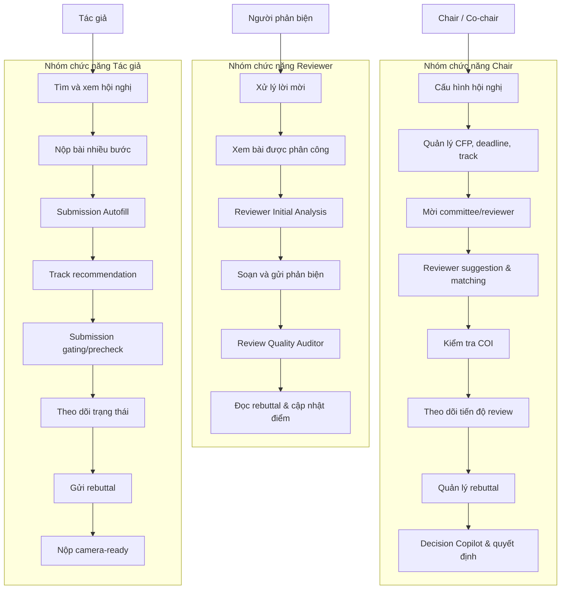

# Báo cáo danh sách chức năng hệ thống ConferenceSpace theo vai trò

## 1. Mẫu trình bày danh sách chức năng trong báo cáo phần mềm

Trong báo cáo phân tích và thiết kế phần mềm, danh sách chức năng thường không nên chỉ liệt kê tên màn hình. Cách trình bày rõ ràng hơn là kết hợp ba lớp thông tin:

1. **Sơ đồ use case theo vai trò:** cho người đọc thấy mỗi vai trò tương tác với nhóm chức năng nào.
2. **Bảng ma trận chức năng:** mỗi chức năng có mã, tên, vai trò, mô tả, đầu vào chính, đầu ra chính và ghi chú phụ thuộc.
3. **Luồng nghiệp vụ chính:** mô tả thứ tự thao tác end-to-end, ví dụ Author nộp bài -> Chair phân công -> Reviewer phản biện -> Author rebuttal -> Chair ra quyết định.

Mẫu bảng đề xuất:

| Mã | Nhóm chức năng | Chức năng | Vai trò | Mô tả | Đầu vào chính | Đầu ra chính | Phụ thuộc/Ghi chú |
| --- | --- | --- | --- | --- | --- | --- | --- |
| F-XXX-01 | Tên phân hệ | Tên chức năng | Role | Người dùng làm gì và hệ thống hỗ trợ gì | Dữ liệu/form/file | Bản ghi/trạng thái/thông báo | Điều kiện để chạy được |

Với ConferenceSpace, cách phù hợp nhất là trình bày theo **ba vai trò nghiệp vụ chính**: Chủ tọa/Đồng chủ tọa, Người phản biện và Tác giả; sau đó bổ sung nhóm chức năng dùng chung và vai trò PC đọc dữ liệu.

## 2. Phạm vi rà soát mã nguồn

Báo cáo này được tổng hợp từ các nguồn chính trong mã nguồn:

- Frontend route map: `frontend/lib/routes.ts`, `frontend/lib/navigation.ts`.
- Page routes: `frontend/app/role/author`, `frontend/app/role/reviewer`, `frontend/app/role/chair`.
- Component nghiệp vụ: `frontend/components/author`, `frontend/components/reviewer`, `frontend/components/chair`.
- API client frontend: `frontend/lib/api/*.ts`.
- Backend routes: `backend/cmd/server/main.go`.
- Controller/middleware backend: `backend/internal/controller`, `backend/internal/middleware/authorization.go`.
- AI service workflows: `ai-service/app/workflows/*`.
- UAT scripts: `docs/uat/test_script_author.md`, `docs/uat/test_script_reviewer.md`, `docs/uat/test_script_chair.md`.

## 3. Các vai trò người dùng

| Vai trò | Mục tiêu chính | Phạm vi quyền |
| --- | --- | --- |
| **Tác giả (Author)** | Tìm hội nghị, nộp bài, theo dõi trạng thái, phản hồi rebuttal và nộp camera-ready. | Quản lý bài nộp của chính mình, xem hội nghị công khai, tham gia discussion/rebuttal liên quan đến bài của mình. |
| **Người phản biện (Reviewer)** | Nhận lời mời, xem bài được phân công, viết phản biện chất lượng, phản hồi sau rebuttal. | Truy cập các assignment của chính mình, xem tệp bài được giao, lưu/gửi review, phản hồi rebuttal. |
| **Chủ tọa/Đồng chủ tọa (Chair/Co-chair)** | Tạo và điều hành hội nghị, mời reviewer, phân công, theo dõi review, mở rebuttal và ra quyết định. | Quản lý hội nghị mình phụ trách, xem bài nộp, reviewer, COI, review, discussion và quyết định cuối. |
| **PC Member** | Theo dõi thông tin hội nghị và bài nộp ở chế độ tham khảo. | Quyền đọc với một số màn hình Chair; không thực hiện thao tác thay đổi nghiệp vụ chính. |

## 4. Use case tổng quát theo vai trò

## 5. Danh sách chức năng dùng chung

| Mã | Chức năng | Vai trò | Mô tả | Ghi chú triển khai |
| --- | --- | --- | --- | --- |
| F-COM-01 | Đăng ký tài khoản | Tất cả | Người dùng tạo tài khoản bằng email, họ tên, mật khẩu và domain chuyên môn. | Backend `/api/v1/auth/register`; frontend `/register`. |
| F-COM-02 | Đăng nhập/đăng xuất | Tất cả | Xác thực bằng email/mật khẩu, lưu JWT và chuyển đến chọn vai trò. | Backend `/api/v1/auth/login`; frontend `/login`. |
| F-COM-03 | Xác thực email | Tất cả | Xác nhận email qua token để hoàn tất tài khoản. | Backend `/api/v1/auth/verify-email`; frontend `/verify-email`. |
| F-COM-04 | Quên/đặt lại/đổi mật khẩu | Tất cả | Gửi yêu cầu reset mật khẩu và đổi mật khẩu trong hồ sơ. | Backend `/forgot-password`, `/reset-password`, `/change-password`. |
| F-COM-05 | Chọn vai trò làm việc | Tất cả | Người dùng chọn Author, Reviewer hoặc Chair sau khi đăng nhập. | Frontend `/role`; các role mặc định mở cho người dùng. |
| F-COM-06 | Quản lý hồ sơ cá nhân | Tất cả | Xem/cập nhật họ tên, email, domain, affiliation và thông tin học thuật. | Frontend `/profile/[user_id]`; API `/api/v1/users/*`. |
| F-COM-07 | Liên kết Semantic Scholar | Tất cả | Đồng bộ hồ sơ học thuật, bài báo và keyword để hỗ trợ matching/COI. | API `/api/v1/users/link-academic-profile`, `/semantic-scholar/*`. |
| F-COM-08 | Thông báo trong ứng dụng | Tất cả | Xem, đánh dấu đã đọc, xóa và theo dõi số thông báo chưa đọc. | API `/api/v1/notifications`; WebSocket `/ws/notifications`. |
| F-COM-09 | Lịch/Schedules | Tất cả | Tổng hợp deadline hội nghị, submission, review, rebuttal và camera-ready. | Frontend có route schedules theo từng role. |
| F-COM-10 | Discussion thread | Author, Reviewer, Chair | Trao đổi theo bài nộp, có message và attachment. | API `/api/v1/threads/*`, `/submissions/:id/threads`. |
| F-COM-11 | Chatbot/Agent query | Tất cả | Hỏi đáp hoặc truy vấn dữ liệu hệ thống qua agent service. | Backend `/api/v1/agent/query`; frontend `/api/chat`. |
| F-COM-12 | Ghi nhận usage event | Tất cả | Ghi nhận sự kiện sử dụng để phân tích hành vi và đánh giá sản phẩm. | API `/api/v1/usage-events`. |

## 6. Danh sách chức năng vai trò Tác giả

| Mã | Nhóm chức năng | Chức năng | Mô tả | Đầu vào chính | Đầu ra chính/Trạng thái |
| --- | --- | --- | --- | --- | --- |
| F-AUTHOR-01 | Khám phá hội nghị | Xem danh sách hội nghị | Tác giả xem các hội nghị đang mở hoặc phù hợp với nhu cầu nộp bài. | Bộ lọc/search, role author. | Danh sách hội nghị, thông tin deadline/trạng thái. |
| F-AUTHOR-02 | Khám phá hội nghị | Tìm kiếm/lọc hội nghị | Tìm hội nghị theo tên, acronym, domain, track hoặc trạng thái. | Từ khóa, filter. | Danh sách hội nghị đã lọc. |
| F-AUTHOR-03 | Khám phá hội nghị | Bookmark hội nghị | Đánh dấu hội nghị quan tâm để quay lại nhanh. | Conference ID. | Trạng thái bookmark. |
| F-AUTHOR-04 | Chi tiết hội nghị | Xem Overview/CFP/Important Dates/Committee | Đọc mô tả, call for papers, deadline, track và ban tổ chức trước khi nộp. | Conference ID. | Trang chi tiết hội nghị. |
| F-AUTHOR-05 | Nộp bài | Tạo bài nộp mới | Khởi tạo submission khi hội nghị đang ở trạng thái `open`. | Conference ID, thông tin bài. | Submission draft hoặc submitted. |
| F-AUTHOR-06 | Nộp bài | Quy trình nộp bài nhiều bước | Form gồm Paper Details, Authors, Upload Manuscript, COI, Review & Submit. | Title, abstract, keyword, authors, file, COI. | Submission hoàn chỉnh. |
| F-AUTHOR-07 | AI hỗ trợ | Submission Autofill | Trích xuất metadata từ PDF/tệp nộp để tự điền title, abstract, keyword, author/material. | Manuscript file. | Gợi ý metadata có thể chỉnh sửa. |
| F-AUTHOR-08 | AI hỗ trợ | Gợi ý track | Phân tích title/abstract/keyword để đề xuất track phù hợp. | Title, abstract, keywords, conference tracks. | Danh sách track recommendation. |
| F-AUTHOR-09 | AI hỗ trợ | Submission precheck/gating | Kiểm tra bản thảo theo policy: định dạng, section, references, anonymization, scope, banned phrase. | File bài báo, policy hội nghị. | Kết quả accept/warning/blocker. |
| F-AUTHOR-10 | Nộp bài | Lưu nháp và autosave | Lưu submission chưa gửi chính thức, có autosave định kỳ. | Dữ liệu form hiện tại. | Draft submission, thời điểm lưu gần nhất. |
| F-AUTHOR-11 | Nộp bài | Gửi/publish bài | Chuyển bài từ draft sang chính thức khi đủ điều kiện. | Submission ID, confirmation. | Trạng thái submitted/published. |
| F-AUTHOR-12 | Quản lý bài nộp | Xem My Submissions | Xem các bài đã nộp hoặc lưu nháp của tài khoản. | Email người dùng. | Danh sách submission. |
| F-AUTHOR-13 | Quản lý bài nộp | Chỉnh sửa bài | Sửa thông tin hoặc tệp trước deadline hoặc khi policy cho phép. | Submission ID. | Submission được cập nhật. |
| F-AUTHOR-14 | Quản lý bài nộp | Rút bài | Rút submission khi còn trong điều kiện cho phép. | Submission ID, xác nhận. | Trạng thái withdrawn. |
| F-AUTHOR-15 | Theo dõi | Xem trạng thái bài | Theo dõi trạng thái draft/submitted/reviewing/accepted/rejected/withdrawn. | Submission ID. | Timeline/trạng thái hiện tại. |
| F-AUTHOR-16 | Rebuttal | Xem review và gửi rebuttal | Khi Chair mở rebuttal, tác giả viết phản hồi tổng quát và phản hồi từng điểm. | General response, point responses. | Rebuttal submitted. |
| F-AUTHOR-17 | Rebuttal | Theo dõi reviewer acknowledgment | Xem reviewer đã đọc/acknowledge phản hồi hay chưa. | Submission ID. | Tiến độ acknowledged. |
| F-AUTHOR-18 | Discussion | Thảo luận theo bài nộp | Trao đổi trong thread được mở cho bài nộp. | Message, attachment. | Message/thread mới. |
| F-AUTHOR-19 | Kết quả | Xem quyết định cuối | Xem kết quả accept/reject và thông tin liên quan sau khi Chair quyết định. | Submission ID. | Decision status. |
| F-AUTHOR-20 | Camera-ready | Nộp bản camera-ready | Với bài accepted, tác giả upload bản cuối trước deadline. | Final manuscript file. | Camera-ready file đã lưu. |

## 7. Danh sách chức năng vai trò Người phản biện

| Mã | Nhóm chức năng | Chức năng | Mô tả | Đầu vào chính | Đầu ra chính/Trạng thái |
| --- | --- | --- | --- | --- | --- |
| F-REV-01 | Dashboard | Xem dashboard reviewer | Tổng hợp assignment, lời mời, deadline và trạng thái review. | Reviewer email. | Dashboard dữ liệu cá nhân. |
| F-REV-02 | Lời mời | Xem lời mời phản biện | Xem committee invitation hoặc paper invitation. | Reviewer email. | Danh sách invitation. |
| F-REV-03 | Lời mời | Chấp nhận lời mời | Reviewer đồng ý tham gia committee hoặc nhận bài. | Assignment/invitation ID. | Trạng thái accepted. |
| F-REV-04 | Lời mời | Từ chối lời mời kèm lý do | Từ chối vì không đúng chuyên môn, bận, conflict, lịch hoặc lý do khác. | Reason, optional note. | Trạng thái declined/rejected. |
| F-REV-05 | Hội nghị | Xem hội nghị reviewer tham gia | Liệt kê các hội nghị mà reviewer đã accepted. | Reviewer email. | Danh sách conference. |
| F-REV-06 | Assignment | Xem bài được phân công | Xem title, abstract, keyword, track, deadline và trạng thái assignment. | Conference ID, reviewer email. | Danh sách bài được phân công. |
| F-REV-07 | Assignment | Tìm kiếm/lọc/sắp xếp bài | Lọc theo pending/accepted/declined/completed, sort theo deadline/title/status. | Search/filter/sort. | Danh sách bài đã lọc. |
| F-REV-08 | Assignment | Xem/tải manuscript | Reviewer tải hoặc preview file bài được giao. | Submission ID, conference ID. | File manuscript. |
| F-REV-09 | AI hỗ trợ | Reviewer Initial Analysis | AI tạo pre-read briefing, contribution, readiness signal, attention points và annotation. | Assignment ID, manuscript. | Artifact phân tích ban đầu. |
| F-REV-10 | Review | Nhập điểm tiêu chí | Chấm Originality, Technical Quality, Clarity, Significance, Methodology. | Điểm 1-10. | Review score trung bình. |
| F-REV-11 | Review | Nhập nhận xét chi tiết | Viết summary, strengths, weaknesses, questions for authors. | Nội dung review. | Review data. |
| F-REV-12 | Review | Chọn recommendation và confidence | Chọn accept/borderline/reject và mức tự tin. | Recommendation, confidence. | Kết luận reviewer. |
| F-REV-13 | Review | Lưu nháp phản biện | Lưu review chưa chính thức để tiếp tục sau. | Review draft. | Trạng thái draft. |
| F-REV-14 | AI hỗ trợ | Review Quality Auditor | Kiểm tra review quá ngắn, thiếu phân tích, thiếu weakness actionable, mâu thuẫn điểm/nhận xét, tone không phù hợp. | Review score/data. | Audit findings pass/warn/block. |
| F-REV-15 | Review | Gửi phản biện chính thức | Submit review sau validation và audit preflight. | Review data, status submitted. | Review submitted/completed. |
| F-REV-16 | Review | Override khi audit service lỗi | Cho phép xác nhận gửi nếu audit không chạy được nhưng backend cho phép override. | Confirmation. | Review submitted với audit override. |
| F-REV-17 | Rebuttal | Xem phản hồi tác giả | Đọc general response và per-point response trong phase rebuttal. | Submission/assignment ID. | Rebuttal panel. |
| F-REV-18 | Rebuttal | Acknowledge từng điểm | Đánh dấu phản hồi của tác giả là addressed/needs discussion kèm note. | Point ID, status, note. | Acknowledgment state. |
| F-REV-19 | Rebuttal | Cập nhật điểm sau rebuttal | Sau khi đọc rebuttal, reviewer có thể cập nhật score, recommendation và comment. | Score, recommendation, comment. | Post-rebuttal score. |
| F-REV-20 | Discussion | Tham gia thảo luận | Gửi/đọc message trong thread liên quan đến assignment/submission. | Message, attachment. | Discussion message. |
| F-REV-21 | Completed | Xem review đã hoàn thành | Theo dõi các bài đã submit review. | Reviewer email. | Danh sách completed reviews. |

## 8. Danh sách chức năng vai trò Chair/Co-chair

| Mã | Nhóm chức năng | Chức năng | Mô tả | Đầu vào chính | Đầu ra chính/Trạng thái |
| --- | --- | --- | --- | --- | --- |
| F-CHAIR-01 | Dashboard | Xem dashboard Chair | Tổng hợp số hội nghị, submission, tiến độ review, acceptance rate và action cần xử lý. | Role chair, danh sách hội nghị. | Dashboard metrics/action list. |
| F-CHAIR-02 | Hội nghị | Xem danh sách hội nghị quản lý | Liệt kê hội nghị mà người dùng là chair/co-chair. | User role/email. | Danh sách conference. |
| F-CHAIR-03 | Hội nghị | Tạo hội nghị mới | Wizard cấu hình basic info, topic/deadline, policy, CFP, committee, final review. | Conference form. | Conference draft/open. |
| F-CHAIR-04 | Template | Tạo hội nghị từ template | Dùng template cấu hình có sẵn để tạo nhanh hội nghị. | Template ID. | Conference form được prefill. |
| F-CHAIR-05 | Template | Lưu/quản lý template | Tạo, cập nhật, xóa template cấu hình hội nghị. | Template metadata/config. | Conference config template. |
| F-CHAIR-06 | Hội nghị | Chỉnh sửa hội nghị | Cập nhật thông tin, deadline, policy, CFP, committee. | Conference ID, update payload. | Conference updated. |
| F-CHAIR-07 | Hội nghị | Chuyển trạng thái hội nghị | Chuyển draft/open/reviewing/decision/closed/completed tùy workflow. | Conference ID, status. | Conference status mới. |
| F-CHAIR-08 | Chi tiết hội nghị | Xem overview/CFP/dates/committee | Theo dõi cấu hình và thông tin công khai của hội nghị. | Conference ID. | Tab chi tiết hội nghị. |
| F-CHAIR-09 | Committee | Mời reviewer/PC/co-chair | Mời user có sẵn hoặc email ngoài vào hội nghị. | Email, role. | Reviewer/committee invitation. |
| F-CHAIR-10 | Committee | Quản lý external invitation | Gửi, xem, xóa invitation cho người chưa có tài khoản. | Email, metadata, token. | External invitation pending/accepted. |
| F-CHAIR-11 | Committee | Quản lý trạng thái reviewer | Theo dõi pending/accepted/declined và xóa reviewer khỏi hội nghị. | Reviewer ID/status. | Reviewer state. |
| F-CHAIR-12 | Submission | Xem danh sách bài nộp | Tìm, lọc theo track/status và sort theo ID/title/score. | Search/filter/sort. | Bảng submission. |
| F-CHAIR-13 | Submission | Xem chi tiết bài nộp | Xem metadata, tác giả, file, review, timeline, discussion, history. | Conference ID, submission ID. | Trang submission detail. |
| F-CHAIR-14 | Submission | Cập nhật trạng thái/quyết định nhanh | Chuyển trạng thái accepted/rejected hoặc trạng thái xử lý khác. | Submission ID, status. | Submission decision/status. |
| F-CHAIR-15 | Assignment | Tạo gợi ý phân công | Chạy/đọc suggestion group cho từng submission. | Conference ID, submissions/reviewers. | Reviewer suggestions. |
| F-CHAIR-16 | Assignment | Xem match score và match detail | Xem điểm phù hợp, keyword overlap, tải reviewer và bằng chứng matching. | Suggestion/assignment metadata. | Giải thích phù hợp reviewer-paper. |
| F-CHAIR-17 | Assignment | Thêm reviewer thủ công | Thêm reviewer accepted vào suggestion của một submission. | Submission ID, reviewer ID. | Suggested assignment. |
| F-CHAIR-18 | Assignment | Xác nhận phân công | Confirm một hoặc nhiều suggestion để tạo assignment chính thức. | Assignment IDs. | Confirmed assignments. |
| F-CHAIR-19 | Assignment | Xóa suggestion | Loại reviewer khỏi danh sách gợi ý trước khi confirm. | Assignment ID. | Suggestion deleted. |
| F-CHAIR-20 | Assignment | Theo dõi phân công đã xác nhận | Xem reviewer invited/accepted/completed/incomplete theo từng submission. | Conference ID. | Confirmed assignment table. |
| F-CHAIR-21 | COI | Xem dashboard COI | Xem thống kê xung đột lợi ích trong hội nghị. | Conference ID. | COI stats. |
| F-CHAIR-22 | COI | Kiểm tra reviewer-author COI | Kiểm tra self-author, declared conflict và relationship graph nếu Neo4j có cấu hình. | Reviewer ID, author email. | COI report. |
| F-CHAIR-23 | COI | Rebuild COI relationship | Tính lại quan hệ COI cho hội nghị. | Conference ID. | COI relationships refreshed. |
| F-CHAIR-24 | Review | Xem review của submission | Xem danh sách review, score, recommendation, confidence và nội dung nhận xét. | Submission ID. | Review list/analytics. |
| F-CHAIR-25 | Review | Xem review analytics | Tổng hợp review progress và điểm trung bình. | Submission ID. | Review analytics. |
| F-CHAIR-26 | Rebuttal | Cấu hình rebuttal | Thiết lập phase, deadline, character limit và policy rebuttal. | Settings payload. | Rebuttal config. |
| F-CHAIR-27 | Rebuttal | Mở/finalize rebuttal | Chuyển phase rebuttal để tác giả gửi phản hồi và kết thúc giai đoạn. | Conference ID. | Rebuttal phase. |
| F-CHAIR-28 | Rebuttal | Mở discussion sau rebuttal | Cho phép thảo luận sâu hơn sau khi có phản hồi của tác giả. | Conference ID. | Discussion phase open. |
| F-CHAIR-29 | AI hỗ trợ | Chair Decision Copilot | AI tổng hợp metadata, review, rebuttal, discussion để hỗ trợ quyết định. | Submission context. | Decision brief/analysis. |
| F-CHAIR-30 | Decision | Ra quyết định cuối | Chair lưu quyết định accept/reject dựa trên review, rebuttal và judgment cuối. | Submission ID, status. | Final decision. |
| F-CHAIR-31 | Camera-ready | Kiểm tra bản camera-ready | Xem/tải bản cuối sau khi bài accepted. | Submission ID. | Camera-ready file. |
| F-CHAIR-32 | PC read-only | Cho PC xem dữ liệu hội nghị | PC có thể xem một số tab/tổng quan nhưng không có quyền chỉnh sửa. | Role `pc`. | Read-only view. |

## 9. Các workflow AI trong hệ thống

| Workflow | Vai trò hưởng lợi | Mục tiêu | Endpoint AI service |
| --- | --- | --- | --- |
| Submission Autofill | Author | Trích xuất metadata và vật liệu nộp bài từ manuscript. | `/api/v1/workflows/submission-autofill/runs` |
| Track Recommendation | Author | Gợi ý track dựa trên title, abstract, keyword và danh sách track hội nghị. | `/api/v1/workflows/track-recommendation/recommend` |
| Submission Material Gating | Author/Chair | Kiểm tra sơ bộ bản thảo theo policy hội nghị. | `/api/v1/workflows/submission-material-gating/runs` |
| Reviewer Initial Analysis | Reviewer | Tạo briefing ban đầu, điểm cần chú ý và annotation hỗ trợ đọc bài. | `/api/v1/workflows/reviewer-initial-analysis/resolve` |
| Review Quality Auditor | Reviewer/Chair | Kiểm tra chất lượng, độ đầy đủ và tính nhất quán của review. | `/api/v1/workflows/review-quality-auditor/resolve` |
| Chair Decision Copilot | Chair | Tổng hợp review/rebuttal/discussion để hỗ trợ quyết định. | `/api/v1/workflows/chair-decision-copilot/resolve` |
| Research Keywords | Hệ thống/Author | Trích xuất hoặc gợi ý keyword nghiên cứu. | `/api/v1/workflows/research-keywords/extract` |

Lưu ý: reviewer matching và COI detection không phụ thuộc hoàn toàn vào LLM. Matching được triển khai trong backend bằng thuật toán tương đồng có thể giải thích; COI dùng các detector xác định và có thể bổ sung Neo4j nếu cấu hình sẵn.

## 10. Luồng nghiệp vụ end-to-end đề xuất trong báo cáo

1. **Chair setup:** Chair tạo hội nghị, cấu hình CFP, deadline, track, policy và committee.
2. **Author submission:** Author tìm hội nghị, dùng autofill/track recommendation/precheck nếu cần, khai báo COI và gửi bài.
3. **Reviewer preparation:** Reviewer nhận lời mời, cập nhật profile/domain và chấp nhận tham gia.
4. **Assignment:** Chair xem reviewer suggestion, kiểm tra COI, điều chỉnh thủ công và xác nhận phân công.
5. **Review:** Reviewer dùng initial analysis, viết review, chạy audit, lưu nháp hoặc submit chính thức.
6. **Rebuttal:** Chair mở rebuttal, Author gửi phản hồi, Reviewer acknowledge và cập nhật điểm nếu cần.
7. **Decision:** Chair xem review analytics, dùng Decision Copilot, thảo luận nội bộ và ra quyết định.
8. **Camera-ready:** Nếu bài được chấp nhận, Author upload bản camera-ready và Chair kiểm tra.

## 11. Tóm tắt phạm vi chức năng

ConferenceSpace bao phủ đầy đủ vòng đời hội nghị học thuật theo ba vai trò chính:

- **Author:** tìm hội nghị, nộp bài nhiều bước, AI autofill, gợi ý track, precheck/gating, rebuttal và camera-ready.
- **Reviewer:** xử lý lời mời, xem bài được phân công, AI initial analysis, nhập review, review audit, discussion và post-rebuttal score.
- **Chair/Co-chair:** tạo/cấu hình hội nghị, template, reviewer invitation, reviewer matching, COI, assignment, review tracking, rebuttal management, decision copilot và final decision.

Điểm khác biệt chính của hệ thống là không chỉ có chức năng quản lý hội nghị cơ bản, mà còn tích hợp AI vào đúng các điểm có nhiều thao tác thủ công: tự điền submission, kiểm tra bản thảo, hỗ trợ reviewer đọc bài, kiểm tra chất lượng review và tổng hợp quyết định cho Chair.
