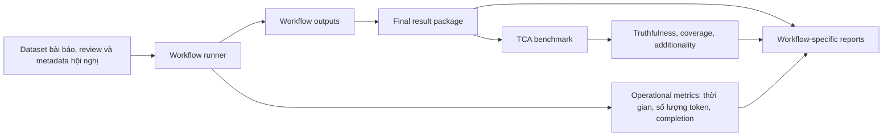
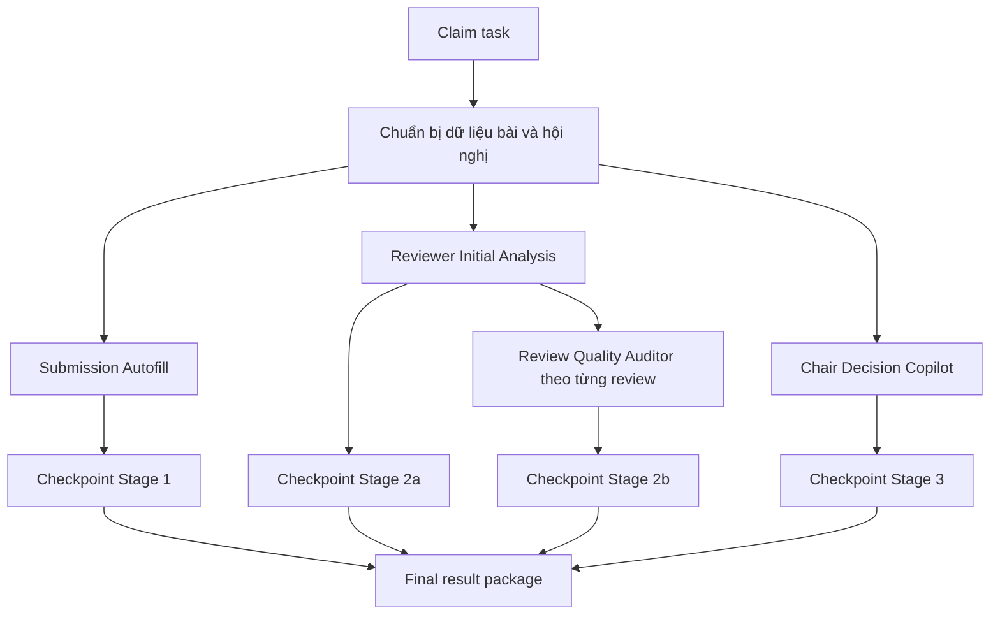
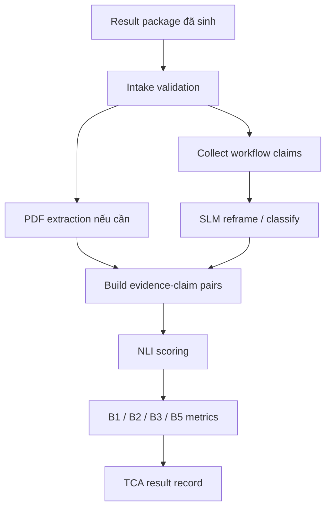
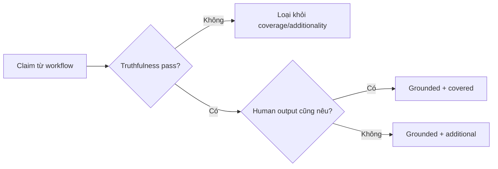

# Môi trường, kiến trúc và phương pháp benchmark các workflow AI

## 1. Mục đích của tài liệu

Tài liệu này mô tả môi trường thực nghiệm, kiến trúc benchmark và luồng xử lý phía sau các kết quả đánh giá workflow AI của ConferenceSpace. Mục tiêu không phải là lặp lại kết quả của từng workflow, mà là giải thích vì sao setup benchmark có thể được xem là hợp lý, có kiểm soát và đủ tin cậy để làm cơ sở cho các báo cáo kết quả.

Các benchmark workflow AI trong đề tài được tạo từ hai lần chạy chính. Lần thứ nhất là **workflow runner**, dùng để chạy các workflow trên dataset, sinh đầu ra thật, lưu thời gian xử lý, số lượng token và các metric deterministic có thể tính trực tiếp. Lần thứ hai là **TCA benchmark**, dùng để đánh giá lại các đầu ra đã sinh ở lần thứ nhất theo các tiêu chí truthfulness, coverage và additionality.

Việc tách hai lần chạy này là điểm quan trọng của thiết kế benchmark. Workflow runner đóng vai trò hệ thống sinh kết quả. TCA benchmark đóng vai trò hệ thống đánh giá hậu kiểm trên kết quả đã lưu. Nhờ đó, báo cáo không trộn lẫn giữa “khả năng tạo output” và “độ đáng tin của output”.

## 2. Nguyên tắc thiết kế benchmark

Benchmark được thiết kế theo bốn nguyên tắc.

Thứ nhất, **đo đúng bản chất của từng workflow**. Submission Autofill tạo metadata có dữ liệu tham chiếu rõ, nên có thể dùng exact match, F1 và ROUGE. Reviewer Initial Analysis, Review Quality Auditor và Chair Decision Copilot tạo đầu ra tự luận, nên cần đánh giá theo độ bám chứng cứ, độ trùng với nhận xét của con người và giá trị bổ sung. Chatbot Agent là trợ lý nền tảng, nên cần đọc theo outcome workflow, quyền truy cập, tool-call success và trải nghiệm stream.

Thứ hai, **không dùng một metric chung cho mọi đầu ra AI**. Một con số “accuracy” duy nhất sẽ gây hiểu nhầm vì các workflow không cùng bản chất. Metadata extraction có thể chấm gần như deterministic; review support và chair support chỉ có thể chấm theo các lớp claim/evidence; chatbot cần manual evidence-based review.

Thứ ba, **lưu lại output trước khi đánh giá**. Các kết quả workflow được lưu thành result package. TCA benchmark đọc lại result package này để đánh giá, thay vì đánh giá tạm thời trong cùng một ngữ cảnh sinh output. Điều này giúp giảm nguy cơ benchmark chỉ phản ánh một lần chạy ad hoc.

Thứ tư, **giới hạn kết luận theo bằng chứng có thật**. Nếu một metric chưa có ground truth hoặc chưa có nhãn người đánh giá, báo cáo không suy diễn thành độ chính xác chuyên môn. Ví dụ, track recommendation hiện có bằng chứng về tính hoàn tất và track hợp lệ, nhưng chưa đủ cơ sở để kết luận top-1 accuracy theo lựa chọn của chuyên gia.

## 3. Tổng quan kiến trúc hai lần chạy

Luồng benchmark có thể hiểu theo thứ tự sau:

1. Dataset đầu vào chứa bài nộp, metadata, review, rebuttal, metareview và ngữ cảnh hội nghị.
2. Workflow runner chạy các workflow AI để tạo output thật cho từng bài.
3. Workflow runner lưu output, metric vận hành và các metric deterministic có thể tính trực tiếp.
4. Result package đã hoàn tất được dùng làm đầu vào cho TCA benchmark.
5. TCA benchmark đọc output đã sinh, tách các claim cần kiểm tra, đối chiếu với nguồn dữ liệu liên quan và tạo metric đánh giá chất lượng.
6. Các báo cáo workflow sử dụng cả hai nhóm bằng chứng: vận hành từ workflow runner và chất lượng hậu kiểm từ TCA benchmark.

Thiết kế này giúp người đọc phân biệt rõ “workflow có chạy và sinh output được không” với “output đó có đáng tin và hữu ích không”.

## 4. Nguồn gốc và cách chọn dataset

Dataset benchmark được xây dựng bằng cách chọn lọc phần phù hợp nhất từ bộ dữ liệu gốc **ReviewRebuttal** trên Hugging Face: [Daoze/ReviewRebuttal](https://huggingface.co/datasets/Daoze/ReviewRebuttal). Bộ dữ liệu này gắn với bài báo [Re2: A Consistency-ensured Dataset for Full-stage Peer Review and Multi-turn Rebuttal Discussions](https://arxiv.org/abs/2505.07920), được công bố trên arXiv với mã 2505.07920.

Theo mô tả của dataset và bài báo gốc, Re2/ReviewRebuttal là bộ dữ liệu peer review nhiều giai đoạn, bao gồm bài nộp ban đầu, review, điểm số, confidence, rebuttal, thảo luận, metareview và quyết định cuối cùng. Bài báo gốc mô tả bộ dữ liệu ở quy mô 19,926 initial submissions, 70,668 review comments và 53,818 rebuttals từ các venue trên OpenReview. Đây là nguồn dữ liệu phù hợp với ConferenceSpace vì cấu trúc của nó gần với vòng đời mà hệ thống cần hỗ trợ: submission, review, rebuttal, metareview và chair decision.

Tuy nhiên, benchmark của ConferenceSpace không dùng toàn bộ dataset gốc. Nhóm chọn lọc một tập con phù hợp với mục tiêu đánh giá workflow AI. Các bản ghi được ưu tiên khi có đủ dữ liệu để tái tạo luồng xử lý của nền tảng, gồm metadata bài nộp, nội dung review, thông tin rebuttal/metareview khi có, conference context và khả năng truy xuất hoặc trích xuất nội dung bài. Việc chọn lọc này nhằm đảm bảo mỗi workflow có đầu vào đúng với phạm vi thiết kế, thay vì ép benchmark chạy trên các bản ghi thiếu dữ liệu hoặc không đủ điều kiện đánh giá.

Kết quả chọn lọc tạo thành dataset workflow runner gồm 1,127 bài. Đây là tập dữ liệu được dùng để sinh output workflow thật. Sau đó, 1,097 bản ghi đủ điều kiện được đưa vào TCA benchmark để đánh giá chất lượng hậu kiểm. Sự khác biệt giữa hai con số này phản ánh điều kiện đánh giá của TCA: không phải mọi output đã sinh đều có đủ dữ liệu cần thiết cho mọi metric truthfulness, coverage hoặc additionality.

Việc dùng tập con chọn lọc có hai lợi ích. Thứ nhất, benchmark tập trung vào các trường hợp có đủ bằng chứng để đánh giá thay vì tạo metric trên dữ liệu thiếu. Thứ hai, tập dữ liệu vẫn giữ được tính thực tế vì bắt nguồn từ một dataset peer review thật, có cấu trúc gần với quy trình hội nghị học thuật mà ConferenceSpace mô phỏng.

Giới hạn của cách chọn này là benchmark không đại diện cho toàn bộ phân bố của ReviewRebuttal. Các kết quả trong báo cáo nên được hiểu là kết quả trên tập phù hợp nhất cho workflow benchmark, không phải kết luận thống kê cho toàn bộ 19,926 bài trong dataset gốc.

## 5. Môi trường và cấu hình mô hình

### 5.1. Workflow runner

Trong đợt benchmark này, workflow runner dùng router mô hình với cấu hình sinh kết quả bằng **Gemini 3.1 Flash Lite**. Đây là lựa chọn phù hợp cho benchmark quy mô lớn vì mục tiêu của lần chạy đầu tiên là sinh output workflow nhất quán trên nhiều bài, đồng thời đo được độ trễ và số lượng token ở điều kiện vận hành thực tế.

Workflow runner không dùng mô hình để tự chấm các metric semantic của chính nó. Nó chỉ sinh output workflow và ghi nhận các metadata vận hành như thời gian gọi mô hình, số lượng token input/output và thời gian hoàn tất task. Với Submission Autofill, workflow runner đồng thời tính các metric deterministic vì metadata có dữ liệu tham chiếu rõ.

### 5.2. TCA benchmark

TCA benchmark dùng đúng cấu hình được triển khai trong source code của module benchmark. Thành phần đánh giá chính là mô hình NLI **ModernCE-large-nli**, dùng để kiểm tra quan hệ giữa claim và evidence. Worker TCA cũng dùng hai mô hình nhỏ để chuẩn hóa claim trước khi đưa vào NLI:

| Thành phần | Vai trò trong benchmark |
| --- | --- |
| ModernCE-large-nli | Kiểm tra entailment giữa evidence và claim |
| Qwen 3.5 2B | Chuyển attention point hoặc rationale thành claim rõ hơn để NLI có thể kiểm tra |
| Qwen 3.5 0.8B | Phân loại claim kỹ thuật hoặc hành chính, và hỗ trợ một số bước phân loại chất lượng dữ liệu |

Worker TCA trong source code được cấu hình chạy trong môi trường GPU cloud, với GPU L4, 2 CPU, 4 GB RAM và thời gian xử lý tối đa 3600 giây cho một worker. NLI engine dùng context length 8192 token và batch size an toàn theo thiết bị thực tế. Dispatcher TCA dùng cơ chế lease 30 phút và tối đa 3 attempts cho mỗi task.

Các thông số này quan trọng vì TCA không phải là phần chấm thủ công rời rạc. Nó là một pipeline đánh giá có cấu hình rõ ràng, có mô hình kiểm tra claim/evidence riêng, có retry, có task state và có kết quả lưu lại theo từng bài.

## 6. Kiến trúc workflow runner

Workflow runner được tổ chức theo mô hình dispatcher-worker. Dispatcher quản lý danh sách task, trạng thái xử lý và kết quả hoàn tất. Worker nhận task, chuẩn bị dữ liệu đầu vào cho từng workflow, gọi workflow tương ứng, lưu checkpoint sau từng stage và cuối cùng tạo result package.

Một task tương ứng với một bài. Mỗi task có thể đi qua các stage chính:

| Stage | Workflow | Vai trò |
| --- | --- | --- |
| Stage 1 | Submission Autofill | Tự động điền metadata và track ranking nếu có ngữ cảnh track |
| Stage 2a | Reviewer Initial Analysis | Tạo briefing và annotation hỗ trợ reviewer |
| Stage 2b | Review Quality Auditor | Audit từng review liên quan đến bài |
| Stage 3 | Chair Decision Copilot | Tạo decision brief hỗ trợ chair |

Workflow runner có một điểm thiết kế đáng chú ý: một số stage có thể chạy song song khi không phụ thuộc trực tiếp vào nhau. Submission Autofill, Reviewer Initial Analysis và Chair Decision Copilot có thể được khởi chạy độc lập trên cùng task. Review Quality Auditor chạy sau khi có Reviewer Initial Analysis, vì auditor cần sử dụng một phần bối cảnh phân tích để audit review tốt hơn.

Sau mỗi stage, worker ghi checkpoint. Nếu task lỗi, lỗi được lưu lại thay vì im lặng bỏ qua. Nếu task hoàn tất, result package được validate và serialize theo schema ổn định. Result package cuối cùng chỉ giữ các phần cần thiết cho benchmark và báo cáo: nguồn dữ liệu, output của từng workflow, metric của từng workflow và thống kê vận hành.

Thiết kế checkpoint giúp benchmark có khả năng quan sát lỗi và tiến độ theo stage. Điều này quan trọng khi chạy trên hơn một nghìn bài, vì một lỗi ở một workflow không nên làm mất toàn bộ bối cảnh đánh giá.

## 7. Result package từ workflow runner

Result package là cầu nối giữa workflow runner và TCA benchmark. Nó lưu ba nhóm thông tin chính.

Nhóm thứ nhất là **source context**, gồm dữ liệu bài nộp, review/rebuttal và thông tin hội nghị. Đây là nguồn tham chiếu chung cho các workflow và cho bước đánh giá sau.

Nhóm thứ hai là **workflow output**, tức đầu ra thật mà workflow tạo ra. Ví dụ, Submission Autofill lưu fields, authors và track rankings; Reviewer Initial Analysis lưu briefing và annotations; Review Quality Auditor lưu findings; Chair Decision Copilot lưu evidence summary và disagreement map.

Nhóm thứ ba là **metrics và stats**, gồm metric deterministic của Submission Autofill, metadata gọi mô hình của từng workflow, tổng thời gian, tổng số lượng token và các thống kê vận hành theo vai trò.

Điểm quan trọng là result package không lưu các artifact debug không cần thiết vào báo cáo cuối. Nó giữ một contract công khai đủ gọn để TCA benchmark và report generation cùng đọc được, đồng thời tránh trộn dữ liệu nguồn với dữ liệu đánh giá.

## 8. Kiến trúc TCA benchmark

TCA benchmark cũng dùng kiến trúc dispatcher-worker, nhưng mục tiêu khác workflow runner. Nó không sinh lại output workflow. Nó đọc result package đã có và đánh giá chất lượng các output đó.

Mỗi task TCA tương ứng với một bài. Worker xử lý một bài theo các bước:

1. Kiểm tra dữ liệu đầu vào có đủ điều kiện benchmark hay không.
2. Tải và trích xuất nội dung paper nếu metric cần đối chiếu với toàn văn.
3. Thu thập các claim cần kiểm tra từ output workflow.
4. Chuyển các claim khó kiểm tra về dạng phát biểu rõ hơn khi cần.
5. Tạo các cặp evidence-claim cho NLI.
6. Chạy NLI để tính entailment score.
7. Tổng hợp kết quả theo từng nhóm benchmark B1, B2, B3 và B5.
8. Lưu kết quả TCA cùng metadata chất lượng dữ liệu.

TCA benchmark có bốn nhóm đánh giá chính:

| Nhóm | Workflow được đánh giá | Câu hỏi đánh giá |
| --- | --- | --- |
| B1 | Reviewer Initial Analysis | Các quote/annotation có thật trong paper không? |
| B2 | Reviewer Initial Analysis | Attention points có đúng với paper, có trùng hoặc bổ sung so với reviewer không? |
| B3 | Review Quality Auditor | Findings có đúng với review và có hợp lệ theo loại lỗi không? |
| B5 | Chair Decision Copilot | Evidence basis và disagreement map có bám vào review/metareview không? |

Với B1, benchmark dùng đối chiếu deterministic vì quote có thể kiểm tra trực tiếp trong text. Với B2, B3 và B5, benchmark dùng NLI vì đầu ra là claim tự nhiên, cần kiểm tra quan hệ giữa claim và evidence thay vì so khớp chuỗi đơn giản.

## 9. Truthfulness, Coverage và Additionality

TCA là viết tắt của ba lớp đánh giá: Truthfulness, Coverage và Additionality.

**Truthfulness** trả lời câu hỏi: claim của workflow có được hỗ trợ bởi nguồn dữ liệu không? Đây là lớp quan trọng nhất. Nếu claim không grounded, nó không được dùng để tính coverage hoặc additionality, vì một claim bịa nhưng tình cờ giống nhận xét của con người không nên được tính là đúng.

**Coverage** trả lời câu hỏi: trong các claim đã grounded, có bao nhiêu claim cũng xuất hiện trong output của con người, chẳng hạn review hoặc metareview? Chỉ số này đo mức giao nhau giữa workflow và chuyên gia.

**Additionality** trả lời câu hỏi: trong các claim đã grounded, có bao nhiêu claim chỉ workflow nêu ra mà con người không viết rõ? Chỉ số này giúp đo giá trị bổ sung của workflow, nhưng cần đọc thận trọng vì con người có thể đã cân nhắc một ý nhưng không ghi vào review hoặc metareview.

Cách tổ chức này giúp benchmark không đánh đồng ba khái niệm khác nhau: đúng với nguồn, trùng với con người, và bổ sung ngoài phần con người viết.

## 10. Vì sao setup này đáng tin cậy

Setup benchmark có năm điểm làm tăng độ tin cậy.

Thứ nhất, **generator và evaluator được tách rời**. Workflow runner sinh output bằng router mô hình được cấu hình cho đợt benchmark. TCA benchmark đọc lại output đã lưu và đánh giá bằng pipeline riêng. Điều này hạn chế việc một hệ thống vừa tự tạo vừa tự hợp thức hóa kết quả trong cùng một bước.

Thứ hai, **kết quả được lưu theo artifact ổn định**. Result package là nguồn dữ liệu trung gian giữa hai lần chạy. Nhờ đó, nếu cần review lại một kết quả, người đánh giá có thể truy ngược từ metric về output workflow và source context tương ứng.

Thứ ba, **metric được chọn theo bản chất đầu ra**. Metadata extraction dùng metric deterministic; annotation quote dùng string matching; claim tự luận dùng NLI; chatbot dùng manual workflow review. Đây là lựa chọn hợp lý hơn việc ép mọi workflow vào một điểm accuracy chung.

Thứ tư, **pipeline có cơ chế task state và retry**. Dispatcher quản lý task, lease, attempt và trạng thái hoàn tất/thất bại. Thiết kế này giúp benchmark quy mô lớn ít phụ thuộc vào thao tác thủ công và có thể quan sát được lỗi thay vì bỏ qua.

Thứ năm, **giới hạn được nêu rõ trong báo cáo**. Với các workflow không có ground truth tuyệt đối, báo cáo chỉ kết luận trong phạm vi metric đo được. Ví dụ, Chair Decision Copilot được đánh giá là hỗ trợ tổng hợp evidence, không được trình bày như bộ phân loại quyết định accept/reject.

## 11. Những gì setup này không chứng minh

Setup benchmark này không chứng minh rằng AI có thể thay reviewer đọc và đánh giá bài báo. Nó chỉ chứng minh các workflow AI có thể hỗ trợ một số bước cụ thể trong quy trình peer review.

Setup này cũng không chứng minh quyết định accept/reject cuối cùng là đúng. Chair Decision Copilot không được benchmark bằng decision label match trong kết quả hiện tại, nên mọi kết luận phải dừng ở mức hỗ trợ evidence synthesis.

TCA không thay thế đánh giá chuyên gia. NLI có thể bỏ sót các claim đúng nhưng diễn đạt khác, hoặc đánh giá thấp các suy luận kỹ thuật phức tạp. Vì vậy, truthfulness score nên được đọc như tín hiệu groundedness/hallucination risk, không phải bản án tuyệt đối về đúng sai học thuật.

Coverage thấp cũng không tự động có nghĩa workflow kém. Review và metareview của con người thường là bản ghi chọn lọc, không phải danh sách đầy đủ mọi điều họ đã cân nhắc. Một claim grounded nhưng không xuất hiện trong metareview có thể là giá trị bổ sung thật, cũng có thể chỉ là điểm không quan trọng với chair.

Cuối cùng, benchmark này không đo tác động dài hạn của AI lên văn hóa phản biện, trách nhiệm học thuật, hay độ công bằng của quyết định hội nghị. Những vấn đề đó cần nghiên cứu người dùng và thực nghiệm vận hành dài hạn hơn.

## 12. Mapping giữa workflow, nguồn số liệu và kết luận được phép rút ra

| Workflow | Nguồn số liệu chính | Metric chính | Kết luận được phép rút ra |
| --- | --- | --- | --- |
| Submission Autofill | Workflow runner | Title match, token F1, ROUGE, author/keyword F1, completion rate | Workflow hỗ trợ điền metadata tốt đến mức nào |
| Track recommendation trong Autofill | Benchmark hợp đồng riêng | Completion, invalid track rate | Workflow có gợi ý track hợp lệ không; chưa kết luận accuracy chuyên gia |
| Submission Gating | Rule/steering benchmark | Verdict accuracy, rule recall, false block, contract violation | Rule check có đáng tin không; steering có giữ đúng phạm vi không |
| Reviewer Initial Analysis | Workflow runner + TCA | Quote grounded rate, fabrication rate, attention truthfulness, coverage, additionality | Workflow hỗ trợ reviewer định hướng đọc bài đáng tin đến đâu |
| Review Quality Auditor | Workflow runner + TCA | Finding count, status distribution, truthfulness, validity, grounded-valid rate | Workflow phát hiện rủi ro review hữu ích đến đâu và nhiễu ở mức nào |
| Chair Decision Copilot | Workflow runner + TCA | Evidence truthfulness, disagreement truthfulness, additionality, high-risk rate | Workflow hỗ trợ chair tổng hợp evidence tốt đến đâu |
| Chatbot Agent | Manual evidence-based benchmark | Workflow outcome, tool-call success, permission safety, TTFT, stream duration | Chatbot hỗ trợ navigate và thao tác platform tốt đến đâu |

## 13. Cách đọc kết quả trong Chương 5

Khi đọc các báo cáo benchmark workflow, cần đọc theo thứ tự sau.

Trước hết, xem dataset và mẫu số. Một metric trên 1,127 bài có ý nghĩa khác một metric trên 24 scenario. Báo cáo phải nêu rõ mẫu số và phạm vi của từng kết quả.

Tiếp theo, xem metric thuộc loại nào. Metric deterministic như title exact match có thể đọc gần như trực tiếp. Metric TCA cần đọc như tín hiệu hậu kiểm claim/evidence. Manual chatbot review cần đọc như đánh giá workflow outcome theo kịch bản.

Sau đó, xem giới hạn của từng workflow. Một kết quả tốt ở groundedness không có nghĩa workflow thay được con người. Một kết quả tốt ở latency không có nghĩa output đúng. Một tỷ lệ tool-call thất bại không tự động làm workflow thất bại nếu chatbot tự phục hồi và câu trả lời cuối đúng.

Cuối cùng, kết luận phải quay lại nguyên tắc thiết kế của đề tài: AI trong ConferenceSpace là lớp hỗ trợ, không phải lớp quyết định học thuật cuối cùng. Benchmark được thiết kế để chứng minh tính hữu ích và giới hạn của lớp hỗ trợ đó, chứ không chứng minh khả năng tự động hóa toàn bộ peer review.

## 14. Kết luận

Thiết lập benchmark của ConferenceSpace hợp lý vì tách rõ ba lớp: dữ liệu đầu vào, workflow sinh output và benchmark đánh giá output. Workflow runner tạo kết quả thực tế trên dataset và ghi lại chi phí vận hành. TCA benchmark đánh giá lại các kết quả đã sinh bằng pipeline kiểm tra claim/evidence có cấu hình rõ ràng. Chatbot Agent được đánh giá riêng theo manual evidence-based review vì bản chất là workflow tương tác với nền tảng.

Với setup này, các kết quả benchmark có thể được trình bày như bằng chứng thực nghiệm có kiểm soát cho năng lực hỗ trợ của các workflow AI. Đồng thời, setup cũng đặt ranh giới rõ ràng: hệ thống hỗ trợ nhập liệu, đọc hiểu, kiểm tra và tổng hợp; quyết định học thuật cuối cùng vẫn thuộc về con người.
