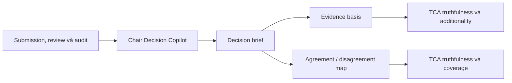

# Báo cáo benchmark workflow Chair Decision Copilot

## 1. Mục tiêu đánh giá

Benchmark này đánh giá workflow Chair Decision Copilot trong vai trò hỗ trợ chair tổng hợp evidence trước khi ra quyết định. Workflow không thay chair quyết định nhận hay loại bài. Mục tiêu là giúp chair đọc nhanh bức tranh tổng thể: điểm mạnh, điểm yếu, vùng đồng thuận, vùng bất đồng, câu hỏi còn mở và cơ sở chứng cứ liên quan đến bài nộp.

Một workflow chair copilot tốt cần có hai phẩm chất. Thứ nhất, nó phải bám vào thông tin có sẵn từ bài, review và các phân tích trước đó. Thứ hai, nó phải giúp chair nhìn thấy cấu trúc quyết định thay vì chỉ viết lại một đoạn tóm tắt chung chung. Vì vậy, benchmark tập trung vào độ bám chứng cứ, khả năng tạo bản đồ bất đồng và mức độ bổ sung thông tin hữu ích cho chair.

## 2. Dataset đầu vào cho benchmark

Workflow runner chạy trên 1,127 bài nộp. Mỗi bài có bối cảnh liên quan đến nội dung submission, phân tích reviewer, audit review và các thông tin hỗ trợ quyết định. Kết quả sinh ra được dùng để đo thời gian, số lượng token và cấu trúc đầu ra.

Sau đó, 1,097 kết quả đủ điều kiện được đưa vào TCA benchmark để đánh giá độ đúng và độ hữu ích của evidence basis và disagreement map.

| Nhóm dữ liệu | Số bài | Vai trò trong benchmark |
| --- | ---: | --- |
| Lượt chạy workflow runner | 1,127 | Sinh decision brief và đo vận hành |
| Lượt đánh giá TCA | 1,097 | Đánh giá truthfulness, coverage, additionality và rủi ro cao |

Báo cáo không dùng chỉ số khớp nhãn quyết định vì kết quả benchmark hiện tại không có trường đo decision label match đủ tin cậy. Do đó, workflow được đánh giá như công cụ hỗ trợ chair tổng hợp evidence, không như bộ phân loại quyết định accept/reject.

## 3. Cách thức benchmark

Benchmark gồm hai lần chạy. Lần thứ nhất chạy workflow trên từng bài để sinh bản hỗ trợ chair. Đầu ra được kiểm tra ở các khía cạnh cấu trúc: số evidence basis item, số điểm mạnh, điểm yếu, câu hỏi cần làm rõ, vùng đồng thuận, vùng bất đồng và unresolved concerns.

Lần thứ hai chạy TCA benchmark trên đầu ra đã sinh. TCA đánh giá hai nhóm nội dung quan trọng nhất của workflow: evidence basis và disagreement map. Evidence basis cần đúng với nguồn và hữu ích cho quyết định. Disagreement map cần phản ánh các điểm reviewer hoặc tín hiệu đánh giá chưa thống nhất, không bịa thêm xung đột không có trong dữ liệu.

Phương pháp này phù hợp với vai trò của chair copilot. Hệ thống không bị chấm theo việc có đoán đúng quyết định cuối cùng hay không, vì quyết định cuối cùng phụ thuộc vào tiêu chí hội nghị, quota, chiến lược chương trình và đánh giá trách nhiệm của chair. Thay vào đó, benchmark đo xem workflow có tạo được bản đồ evidence đáng tin để chair ra quyết định tốt hơn hay không.

## 4. Metrics

| Metric | Ý nghĩa |
| --- | --- |
| Thời gian xử lý | Thời gian tạo decision brief cho một bài |
| Số lượng token | Số token sử dụng để sinh decision brief |
| Evidence basis items | Số luận điểm/chứng cứ được đưa vào nền tảng quyết định |
| Strengths / weaknesses | Số điểm mạnh và điểm yếu được tổng hợp |
| Questions | Số câu hỏi hoặc vấn đề cần chair làm rõ |
| Areas of agreement | Số vùng đồng thuận giữa các nguồn đánh giá |
| Areas of disagreement | Số vùng bất đồng giữa các nguồn đánh giá |
| Unresolved concerns | Số vấn đề còn mở sau khi tổng hợp |
| Evidence truthfulness | Tỷ lệ evidence basis đúng với dữ liệu nguồn |
| Evidence additionality | Tỷ lệ evidence đúng và bổ sung giá trị cho chair |
| High-risk rate | Tỷ lệ bài có đầu ra bị đánh dấu rủi ro cao trong TCA |
| Disagreement truthfulness | Tỷ lệ bản đồ bất đồng phản ánh đúng dữ liệu |
| Disagreement coverage | Tỷ lệ bất đồng quan trọng được bao phủ |

## 5. Kết quả

### 5.1. Kết quả vận hành từ workflow runner

| Chỉ số | Trung bình | Trung vị | Thấp nhất | Cao nhất |
| --- | ---: | ---: | ---: | ---: |
| Thời gian xử lý | 21.68 giây | 20.59 giây | 12.81 giây | 116.74 giây |
| Số lượng token | 6,242 token | 6,224 token | 4,084 token | 11,203 token |
| Evidence basis items | 6.18 | 6.00 | 3.00 | 11.00 |
| Strengths | 4.30 | - | - | - |
| Weaknesses | 5.13 | - | - | - |
| Questions | 4.62 | - | - | - |
| Areas of agreement | 3.79 | - | - | - |
| Areas of disagreement | 3.18 | - | - | - |
| Unresolved concerns | 4.32 | - | - | - |

Workflow tạo decision brief có cấu trúc khá đầy đủ. Trung bình mỗi bài có hơn 6 evidence basis item, hơn 4 điểm mạnh, hơn 5 điểm yếu và hơn 4 câu hỏi hoặc vấn đề cần làm rõ. Điều này cho thấy đầu ra không chỉ là một bản tóm tắt ngắn, mà là một bản hỗ trợ quyết định có nhiều phần phục vụ chair.

### 5.2. Kết quả TCA

| Chỉ số TCA | Trung bình | Trung vị | Thấp nhất | Cao nhất |
| --- | ---: | ---: | ---: | ---: |
| Evidence basis truthfulness | 87.34% | 100.00% | 0.00% | 100.00% |
| Evidence basis coverage | 5.27% | 0.00% | 0.00% | 100.00% |
| Evidence basis additionality | 91.63% | 100.00% | 0.00% | 100.00% |
| High-risk rate | 1.28% | - | - | - |
| Disagreement map truthfulness | 87.11% | 100.00% | 0.00% | 100.00% |
| Disagreement map coverage | 13.82% | 0.00% | 0.00% | 100.00% |

Evidence basis truthfulness đạt 87.34% và disagreement map truthfulness đạt 87.11%. Đây là kết quả tích cực vì hai phần này là trung tâm của workflow. Additionality của evidence basis đạt 91.63%, cho thấy nhiều luận điểm không chỉ đúng mà còn bổ sung góc nhìn hữu ích cho chair so với phần tham chiếu được dùng trong benchmark.

Coverage thấp ở cả evidence basis và disagreement map cần được đọc đúng bối cảnh. Chair decision brief không nhất thiết phải lặp lại toàn bộ metareview hoặc mọi nhận xét của reviewer. Nó được thiết kế để tổ chức evidence theo hướng ra quyết định. Vì vậy, coverage thấp kết hợp với truthfulness và additionality cao cho thấy workflow thường tạo ra các điểm đúng và bổ sung, nhưng không bao phủ hết toàn bộ nội dung mà con người có thể viết trong quyết định.

High-risk rate khoảng 1.28%, tương đương xấp xỉ 14 bài trong tập TCA. Đây là nhóm cần kiểm tra kỹ, vì với workflow hỗ trợ quyết định, một số ít trường hợp rủi ro cao vẫn có thể ảnh hưởng lớn nếu chair tin dùng không kiểm tra.

## 6. Diễn giải ý nghĩa

Chair Decision Copilot có giá trị rõ ở vai trò tổng hợp evidence. Nó tạo bản brief có cấu trúc, giúp chair thấy đồng thuận, bất đồng, điểm mạnh, điểm yếu và vấn đề còn mở. Về mặt vận hành, thời gian trung bình 21.68 giây phù hợp với một tác vụ hỗ trợ chair, đặc biệt nếu được chạy trước khi chair mở màn hình quyết định.

TCA cho thấy đầu ra có độ truthfulness khá cao ở hai phần quan trọng nhất. Đây là bằng chứng workflow có thể dùng để tăng tốc quá trình đọc và tổng hợp, miễn là chair hiểu rằng đây là bản hỗ trợ, không phải phán quyết. Additionality cao là điểm đáng chú ý: workflow có thể nêu thêm các luận điểm hữu ích thay vì chỉ sao chép review.

Tuy nhiên, báo cáo không nên khẳng định workflow “ra quyết định đúng”. Kết quả hiện tại không có metric khớp nhãn quyết định cuối cùng. Hơn nữa, trong bối cảnh hội nghị, quyết định cuối cùng phụ thuộc vào nhiều yếu tố ngoài nội dung từng bài. Cách trình bày đúng là workflow hỗ trợ chair ra quyết định bằng cách cung cấp bản đồ evidence đáng tin ở mức tương đối cao.

## 7. Hạn chế rút ra được

Hạn chế quan trọng nhất là thiếu đánh giá trực tiếp về decision label match. Không có cơ sở để nói hệ thống chọn accept/reject chính xác. Đây không phải lỗi của workflow nếu phạm vi thiết kế là hỗ trợ chair, nhưng là giới hạn cần nêu rõ khi trình bày benchmark.

Thứ hai, coverage của evidence và disagreement thấp. Điều này không phủ định giá trị workflow, nhưng cho thấy đầu ra chưa bao phủ đầy đủ mọi điểm mà con người có thể đưa vào quyết định. Chair vẫn cần đọc review và thông tin gốc khi xử lý các bài nhạy cảm.

Thứ ba, high-risk rate tuy thấp nhưng không bằng 0. Với workflow nằm gần điểm ra quyết định, các trường hợp rủi ro cao cần cơ chế đánh dấu rõ trong giao diện và không nên bị giấu trong một bản tóm tắt trông quá tự tin.

## 8. Kết luận

Chair Decision Copilot có bằng chứng tốt để được trình bày như một công cụ hỗ trợ chair tổng hợp evidence. Workflow tạo đầu ra có cấu trúc, thời gian xử lý trung bình khoảng 21.68 giây, và đạt truthfulness khoảng 87% ở cả evidence basis lẫn disagreement map.

Kết luận cần giữ đúng phạm vi: workflow hỗ trợ chair đọc nhanh và ra quyết định có cơ sở hơn, nhưng không thay chair và không được chứng minh là bộ phân loại quyết định cuối cùng. Điểm cải thiện tiếp theo là bổ sung benchmark có nhãn quyết định từ chair hoặc meta-reviewer để đánh giá mức độ tương thích giữa brief của hệ thống và quyết định thực tế.
