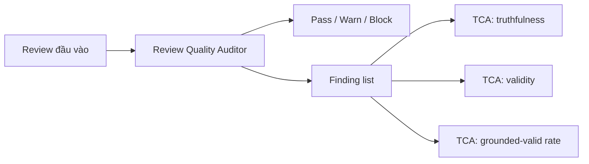

# Báo cáo benchmark workflow Review Quality Auditor

## 1. Mục tiêu đánh giá

Benchmark này đánh giá workflow Review Quality Auditor trong vai trò kiểm tra chất lượng bản review trước khi chair sử dụng hoặc trước khi phản hồi cho reviewer. Workflow không nhằm thay chair phán xét reviewer đúng hay sai. Mục tiêu là phát hiện các rủi ro trong review, chẳng hạn nhận xét thiếu căn cứ, khuyến nghị không khớp lập luận, bỏ sót điểm quan trọng của bài, hoặc review quá chung chung để sử dụng.

Một workflow auditor tốt cần tạo ra tín hiệu kiểm tra có ích nhưng không được làm người dùng hiểu rằng mọi finding đều là kết luận cuối cùng. Vì vậy, benchmark đọc workflow này như một lớp cảnh báo hỗ trợ kiểm soát chất lượng, trong đó tỷ lệ phát hiện, mức độ bám chứng cứ và độ nhiễu đều quan trọng.

## 2. Dataset đầu vào cho benchmark

Workflow runner chạy trên 1,127 bài nộp và tạo audit cho các review liên quan. Tổng cộng có 3,658 lượt audit được sinh ra. Sau đó, các kết quả audit được đưa vào TCA benchmark để đánh giá tính đúng, tính hợp lệ và mức độ bám chứng cứ của finding.

| Nhóm dữ liệu | Quy mô | Vai trò trong benchmark |
| --- | ---: | --- |
| Bài nộp trong workflow runner | 1,127 bài | Sinh bối cảnh bài và review cần audit |
| Lượt audit được tạo | 3,658 audit | Đo trạng thái pass/warn/block, số finding, thời gian và số lượng token |
| Lượt đánh giá TCA | 2,637 đến 3,472 đơn vị đánh giá tùy metric | Đo truthfulness, validity và grounded-valid rate của finding |

Các mẫu số TCA khác nhau vì không phải finding nào cũng đủ điều kiện để chấm mọi metric. Ví dụ, một finding có thể chấm được tính hợp lệ nhưng không đủ dữ liệu để chấm đầy đủ grounding theo cùng một cách.

## 3. Cách thức benchmark

Benchmark được thực hiện theo hai bước. Bước đầu tiên chạy workflow auditor trên các review đã có để tạo ra trạng thái audit và danh sách finding. Mỗi audit có thể kết luận review đạt, cần cảnh báo, hoặc cần chặn để xem xét thêm. Bước này trả lời câu hỏi: workflow có vận hành ổn định và tạo được tín hiệu kiểm tra không?

Bước thứ hai dùng TCA benchmark để đọc lại các finding đã sinh. TCA không chỉ đếm số cảnh báo, mà kiểm tra xem cảnh báo có đúng với nội dung review/bài nộp hay không, có hợp lệ theo tiêu chí kiểm tra hay không, và có vừa đúng vừa có cơ sở chứng cứ hay không.

Cách đọc này tránh nhầm lẫn giữa “nhiều finding” và “chất lượng cao”. Một auditor có thể sinh nhiều cảnh báo nhưng nếu cảnh báo thiếu căn cứ thì sẽ tạo nhiễu. Ngược lại, một auditor hữu ích cần cân bằng giữa phát hiện rủi ro và không làm chair mất thời gian xử lý các cảnh báo yếu.

## 4. Metrics

| Metric | Ý nghĩa |
| --- | --- |
| Audit count | Tổng số lượt review được audit |
| Pass / warn / block | Trạng thái auditor gán cho review |
| Findings per audit | Số vấn đề trung bình được nêu trong mỗi audit |
| Finding severity | Mức nghiêm trọng của finding, gồm warning hoặc blocking |
| Finding code distribution | Nhóm vấn đề thường gặp trong review |
| Thời gian xử lý | Thời gian tạo audit cho một review |
| Số lượng token | Số token dùng để sinh audit |
| TCA truthfulness | Tỷ lệ finding đúng với nội dung nguồn |
| TCA validity rate | Tỷ lệ finding hợp lệ theo tiêu chí audit |
| TCA grounded-valid rate | Tỷ lệ finding vừa đúng vừa có cơ sở chứng cứ rõ |

## 5. Kết quả

### 5.1. Kết quả vận hành từ workflow runner

| Chỉ số | Kết quả |
| --- | ---: |
| Số bài có audit | 1,127 |
| Tổng lượt audit | 3,658 |
| Findings trung bình mỗi audit | 2.39 |
| Thời gian xử lý trung bình mỗi audit | 15.55 giây |
| Thời gian xử lý trung vị | 14.63 giây |
| Thời gian xử lý cao nhất | 123.67 giây |
| Số lượng token trung bình mỗi audit | 7,874 token |
| Số lượng token trung vị | 7,853 token |

Auditor tạo trung bình 2.39 finding cho mỗi review. Thời gian trung bình 15.55 giây là chấp nhận được cho một bước kiểm tra chất lượng review, đặc biệt nếu chạy sau khi reviewer nộp review hoặc trước khi chair đọc tổng hợp.

### 5.2. Phân bố trạng thái audit

| Trạng thái | Số lượt |
| --- | ---: |
| Block | 1,913 |
| Warn | 1,650 |
| Pass | 95 |

Phân bố này cho thấy auditor khá nghiêm khắc. Phần lớn review bị đánh dấu warn hoặc block, trong khi số pass chỉ 95 lượt. Đây là tín hiệu cần đọc thận trọng: nếu dùng trong sản phẩm thật, hệ thống cần giao diện giúp chair ưu tiên finding quan trọng nhất, tránh biến auditor thành nguồn cảnh báo quá tải.

### 5.3. Phân bố mức độ và loại finding

| Nhóm finding phổ biến | Số lượt |
| --- | ---: |
| Tiêu chí đánh giá chưa được hỗ trợ đủ bằng lập luận | 3,753 |
| Chưa xử lý các điểm reviewer cần chú ý | 990 |
| Mất cân bằng giữa điểm mạnh và điểm yếu | 762 |
| Chưa xử lý core claims của bài | 713 |
| Chưa xử lý limitations của bài | 677 |
| Căng thẳng giữa recommendation và narrative | 655 |
| Recommendation chưa được hỗ trợ đủ | 533 |
| Review quá chung chung để nộp | 460 |
| Tự mâu thuẫn | 162 |
| Căng thẳng giữa confidence và mức hỗ trợ | 39 |

Tổng cộng có 6,221 warning finding và 2,523 blocking finding. Nhóm finding phổ biến nhất liên quan đến việc review đưa ra tiêu chí hoặc khuyến nghị nhưng chưa hỗ trợ bằng lập luận đủ rõ. Điều này phù hợp với mục tiêu của auditor: kiểm tra review có đủ căn cứ để chair tin dùng hay không.

### 5.4. Kết quả TCA

| Chỉ số TCA | Trung bình | Trung vị | Thấp nhất | Cao nhất |
| --- | ---: | ---: | ---: | ---: |
| Truthfulness per review | 58.28% | 50.00% | 0.00% | 100.00% |
| Validity rate | 71.04% | 100.00% | 0.00% | 100.00% |
| Grounded-valid rate | 46.99% | 50.00% | 0.00% | 100.00% |
| Findings per review trong TCA | 2.37 | - | - | - |

Kết quả TCA cho thấy auditor có giá trị nhưng còn nhiễu. Validity rate đạt 71.04%, nghĩa là phần lớn finding phù hợp với tiêu chí audit. Tuy nhiên, grounded-valid rate chỉ 46.99%, tức chưa đến một nửa finding vừa hợp lệ vừa có cơ sở chứng cứ rõ theo benchmark. Truthfulness trung bình 58.28% cũng cho thấy nhiều finding cần người dùng xác minh trước khi xem là kết luận.

## 6. Diễn giải ý nghĩa

Review Quality Auditor hữu ích ở vai trò tạo tín hiệu kiểm tra chất lượng review. Nó phát hiện nhiều loại vấn đề có ý nghĩa thực tế: nhận xét thiếu căn cứ, khuyến nghị chưa được hỗ trợ, review chung chung, hoặc mâu thuẫn nội bộ. Những finding này phù hợp với vấn đề thật trong quy trình chair đọc review, vì chair thường cần biết review nào đáng tin, review nào cần hỏi lại reviewer.

Tuy nhiên, kết quả TCA buộc báo cáo phải giữ giọng thận trọng. Auditor không nên được trình bày như hệ thống tự động kết luận review đạt hay không đạt. Tỷ lệ grounded-valid còn thấp cho thấy một phần finding có thể đúng theo hướng chung nhưng chưa đủ bằng chứng chi tiết, hoặc diễn giải mạnh hơn dữ liệu cho phép.

Phân bố block rất cao cũng là một tín hiệu sản phẩm quan trọng. Nếu toàn bộ warning và block được hiển thị ngang nhau, chair có thể bị quá tải. Workflow này cần cơ chế ưu tiên, gom nhóm và giải thích rõ finding nào cần xử lý ngay, finding nào chỉ là gợi ý cải thiện.

## 7. Hạn chế rút ra được

Hạn chế lớn nhất là độ nhiễu của finding. Truthfulness và grounded-valid rate chưa đủ cao để dùng auditor như một bộ lọc tự động. Cách dùng phù hợp là đưa finding cho chair xem như danh sách kiểm tra, không phải quyết định cuối cùng.

Thứ hai, benchmark chưa đo trực tiếp tác động của auditor lên chất lượng review sau khi reviewer chỉnh sửa. Một finding có thể đúng, nhưng nếu reviewer không hiểu hoặc không sửa được review tốt hơn, giá trị thực tế vẫn bị giới hạn.

Thứ ba, phân bố trạng thái audit có xu hướng nghiêm khắc. Cần benchmark thêm với review chất lượng cao do chuyên gia viết để kiểm tra false alarm, nếu không hệ thống có thể làm giảm niềm tin người dùng vì cảnh báo quá nhiều.

## 8. Kết luận

Review Quality Auditor có bằng chứng vận hành tốt: chạy được trên 3,658 lượt audit, tạo trung bình 2.39 finding mỗi audit, và phát hiện các nhóm vấn đề review có ý nghĩa thực tế. Workflow phù hợp để hỗ trợ chair kiểm tra review, nhất là khi cần rà soát nhanh các review có khả năng thiếu căn cứ.

Kết luận cần giữ đúng mức: auditor là công cụ hỗ trợ phát hiện rủi ro, không phải hệ thống tự động chấm chất lượng review. Với grounded-valid rate 46.99% và truthfulness trung bình 58.28%, mọi finding quan trọng vẫn cần chair hoặc người phụ trách xác nhận trước khi dùng để đưa ra hành động.
