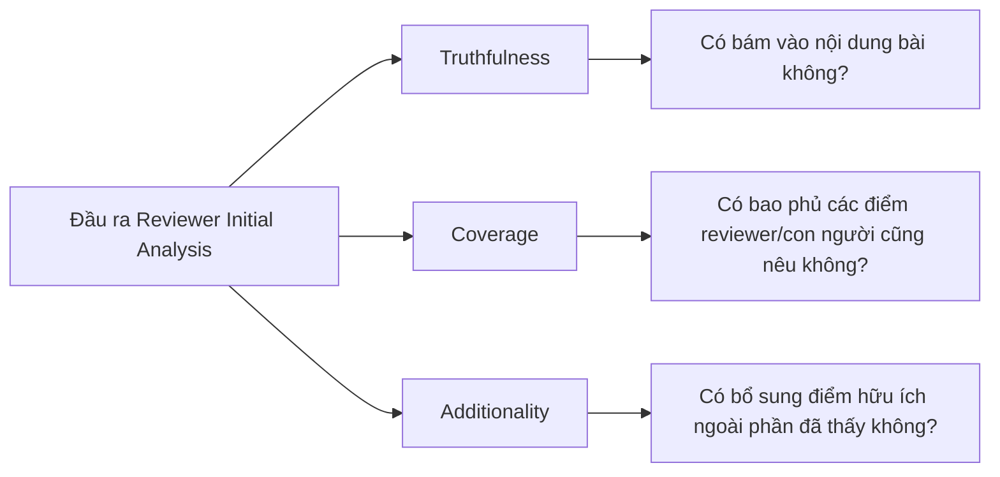

# Báo cáo benchmark workflow Reviewer Initial Analysis

## 1. Mục tiêu đánh giá

Benchmark này đánh giá workflow Reviewer Initial Analysis trong vai trò hỗ trợ reviewer đọc bài trước khi viết review. Workflow không thay reviewer đưa ra nhận xét cuối cùng. Mục tiêu là tạo một bản phân tích ban đầu có cấu trúc, chỉ ra đóng góp được tuyên bố, các điểm reviewer nên chú ý, và các annotation bám vào nội dung bài.

Một workflow tốt cần giúp reviewer tiết kiệm thời gian định hướng mà không làm méo nội dung bài. Vì vậy, benchmark tập trung vào ba câu hỏi: hệ thống có tạo đủ artifact hỗ trợ review hay không, các trích dẫn và annotation có bám vào nguồn hay không, và các điểm chú ý có thật sự bổ sung giá trị thay vì chỉ lặp lại thông tin hiển nhiên hay không.

## 2. Dataset đầu vào cho benchmark

Dataset workflow runner gồm 1,127 bài nộp học thuật. Các bài này được chạy qua workflow để tạo phân tích ban đầu cho reviewer. Sau đó, một tập 1,097 kết quả được đưa vào benchmark TCA để đánh giá các khía cạnh truthfulness, coverage và additionality trên đầu ra đã sinh.

| Nhóm dữ liệu | Số bài | Vai trò trong benchmark |
| --- | ---: | --- |
| Lượt chạy workflow runner | 1,127 | Sinh reviewer briefing, annotation, thời gian và số lượng token |
| Lượt đánh giá TCA | 1,097 | Đánh giá độ bám chứng cứ và độ hữu ích của đầu ra đã sinh |

Sự khác biệt về số lượng giữa hai nhóm là bình thường trong thiết kế benchmark: workflow runner chạy toàn bộ tập đầu vào, còn TCA benchmark chỉ đánh giá các kết quả đủ điều kiện cho bộ kiểm tra sau đó. Báo cáo vì vậy không gộp hai mẫu số này thành một.

## 3. Cách thức benchmark

Benchmark được thực hiện theo hai lần chạy có vai trò khác nhau.

Lần thứ nhất là workflow runner. Mỗi bài nộp được đưa vào workflow để tạo bản phân tích ban đầu, gồm các phần như đóng góp được tuyên bố, tín hiệu sẵn sàng cho review, các điểm reviewer cần chú ý và annotation liên quan. Lượt chạy này cung cấp số liệu về khả năng hoàn tất, độ dài đầu ra, thời gian xử lý và số lượng token.

Lần thứ hai là TCA benchmark trên các đầu ra đã được sinh. TCA được dùng như lớp review evidence-based, gồm ba góc nhìn:

Vì workflow này tạo phân tích trước khi reviewer viết review, coverage không được hiểu là hệ thống phải dự đoán toàn bộ review của con người. Coverage thấp cần được đọc cẩn trọng: nó có thể phản ánh việc reviewer và hệ thống chú ý đến các khía cạnh khác nhau, không nhất thiết là workflow vô dụng. Truthfulness và additionality là hai chỉ số quan trọng hơn để đánh giá liệu phân tích ban đầu có đáng tin và có thêm giá trị định hướng hay không.

## 4. Metrics

| Metric | Ý nghĩa |
| --- | --- |
| Thời gian xử lý | Thời gian workflow tạo xong phân tích ban đầu cho một bài |
| Số lượng token | Số token sử dụng để sinh đầu ra |
| Review readiness signals | Số tín hiệu giúp reviewer biết bài đã sẵn sàng đọc ở mức nào |
| Claimed contributions | Số đóng góp hệ thống trích ra từ bài |
| Reviewer attention points | Số điểm reviewer nên chú ý khi đọc bài |
| Annotation count | Số annotation bám vào nội dung bài |
| Quote grounded rate | Tỷ lệ trích dẫn/claim có thể đối chiếu với nội dung nguồn |
| Fabrication rate | Tỷ lệ nội dung không tìm được cơ sở trong nguồn |
| Attention point truthfulness | Tỷ lệ điểm chú ý đúng với nội dung bài |
| Coverage | Tỷ lệ điểm của hệ thống trùng với các điểm quan trọng do người review nêu |
| Additionality | Tỷ lệ điểm đúng và bổ sung thêm góc nhìn ngoài phần đã được người review nêu |

## 5. Kết quả

### 5.1. Kết quả vận hành từ workflow runner

| Chỉ số | Trung bình | Trung vị | Thấp nhất | Cao nhất |
| --- | ---: | ---: | ---: | ---: |
| Thời gian xử lý | 39.18 giây | 37.53 giây | 22.94 giây | 126.36 giây |
| Số lượng token | 11,575 token | 11,681 token | 5,865 token | 21,132 token |
| Review readiness signals | 8.00 | 8.00 | - | - |
| Claimed contributions | 4.94 | - | - | - |
| Reviewer attention points | 6.09 | - | - | - |
| Số section trong đầu ra | 4.99 | - | - | - |
| Annotation count | 16.74 | - | - | - |

Workflow tạo đầu ra tương đối giàu thông tin. Trung bình mỗi bài có gần 5 đóng góp được trích ra, hơn 6 điểm reviewer cần chú ý, và khoảng 17 annotation. Điều này cho thấy workflow không chỉ trả một đoạn tóm tắt ngắn, mà tạo được bộ tín hiệu có thể giúp reviewer định hướng quá trình đọc.

### 5.2. Kết quả TCA

| Chỉ số TCA | Trung bình | Trung vị | Thấp nhất | Cao nhất |
| --- | ---: | ---: | ---: | ---: |
| Quote grounded rate | 96.22% | 100.00% | 55.17% | 100.00% |
| Fabrication rate | 3.78% | 0.00% | 0.00% | 44.83% |
| Số quote mỗi bài | 26.32 | 26.00 | 12.00 | 43.00 |
| Attention point truthfulness | 69.86% | 75.00% | 0.00% | 100.00% |
| Coverage | 4.49% | 0.00% | 0.00% | 100.00% |
| Additionality | 92.23% | 100.00% | 0.00% | 100.00% |
| Admin count | 2.29 | - | - | - |

Kết quả nổi bật nhất là quote grounded rate đạt 96.22% và fabrication rate trung bình chỉ 3.78%. Điều này cho thấy phần lớn nội dung được neo vào bài gốc, đặc biệt ở các đoạn có trích dẫn hoặc annotation rõ ràng.

Attention point truthfulness đạt 69.86%, thấp hơn quote grounded rate. Đây là kết quả hợp lý vì attention point thường là diễn giải hoặc khuyến nghị reviewer nên chú ý, khó kiểm chứng trực tiếp hơn một trích dẫn. Coverage chỉ đạt 4.49%, trong khi additionality đạt 92.23%. Mẫu này cho thấy hệ thống thường nêu các điểm đúng nhưng khác với những gì reviewer con người cuối cùng chọn nhấn mạnh.

## 6. Diễn giải ý nghĩa

Reviewer Initial Analysis hoạt động tốt nhất ở vai trò bản đồ đọc bài. Hệ thống tạo được nhiều annotation, trích xuất đóng góp và điểm chú ý, trong khi phần trích dẫn có độ bám nguồn cao. Điều này phù hợp với mục tiêu hỗ trợ reviewer trước khi viết review: giúp họ biết nên nhìn vào đâu, không thay họ kết luận bài mạnh hay yếu.

Coverage thấp không nên được diễn giải đơn giản là chất lượng thấp. Trong workflow này, coverage đo mức giao nhau giữa điểm hệ thống nêu và điểm con người nêu trong review. Nhưng phân tích ban đầu được tạo trước review, còn review của con người thường chọn một số vấn đề nổi bật nhất sau khi đọc sâu. Vì vậy, coverage thấp kết hợp với additionality cao cho thấy hệ thống có xu hướng đưa thêm góc nhìn kiểm tra hơn là lặp lại review của con người.

Điểm cần thận trọng là truthfulness của attention point chưa đạt mức đủ cao để dùng không kiểm tra. Reviewer vẫn cần đọc bài và xác nhận. Workflow nên được trình bày như công cụ hỗ trợ định hướng, không phải bản đánh giá sơ bộ đáng tin tuyệt đối.

## 7. Hạn chế rút ra được

Thứ nhất, TCA là benchmark dựa trên các proxy có thể kiểm tra tự động, không thay thế đánh giá chuyên gia đầy đủ. Truthfulness, coverage và additionality giúp phát hiện xu hướng lớn, nhưng không thể xác định toàn bộ chất lượng học thuật của một nhận xét.

Thứ hai, attention point có tỷ lệ truthfulness trung bình 69.86%, nghĩa là vẫn có một phần đáng kể điểm chú ý cần reviewer xác minh. Nếu đưa workflow vào sản phẩm, giao diện nên thể hiện các điểm này như gợi ý cần kiểm tra, không như kết luận.

Thứ ba, thời gian xử lý trung bình gần 40 giây và có trường hợp vượt 2 phút. Workflow phù hợp hơn với tác vụ chuẩn bị review bất đồng bộ hoặc chạy trước, không phù hợp nếu reviewer kỳ vọng phản hồi tức thời ngay khi mở bài.

## 8. Kết luận

Reviewer Initial Analysis có bằng chứng tốt để được trình bày như một workflow hỗ trợ reviewer định hướng đọc bài. Hệ thống tạo đầu ra phong phú, có nhiều annotation, và phần trích dẫn bám nguồn cao với quote grounded rate 96.22%.

Kết luận cần giữ đúng phạm vi: workflow hữu ích để chuẩn bị review và gợi ý điểm cần kiểm tra, nhưng chưa đủ tin cậy để thay reviewer đánh giá nội dung. Các attention point cần được người dùng xác nhận, đặc biệt vì truthfulness trung bình của nhóm này còn khoảng 69.86%.
