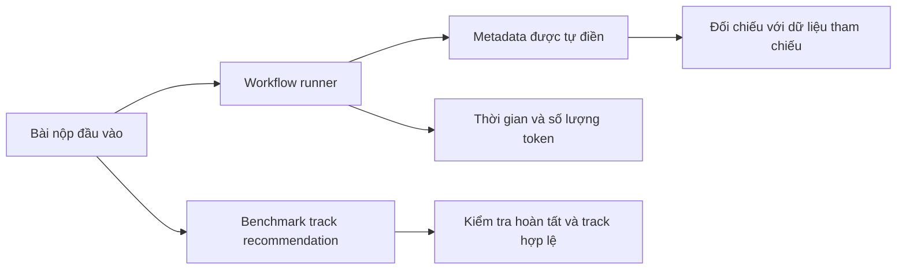

# Báo cáo benchmark workflow Submission Autofill

## 1. Mục tiêu đánh giá

Benchmark này đánh giá workflow Submission Autofill trong vai trò hỗ trợ tác giả và ban tổ chức chuẩn hóa thông tin bài nộp. Workflow có hai năng lực chính: trích xuất metadata từ nội dung bài và gợi ý track phù hợp khi có danh sách track để đối chiếu. Mục tiêu là giảm công nhập liệu thủ công, tăng độ đầy đủ của dữ liệu submission, và giúp bài nộp đi vào đúng luồng xử lý ban đầu.

Workflow không được đánh giá như một hệ thống thẩm định chất lượng nghiên cứu. Kết quả tốt không có nghĩa là bài nộp hay hơn, mà nghĩa là các thông tin căn bản như tiêu đề, tóm tắt, tác giả, từ khóa và gợi ý track được tạo ra đủ chính xác để người dùng kiểm tra nhanh và chỉnh sửa nếu cần.

## 2. Dataset đầu vào cho benchmark

Dataset chính gồm 1,127 bài nộp học thuật từ nhiều hội nghị và track khác nhau. Các bài nộp này được dùng để chạy workflow và đối chiếu metadata sinh ra với dữ liệu tham chiếu đã có. Dataset có độ đa dạng về hội nghị, lĩnh vực và quy mô track, giúp đánh giá workflow trên nhiều kiểu bài khác nhau thay vì chỉ một bộ mẫu nhỏ.

| Nguồn dữ liệu | Số bài |
| --- | ---: |
| ICLR 2023 TinyPapers | 215 |
| UAI 2022 Conference | 213 |
| CoRL 2023 Conference | 191 |
| CoRL 2022 Conference | 178 |
| MIDL 2023 Conference | 111 |
| LOG 2022 Conference | 82 |
| MIDL 2023 Short Paper Track | 77 |
| IEEE ICIST 2024 Conference | 60 |
| **Tổng cộng** | **1,127** |

Ngoài dataset chính, phần track recommendation có một benchmark hợp đồng riêng gồm 48 trường hợp. Nhóm này dùng để kiểm tra rằng workflow hoàn tất và không gợi ý track ngoài danh sách hợp lệ. Phần này chưa có nhãn người đánh giá để kết luận độ chính xác top-1 hoặc top-3.

## 3. Cách thức benchmark

Benchmark được thực hiện qua hai loại chạy khác nhau. Lần chạy workflow runner được dùng để chạy Submission Autofill trên dataset, lưu lại kết quả metadata, thời gian xử lý và số lượng token. Với metadata extraction, kết quả sinh ra có thể đối chiếu trực tiếp với dữ liệu tham chiếu nên workflow runner đồng thời cung cấp các chỉ số chất lượng chi tiết.

Với các chỉ số đánh giá độ hữu dụng rộng hơn, báo cáo không dùng suy đoán thủ công từ một vài ví dụ. Các kết quả workflow đã sinh được lưu lại và có thể được dùng ở bước đánh giá sau. Riêng track recommendation hiện được đánh giá bằng một lượt benchmark hợp đồng riêng: hệ thống phải hoàn tất yêu cầu và mọi track được đề xuất phải thuộc danh sách track cho phép.

Điểm quan trọng của phương pháp là không trộn kết quả metadata extraction với track recommendation. Metadata có nhãn tham chiếu nên có thể báo cáo F1, exact match và ROUGE. Track recommendation hiện mới có bằng chứng về tính hợp lệ của gợi ý, chưa có bằng chứng về mức độ đúng theo lựa chọn của con người.

## 4. Metrics

| Metric | Ý nghĩa |
| --- | --- |
| Title exact match | Tỷ lệ tiêu đề được trích xuất khớp hoàn toàn dữ liệu tham chiếu |
| Title token F1 | Mức khớp theo token của tiêu đề, hữu ích khi có khác biệt nhỏ về dấu câu hoặc định dạng |
| Abstract ROUGE-1 | Mức trùng lặp từ đơn giữa abstract sinh ra và abstract tham chiếu |
| Abstract ROUGE-L | Mức khớp chuỗi con dài nhất của abstract, phản ánh độ bảo toàn cấu trúc nội dung |
| Keyword F1 | Độ khớp giữa danh sách keyword sinh ra và keyword tham chiếu |
| Author F1 | Độ khớp giữa danh sách tác giả sinh ra và danh sách tác giả tham chiếu |
| Required field completion rate | Tỷ lệ trường bắt buộc được điền đủ |
| Invalid track rate | Tỷ lệ gợi ý track nằm ngoài danh sách track hợp lệ |
| Thời gian xử lý | Thời gian workflow hoàn tất trên mỗi bài |
| Số lượng token | Số token workflow sử dụng trong quá trình sinh kết quả |

Các chỉ số metadata được đọc như chỉ số chất lượng trực tiếp. Các chỉ số track recommendation được đọc như chỉ số hợp đồng và độ an toàn đầu ra, không phải accuracy theo sở thích chuyên gia.

## 5. Kết quả

### 5.1. Metadata extraction trên dataset chính

| Chỉ số | Trung bình | Trung vị | Thấp nhất | Cao nhất |
| --- | ---: | ---: | ---: | ---: |
| Title exact match | 91.22% | 100.00% | 0.00% | 100.00% |
| Title token F1 | 98.20% | 100.00% | 0.00% | 100.00% |
| Abstract ROUGE-1 | 83.64% | 85.49% | 3.64% | 100.00% |
| Abstract ROUGE-L | 83.25% | 85.42% | 3.64% | 100.00% |
| Keyword F1 | 92.77% | 100.00% | 0.00% | 100.00% |
| Author F1 | 83.49% | 100.00% | 0.00% | 100.00% |
| Required field completion rate | 86.93% | 100.00% | 0.00% | 100.00% |

Tiêu đề và keyword là hai nhóm có kết quả mạnh nhất. Title token F1 đạt 98.20%, cho thấy ngay cả khi exact match không hoàn toàn tuyệt đối, nội dung tiêu đề vẫn được giữ gần như đầy đủ. Keyword F1 đạt 92.77%, phù hợp với vai trò gợi ý nhanh cho người dùng kiểm tra lại.

Abstract đạt ROUGE-1 trung bình 83.64% và ROUGE-L trung bình 83.25%. Đây là mức tốt cho tác vụ tự điền vì abstract thường có độ dài lớn và nhạy với khác biệt định dạng. Author F1 thấp hơn keyword và title, đạt 83.49%, phản ánh việc trích xuất tác giả dễ bị ảnh hưởng bởi định dạng PDF, thứ tự tên, ký hiệu affiliation hoặc thiếu thông tin rõ ràng.

### 5.2. Vận hành workflow

| Chỉ số | Kết quả |
| --- | ---: |
| Số bài chạy workflow | 1,127 |
| Thời gian xử lý trung bình | 10.64 giây |
| Thời gian xử lý trung vị | 9.32 giây |
| Thời gian xử lý cao nhất | 102.20 giây |
| Số lượng token trung bình | 4,094 token |
| Số lượng token trung vị | 4,058 token |
| Số lượng token cao nhất | 6,496 token |

Thời gian trung bình 10.64 giây cho thấy workflow phù hợp với tác vụ hỗ trợ trước khi nộp bài, nơi người dùng có thể chờ vài giây để nhận form được điền sẵn. Trường hợp cao nhất 102.20 giây là ngoại lệ cần theo dõi, vì độ trễ dài có thể làm trải nghiệm nhập liệu bị gián đoạn.

### 5.3. Track recommendation

| Chỉ số | Kết quả |
| --- | ---: |
| Số trường hợp benchmark riêng | 48 |
| Hoàn tất | 48 / 48 |
| Invalid track rate | 0.00% |
| Thời gian xử lý trung bình | 18.19 giây |
| Thời gian xử lý trung vị | 17.54 giây |
| Thời gian xử lý cao nhất | 37.42 giây |

Kết quả track recommendation cho thấy hệ thống hoàn tất toàn bộ 48 trường hợp và không gợi ý track ngoài danh sách hợp lệ. Đây là bằng chứng tốt về tính an toàn hợp đồng của đầu ra. Tuy nhiên, vì benchmark chưa có nhãn chuyên gia về track đúng nhất, chưa thể kết luận top-1 accuracy hoặc top-3 acceptance.

Trong dataset workflow chính, phần lớn bản ghi không có danh sách track recommendation trong kết quả cuối cùng, chủ yếu do bối cảnh đầu vào không phải lúc nào cũng cung cấp đủ danh sách track để lựa chọn. Vì vậy, báo cáo không dùng nhóm dữ liệu đó để kết luận chất lượng track recommendation.

## 6. Diễn giải ý nghĩa

Submission Autofill là workflow có bằng chứng định lượng mạnh nhất ở phần metadata extraction. Trên 1,127 bài, hệ thống trích xuất tiêu đề, keyword và abstract ở mức đủ tốt để giảm đáng kể thao tác nhập liệu. Kết quả trung vị của nhiều chỉ số đạt 100%, cho thấy với phần lớn bài nộp có định dạng rõ, workflow điền đúng hoặc gần đúng các trường chính.

Tuy nhiên, hệ thống không nên tự động khóa dữ liệu sau khi autofill. Các chỉ số thấp nhất bằng 0 ở một số trường cho thấy vẫn tồn tại các trường hợp thất bại hoàn toàn, có thể do tài liệu khó đọc, metadata thiếu, hoặc định dạng khác thường. Cách sử dụng đúng là điền sẵn để người dùng xác nhận, không thay người dùng chịu trách nhiệm cuối cùng.

Với track recommendation, kết quả hiện tại có thể bảo vệ ở mức: hệ thống hoàn tất ổn định và không đề xuất track ngoài danh sách hợp lệ. Chưa nên trình bày rằng hệ thống chọn track “đúng” theo nghĩa học thuật, vì còn thiếu nhãn chuyên gia để đo accuracy. Đây là khác biệt quan trọng giữa benchmark hợp đồng đầu ra và benchmark chất lượng chuyên môn.

## 7. Hạn chế rút ra được

Hạn chế lớn nhất của metadata extraction nằm ở các tài liệu có định dạng không nhất quán. Author F1 thấp hơn title và keyword cho thấy trích xuất tên tác giả vẫn là vùng cần cải thiện, đặc biệt khi bài có nhiều tác giả, nhiều affiliation, hoặc tên được trình bày theo nhiều chuẩn khác nhau.

Track recommendation chưa có đánh giá human-labeled. Benchmark hiện chỉ chứng minh rằng hệ thống không sinh track ngoài danh sách hợp lệ và có thể hoàn tất yêu cầu. Để báo cáo chất lượng đầy đủ hơn, cần có nhãn từ chair hoặc domain expert về track phù hợp, sau đó đo top-1 accuracy, top-3 acceptance và phân tích các trường hợp mơ hồ.

Một hạn chế khác là thời gian xử lý có outlier cao. Dù trung bình vẫn chấp nhận được, hệ thống cần theo dõi các trường hợp trên một phút vì autofill là tác vụ người dùng thường kỳ vọng phản hồi nhanh.

## 8. Kết luận

Submission Autofill đã đủ bằng chứng để trình bày như một workflow hỗ trợ nhập liệu có giá trị thực tế. Metadata extraction đạt kết quả mạnh ở tiêu đề, keyword và abstract; các trường bắt buộc được điền với tỷ lệ trung bình 86.93%; thời gian xử lý trung bình khoảng 10.64 giây.

Kết luận cần giữ đúng phạm vi: workflow phù hợp để tạo bản nháp metadata cho người dùng kiểm tra và chỉnh sửa. Track recommendation hiện chứng minh được tính hợp lệ của đầu ra, nhưng chưa đủ cơ sở để khẳng định độ chính xác lựa chọn track theo tiêu chuẩn chuyên gia.
