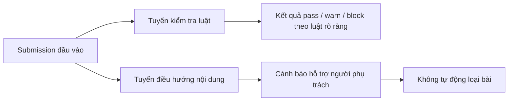

# Báo cáo benchmark workflow Submission Gating

## 1. Mục tiêu đánh giá

Benchmark này đánh giá workflow Submission Gating ở hai năng lực riêng biệt: kiểm tra luật nộp bài có thể xác định rõ bằng quy định, và điều hướng người dùng khi nội dung bài nộp có dấu hiệu cần xem xét thêm. Mục tiêu không phải là thay thế chair hay ban tổ chức trong quyết định nhận hoặc loại bài, mà là kiểm tra liệu hệ thống có thể phát hiện các lỗi hình thức rõ ràng, tạo cảnh báo có ích, và không tự ý đưa ra quyết định vượt quyền hay không.

Trong phạm vi báo cáo này, Submission Gating được hiểu là lớp kiểm soát đầu vào trước khi bài nộp đi sâu vào quy trình review. Một kết quả tốt cần thỏa ba yêu cầu: không bỏ sót lỗi luật rõ ràng, không chặn sai bài hợp lệ, và khi sử dụng phần hỗ trợ bằng mô hình ngôn ngữ, hệ thống chỉ được đưa ra khuyến nghị kiểm tra chứ không được biến khuyến nghị đó thành phán quyết tự động.

## 2. Dataset đầu vào cho benchmark

Bộ dữ liệu benchmark được tổ chức thành hai nhóm kiểm thử. Nhóm thứ nhất là các trường hợp có luật rõ ràng, ví dụ thiếu trường bắt buộc, không đạt điều kiện định dạng, hoặc vi phạm quy tắc nộp bài có thể kiểm tra trực tiếp. Nhóm thứ hai là các trường hợp cần đọc nội dung để đưa ra cảnh báo mềm, ví dụ dấu hiệu chưa đúng phạm vi, phần mô tả chưa đủ rõ, hoặc vấn đề cần chair cân nhắc trước khi cho bài đi tiếp.

| Nhóm dữ liệu | Số trường hợp | Vai trò trong benchmark |
| --- | ---: | --- |
| Kiểm tra luật tất định | 8 | Đo khả năng phát hiện đúng lỗi hình thức và tránh chặn sai |
| Điều hướng nội dung bằng mô hình ngôn ngữ | 24 | Đo khả năng sinh cảnh báo hỗ trợ mà không vượt quyền quyết định |

Dataset này không được thiết kế để bao phủ toàn bộ các biến thể của một hội nghị thật. Nó tập trung vào những tình huống đại diện cho rủi ro quan trọng nhất của submission gating: sai luật rõ ràng, cảnh báo nội dung cần người phụ trách xem xét, và ranh giới giữa hỗ trợ ra quyết định với tự động ra quyết định.

## 3. Cách thức benchmark

Benchmark được tách thành hai tuyến để tránh trộn lẫn hai loại năng lực khác nhau.

Tuyến kiểm tra luật dùng các điều kiện có thể đối chiếu trực tiếp với đáp án kỳ vọng. Vì vậy, kết quả có thể đọc bằng các chỉ số như độ chính xác verdict, recall rule ID, và số bài bị chặn sai. Tuyến điều hướng nội dung được đánh giá như một cơ chế hỗ trợ. Phần này không được xem là bộ phân loại tự động, nên tiêu chí quan trọng nhất là hoàn tất xử lý, tạo được các finding nội dung, và không vi phạm hợp đồng bằng cách tự ý đưa ra quyết định loại bài.

Hai tuyến này được benchmark riêng để báo cáo không thổi phồng năng lực của hệ thống. Nếu luật rõ ràng đạt kết quả cao, điều đó chỉ chứng minh năng lực kiểm tra quy tắc rõ ràng. Nếu tuyến điều hướng nội dung tạo được cảnh báo, điều đó chứng minh khả năng hỗ trợ đọc sơ bộ, không chứng minh hệ thống có quyền hoặc có đủ độ tin cậy để thay chair.

## 4. Metrics

| Metric | Ý nghĩa |
| --- | --- |
| Tỷ lệ hoàn tất | Số trường hợp chạy xong không lỗi trên tổng số trường hợp |
| Blocking verdict accuracy | Tỷ lệ hệ thống đưa ra đúng kết luận pass, warn hoặc block với nhóm luật rõ ràng |
| Rule ID recall | Tỷ lệ luật vi phạm được phát hiện đúng trong nhóm rule check |
| False block count | Số bài đáng lẽ không bị chặn nhưng bị hệ thống chặn |
| Content finding count | Số cảnh báo nội dung được sinh ra ở tuyến điều hướng |
| Contract violation count | Số lần phần điều hướng nội dung tự ý tạo quyết định block trái phạm vi |
| Thời gian xử lý | Thời gian từ lúc nhận submission đến lúc trả kết quả gating |

Các metric ở tuyến rule check là metric chính xác theo luật. Các metric ở tuyến điều hướng nội dung là metric vận hành và kiểm soát phạm vi. Báo cáo không gán độ chính xác nội dung cho tuyến điều hướng nếu chưa có nhãn người đánh giá độc lập cho từng finding.

## 5. Kết quả

### 5.1. Tuyến kiểm tra luật tất định

| Chỉ số | Kết quả |
| --- | ---: |
| Số trường hợp | 8 |
| Hoàn tất | 8 / 8 |
| Blocking verdict accuracy | 100.00% |
| Rule ID recall | 100.00% |
| False block count | 0 |
| Thời gian xử lý trung bình | 0.08 giây |
| Thời gian xử lý trung vị | 0.09 giây |
| Thời gian xử lý cao nhất | 0.14 giây |

Kết quả cho thấy phần rule check hoạt động ổn định trên bộ trường hợp đã kiểm thử. Tất cả trường hợp đều hoàn tất, verdict khớp kỳ vọng, rule ID được phát hiện đầy đủ, và không có trường hợp chặn sai.

### 5.2. Tuyến điều hướng nội dung

| Chỉ số | Kết quả |
| --- | ---: |
| Số trường hợp | 24 |
| Hoàn tất | 24 / 24 |
| Số finding nội dung | 26 |
| Vi phạm hợp đồng block tự động | 0 |
| Thời gian xử lý trung bình | 11.83 giây |
| Thời gian xử lý trung vị | 11.47 giây |
| Thời gian xử lý cao nhất | 19.64 giây |

Tuyến điều hướng nội dung hoàn tất toàn bộ trường hợp và tạo 26 cảnh báo hỗ trợ. Điểm quan trọng là không có lần nào hệ thống biến cảnh báo nội dung thành quyết định chặn tự động. Đây là điều kiện cần để workflow có thể được dùng như lớp hỗ trợ chair hoặc author, thay vì một cơ chế loại bài thiếu kiểm soát.

## 6. Diễn giải ý nghĩa

Submission Gating đạt kết quả tốt nhất ở phần có luật rõ ràng. Điều này phù hợp với kỳ vọng thiết kế: các quy định hình thức nên được kiểm tra nhanh, nhất quán và dễ giải thích. Thời gian trung bình 0.08 giây cho nhóm rule check cho thấy phần này có thể đặt ở đầu quy trình nộp bài mà không tạo độ trễ đáng kể cho người dùng.

Tuyến điều hướng nội dung cho thấy hệ thống có thể hỗ trợ phát hiện vấn đề mềm, nhưng chưa nên được trình bày như một bộ đánh giá chất lượng bài nộp. Việc hoàn tất 24/24 trường hợp và không có vi phạm hợp đồng là bằng chứng về tính kiểm soát của workflow. Tuy nhiên, vì chưa có nhãn người đánh giá cho từng finding, báo cáo chỉ có thể kết luận rằng hệ thống sinh được cảnh báo đúng phạm vi, chưa thể kết luận các cảnh báo đó đều chính xác hoặc đủ hữu ích trong mọi bối cảnh.

Điểm mạnh của workflow là tách rõ hai mức quyết định. Phần luật tất định tạo kết quả có thể kiểm chứng trực tiếp; phần nội dung tạo tín hiệu hỗ trợ và giữ quyền quyết định cho người phụ trách. Đây là thiết kế phù hợp với hệ thống học thuật, nơi một lỗi định dạng có thể xử lý tự động, nhưng đánh giá nội dung vẫn cần con người chịu trách nhiệm.

## 7. Hạn chế rút ra được

Bộ rule check hiện mới có 8 trường hợp, đủ để chứng minh đường chạy cơ bản nhưng chưa đủ để đại diện cho toàn bộ biến thể quy định của nhiều hội nghị. Cần mở rộng thêm các trường hợp biên, ví dụ bài vừa thiếu metadata vừa sai định dạng, bài thuộc track có quy tắc riêng, hoặc submission được chỉnh sửa nhiều lần trước deadline.

Tuyến điều hướng nội dung chưa có bộ nhãn thủ công cho groundedness, actionability và mức độ nghiêm trọng của từng finding. Vì vậy, kết quả hiện tại chỉ nên được dùng để chứng minh workflow chạy đúng phạm vi và không vượt quyền, chưa nên dùng để công bố độ chính xác nội dung.

Một hạn chế khác là benchmark chưa đo trải nghiệm người dùng khi cảnh báo được hiển thị trong giao diện nộp bài. Với workflow gating, cách diễn đạt cảnh báo quan trọng gần bằng bản thân việc phát hiện cảnh báo, vì người dùng cần hiểu họ nên sửa gì trước khi nộp lại.

## 8. Kết luận

Submission Gating đã có nền tảng tốt để sử dụng như lớp kiểm soát đầu vào của nền tảng. Phần kiểm tra luật rõ ràng đạt 100% trên bộ kiểm thử hiện tại, chạy rất nhanh và không tạo false block. Phần điều hướng nội dung hoàn tất toàn bộ trường hợp, sinh cảnh báo hỗ trợ, và giữ đúng ranh giới không tự động loại bài.

Kết luận có thể bảo vệ là: workflow này phù hợp để hỗ trợ kiểm tra hình thức và cảnh báo sơ bộ, nhưng chưa đủ cơ sở để tuyên bố năng lực đánh giá chất lượng nội dung bài nộp ở mức tự động. Bước cải thiện quan trọng nhất là mở rộng rule cases và bổ sung đánh giá thủ công cho các finding nội dung.
