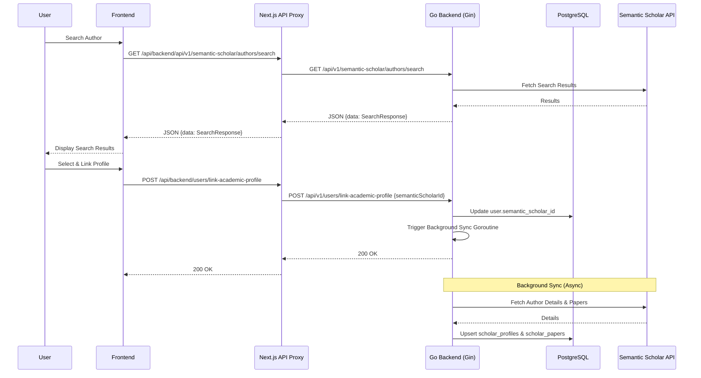

# Academic Profile Setup & Integration Documentation

This document outlines the full flow and setup for the Academic Profile Synchronization feature, connecting users with their Semantic Scholar data.

## 1. Feature Overview
The feature allows users to:
1.  **Search**: Find their academic profile using the Semantic Scholar API.
2.  **Link**: Connect their system account with a specific Semantic Scholar ID.
3.  **Sync**: Automatically fetch and store their profile stats and paper history in the local database.
4.  **Display**: View a rich academic dashboard with H-Index, Citation counts, and a list of publications.

## 2. System Architecture



## 3. Database Setup

Ensure these migrations are applied to the PostgreSQL database:

### Migration 000023: User Fields
Adds linking fields to the existing `users` table.
```sql
ALTER TABLE users ADD COLUMN semantic_scholar_id VARCHAR(50) NULL;
ALTER TABLE users ADD COLUMN profile_sync_status VARCHAR(20) DEFAULT NULL;
```

### Migration 000024: Scholar Tables
Creates the normalized relational storage for synced data.
```sql
CREATE TABLE scholar_profiles (
    id SERIAL PRIMARY KEY,
    user_id INT NOT NULL REFERENCES users(user_id) ON DELETE CASCADE,
    semantic_scholar_id VARCHAR(100) NOT NULL UNIQUE,
    name VARCHAR(255) NOT NULL,
    affiliations TEXT[],
    paper_count INT DEFAULT 0,
    citation_count INT DEFAULT 0,
    h_index INT DEFAULT 0,
    url TEXT,
    created_at TIMESTAMP WITH TIME ZONE DEFAULT CURRENT_TIMESTAMP,
    updated_at TIMESTAMP WITH TIME ZONE DEFAULT CURRENT_TIMESTAMP
);

CREATE TABLE scholar_papers (
    id SERIAL PRIMARY KEY,
    semantic_scholar_id VARCHAR(100) NOT NULL UNIQUE,
    title TEXT NOT NULL,
    abstract TEXT,
    venue TEXT,
    year INT,
    citation_count INT DEFAULT 0,
    url TEXT,
    authors JSONB,
    created_at TIMESTAMP WITH TIME ZONE DEFAULT CURRENT_TIMESTAMP,
    updated_at TIMESTAMP WITH TIME ZONE DEFAULT CURRENT_TIMESTAMP
);
```

## 4. API Endpoints

| Method | Endpoint | Description |
| :--- | :--- | :--- |
| `GET` | `/api/v1/semantic-scholar/authors/search?q=...` | Search for authors by name |
| `GET` | `/api/v1/semantic-scholar/authors/{id}` | Get detailed author info |
| `POST` | `/api/v1/users/link-academic-profile` | Link profile to current user and start sync |
| `GET` | `/api/v1/users/me/academic-profile` | Retrieve the synced stats and papers |

## 5. Development Pitfalls & Fixes

### API Proxy Configuration
The Next.js proxy (`app/api/backend/[...path]/route.ts`) must handle prefixes correctly. 
- **Fix**: Intelligently prepend `/api/v1` ONLY if it is not already present in the target path or base URL. This prevents 404s and double-prefixing.

### Request Body & Content-Length
When proxying POST requests from the client:
- **CAUTION**: Always delete the `Content-Length` header before re-fetching in the proxy. 
- **Reason**: The browser sends a length based on the original payload, but if it is re-stringified or modified in the proxy, the length might change. If they mismatch, the backend will fail to parse the body, leading to `400 Bad Request` or "Required field missing" errors.

### Backend Data Wrapping
The backend uses a standard `handler.Response{Data: ...}` wrapper.
- **Frontend Sync**: The [apiFetch](file:///e:/FITUS/Graduate%20Project/ConferenceSpace/frontend/lib/api/client.ts#62-117) utility must correctly unwrap the `data` field to avoid "Double Wrapping" (e.g., `response.data.data`), which causes property access like `authorId` to return `undefined`.

## 6. Verification
To verify the setup:
1. Run `make migrate-up` in the backend.
2. Open the user dashboard.
3. Use the "Link Academic Profile" onboarding flow.
4. Check the `scholar_*` tables in the database to see the papers being synced asynchronously.
5. Refresh the user profile page to see the integrated academic data.
